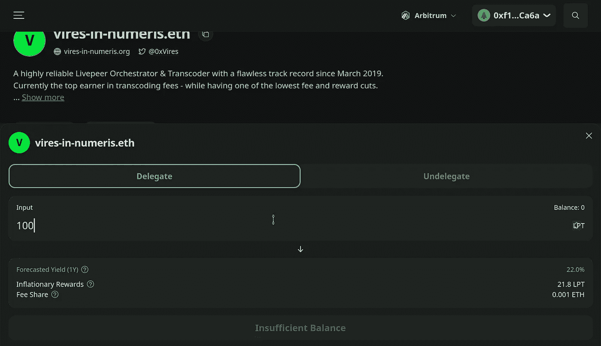

# 每年 20%，现在你可以了！

> 原文：<https://medium.com/coinmonks/20-percent-annual-return-now-you-can-e0ee30f332a?source=collection_archive---------28----------------------->

我已经享受了两年，我不是在谈论庞氏骗局或其他奇怪的赚钱方式。

这是一个谈论不多的项目，因为它涉及一个非常特殊的领域:**视频流**。

不要误解，在这种情况下，它不会与网飞或 Youtube 竞争，在这种情况下，我们谈论的是流媒体视频，而是为使用它的公司提供便利。

Livepeer 平台提供了一个分散的基础设施，可以将任何视频内容转换成不同的格式。

这个项目的天才之处就在于:让位于世界上最隐蔽角落的任何公司都有可能租用专用设备和软件来转换他们的视频内容。以非常低的费用租赁，而不是昂贵的月/年订阅。

LPT 治理令牌用于支付设备和软件的租赁费用。

# 这个项目。

T 这家公司诞生于 2017 年，自此在密码领域迈出了第一步。我是在 2019 年 11 月知道这个令牌的，当时价格在 2.5 美元左右。老实说，我对这个项目抱有一些信心，因为视频流和与多媒体相关的一切在计算领域对所有人、公司和市场趋势都有一定的优势；但没想到能达到这些程度。

让我记住这个项目的另一个因素是它所使用的验证方法:dPoS，“委托利益证明”。

在这种情况下，由于令牌是在以太坊区块链上创建的，因此它不是真正的赌注，因为编排者不验证任何交易。

编排器向平台提供其计算能力(GPU ),以转换和解码要转换的视频。在这种情况下，用户在 staking 中提供的令牌被用作治理令牌，orchestrator 将直接使用这些令牌进行内部网络决策。

正如我上面提到的，这个令牌是在以太坊区块链创造的；为了避免网络高昂的费用，令牌被转移到 L2，使用 Arbitrum 平台。

这一举措受益匪浅，事实上，各种交易的费用大幅降低。

立桩极其简单，拆桩也是一样；然而，对于后者，程序需要大约 15 天。

数字。

正如我所说的，APY 相当可观(这就是为什么我从 2019 年开始这样做),令牌在 2021 年 11 月越来越升值，达到 62 美元！

鉴于 Web3 的出现，我认为代币价格可能会再次上涨。

说够了，让我们来看看数字，我会给你看屏幕上这个平台的回报。

从上图截图可以看出，下注 100 LPT，年回报差不多 22 代币。

22%!

# 示范

但是这可能会引起误解，而且没有任何确认，事实上现在我给你看我的钱包:你可以看到我已经解锁了 100 个代币(之前我有 500 个代币)；在取消授权时，这 500 个令牌已经“生产”了 15 个令牌(比预期的要低，因为我的钱包遇到了一些麻烦)

出于演示目的，让我们做一些快速计算:

大约 500 LPT x 22% = 109 LPT。

109 LPT / 12 个月=大约 9 LPT。

2 个月的赌注，然后产生 9 LPT x 2 个月= 18 LPT。

下面是我的帐户屏幕:

如你所见，奖励代币是 17.15 美元

***不坏吧？***

# 结论

提供奖励的真实项目是真实存在的，即使它们可能没有我们在其他 DeFi 项目中遇到的高，但在这里我从 3 年以来赚了两倍(额外的 LPT 和价格上涨)。

除此之外，这个团队对用户有一些关注，事实上为了减少费用他们把所有东西都搬到了 L2 联邦理工学院；为了避免代币的价格下跌，他们在拆解过程中引入了某些限制，使得获得代币的时间更长。

对一些人来说，这可能是不必要的时间浪费，但我认为这是对项目和围绕项目的人们(以及使用这项服务的公司)的极大尊重。

下周见，我将概述几件与矿工有关的小事:并不是所有的文字都与现实相符，至少对我来说是这样。

# 临时演员

正如我在上面写的，标记 LPT 标记非常简单，但是，必须澄清一点:标记一旦被标记，就从某人自己的钱包转移到指挥者的钱包。

该协议为管弦乐队的任何“拉地毯”行为提供了最高保障，因为管弦乐队的不当行为将受到严厉惩罚。

为简单起见，我们可以说打桩作业分为三个阶段

-从启用的交换机(例如币安)购买令牌，并将其发送到支持第 2 层的钱包中。

-通过 arbitrum 平台(https://bridge.arbitrum.io/)将 LPT 令牌从 L1 转移到 L2

-在 live peer explorer([https://explorer.livepeer.org/](https://explorer.livepeer.org/))中通过委托给编排者来实际标记令牌

这些都是在 Livepeer 上下注时需要遵循的简单程序。

如果有人想要更精确的关于如何下注的指南，请在评论中发表，我会安排好的。

> 免责声明:我在这篇文章中所写的一切都来自个人经验，绝不是财务或投资建议。

创业让大多数人止步不前

迈克

> 交易新手？试试[加密交易机器人](/coinmonks/crypto-trading-bot-c2ffce8acb2a)或者[复制交易](/coinmonks/top-10-crypto-copy-trading-platforms-for-beginners-d0c37c7d698c)