# 通过 FTX 崩溃，在与开源机器人的 BTC 拷贝交易中获得 20%的利润

> 原文：<https://medium.com/coinmonks/20-profit-in-btc-copy-trading-with-an-open-source-bot-through-the-ftx-crash-b4fa9c7918e7?source=collection_archive---------0----------------------->

## 加密货币

## 如何使用一个免费和开源的交易机器人来遵循经验丰富的算法交易者的策略。

三周前，我向您介绍了 Superalgos 的最新成果，这是一个开源项目，支持社区成员之间的复制交易。

TL；DR 版本是:

*   免费开源的 [Superalgos 平台](https://superalgos.org/crypto-trading-bots-platform.shtml)经过五年的持续发展，成为 GitHub 上[顶级交易搜索结果。](https://github.com/search?q=trading)
*   该项目吸引了优秀的人才，鼓励团队合作，这样用户就可以集中技能变得更聪明、更强壮、更快。
*   一些集团通过各种自动化策略实现了持续的盈利。
*   该项目以集体商业模式为特色，并以[的本土符号](https://superalgos.org/token-overview.shtml)激励贡献，包括广播信号。
*   缺乏自己盈利策略的社区成员可能会使用他们的机器人免费关注他人。

如果你想深入了解细节，这里有一篇完整的文章:

 [## 为什么有人会分享一个有利可图的交易机器人？我知道为什么！

### 我们的开源项目正在发布一个免费的盈利机器人，所以我很有资格回答这个百万美元的问题…

medium.com](/coinmonks/why-would-anyone-share-a-profitable-trading-bot-i-know-why-958fc8b82960) 

> 现在我回来分享我的个人经验复制交易 Superalgos 生态系统中这些团队之一广播的第一个信号！

我说的是 Signalytic 的趋势飙升。该信号针对 BTC-USDT 现货市场进行了优化。我在 Raspberry Pi 上运行这个机器人，这样它就可以独立于我日常使用的其他机器全天候运行。一些用户选择在云中运行机器人，甚至在旧的安卓手机上运行机器人。

# 第一周，10 月 21 日—27 日

本周的前半周对交易来说相当无聊，因为市场在 18.5 万美元至 19.5 万美元之间波动，在 25 日突破之前，波动性处于创纪录低位。

> 直到 25 日，我在 BTC 上涨了 1.5%，最大跌幅为 1%。

这是一个奇怪的时期，也是一个很好的测试，因为在低波动性的背景下，亏损是非常容易的。通常的问题是滑点和费用会吞噬掉一个策略可能带来的任何表现。

在这种情况下，滑动是最小的，因为我用 0.01 BTC 测试信号。费用也不是问题，因为我在币安交易 BTC-USDT 市场，目前是零费用。

10 月 25 日越狱后，事情变得更有趣了。

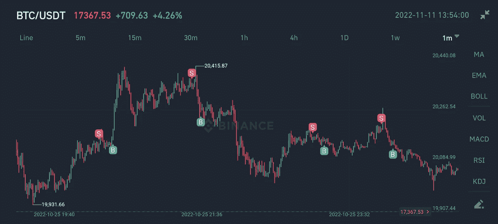

我在币安手机应用程序的 1 分钟图表上截取了这些截图。你所看到的是卖出(红色)和买入(绿色)市场订单，由 1 分钟蜡烛线绘制，订单在此完成。

正如你所看到的，这是一个在几分钟内建仓的策略。上面的图像显示了四个漂亮的点击卖出 BTC 高，并在较低的价格重新购买，以积累 BTC。

遗憾的是，币安手机应用程序并没有精确地按照订单成交的价格水平来绘制订单图标。相反，它在蜡烛线的上方(对于卖出订单)和下方(对于买入订单)绘制图标。这部分扭曲了每个位置的视觉表示，使其在性能方面看起来比实际更好。

Superalgos UI 以订单被满足的精确价格水平绘制订单，但是我没有前两周 Superalgos UI 的截图。你会在跑步的最后一段得到它们！

在这里你可以看到 10 月 26 日更多的头皮:

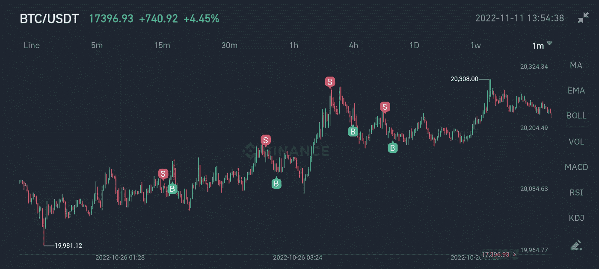

第一个职位是失败的，但其他三个是成功的。

注意所有的交易是如何以卖出订单开始，以买入订单结束的。这意味着交易系统在这一点上是看涨的，站在 BTC 假设价格会上涨，并试图在价格暂时下跌时快速交易以增加 BTC 的平衡。

我不知道交易系统如何评估趋势或刷单机会，因为我不知道背后的逻辑。

> 这一策略是由作者保密的。我所能看到的是我的机器人在自动跟踪信号时下的订单。

同样在 26 日，又有几个失败，接着是一个成功，价格又一次飙升。

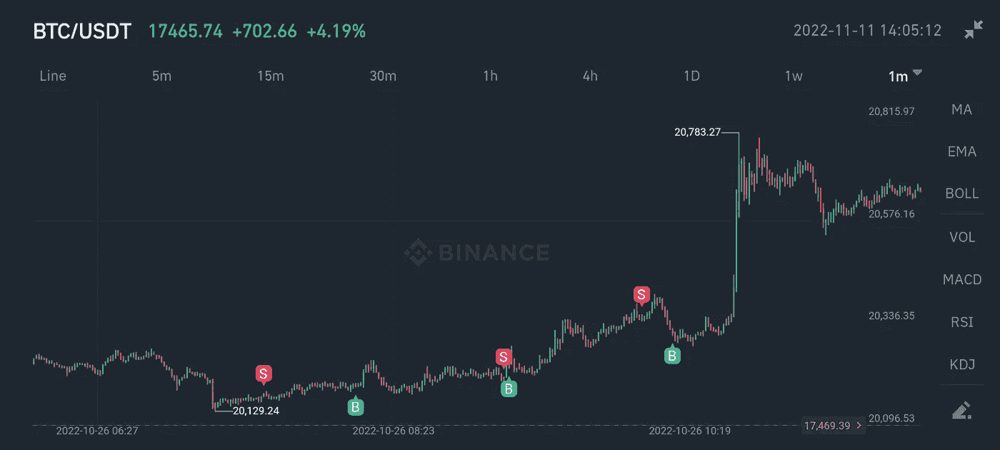

图像上的前两个位置失败了，而第三个位置——就在峰值出现之前——成功了。

27 号，我出错了，bot 停了。

我通过项目的电报组报告了这个问题[，却发现开发人员已经合并了一个改进，可能会修复我的问题。我更新了我的机器人，再次启动它，**这次是 0.1 BTC** ，从那以后一直运行没有任何错误。](https://superalgos.org/community-join.shtml)

# 第二周，10 月 28 日—11 月 3 日

本周，市场多次重新测试 20k 美元支撑区，比特币 Twitter 开始看涨。底部在里面吗？许多人认为它可能！

随着适当波动性的回归，我急切地想看看这个策略会有怎样的表现。

看看 28 号的几笔交易:

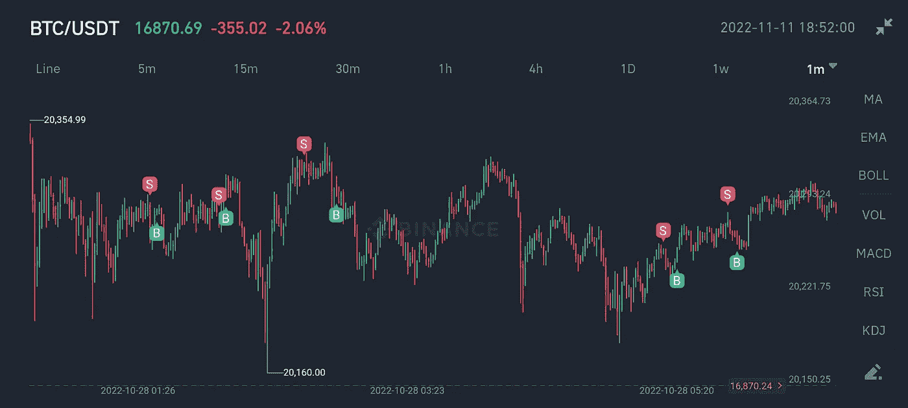

大部分头寸都很短，不到十分钟，P&L 也很浅，范围从-0.2%到 0.2%。这是一个耐心积累的游戏！好的一面是你白天不需要太多的注意力，如果有的话。这个机器人一直不停地跑…

同样是在 28 日，这里有一个跨越近一个小时的较长仓位的例子:

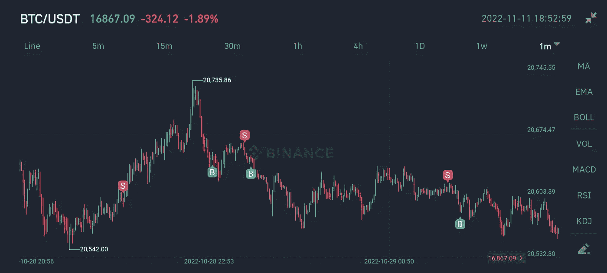

这是图像中的第一个位置，这是一个明显的失败，因为机器人以更高的价格购买。然后，打几下来补偿短暂的损失。

10 月 29 日的另一个截图显示了一个更深的位置，在单次出手中赢得了大约 1%的利润。就是图像中间的那个。

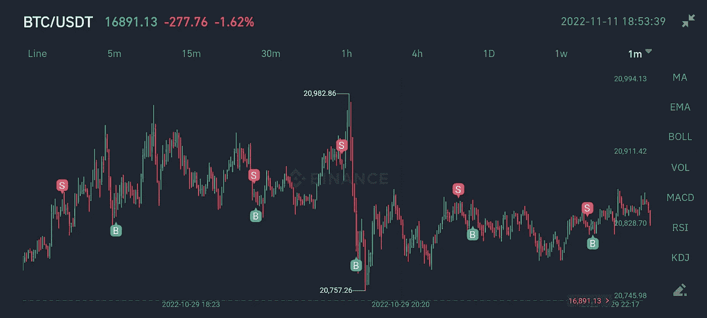

接下来，在 31 号，有一个很好的例子来说明为什么在系统看涨的时候站在 BTC 是值得的:头皮，头皮，头皮，再多一点时间，然后持有 BTC！等待价格上涨，然后再开始倒票！漂亮！

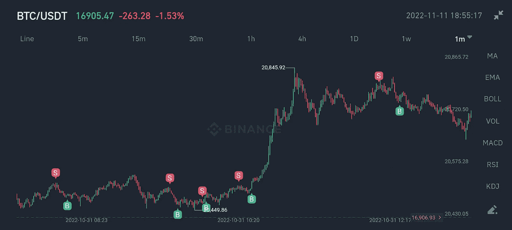

现在，让我们跳到 11 月 2 日，看看在异常期间会发生什么。

前三个位置都是快速黄牛。至少有两个失败了，但损失很少。然后疯狂的事情发生了！一分钟之内，一根诈骗绳上下跨越近 600 美元。

策略不变，继续持有 BTC，什么都不做，等待下一次刷单机会。

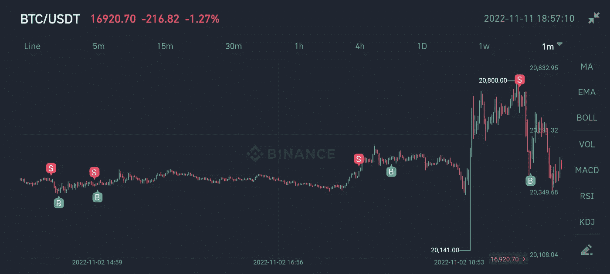

然后嘣！它击中了一个杀手 2%的胜利！

> 在此期间，到 10 月 30 日，我已经下跌了近 1%。然后我回到盈亏平衡线上方，11 月 3 日收盘时上涨了约 1.5%。

这与我经历的极低波动性的第一周非常相似。

到目前为止，我的第一印象是这个策略看起来很安全，很好地处理了异常情况，相当保守，并且没有冒太多的风险。

也就是说，两周是得出有意义结论的一个非常小的样本，所以我把所有这些作为非决定性的轶事观察。

# 第三周，11 月 4 日—11 月 10 日

这可能是自 Mt. Gox 崩溃以来比特币历史上最疯狂的一周。

它开始于 4 日和 5 日反弹至 21.4 千美元。鉴于 20k 美元的支撑区域在上周已经被彻底测试，交易者开始变得兴奋起来。历时 5 个月的积累期很可能即将结束，下一轮牛市正在敲门。

该策略似乎随着市场的上涨而减少交易，这是可以理解的，甚至是可取的，如果你的目标是积累比特币，像我一样。

下图显示的是当地价格为 21.4 美元的顶部，两边都是一些不错的旧头皮:

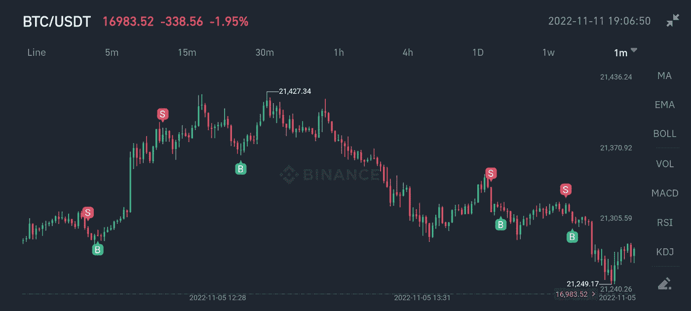

比特币的一切看起来都很好，直到它受到追捧。

币安的首席执行官投下了一颗重磅炸弹，击中了这个行业最受伤的地方:我们对集中式交易所的信任，这是当前连接菲亚特世界和比特币的基础设施的关键部分。

11 月 5 日 21.4k 美元的本地顶部突然变得不可改变。这样一颗重磅炸弹不会让我们很快突破那个阻力区。

然而，这个策略不受坏消息的影响，继续刷单，好像什么也没发生。

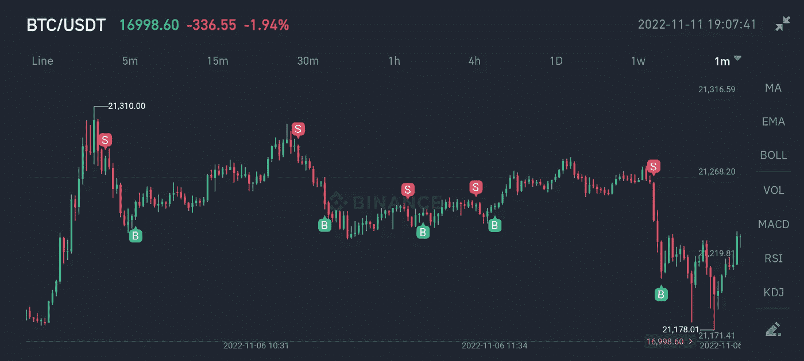

市场的紧张情绪导致了一些额外的波动，导致了第一条推文之后的一些好交易。

11 月 7 日，尽管 SBF 徒劳地试图淡化此事，但随着投机活动的增加和珍闻信息的出现，比特币继续下滑。

该策略无视比特币 Twitter 上的发展，继续持有比特币并倒卖。

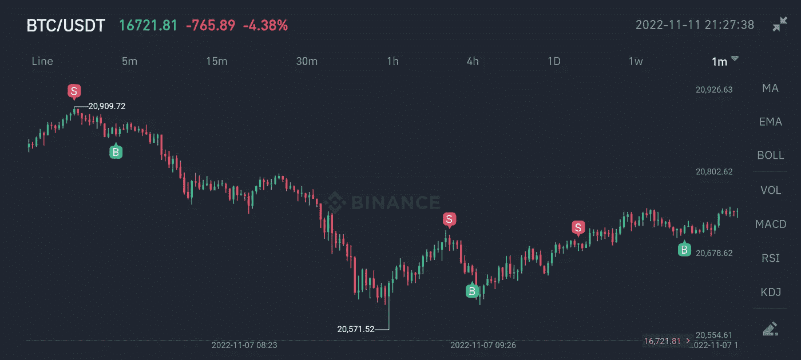

> 在那之前，我在前半周的 BTC 时间里上涨了 2%,从来没有下跌过！

然后是第二条推文，11 月 8 日。

CZ 证实了在此之前只存在于传闻平面中的第一手信息，市场疯狂地用热刀像切黄油一样切开所有现有的支持区域。

尽管如此，该战略发挥冷静，不急于。

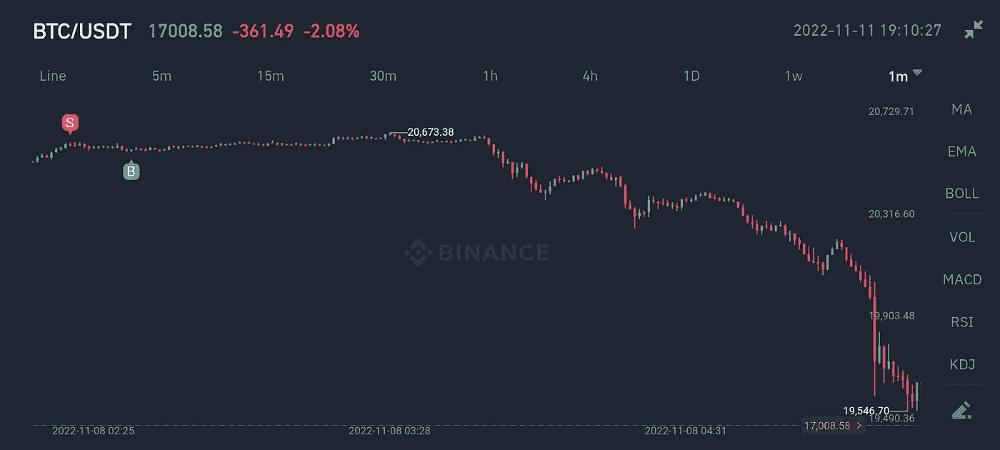

这是在决定性的回落到 2 万美元以下之前的最后一次尝试。

现在看看在 19.7 千美元区域的第一次移动结束后发生了什么。

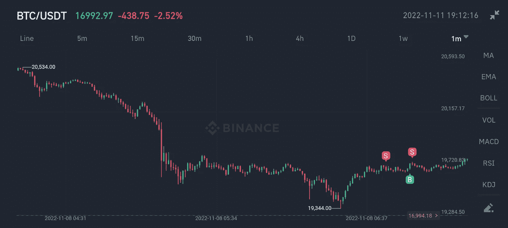

交易系统又下了一个看涨的头寸，但紧接着，卖出了所有决定站在 USDT 一边的 BTC。

我的理解是，当刷单在几分钟内发生时，系统在更高的时间框架内评估趋势，这一显著的变动使趋势偏向熊市。

接下来的几个位置证实了怀疑。

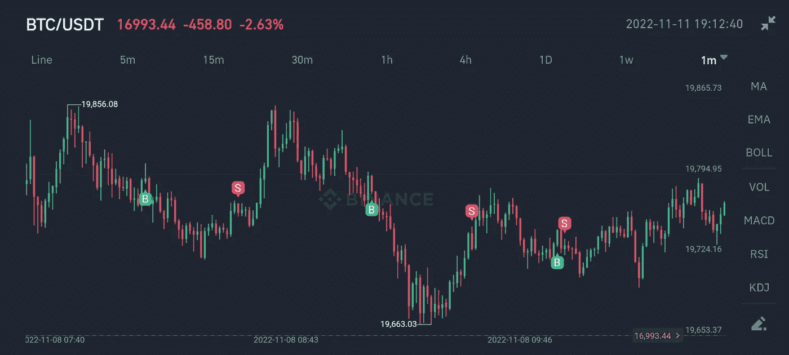

注意系统现在是如何先买入，然后平仓卖出，在不活跃时站在 USDT 上。

尽管如此，在 11 月 8 日，下滑继续温和，系统继续站在 USDT 刷单。

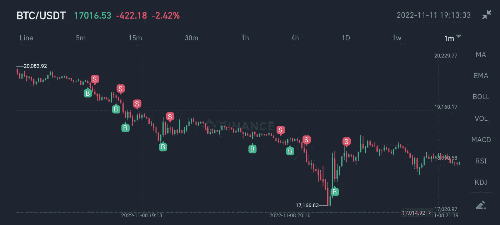

> 在 11 月 8 日最后一次建仓后，BTC 交易价为 18.4 万美元，我在 BTC 涨了 5%(与前一周的结果累计)。

看起来市场很乐意在 18，000-19，000 美元范围内等待，但币安很快就在 11 月 9 日给棺材钉上了最后一颗钉子:

幸运的是，这个策略知道看涨趋势已经消失，在下跌到 15.5 万美元以下的过程中，我一直站在 USDT 的立场上

这是 Superalgos 对实时交易时段的可视化展示:

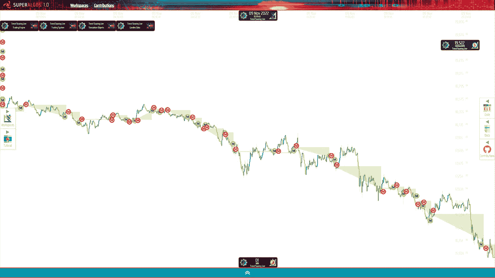

为清晰起见，下面是两张幻灯片的相似视图，显示了在较短时间内$15.5k 的分割情况:

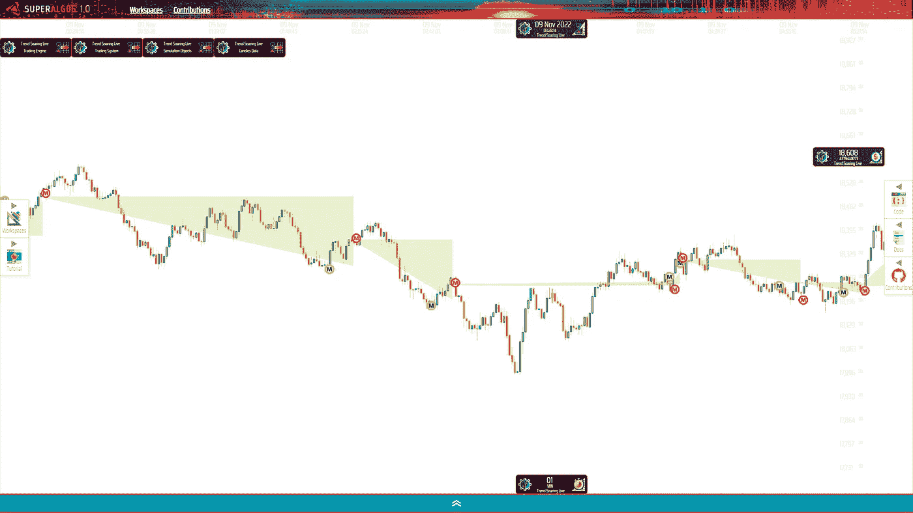

…以及:

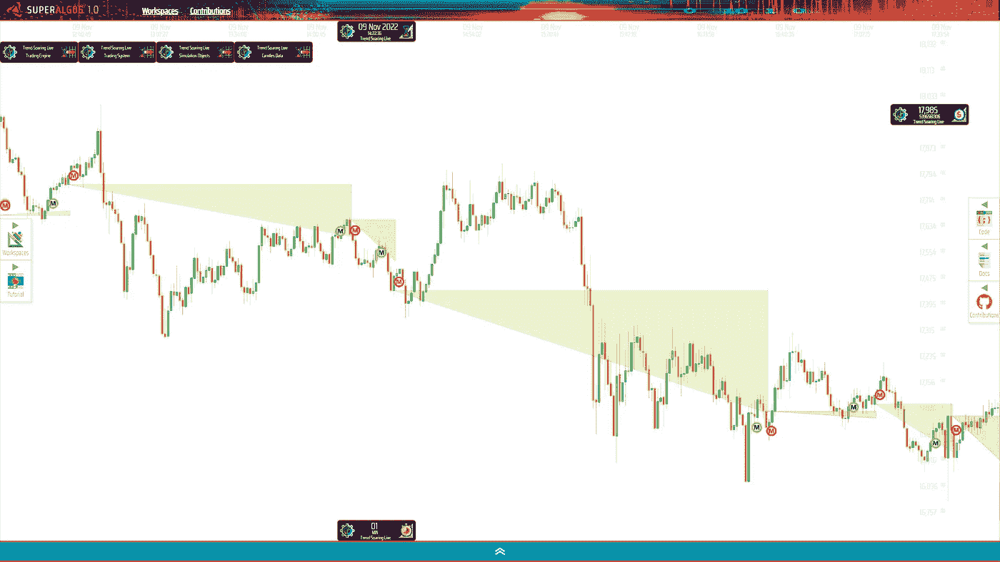

正如前面所暗示的，Superalgos 以订单被执行的确切价格水平绘制代表买卖订单的图标。

为了提高每个位置的可见性，界面提供了一个用三角形标记位置跨度的层。水平边标记策略的目标价格，垂直边标记成交时的差价。

> 截至 11 月 9 日，我在 BTC 的股票上涨了 23%!

11 月 10 日出现了显著的反弹，比特币玩家争相买入，回到了 17k-18k 美元的区间。

因为这个动作很突然，一些鲸鱼在一分钟内买了大量的硬币，所以这个策略仍然是看跌的，站在 USDT 的立场上看跌。

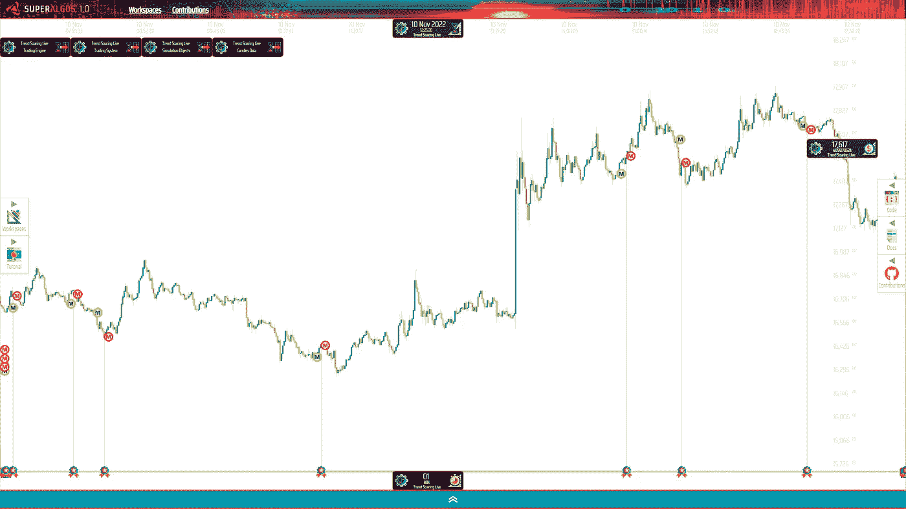

突然的上涨在 BTC 花费了大约 7%,但是如果算上当天成功的交易，平均损失为 3%。

> 这就是我如何在 BTC 以 20%的利润结束了自 Mt. Gox 以来最疯狂的一周！

在分析了三个星期的交易结果后，我决定在接下来的几个星期里把交易量增加一倍，继续在游戏中收集数据。

到目前为止，我遇到了一个从看涨到看跌的明显转变，几个由灾难性消息引发的快速波动的异常情况，极低和极高的波动背景，以及介于两者之间的一切。到目前为止，这是一次紧张的现场测试！

我很想知道当趋势再次变得看涨时，策略会如何表现。在这段时间里，我希望我能继续增加我的比特币持有量，这正是我所追求的！

# 如何跳上船

Superalgos 是一个开源项目。新的副本交易维度将原本复杂的 Superalgos 平台推向了一个全新的领域。如果你精通操作电脑，并能按照指示操作，你应该能够处理有点陡峭的学习曲线，并在几个小时内部署你的复制交易机器人。

这个社区非常欢迎你，你会得到所有你可能需要的帮助来加入复制交易者的行列。

在我让你走之前，请允许我补充一些东西。

> 你真是个幸运的混蛋！

社区中的人们已经不知疲倦地工作了多年，以达到盈利策略开始出现的点。最重要的是，这个项目在营销上没有花费一分钱。它纯粹是通过口口相传发展起来的。

您非常幸运地找到了第一次测试运行的评论，并且成为了第一批在这个阶段加入项目的少数人之一。

下面的文章提供了您需要开始的所有细节:

 [## 自由和开源的分散社会交易的力量

### 如何使用 Superalgos 自动跟随经验丰富的算法交易员的交易机器人，免费！

medium.com](/superalgos/the-power-of-free-and-open-source-decentralized-social-trading-d67cb1aab1b) 

# 想知道接下来会发生什么吗？

正如我所说的，我已经将大小增加了一倍，而且在我写这篇文章的时候，这个机器人仍然在交易。如果你想了解未来几周如何影响我的 BTC 包，请关注我并订阅电子邮件通知。

***还有请记住，以上都不是理财建议。交易本身就有风险，你可能会损失全部或部分资金。还要注意回溯测试的表现并不代表实时交易的表现，实时交易的表现也不代表未来的表现！复制交易风险自担！***