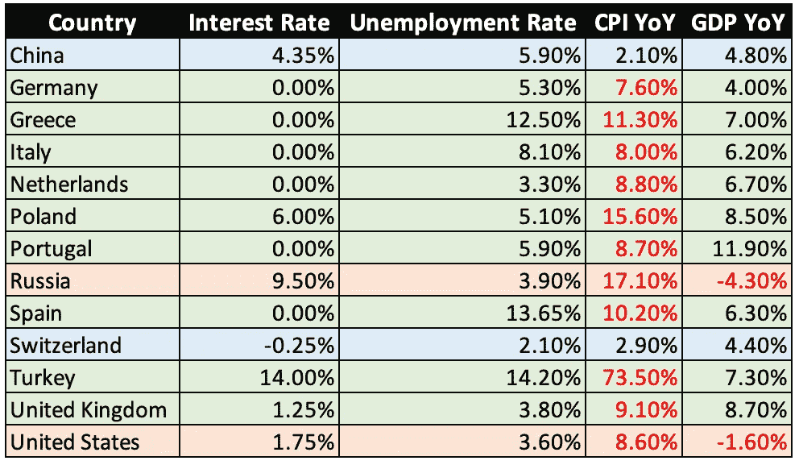
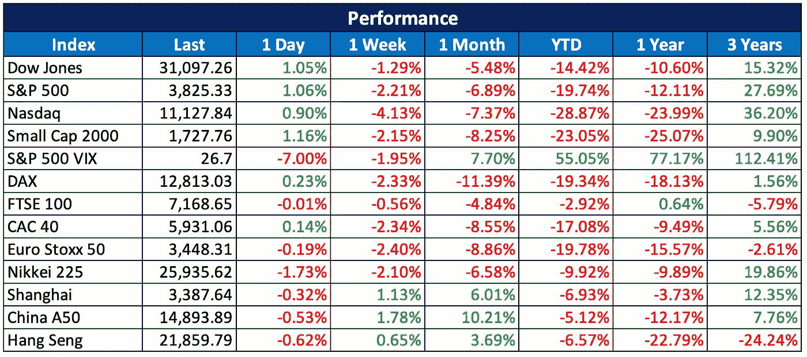
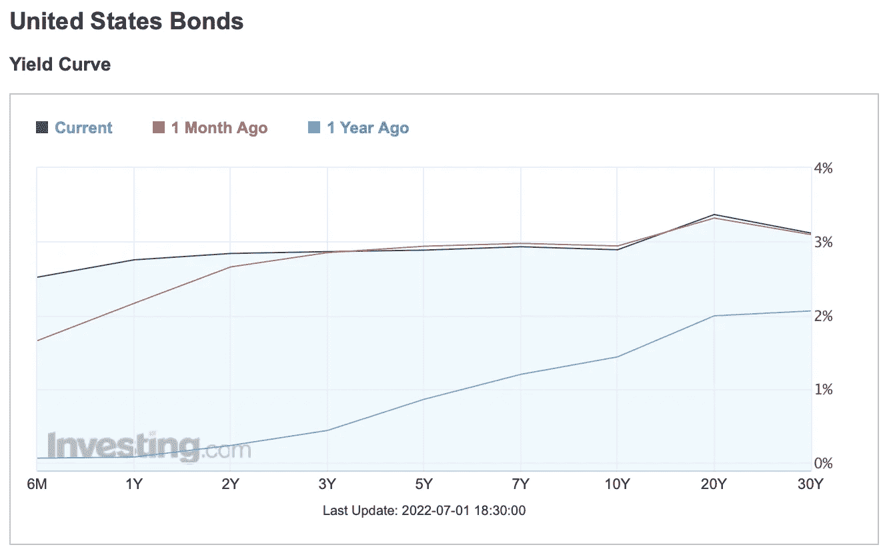
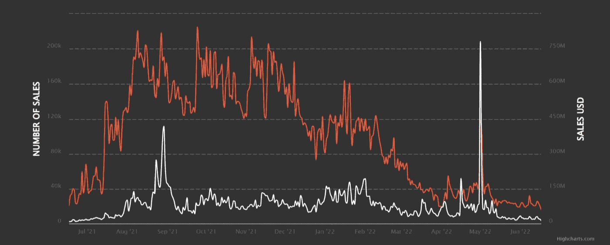

# 2022 07 03 YOLO 市场周刊摘要

> 原文：<https://medium.com/coinmonks/2022-07-03-yolo-markets-weekly-recap-e08fb62bbcf7?source=collection_archive---------35----------------------->

在 Medium 和 Twitter @nerdzvest 上关注我

# nerdzvest 洞察力

> **预计市场将保持区间波动**

最新的市场趋势似乎与去年相反，美国和欧洲市场下跌，而中国股市小幅上涨。这可能是由于美国和大多数欧洲国家的高通胀导致经济紧张，导致央行加息。加上各种宏观经济事件，它打击了投资者对衰退可能在未来几个月登陆的担忧。

Nerdz 认为，随着我们开始看到高通胀和供应链问题对公司业绩和消费者信心的影响，这种下降趋势可能会在未来几个月持续下去。

> 交易新手？试试[密码交易机器人](/coinmonks/crypto-trading-bot-c2ffce8acb2a)或者[复制交易](/coinmonks/top-10-crypto-copy-trading-platforms-for-beginners-d0c37c7d698c)

与此同时，在市场和经济跌至过去一年的最低点(部分原因是 CCP 加强了控制)后，中国似乎正在朝着相反的方向发展。它的 CPI 数字看起来适中，但 GDP 增长率低于预期。难怪中国政府正寻求实施促增长政策，以提振其遭受重创的经济。这可能为中国股市带来反弹的顺风，但 Nerdz 仍对中国股票的选择保持谨慎，因为它在很大程度上受中国政策和战略的影响。

> *Nerdz 指示器*

短期:谨慎

中期:看跌

长期:机会主义

# 关键事件

> **航海家数码在整个行业的保证金通知和违约中暂停活动**

数字资产经纪公司 Voyager Digital 暂停了所有客户交易、存款、取款和忠诚度奖励。几天前，航海家的一个客户未能偿还价值数亿美元的贷款，引发了对整个行业破产蔓延效应的日益担忧。

[https://www . CNBC . com/2022/07/01/voyager-digital-suspends-all-trading-deposit-and-取款-。html](https://www.cnbc.com/2022/07/01/voyager-digital-suspends-all-trading-deposits-and-withdrawals-.html)

> **3AC 在破产传闻持续数周后申请破产**

加密对冲基金三箭资本(Three Arrows Capital)上周五晚些时候在纽约南区申请了第 15 章破产，此前几周人们一直猜测它已经功能性破产。该公司从包括 BlockFi、Celsius、Babel Finance 和 Voyager Digital 在内的几家加密贷款机构借入了大量资金，但无力偿还。贷款人停止提款，或者需要扩大信用额度以度过难关。

[https://www . coin desk . com/business/2022/07/01/three-arrows-capital-files-for-banking-in-new York-tied-to-British-virgin-islands-proceeding/](https://www.coindesk.com/business/2022/07/01/three-arrows-capital-files-for-bankruptcy-in-new-york-tied-to-british-virgin-islands-proceeding/)

> **Meta 正在结束它的天秤座稳定币实验**

Meta 将在 9 月前关闭社交媒体公司的数字钱包支付试点 Novi，结束其为期三年的 libra stablecoin 实验。Novi 一直是 Meta 在 2019 年 6 月披露的 libra stablecoin 的钱包，但监管压力迫使 stablecoin 项目改变方向，因为它在 2020 年成为基于加密汇款的汇款试点。然而，它从未超出美国和危地马拉。

[https://www . coin desk . com/business/2022/07/01/meta-to-shutter-Novi-crypto-payments-wallet-in-September-ending-Libra-saga/](https://www.coindesk.com/business/2022/07/01/meta-to-shutter-novi-crypto-payments-wallet-in-september-ending-libra-saga/)

> **毕马威进入元宇宙**

毕马威开设了首个元宇宙协作中心，将员工、客户和其他人与 Web3 连接起来。该中心将侧重于教育、合作、培训、活动和研讨会。该公司的长期目标是研究其他潜在的元宇宙用例，如医疗保健、消费、零售、媒体和金融服务。

[https://coin telegraph . com/news/KPMG-entries-the-元宇宙-投资 3000 万-网络 3-员工培训](https://cointelegraph.com/news/kpmg-enters-the-metaverse-invests-30m-in-web3-employee-training)

# 市场更新

> **美国和欧洲市场继续下跌，而中国市场保持上升趋势**

在持续的战争、供应链冲击和衰退担忧中，美国和欧洲市场在过去一周下跌。美国收益率曲线也明显变平，短期收益率上升，长期收益率下降。另一方面，中国股市表现良好，延续了数月来的跌势。这是对中国政府正在推动促增长政策以提振受 Covid 封锁严重影响的经济这一事实的回应。

> **NFT 销量在一年的炒作后跌至低谷**

随着加密市场陷入低谷，围绕 NFT 的炒作也随着其日销量降至最低点而平息。然而，像 BAYC 这样的 NFT 顶级项目似乎很好地保持了它的价格(BAYC 徘徊在 90eth 左右，但销量在下降)。

