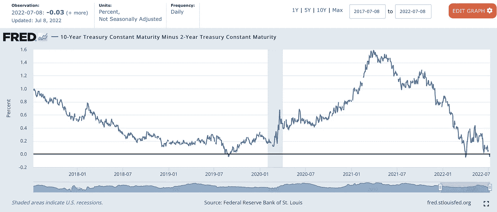
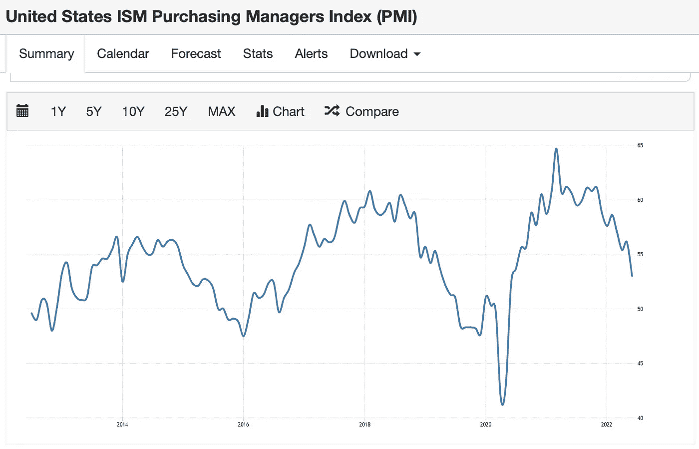
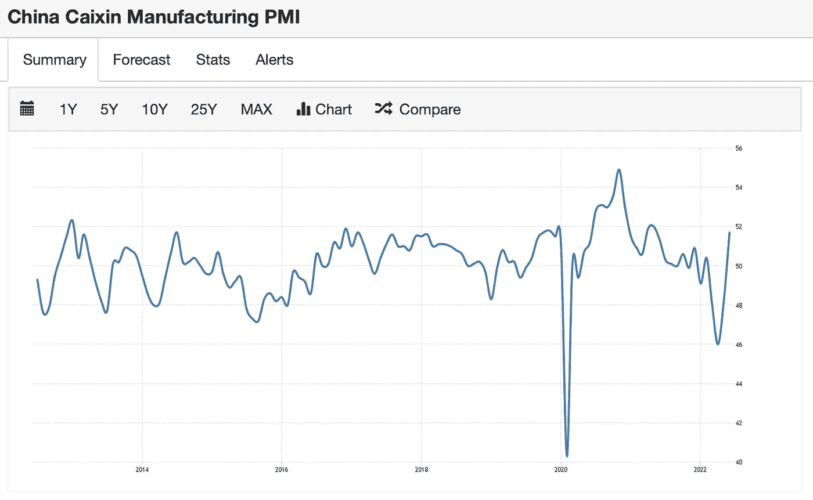
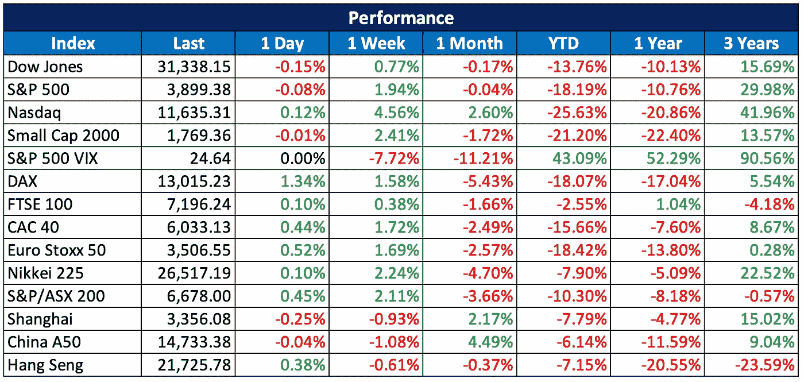
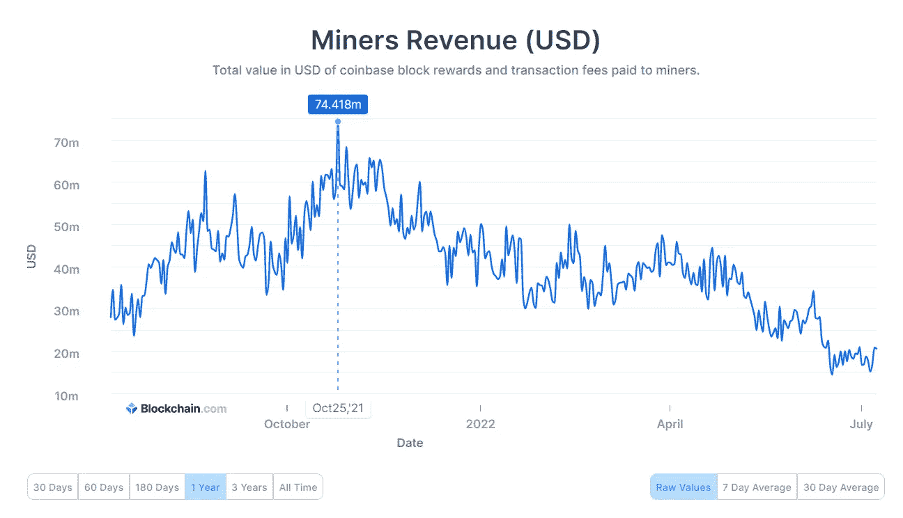
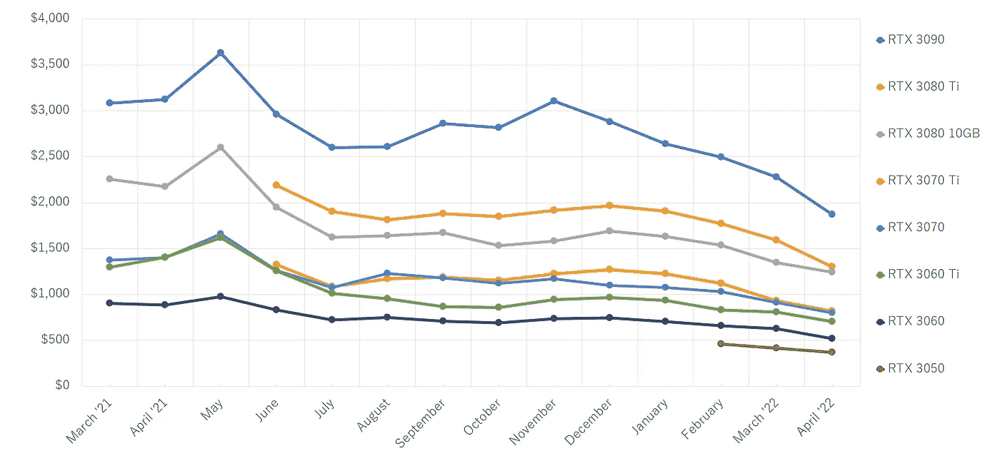

# 2022 07 10 YOLO 市场周刊摘要

> 原文：<https://medium.com/coinmonks/2022-07-10-yolo-markets-weekly-recap-8aab86395df1?source=collection_archive---------29----------------------->

在 Medium 和 Twitter @nerdzvest 上关注我

# nerdzvest 洞察力

> **市场可能继续上涨，但仍应保持谨慎**

过去的一周是百感交集的一周。一方面，我们看到市场从低点反弹。另一方面，负面消息在全球政治舞台上浮动(安倍被枪杀，鲍里斯·约翰逊辞职，斯里兰卡抗议)。Nerdz 认为这可以归结为人们长期忍受的所有痛苦，如高通货膨胀。

虽然目前市场的上涨势头似乎很强劲，但 Nerdz 仍是我们近期的谨慎立场，因为有令人担忧的进一步下行迹象，尽管不可否认的是，市场目前相对超卖。

2-10 年期美国国债利差再次转为负值，而美国采购经理人指数继续下降。这些都是令人担忧的迹象，表明经济正在收缩，美联储正在加息并实施量化紧缩。与此同时，中国经济和市场似乎正朝着相反的方向发展，国家经济开发区将密切关注这种背离，寻找任何机会。

> *Nerdz 指示器*

短期:谨慎

中期:看跌

长期:机会主义

> 交易新手？试试[密码交易机器人](/coinmonks/crypto-trading-bot-c2ffce8acb2a)或[复制交易](/coinmonks/top-10-crypto-copy-trading-platforms-for-beginners-d0c37c7d698c)

# 关键事件

> **马斯克希望终止其 Twitter 交易**

埃隆·马斯克(Elon Musk)希望终止他以 440 亿美元收购 Twitter 的交易，因为 Twitter 涉嫌以实质性不准确的陈述违反合并协议。然而，Twitter 董事会主席 Bret Taylor 表示，该公司仍然致力于以商定的价格完成交易，并计划采取法律行动来执行协议。

[https://www . CNBC . com/2022/07/08/elon-musk-notifies-Twitter-he-is-terminating-deal . html](https://www.cnbc.com/2022/07/08/elon-musk-notifies-twitter-he-is-terminating-deal.html)

> **NFT 平台战争可能在不久的将来发生**

根据 DappRader 的“Q2 Dapp 行业报告”，一场即将到来的不可替代的令牌(NFT)平台战争可能即将爆发。该报告谈到了 UniSwap 最近如何收购 Genie 和 OpenSea 如何收购 Gem，以努力扩大各自的服务，将 NFT 汇总工具纳入其中，该工具可累积来自各种交易平台的 NFT 报价。

[https://coin telegraph . com/news/NFT-platform-wars-can-be-ahead-says-new-dappradar-report](https://cointelegraph.com/news/nft-platform-wars-could-be-ahead-says-new-dappradar-report)

# 市场更新

> 美国和欧洲市场上涨

过去一周，美国和欧洲市场摆脱了对衰退的担忧，出现反弹。美国 6 月份的就业人数大幅增加，这让市场相信美国经济状况良好，可以应对美联储大幅加息。

> **比特币采矿收入下降，全球 GPU 成本下降**

由于 BTC 价格大幅下跌，矿工从交易费和采矿奖励中获得总收入下降了约 80%,达到一年来最低点，接近 1500 万美元。此外，全球芯片短缺和疫情冠状病毒导致 GPU 价格飙升，进一步影响了矿商的利润。随着世界各地的卡制造商恢复运营，GPU 价格大幅下降，一些卡的售价低于 MSRPs。仅在 5 月份，由于供应超过市场需求，GPU 价格平均下降了 15%以上。此外，最近 GPU 的涌入迫使二级市场上的卖家降低了二手采矿钻机的过高价格。

