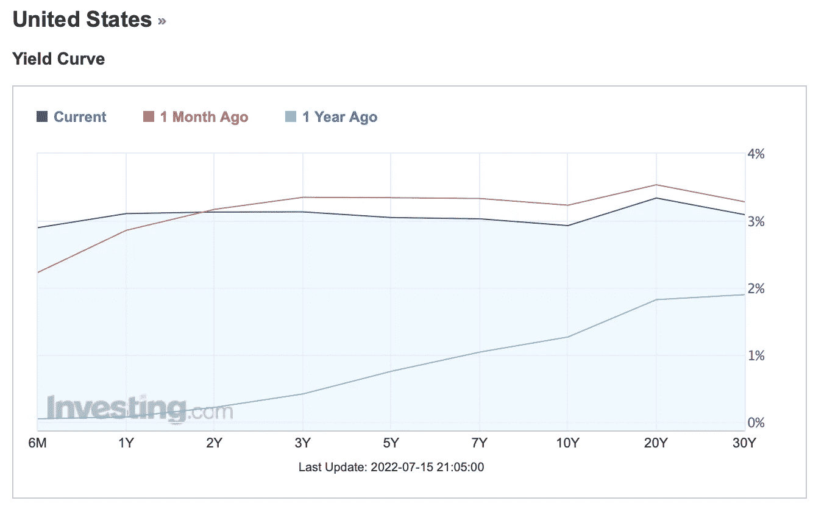

# 2022 07 17 YOLO 市场周刊摘要

> 原文：<https://medium.com/coinmonks/2022-07-17-yolo-markets-weekly-recap-c2019834ea9e?source=collection_archive---------37----------------------->

在 Medium 和 Twitter @nerdzvest 上关注我

# nerdzvest 洞察力

> 随着 7 月 FOMC 即将来临，预计大多数市场将出现横向波动

在美国通胀数据公布后，我们看到了市场的拉锯运动。这可能表明市场目前所处的位置，人们已经对衰退的担忧进行了定价。这是否意味着底部在或接近底部？

Nerdz 认为，由于我们已经横向盘整了一段时间，暂时的底部已经开始形成。然而，许多迹象仍然表明，许多经济体的情况可能会恶化。Nerdz 仍然倾向于谨慎的一方，尤其是当收益率曲线继续反转时。在接下来的几天/几周，在 7 月 FOMC 到来之前，可能会有潜在的上涨。然而，这可能是目前正在形成的侧向运动的一部分。

> 交易新手？试试[密码交易机器人](/coinmonks/crypto-trading-bot-c2ffce8acb2a)或者[复制交易](/coinmonks/top-10-crypto-copy-trading-platforms-for-beginners-d0c37c7d698c)

> ***Nerdz 指示器***

短期:谨慎

中期:看跌

长期:机会主义

# 关键事件

> **摄氏申请破产**

Crypto lending platform Celsius 已经申请第 11 章破产。最近，Celsius 结清了欠 Compound、Aave 和 Maker 的最后一笔分散融资(DeFi)债务，在一个月的时间里，将最初的 8.2 亿美元债务减少到了 0.013 美元。然而，仍将资产锁定在借贷平台上的储户的命运仍不得而知。此外，佛蒙特州金融监管部(DFR)表示，它认为该公司“严重资不抵债”，不具备“资产和流动性”来履行对客户的义务，并指责他们通过将客户资金分配给高风险投资来管理客户资金。

[https://coin telegraph . com/news/breaking-celsius-is-reported-filling-foreign 破产申请](https://cointelegraph.com/news/breaking-celsius-is-reportedly-filing-for-bankruptcy-imminently)

> **Polygon 被选中参与迪士尼加速器计划**

第二层扩展平台 Polygon 被选中参与迪士尼 2022 加速器计划，以 Polygon 的 Web3 技术为基础。以太坊扩展平台是加速器计划接受的六个项目之一，该计划今年的重点是增强现实(ar)、不可伪造的令牌(NFT)和人工智能(AI)。

[https://coin telegraph . com/news/polygon-selected-to-part-in-Disney-s-2022-accelerator-program](https://cointelegraph.com/news/polygon-selected-to-participate-in-disney-s-2022-accelerator-program)

> **上海支持区块链、NFT、Web 3 空间内的企业**

根据上海市政府“上海数字经济发展第十四个五年计划”，上海计划推动区块链、不可伪造令牌(NFT)、元宇宙和 Web3 等创新的发展。尽管该计划对分散金融(DeFi)的前景保持沉默，但它提到了“数字金融”，承诺推动智能合约，改善资产交易、支付和结算、登记和托管。不过，本节重点探讨了数字元的试点。

[https://coin telegraph . com/news/Shanghai-included-区块链-nfts-and-web 三年计划](https://cointelegraph.com/news/shanghai-included-blockchain-nfts-and-web3-in-its-5-year-plan)

# 市场更新

> **美国和欧洲市场保持区间震荡**

美国宣布更高的通货膨胀率(9.1%)震惊了市场，因为参与者迅速将潜在的 1%的加息纳入价格，导致股市下跌。然而，随着消息慢慢深入人心，市场回撤了损失。

> 加入 Coinmonks [电报频道](https://t.me/coincodecap)和 [Youtube 频道](https://www.youtube.com/c/coinmonks/videos)了解加密交易和投资

# 另外，阅读

*   [Bookmap 评论](https://coincodecap.com/bookmap-review-2021-best-trading-software) | [美国 5 大最佳加密交易所](https://coincodecap.com/crypto-exchange-usa)
*   [加密交易机器人](/coinmonks/crypto-trading-bot-c2ffce8acb2a) | [造币评论](https://coincodecap.com/coingate-review)
*   最佳加密[硬件钱包](/coinmonks/hardware-wallets-dfa1211730c6) | [Bitbns 评论](/coinmonks/bitbns-review-38256a07e161)
*   [新加坡十大最佳加密交易所](https://coincodecap.com/crypto-exchange-in-singapore) | [购买 AXS](https://coincodecap.com/buy-axs-token)
*   [红狗赌场评论](https://coincodecap.com/red-dog-casino-review) | [Swyftx 评论](https://coincodecap.com/swyftx-review)