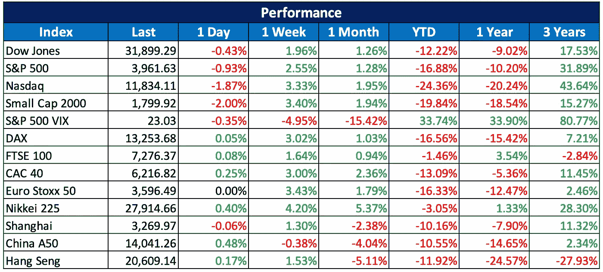
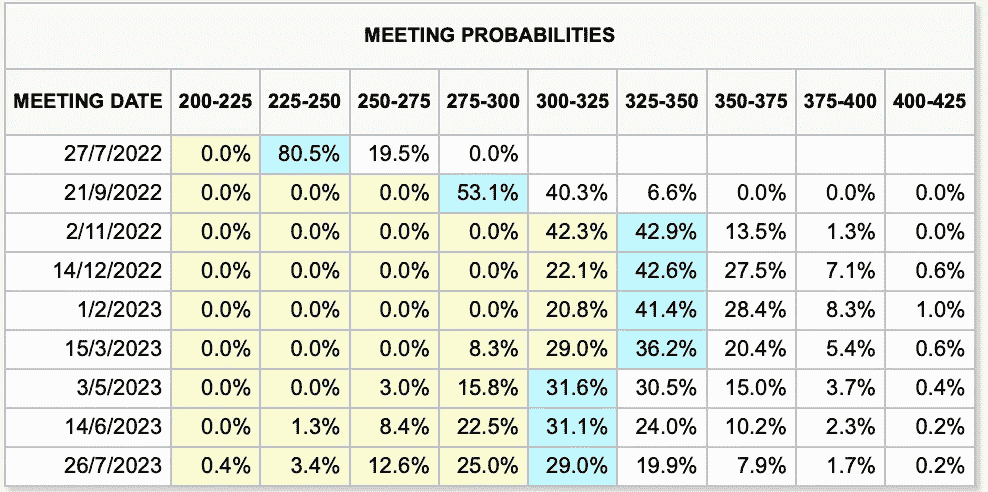

# 2022 07 24 YOLO 市场周刊摘要

> 原文：<https://medium.com/coinmonks/2022-07-24-yolo-markets-weekly-recap-ea49aa4a1fb6?source=collection_archive---------32----------------------->

在 Medium 和 Twitter @nerdzvest 上关注我

# nerdzvest 洞察力

> **预计市场将在 FOMC 之前波动，并在预期加息 75 个基点的消息宣布后上行**

过去一周，主要指数都是积极的，没有出现意外。参与者变得乐观起来，预期通胀可能已经见顶。然而，由于我们仍面临供应链紧缩和通胀压力，尚不清楚这种涨势是否会持续。所有这些问题可能需要一些时间来解决。

展望未来一周，我们将有 7 月 FOMC 公告，这很可能是推动市场走向的主要事件。尽管最初担心加息 100 个基点，但市场参与者似乎预期加息 75 个基点，以抑制本月早些时候报告的高通胀率。Nerdz 同意这一观点，并认为这将使参与者平静下来，美联储正在尽最大努力理智地抑制通胀。这可能会导致市场在声明发布前横盘整理，然后在声明发布后反弹。然而，这在很大程度上取决于讲话后的声明，Nerdz 认为鲍威尔会像以前一样唱同样的调子，这可能会看到市场进一步上涨。

> *Nerdz 指示器*

短期:谨慎

中期:中性至看跌

长期:机会主义

# 关键事件

> **世卫组织宣布猴痘爆发为全球卫生紧急事件**

世卫组织已将日益增长的猴痘疫情提升至最高警戒级别，宣布这是国际关注的突发公共卫生事件。这意味着世卫组织认为此次疫情对全球健康构成了足够严重的威胁，因此需要国际社会采取协调一致的应对措施，以防止病毒进一步传播，并有可能升级为疫情。

[https://www . CNBC . com/2022/07/23/who-declare-spreading-monkey pox-outbreak-a-global-health-emergency . html](https://www.cnbc.com/2022/07/23/who-declares-spreading-monkeypox-outbreak-a-global-health-emergency.html)

> 热浪给中国农业带来麻烦

中国新疆警告说，随着热浪席卷该地区，将会出现更多的山洪和泥石流，并给农业带来风险，从而加快冰川融化的速度，并对其庞大的棉花生产构成威胁。酷热的天气(自 6 月以来)已经推高了为家庭、办公室和工厂降温的电力需求。在农业地区，干旱也成为一个令人担忧的问题。

[https://www . CNBC . com/2022/07/23/China-Xinjiang-warns-of-flood-cotton-risks-mid-sizzling-heat waves . html](https://www.cnbc.com/2022/07/23/chinas-xinjiang-warns-of-floods-cotton-risks-amid-sizzling-heatwaves.html)

> **Web3 平台组成联盟(OMA3)解决互操作性**

基于区块链的元宇宙和 Web3 平台已经决定为 Web3 组建一个开放的元宇宙联盟(OMA3)，以克服该行业的互操作性挑战，核心原则是透明、包容、去中心化和民主化。

该联合组织由 Alien Worlds、Animoca Brands、Dapper Labs、分散之地、MetaMetaverse、Space、Superworld、The Sandbox (SAND)、Upland、Voxels 和 Wivity 建立。

 [## Web3 平台启动开放元宇宙联盟

### 基于区块链的元宇宙和 Web3 平台已经决定为 Web3 (OMA3)建立一个开放的元宇宙联盟，以…

cointelegraph.com](https://cointelegraph.com/news/web3-platforms-launch-the-open-metaverse-alliance) 

> 交易新手？试试[密码交易机器人](/coinmonks/crypto-trading-bot-c2ffce8acb2a)或者[复制交易](/coinmonks/top-10-crypto-copy-trading-platforms-for-beginners-d0c37c7d698c)