# 2022 年中区块链事件和洗钱方法报告

> 原文：<https://medium.com/coinmonks/2022-mid-year-report-on-blockchain-incidents-and-methods-of-laundering-bc1518f02d5c?source=collection_archive---------9----------------------->

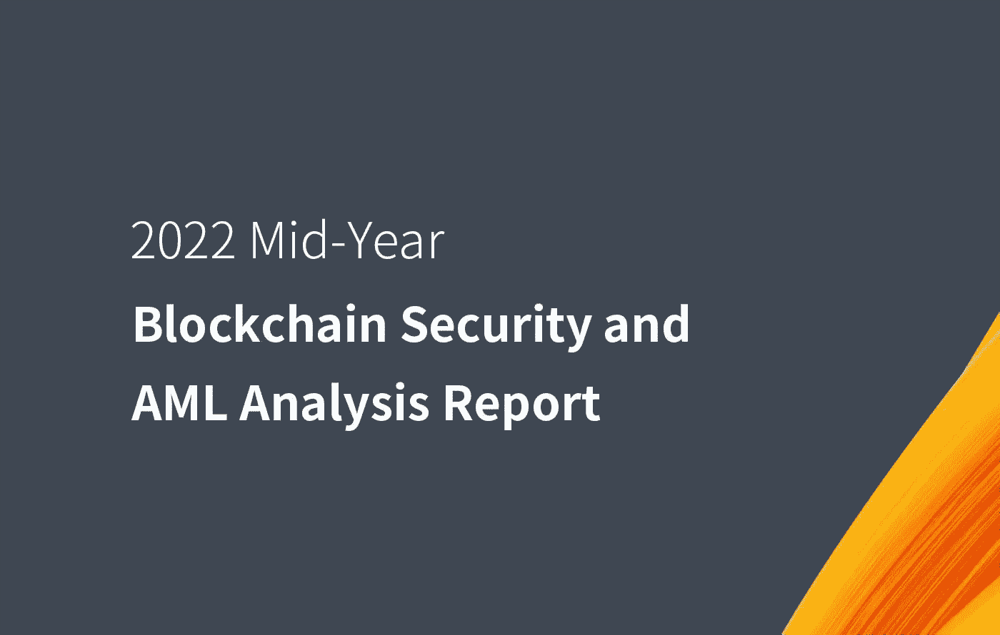

我们最近发布了“ [2022 年中区块链安全和反洗钱分析报告](https://www.slowmist.com/report/first-half-of-the-2022-report(EN).pdf)”。为了方便读者，我们将把这份报告分成四个部分。

这第三篇文章主要关注已知的区块链事件和洗钱方法。

## **已知安全事件**

*   虫洞损失 3.26 亿美元

2 月 3 日，攻击者利用虫洞网络中的一个签名验证漏洞，生成了 12 万个 wet，在 Solana 网络上价值 3.26 亿美元。虫洞的[事件报告](https://wormholecrypto.medium.com/wormhole-incident-report-02-02-22-ad9b8f21eec6)称，虫洞在此次事件中的漏洞具体是索拉纳方核心虫洞契约的签名验证码出现错误。这使得攻击者能够伪造消息来制造虫洞的 wETH，使这次黑客攻击成为迄今为止索拉纳网络上规模最大的损失。

*   豆茎农场闪贷攻击

4 月 17 日，基于以太坊的算法 stablecoin 项目 Beanstalk Farms 遭到了[攻击](https://twitter.com/BeanstalkFarms/status/1515747114894065664)，导致了 1 . 82 亿美元的损失。这种攻击的主要原因是投票和提案执行之间没有时间间隔，这使得攻击者可以在投票结束后直接执行恶意提案，而无需社区审查。令人惊讶的是，袭击者将其中的 25 万美元捐给了一个用于为乌克兰政府募集捐款的地址。

*   和谐 1 亿美元的损失

和谐地平线大桥于 6 月 24 日被黑。根据 SlowMist 的 MistTrack 平台的分析，攻击者带走了超过 1 亿美元，包括 11 个 ERC20 令牌、13，100 个 ETH、5，000 个 BNB 和 640，000 个 BUSD。26 日，Harmony 创始人斯蒂芬·谢(Stephen Tse)在推特上声明，Horizon 受到攻击是由于私钥泄露，而不是智能合约漏洞。尽管 Harmony 加密了他们的私钥，但攻击者能够解密其中的一些密钥，并设法签署了一些未经授权的交易。

*   口袋妖怪拉地毯事件

在 NFT 项目 Pokemoney 的 BSC 上发生了一场闹剧，大约 11，800 BNB(约 350 万美元)被盗。口袋妖怪团队声称，价格下跌是由一个无法解释的黑客攻击造成的，尽管没有发现黑客攻击的证据。他们在 Telegram 上声称，他们无法访问该项目的 Twitter 帐户来通知社区关于这一事件的信息。

*   Crypto.com 入侵了账户

根据 Crypto.com 调查[报告](https://crypto.com/product-news/crypto-com-security-report-next-steps)，2022 年 1 月 17 日，Crypto.com 得知少数用户对其账户上的加密货币进行了未经授权的取款。Crypto.com 暂停所有象征性提款，同时维持基本运营。客户中没有经济损失。“在大多数情况下，我们阻止了未经授权的取款，所有其他客户都得到了全额报销，”Crypto.com 说。483 名 Crypto.com 用户受到该事件的影响。未经授权的取款总额为 4836.26 埃特、443.93 BTC 和 66200 美元的其他货币。

*   Uniswap 空投钓鱼攻击

7 月 12 日，币安创始人 CZ [发推文](https://twitter.com/cz_binance/status/1546624143432433664)称，他们的安全情报部门在区块链联邦理工学院的 Uniswap V3 中发现了一个潜在漏洞。几个小时后，多名 Twitter 用户表示，该协议没有漏洞，但这是一次钓鱼攻击。与 Uniswap 相关的 70，000 多个地址是空投的恶意令牌。airdrop 将用户引向一个看起来与真正的 Uniswap 网站一模一样的钓鱼网站。用户被欺骗签署合同，允许攻击者接管他们的钱包，窃取他们的资金和 NFT。一个钱包丢失了超过 650 万美元的加密货币，另一个丢失了约 168 万美元。

*   OpenSea 电子邮件钓鱼诈骗

全球最大的 NFT 市场 OpenSea 在 2 月 20 日遭到攻击。根据来自 OpenSea 的官方推特[消息，在 OpenSea 合同升级的同时，黑客向所有用户的邮箱发送了钓鱼邮件。许多用户误以为这是一封官方邮件，并授权他们的钱包，导致他们的资产被盗。](https://twitter.com/dfinzer/status/1495302784689704966)

*   ApeCoin 闪贷套利

据 Twitter 用户 [Will Sheehan](https://twitter.com/wilburforce_/status/1504437189979119622) 称，3 月 17 日，一个套利机器人通过闪贷取出了超过 6 万枚 ApeCoins(每枚价值 8 美元)。一项调查显示，这是由于 ApeCoin 的空投机制存在缺陷。ApeCoin 空投是由用户是否拥有 BYAC NFT 的瞬时状态决定的，攻击者可以通过闪贷操纵这种状态。攻击者首先通过闪贷向 BYAC 借款，并使用这些 NFT 来申请空投的 APE 令牌。攻击者随后归还了闪贷。

*   BAYC 官方不和谐黑客

6 月 5 日，BAYC 在其官方 [Twitter](https://twitter.com/BoredApeYC/status/1533181013815349248) 上宣布，其 Discord 服务器遭到短暂攻击，价值约 200 ETH 的 NFT 被盗。该攻击是由一个社区管理员的受损帐户发起的，他发布了一个钓鱼网站的链接。

*   FEG —两起闪贷攻击

5 月 16 日，闪贷被用于[攻击](https://twitter.com/FEGtoken/status/1525965942517268480)多链 DeFi 协议 FEG。攻击者窃取了 144 辆 ETH 和 3280 辆 BNB，总计约 130 万美元。5 月 17 日，FEG 再次遭到攻击，这次攻击者窃取了 291 个 ETH 和 4343 个 BNB，总计 190 万美元，其中 130 万美元在 BSC 上，60 万美元在 ETH 区块链上。虽然这两种攻击相似，但主要原因是 swapToSwap 函数中的 path address 参数没有经过验证，这使得攻击者可以任意传入恶意的路径地址，从而导致 FEGexPRO 合同授权攻击者自己的令牌。

*   乐观由于漏洞损失了 2000 万美元

6 月 9 日，乐观和温特穆特都发布了[公告](https://twitter.com/optimismFND/status/1534631766576836608)通知社区损失了 2000 万 OP 令牌。乐观主义委托 Wintermute 在 OP 代币发行时在二级市场为其提供流动性服务，乐观主义将向 Wintermute 提供 2000 万 OP 代币。Wintermute 提供了一个多重签名地址，在测试了 Wintermute 确认的两笔交易后，乐观向该地址转移了 2000 万 OPs。温特穆特在乐观转移硬币后发现，他们对硬币没有控制权，因为他们提供的多签名地址暂时只部署在以太坊主网上，尚未部署到乐观网络。温特穆特立即开始补救行动，以获得对这些令牌的控制。然而，攻击者已经意识到这一缺陷，并在 Wintermute 之前在乐观网络上部署了多重签名地址，成功控制了 2000 万个令牌。目前，乐观黑客已经返还了 1700 万 OP 代币，并向 Vitalik 的地址转移了 100 万 OP。

*   金融域名系统劫持攻击

5 月 4 日，MM.finance 网站遭到了来自 T2 的 DNS 攻击。根据一份官方文件，攻击者能够在前端代码中注入恶意的合同地址。攻击者利用 DNS 漏洞更改了托管文件中的路由器合同地址。超过 200 万美元的加密货币资产被盗，并通过使用桥梁转移到区块链联邦理工学院。攻击者然后通过龙卷风现金洗钱。

*   KLAYswap 恶意前端攻击

韩国 DeFi 项目 KLAYswap 于 2 月 3 日宣布，该项目被[黑客](/klayswap/klayswap-incident-report-feb-03-2022-f20ba2d8e4dd)攻击，损失约 22 亿韩元，约合 183 万美元。公告称，黑客通过 BGP 劫持方式篡改了 KLAYswap 前端的第三方 JS 链接。当用户访问 KLAYswap 页面时，这种病毒会感染用户，然后授权将资产转移到黑客的钱包地址。在此期间，325 个钱包经历了 407 次交易。

*   陆地生态系统崩溃

5 月 9 日，Terra 的算法支持稳定币 UST 被严重脱钩，使 LUNA 的价值几乎化为乌有。数百亿美元的市值一夜之间化为乌有。Luna Foundation Guard (LFG)试图通过花费约 35 亿美元的比特币来保持 UST 的价值稳定。Terra 最终在 5 月 12 日停止了运营。Terra 的崩溃导致了 600 亿美元的损失，这对比特币的价格产生了抛售压力，并在整个加密行业传播了恐惧。

**安全事件损失概述**

我们将使用上述事件进行反洗钱分析:

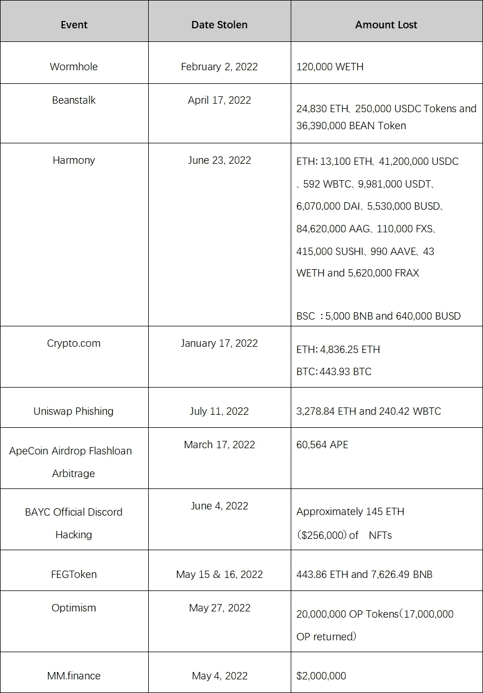

## **详细的反洗钱分析**

*   **虫洞**

黑客地址:cxegprfn 2 ge 5 dniqberurqkhccimer 4 vxkeawcfbbka(Solana)
日期:02/02/2022
被盗金额:12 万 wet
初始资金:龙卷风现金
事件:

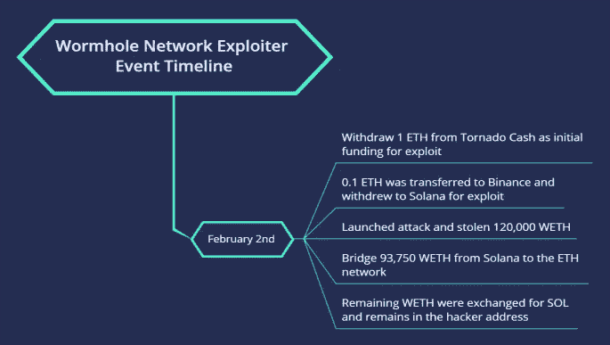

(Wormhole Network Exploiter — Timeline of Fund Transfers)

wet 传输图表:

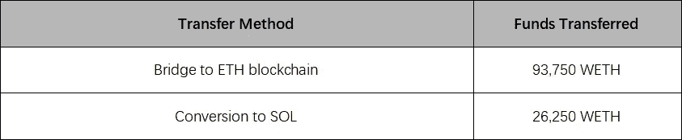

黑客地址的平衡:

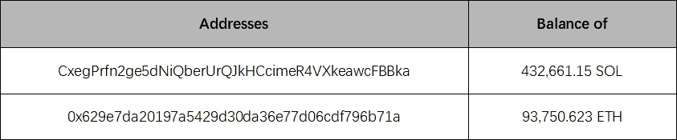

*   **豆茎**

黑客地址:0x 1 C5 dcdd 006 ea 78 a7 e 4783 F9 e 6021 c 32935 a10fb 4(ETH)
日期:04/17/2022
金额:24,830 ETH，25 万 USDC，3639 万豆
初始资金:龙卷风现金
事件:

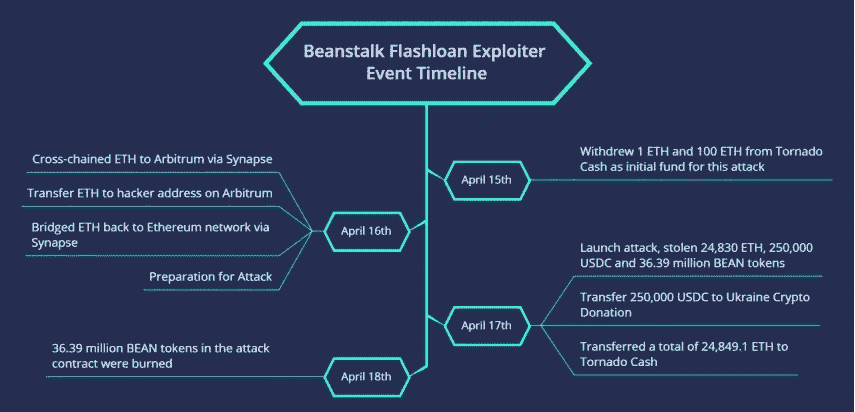

(Beanstalk Flashloan Exploiter — Timeline of Fund Transfers)

以太网传输:

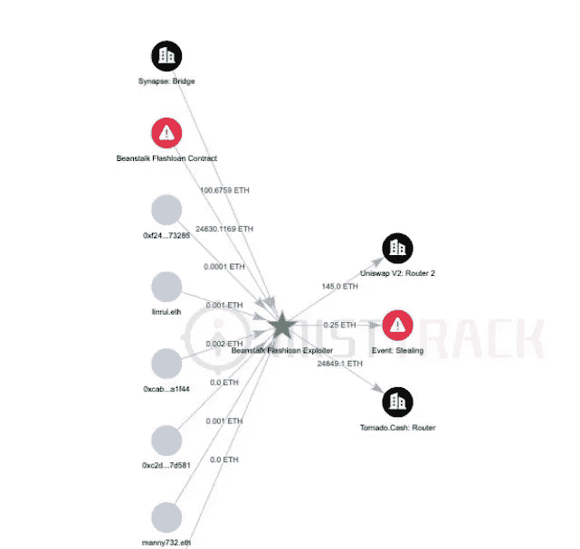

(Beanstalk Flashloan Exploiter ETH — Diagram of Funds Transferred)

以太网传输图表:

Note: The transfer funds include the remaining funds of the attack fee

*   **和声**

黑客地址:
0x0d 043128146654 c 7683 fbf 30 AC 98d 7 b 2285 ded 00(ETH)0x0d 043128146654 c 7683 fbf 30 AC 98d 7 b 2285 ded 00(BSC)
日期:06/23/2022
金额:
ETH:13100 ETH 4120 万 USDC 5120 万 607 万戴、553 万、
8462 万、11 万、寿司 41.5 万、990、43 WETH&562 万
BSC:5000&64 万 BUSD
初期资助:不适用
活动:

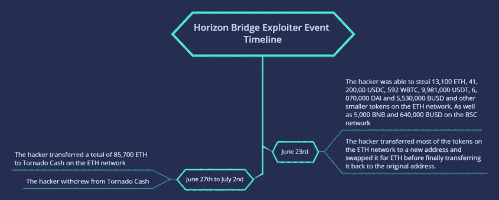

(Horizon Bridge Exploiter — Timeline of Fund Transfers)

以太网传输:

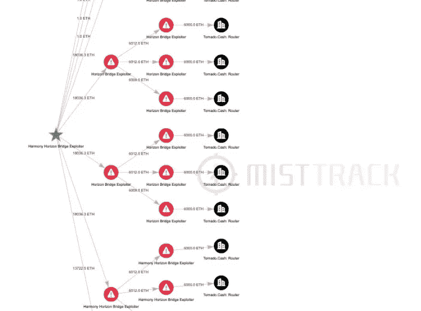

(Horizon Bridge Exploiter ETH — Diagram of Funds Transferred)

以太网传输图表:

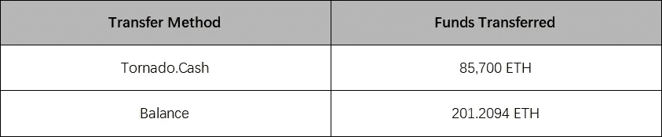

龙卷风。现金转账:

黑客总共向 Tornado Cash 发送了 85，700 ETH。经过我们的分析，我们得出结论，以下取款符合 Harmony 黑客的标准:

●龙卷风提现是分批进行的。每个地址的取款次数是固定的。每个地址收到 5 到 6 笔取款，这意味着 5 * 100 ETH 或 6 * 100 ETH 被发送到取款地址。

●在完成从 Tornado 现金中提取资金后，资金在近一个月的时间里保持相对不动。

根据上面提供的 Tornado 提款特征，总共有 83，300 笔 ETH 提款与黑客有关。

以太网传输图表:

*   **Crypto.com**

黑客地址:
0x6e 1218 c 55 f1 ACB 588 fc 5 e 55 b 721 f 1183d 7d 29d 3d(ETH)BC 1 qk 8 wlwypvr 6v 5 LMS ngg 5a 248 k2 A 9 cgrsrw 5 jsq(BTC)BC 1 q 83 c 9 e 7s 8925 hhy 9 dzqpdyyyfctgwaspj 3 wdrhqr(BTC)BC 1 qk 7 e 2k 8s 252789 cggr 5 xy 67m 6 JVC 0 jsqpd JF

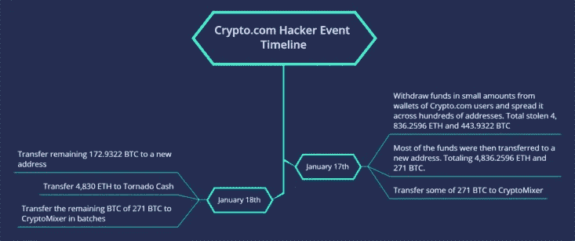

(Crypto.com Hacker — Timeline of Fund Transfers)

以太网传输:

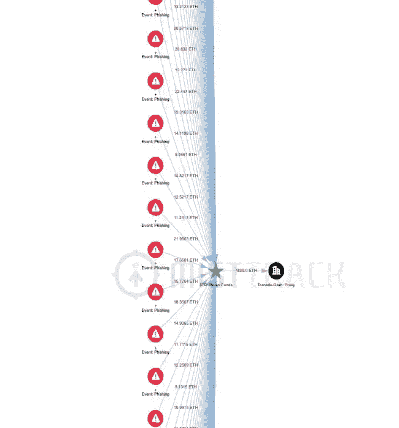

（Crypto.com Hacker ETH — Diagram of Funds Transferred）

以太网传输图表:

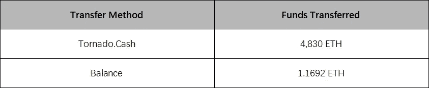

BTC 转移图:

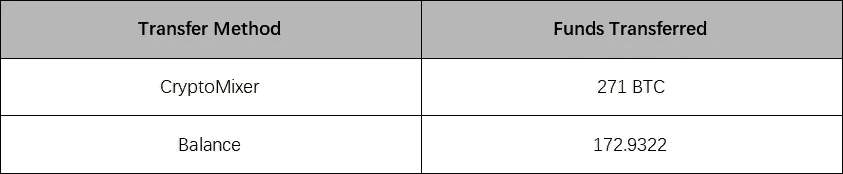

*   **Uniswap 网络钓鱼**

黑客地址:0x 09 b 5027 ef 3a 3b 7332 ee 90321 e 558 bad 9 c 4447 AFA(ETH)
日期:07/11/20227
金额:3,278.8477 ETH，240.42 WBTC
初始资金:龙卷风。现金
转账流量:

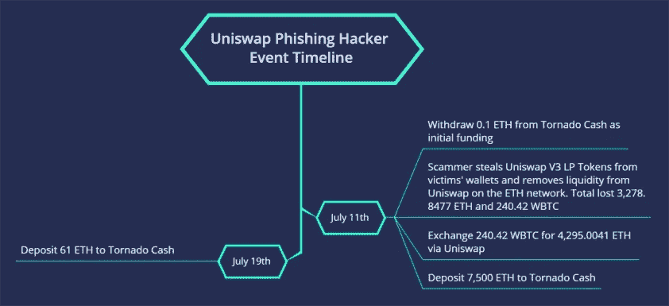

(Uniswap Phishing Hacker — Timeline of Fund Transfers)

以太网传输:

在试图清洗被盗资金时，黑客通过 Uniswap 将 240.42 WBTC 兑换为 4，295.0041 ETH。使被清洗的资金总额达到 7，573.8518 ETH。

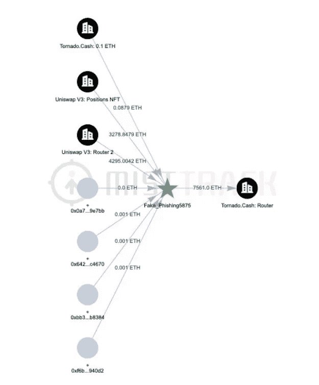

(Uniswap Phishing Hacker ETH — Diagram of Funds Transferred)

以太网传输图表:

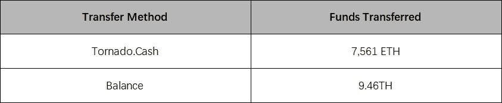

*   **ApeCoin 闪贷套利**

黑客地址:0x 6703741 e 913 a 30d 6604481472 b 6d 81 F3 da 45 E6 e 8(ETH)
日期:03/17/2022
金额:60564 APE
初始资助:FTX
事件:

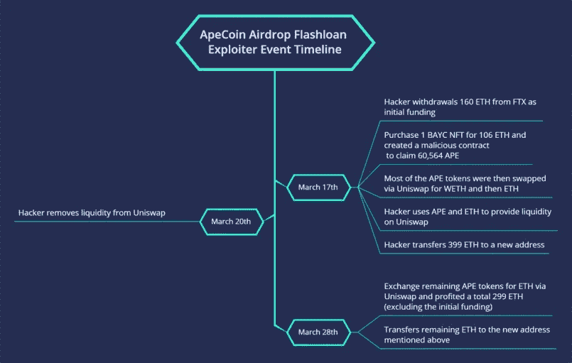

(ApeCoin Airdrop Flashloan Exploiter — Timeline of Fund Transfers)

以太网传输:

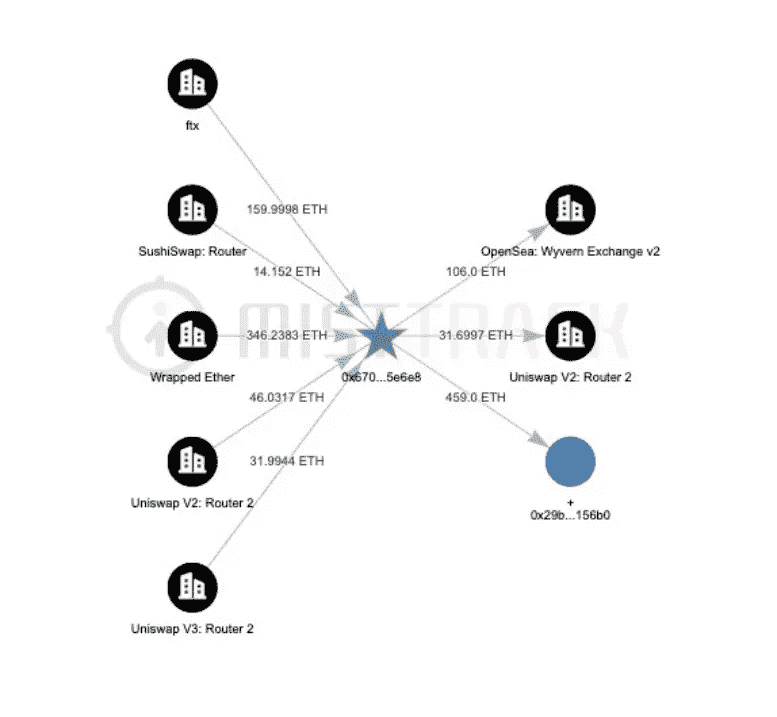

(ApeCoin Airdrop Flashloan Exploiter ETH — Diagram of Funds Transferred)

以太网传输图表:

Note: The transfer funds include the remaining funds of the attack fee.

*   **BAYC 官方不和谐黑客**

黑客地址:0x 1079061d 37 f 7 F3 FD 3295 E4 aad 02 ECE 4a 3 f 20 de 2d(ETH)
日期:06/04/2022
金额:价值超过 145 ETH(25.6 万美元)的 NFTs】初始资金:转让的个人地址
事件:

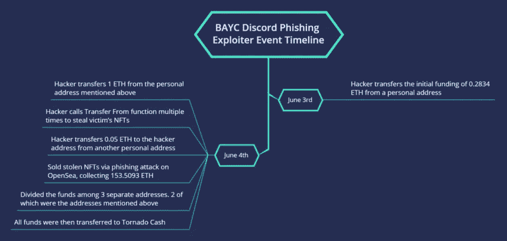

(BAYC Discord Phishing Exploiter — Timeline of Fund Transfers)

ETH 转移图表:

*   **费托肯**

*本节将 5 月 15 日的攻击称为黑客 1，将 5 月 16 日的攻击称为黑客 2。*

黑客地址:
0x 73 b 359 D5 da 488 e B2 e 979990619976 F2 f 004 e 9 ff 7c(黑客 1，ETH/BSC 网络)
0x f99 e5f 80486426 e 7d 3 e 3921269 ffee 9 C2 da 258 e 2(黑客 2，ETH/BSC 网络)
日期:05/15/2022，05/15/2022 金额:
黑客现金
事件:

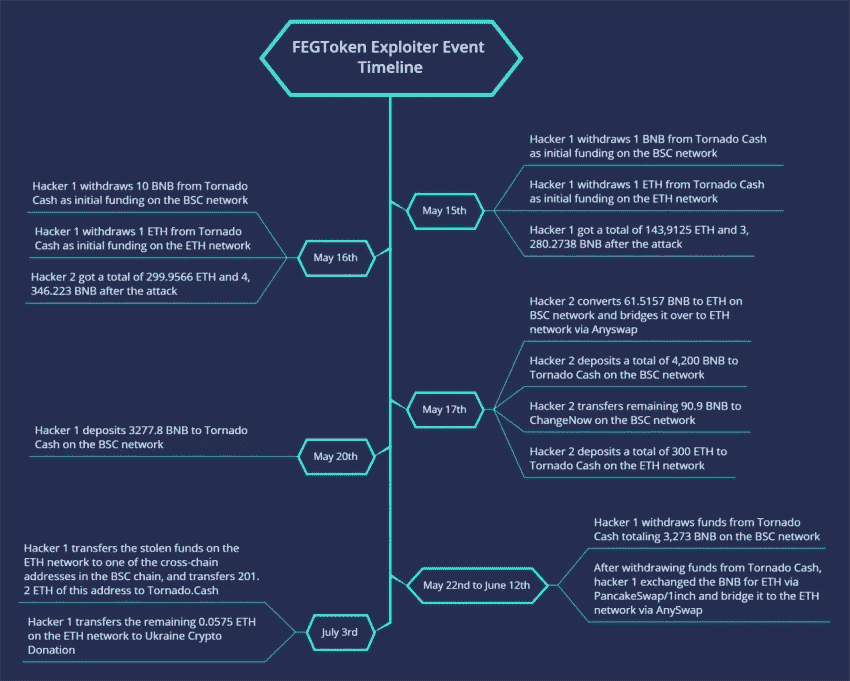

(FEGToken Exploiter- Timeline of Fund Transfers)

对两起事件的分析:

基于区块链分析:

●两个黑客使用不同的方法攻击
〇Hacker 1 多次调用攻击合同
○黑客 2 单次调用附加合同
●两个黑客还使用不同的技术洗钱
〇Hacker 1 将所有被盗资金转移到龙卷风现金
○黑客 2 将大部分资金转移到龙卷风现金，剩余资金转移到 change now
●这些事件发生的时间也有明显的差异
〇Hacker 1 号 5 月 15 日攻击协议，5 月 20 日(BSC)洗钱，7 月 3 日(ETH)
○黑客 2 号 5 月 16 日攻击协议，当天洗钱

黑客 1 资金转移:

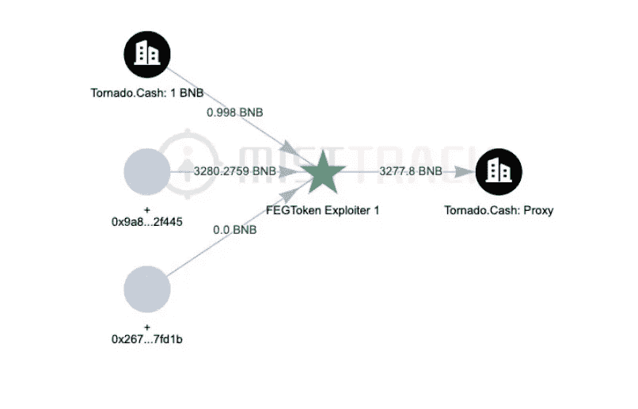

(FEGToken Exploiter 1 BSC — Diagram of Funds Transferred)

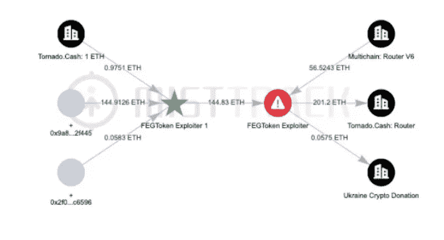

(FEGToken Exploiter 1 ETH — Diagram of Funds Transferred)

令牌传输图表:

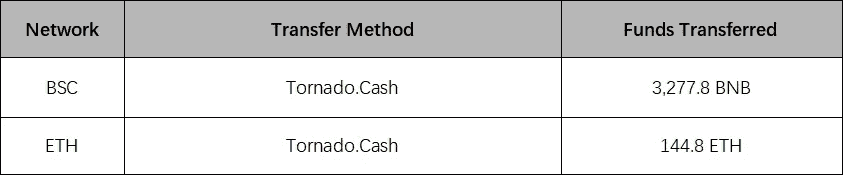

黑客 1 在 BSC 上传输:

在 BSC 上，共有 3277.8 BNB 被转移到 Tornado Cash。根据我们的分析，以下提款符合 FEGToken 剥削者的特征:
●25 或 50 BNB 的交易通过
PancakeSwap/1inch 在 BSC 上交换为 ETH，最后通过 AnySwap 交换到以太坊。
●以太坊的传送暂停了一段时间。

根据上述转账特征，共发现 3，273 笔黑客 BNB 取款。

以下是 BSC 上 Tornado Cash 的资金转账:

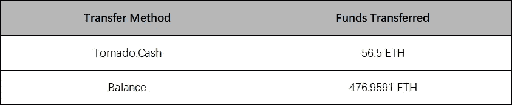

Note: The funds on the BSC have been converted into ETH on the ETH network via AnySwap

黑客 2 转移:

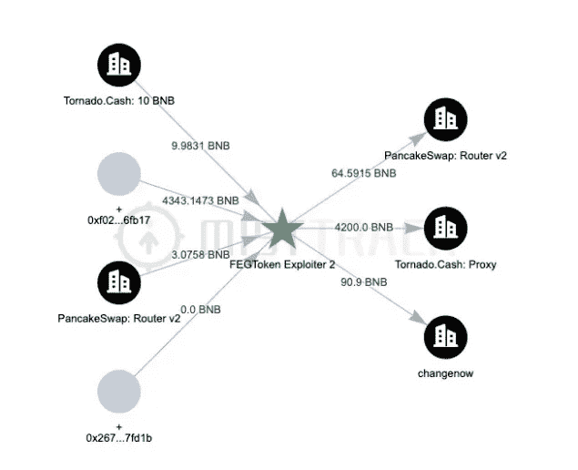

(FEGToken Exploiter 2 BSC — Diagram of Funds Transferred)

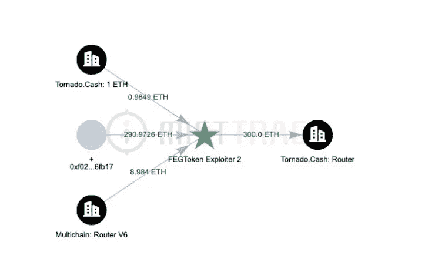

(FEGToken Exploiter 2 ETH — Diagram of Funds Transferred)

令牌传输图表:

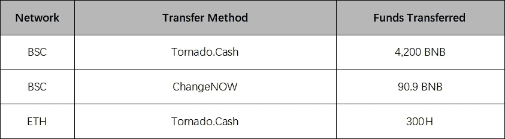

*   **乐观**

黑客地址:0x60b 28637879 b5 a 09d 21 b 68040020 ffbf 7 DBA 5107(乐观)
日期:06/05/2022
金额:2000 万 OP 代币
初始资助:龙卷风。现金
事件:

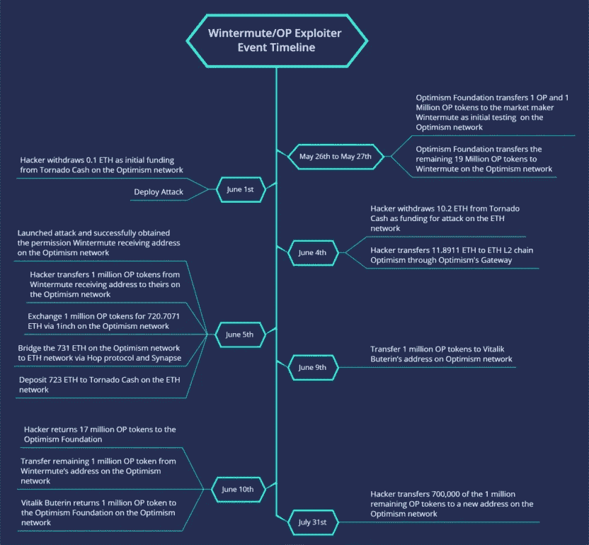

(Wintermute/OP Exploiter — Timeline of Fund Transfers)

OP 转移图:

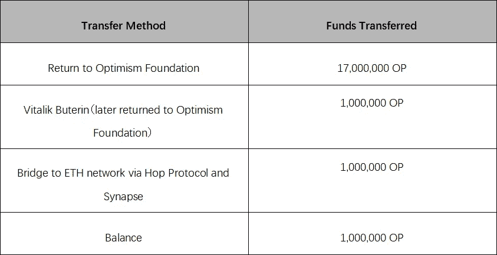

以太网传输:

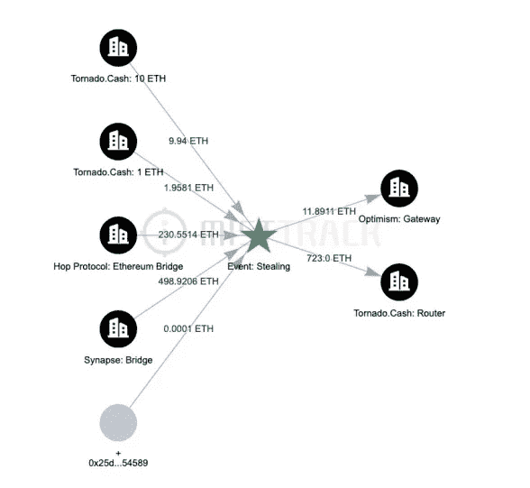

(Wintermute/OP Exploiter ETH — Diagram of Funds Transferred)

以太网传输图表:

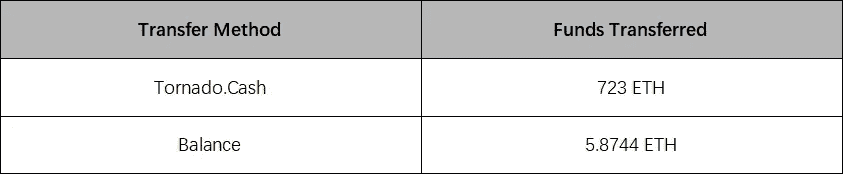

Note: This includes the initial funding used for this attack.

*   **MM.finance**

黑客地址:0xb 3065 Fe 2125 c 413 e 973829108 f 23 e 872 E1 db 9 a6b(Cronos)
日期:05/04/2022
金额:200 万美元
初始资助:OKX
活动:

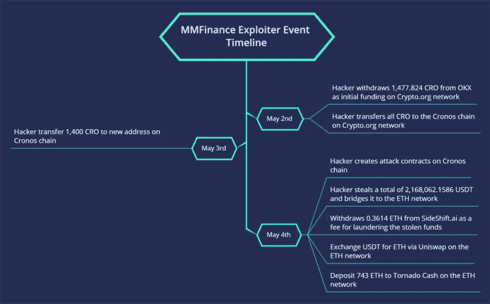

(MMFinance Exploiter — Timeline of Fund Transfers)

以太网传输:

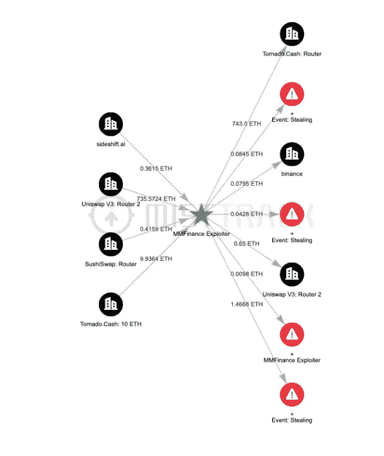

(MMFinance Exploiter ETH — Diagram of Funds Transferred）

以太网传输图表:

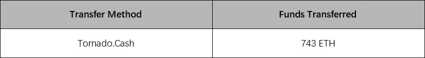

## **总结**

此报告讨论了导致重大损失的各种安全事件、常见事件及其影响程度。除了讨论恶意行为者使用的新方法，它还包括对每种方法和被盗金额的简要描述。该报告概述了大量导致重大损失的安全事件，以及常见事件及其对加密生态系统的影响。此外，它还讨论了恶意行为者采用的新方法、所涉及方法的简要描述以及被盗金额。

MistTrack 用于对 11 起安全事件进行反洗钱分析。通过使用我们的分析技术，我们揭示了关于攻击的初始资金和资金流向的问题的答案。我们还开发了一种算法，使用区块链分析来评估从 Tornado Cash 和 ChipMixer 提取的金额。

在我们的调查中，我们发现大多数事件都发生在以太坊和比特币网络上。以太坊网络上 74.6%的被盗资金被转移到 Tornado Cash，而比特币网络上 48.9 %的被盗资金被转移到 ChipMixer 以避免被发现。

比特币经常是涉及拉扎勒斯集团的重大安全事件和加密洗钱活动的首选加密货币。比特币在混合方式上提供了比以太坊更多的匿名性和灵活性。此外，Lazarus 集团在清洗比特币方面更有经验，这使他们更擅长这个过程。

**下载完整报告:**[**2022 年上半年报告(EN)。pdf**](https://www.slowmist.com/report/first-half-of-the-2022-report(EN).pdf)

●向以太坊的转移暂停了一段时间。

> 交易新手？尝试[加密交易机器人](/coinmonks/crypto-trading-bot-c2ffce8acb2a)或[复制交易](/coinmonks/top-10-crypto-copy-trading-platforms-for-beginners-d0c37c7d698c)