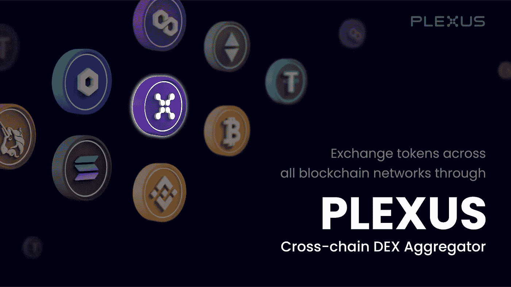
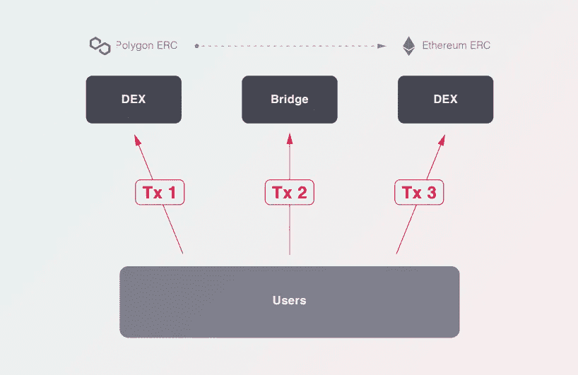
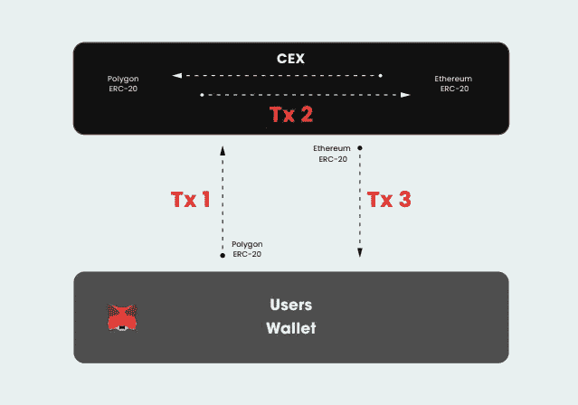
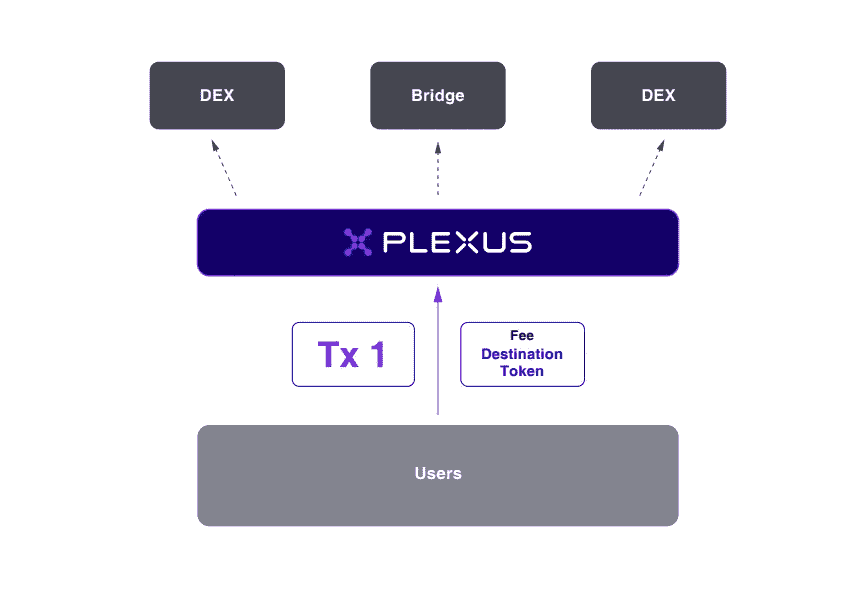
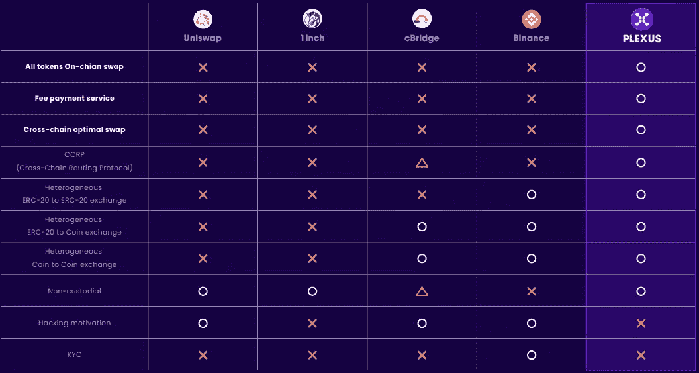
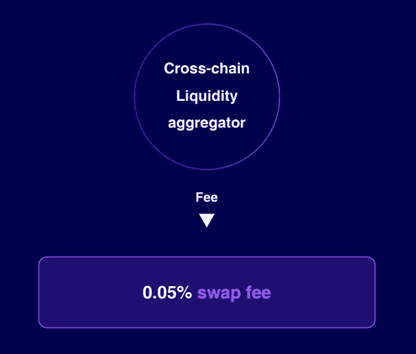
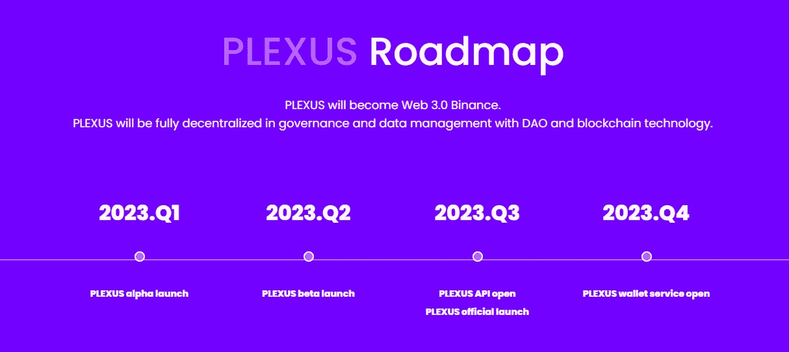

# 2023.前景光明的加密货币——丛

> 原文：<https://medium.com/coinmonks/2023-cryptocurrency-with-a-bright-future-plexus-f183785fb7d2?source=collection_archive---------54----------------------->

大家好:)

当人们问我 2023 年 DeFi 项目的重点是什么时，我想介绍一下这个项目。

**我来解释一下！🕵️‍♂️**

# **什么是丛？**

PLEXUS 是一个跨链的 DEX 聚合器。它是下一代 DEX 聚合器，保证通过一次交易在所有区块链网络和网桥之间实现最快、最便宜和最安全的多步交换。

丛连接所有区块链，聚集流动性。用户现在可以连接他们的钱包，并开始在整个区块链即时交换任何代币。

> 交易新手？在[最佳加密交易](/coinmonks/crypto-exchange-dd2f9d6f3769)上尝试[加密交易机器人](/coinmonks/crypto-trading-bot-c2ffce8acb2a)或[复制交易](/coinmonks/top-10-crypto-copy-trading-platforms-for-beginners-d0c37c7d698c)

# 丛解决什么问题？

1.  **在区块链交换资产的难度**

目前，区块链生态系统的流动性分散在许多不同的主网络中，用户需要通过复杂的步骤将区块链上的一个令牌交换到不同区块链上的另一个令牌。

*例如为了让用户将多边形 ERC-20 代币兑换成以太坊 ERC-20 代币，用户必须通过以下步骤:*

> *1。交换多边形中的令牌 DEX
> 2。通过桥梁转换资产
> 3。以太坊 DEX 中的交换令牌*

**2。不同的本地汽油费代币**

例如。为了让用户将多边形 ERC-20 代币兑换成以太坊 ERC-20，需要如下三种硬币。

> *1。多边形索引
> 2 处的 Matic。在桥
> 3 处缠绕 ETH。以太坊的 ETH DEX*

**3。CEX 问题**

即使你使用一个集中的交易所，也有一个麻烦，就是把代币存入一个经过 KYC 的交易所，交换代币，然后再把它们取出来。

# 解决办法

我们进行了研究和开发以解决 UX 问题，并开发了 **PLEXUS** ，这是一种可以用单个 TX 处理多个链上的所有令牌的服务。

*由于 PLEXUS 支持使用目的地令牌支付所有网络的汽油费，用户无需在钱包中持有单独的汽油费令牌即可在跨链之间进行交换。*

> *丛使用户能够用目的地代币或 PLX 代币支付油费。*
> 
> ***用目的地代币支付油费*** *丛从目的地代币中扣除油费，剩余部分给用户。*
> 
> ***用 PLX 代币交煤气费*** *如果用户钱包里有 PLX 代币，就可以用 PLX 代币交煤气费。*

**通过这种方式，用户可以方便地交换丛中的所有令牌，而无需逐个访问和使用单个 DEX 和多个桥。**

# 神经丛的主要特征

**链上交换**

用户可以通过 PLEXUS 交换链上的任何令牌。丛使 ERC-20 到 ETC-20，ERC-2 到硬币(本地令牌)和硬币到硬币之间的交换链。​

**费用支付服务**

用户可以使用 through PLEXUS 支付燃气费，而无需本地令牌。​

**优化的跨链交换**

用户通常通过著名的 dex 或网桥交换令牌，因为很难比较每笔交易的最佳交换路径。PLEXUS 基于通过自研 Theta 算法收集的流动性数据，通过多条路径分析最优路径来支持交易。​

**CCRP(跨链路由协议)解决方案**

PLEXUS 通过基于 Theta 算法的“CCRP(跨链路由协议)”创新性地克服了在链之间移动资产的限制。CCRP 的特殊之处在于，它能够以最优的交易路径和最低的单笔交易成本实现跨链交易。​

**用户体验(UX)**

通过 PLEXUS，用户可以体验优化的 UX，并通过最佳路线交易所有链上代币，而不必经过复杂的 KYC 过程。

# 令牌组学

*   名称:丛令牌
*   象征:PLX
*   合同地址:0x 60 b 9 c 9 c 167 ba 57 cc 376 b 0 FAA fc 68 df 5 c 9882328 e
*   链条:以太坊

**令牌分发**

*   总供应量:5 亿 PLX
*   投资者:16% 8000 万 PLX (3 个月锁定，12 个月分配)
*   流动性:0.5% 250 万 PLX(锁定 x)
*   空投:0.5% 250 万 PLX(锁定 x)
*   生态系统:10.5% 5250 万 PLX (36 个月分布)
*   营销:13.5% 67，500，000 PLX (36 个月分销)
*   协议贡献者(出资者):30% 150，000，000 (36 个月分配)
*   顾问:4% 20，000，000 PLX (7 个月锁定，15 个月分配)
*   团队金额:25% 125，000，000 PLX (10 个月锁定，26 个月分配)

# **商业模式**

收入结构:0.05%的交换费和基于数据块延迟的收入

*   赌注分配:40%
*   回购基金:40%
*   国库佣金:20%

# 路标

2023.Q1
丛阿尔法发射

2023.Q2
丛贝塔发射

2023.Q3
打开丛 API
丛正式启动

2023.Q4
丛钱包服务开通

这是对神经丛的介绍。

它是一个新项目，将于 2023 年 1 月 30 日推出 alpha 服务，对 DeFi 感兴趣的人可能想关注一下。​

**本评论并非投资建议，所有投资风险自担。**

**由于加密货币具有较高的价格波动性，投资时请谨慎投资。**

**由于评论中的误译，可能会有部分缺失。**

# 🔗了解有关丛的更多信息

[**🌍网址**](http://plexus.app/)**|**[**🖍twitter**](https://twitter.com/plexus_fi)**|**[**📢**](https://discord.gg/M9cU9eQCyJ) **|** [**📞电报**](https://t.me/plexus_exchange) **|** [**📃链接树**](http://linktr.ee/plexus.app)

> 加入 Coinmonks [电报频道](https://t.me/coincodecap)和 [Youtube 频道](https://www.youtube.com/c/coinmonks/videos)了解加密交易和投资

# 另外，阅读

*   [如何购买 Monero](https://coincodecap.com/buy-monero) | [IDEX 评论](https://coincodecap.com/idex-review) | [BitKan 交易机器人](https://coincodecap.com/bitkan-trading-bot)
*   [CoinDCX 评论](/coinmonks/coindcx-review-8444db3621a2) | [加密保证金交易交易所](https://coincodecap.com/crypto-margin-trading-exchanges)
*   [红狗赌场评论](https://coincodecap.com/red-dog-casino-review) | [Swyftx 评论](https://coincodecap.com/swyftx-review) | [CoinGate 评论](https://coincodecap.com/coingate-review)
*   [Bookmap 评论](https://coincodecap.com/bookmap-review-2021-best-trading-software) | [美国 5 大最佳加密交易所](https://coincodecap.com/crypto-exchange-usa)
*   [如何在 FTX 交易所交易期货](https://coincodecap.com/ftx-futures-trading) | [OKEx vs 币安](https://coincodecap.com/okex-vs-binance)