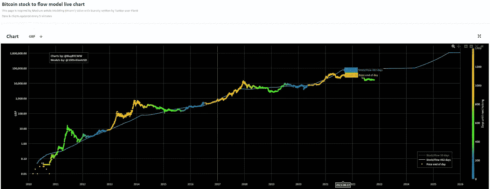

# 2025 加密牛市

> 原文：<https://medium.com/coinmonks/2025-crypto-bull-run-7e70317ee52e?source=collection_archive---------3----------------------->

前几天有人问我，我认为下一轮牛市会是什么时候。多好的问题啊。

让我们开始吧。

# 2025 加密牛市

那将会是什么时候！2025.现在我会告诉你为什么，但请记住，这是我的想法，虽然它是基于一些坚实的想法和数据。

加密遵循周期，而周期受到许多事情的影响，不仅仅是世界事件。在 BTC 的正常周期中，我们会看到一个 ATH，然后大规模抛售至低位(抓住 B 计划和所有 YouTubers)，然后横盘两年，直到下一个半月。大约 6 个月之后，我们会在下一轮牛市中再次出现。

很好而且可以预测。事实上，它是如此的可预测，B 计划使它与库存保持一致。

我们现在来看看他的图表。

哦，亲爱的。我确实听说 B 计划现在在 F 计划上，但是无论哪种方式，正如你所看到的，我们都与他的 STF 模型有分歧。有趣的是，他确实在 5 月份 halvening 之后表现出了上升趋势，这也是我通常预期会看到的。

这次我们的问题是，在更广泛的经济中，没有什么是正常的，即使这是计划好的！

我们已经有了一个疫情(似乎现在已经计划好了)。

我们已经(计划)大规模印钞

我们有大量的债务(计划中的),我们有一个不稳定的(超过正常水平的)世界政治局势，乌克兰战争以及北约和美国与俄罗斯处于代理战争的事实。

是啊，世界上没什么正常的事。哦，是的，结果是，我们在欧洲也有一个人为的能源危机，因为过去几年可笑愚蠢的能源政策和净零废话。我也提到密码规则了吗？美国可能会制定一些影响美国公民的严厉政策，当然结果是更广泛的密码社区。

欢迎来到地球。我们真心希望你过得愉快。

# 衰退

所有这些加在一起，我们将面临经济衰退和通货膨胀(我们已经有了)。作为未来几年所有这些混乱的结果，至少人们(零售)将做的最后一件事是考虑购买密码。他们会考虑如何支付煤气费或给汽车加满油，以及随着业务的自然收缩，他们是否会被解雇。

所以通常情况下，我预计下一轮牛市将在 2024 年 5 月的下一次 BTC 牛市后 4 到 6 个月开始。我仍然认为这是可能的，但它将受到这些其他因素的影响。如果衰退持续到 2024 年，人们将不会急于购买 crypto，因为衰退使人们对他们的钱感到紧张，而不是轻浮。

我确实喜欢好的图表，但我更喜欢看人们在想什么，而不是过去发生了什么。让我们看看目前人们对 Crypto 的看法。

这是过去 5 年谷歌对加密货币的搜索趋势。看起来不太好，是吗？它看起来像我期待的那样诚实。

这是过去 5 年谷歌搜索比特币的趋势。这是零售，就像真实的人群一样，这很重要，因为正是零售推动了牛市和 FOMO。看到趋势了吗？是的，它在下降，一直在下降，而且会一直朝着那个方向前进。比特币目前的趋势得分仅为 12，这一点都不太受欢迎。

让我们看看谷歌如何解释这个数据的想法，记住比特币的分数是 12。

不管 YouTubers 告诉你什么，或者你在自己的小加密回音室里听到什么，散户(推动牛市的人)对加密和比特币的整体情绪非常低，而且一直在变低。

比特币的人气巅峰是在 2017 年！这种下降将继续下去，随着经济衰退的影响，我们甚至可能会看到低于 10，000 美元的 BTC，因为剩下的持有任何密码的零售商将出售它来支付账单。我希望我们确实能看到 BTC 10 公里以下，因为这将为我和你提供一个很好的机会，以低价购买更多的完整比特币，为 2025 年的加密牛市做好准备:)。

让我们看看 Defi

比 39 的比特币好，但也在下降。想看滴滴？

我很高兴看到一点上升的迹象。这可能是 V2 外汇营销的结果，但很难说这种兴趣与投资有什么关系。

# 2024 哈尔文宁

这件事会被大肆渲染，尤其是 Youtubers，甚至可能是我:)。

让我们面对现实吧，当你处于衰退和失业的熊市时，很难继续创作内容。当然，除非你像我一样，有足够的勇气去批评无休止的狂欢。虽然我真的很喜欢 Crypto Kingz，但如果我不得不看完他的另一部《当 X 发生时，水滴会落到月球上》视频，我可能会蜷缩在角落里哭泣。只是开玩笑。我是他的订户，非常欣赏他无限的乐观主义，我为他勇于走出去创造而喝彩。

当衰退持续数年而非数月时，在内容创作方面保持乐观尤其困难！我讨厌成为每日硬币 LOL。人们仍然可能会购买 halvening 的消息，并出售事件，但它可能会被证明是一个错误的标志事件，不会开始下一轮比赛。我预计，如果经济衰退仍在持续，牛市将会停止，不会正常进行。

哦，它会被大肆宣传，你可以放心，但请记住，这不是 Youtubers，推动牛市运行，这是零售。尽一切办法听 Youtubers，但不要看谷歌趋势。谷歌搜索趋势会让你对人们的情绪有一个最好的了解，以及它是否显示出乐观的萌芽。

# 有氦吗？

是的，是的，是的，三次是的。以上所有对你来说都是超级积极的消息。你在这段时间赚了很多钱。这段时间持续得越久，你赚的钱就越多。怎么会？

1.  你每个月都会不断地投资你最喜欢的硬币和项目。(我要写一篇关于我的是什么的文章)
2.  你自信地建立你的投资组合。
3.  当别人抛售时，你买入。
4.  你与疯狂的人群完全相反。
5.  你要记住并完全理解，熊市持续的时间越长，下一轮牛市就越大！
6.  你知道衰退和通货膨胀是计划好的。

这就是你如何定位自己，为 2025 年的加密牛市做好准备，因为你没有像我一样在牛市发生时随大流，你将坐在一个由各种代币和项目组成的大型投资组合中，像我一样，你将赢得大奖。伟大的落魄者将做他们通常做的事情，FOMO 像绵羊一样在上升。

你会知道我们什么时候准备好下一次跑步，因为你会在谷歌趋势中看到。留意一下。

# 加入动物农场滴水网

如果你想加入滴滴网络，请点击这里阅读我在滴滴上的[篇文章，并使用下面的好友链接加入。](https://alttokenomics.com/drip-the-defi-protocol-that-just-keeps-on-dripping/)

# 我的滴滴好友链接

[**drip . community/水龙头？Buddy = 0x 1511093 a 940 a 12 f 6593 CFB 886 e 7 AC 4 ea 95 ADF 5 ab**或者在获得好友框中输入以下内容:**0x 1511093 a 940 a 12 f 6593 CFB 886 e 7 AC 4 ea 95 ADF 5 ab**](http://drip.community/faucet?buddy=0x1511093a940a12F6593cFb886E7ac4ea95AdF5AB)

> 我不是财务顾问。本文中的任何内容都不应被理解为投资建议。你必须 DYOR(做你自己的研究)无论是作者还是出版物都不承担任何责任或义务的任何投资，利润或损失，你可能会招致作为这一信息的结果。文章可能包含附属链接。谢谢你花时间阅读我的文章，如果你想订阅的话。我的文章和指南旨在帮助你在这个经常令人困惑的世界中导航。

马克@阿尔特

*原载于 2022 年 10 月 25 日 https://alttokenomics.com**的* [*。*](https://alttokenomics.com/2025-crypto-bull-run/)

> 交易新手？尝试[加密交易机器人](/coinmonks/crypto-trading-bot-c2ffce8acb2a)或[复制交易](/coinmonks/top-10-crypto-copy-trading-platforms-for-beginners-d0c37c7d698c)