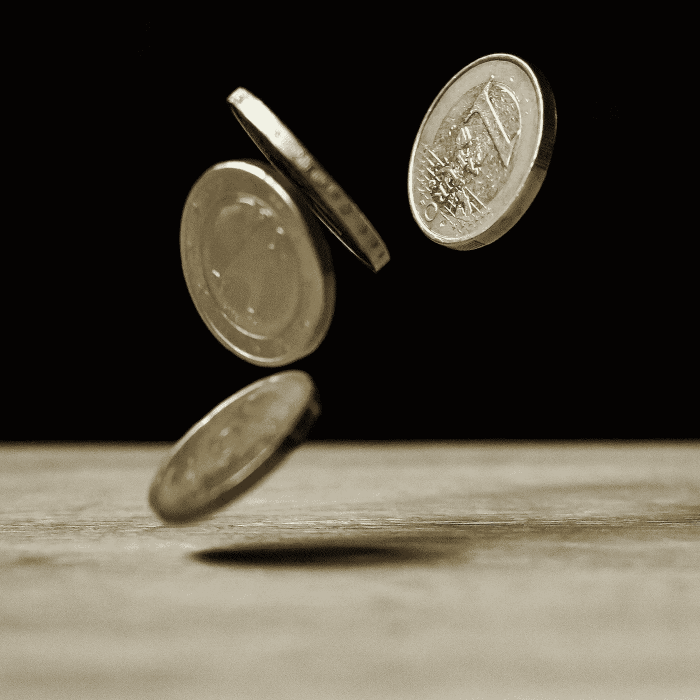

# 22 个轻松省钱的技巧

> 原文：<https://medium.com/coinmonks/22-effortless-money-saving-tips-758f399cfe0?source=collection_archive---------38----------------------->

如果你只削减 10%的开支，你每个月会节省多少钱？

这篇文章最初来自我的网站[www.portfolio-hub.co.uk](http://www.portfolio-hub.co.uk)

Photo from Pexels.com

我相信每个人都很乐意存一点钱，但是当谈到为退休储蓄时，大多数人都是着眼于大局，并试图找出他们如何才能尽可能多地储蓄。