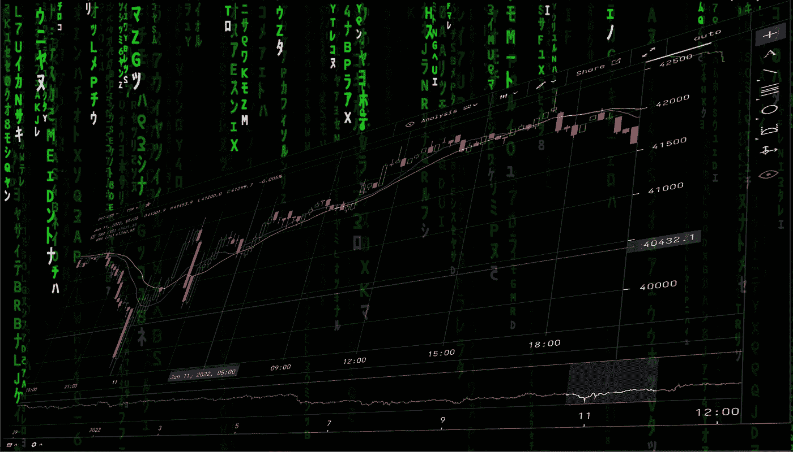
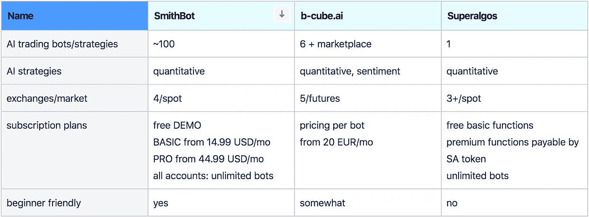
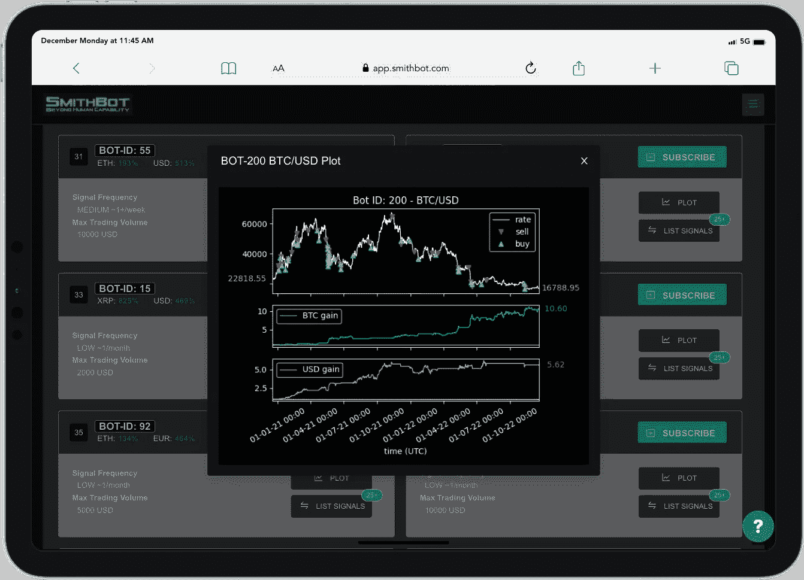
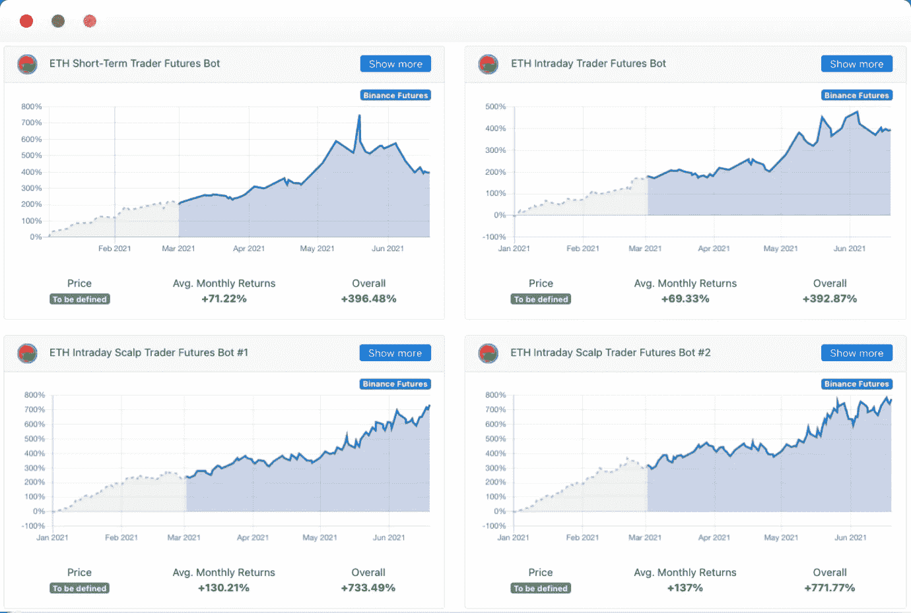
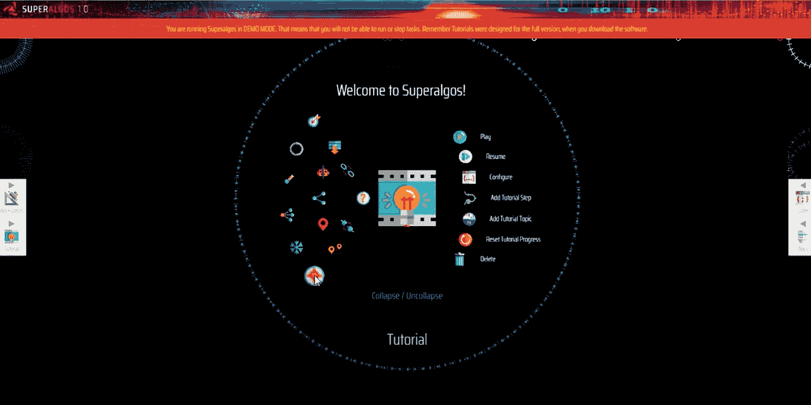

# 3 个最佳人工智能加密交易机器人 2023

> 原文：<https://medium.com/coinmonks/3-best-ai-crypto-trading-bots-2023-a22d3bac72e2?source=collection_archive---------8----------------------->

交易加密货币很难。因为市场是 24/7 开放的，所以交易者有必要大部分时间监控图表，以免错过交易的好机会。因此，在过去几年中，使用加密货币[交易机器人](/coinmonks/crypto-trading-bot-c2ffce8acb2a)变得很普遍，这些机器人可以自动执行交易员提供的交易策略。

到目前为止，大多数加密货币机器人提供商提供传统策略的手动机器人设置。但是这将寻找有利可图的设置的努力、负担和风险加在了用户身上。事实上，大多数交易者从来没有成功地找到一个长期战略，这是不亏钱的。

最近，人工智能交易机器人可以实现更高水平的性能。此外，用户不必研究和尝试不同的策略和参数。 [SmithBot](https://smithbot.com/) 、 [b-cube.ai](https://www.b-cube.ai/) 和 [Superalgos](https://superalgos.org/) 是使用人工智能(ai)和大数据分析的创新交易机器人提供商的例子。它们让不太专业的交易者也能使用高利润的策略。

尽管没有或至少没有很多手动设置，他们提供了一个简单和安全的交易体验。

*越来越多的密码爱好者使用人工智能密码交易机器人来实现投资自动化，并在交易过程中实现利润最大化。但是有什么特点，或者怎么才能找到 2023 年最顶尖的 AI 密码交易机器人？*

## 2023 年顶级人工智能加密交易机器人

# 史密斯博特

[SmithBot](https://smithbot.com/) 是市场上最新的服务，于 2021 年 6 月推出。他们致力于为经验不足的交易者提供先进的加密货币交易方法。因此，他们使用基于新型自适应算法的最先进和专有的人工智能，而不仅仅是优化已知的方法。SmithBot 目前为其基于云的自动交易平台提供了大约 100 个经过预先训练和测试的交易机器人。他们响应迅速的网络应用程序使得在桌面和移动平台上的任何现代浏览器中选择最好的机器人变得容易。

SmithBot 交易引擎在现货市场上运行，在不利用这种降低风险的情况下实现了高性能。此外，SmithBot 目前支持一些领先的交易所，包括币安、Bitfinex、Bitstamp 和北海巨妖。在他们的公开路线图中，他们宣布在未来的某个时候支持期货交易和更多的交易所。

## 用户体验

SmithBot 提供了许多人工智能加密货币交易机器人，这些机器人由他们的研究团队训练和测试。这意味着，没有用户必须选择的参数或策略选项。这使得新手交易者很容易选择一个成功的机器人，而不必花时间研究和测试不同的设置。

web 应用程序可以在所有现代 web 浏览器中完美运行。它有两个主屏幕，排列在选项卡中。首先，仪表板收集所有个人信息，如您订阅的机器人、您连接的交易所的余额以及您的机器人下的订单。在那里，你的每一个机器人都显示了基于来自交易所的订单数据的真实性能。

第二，“机器人名人堂”提供了各种排名和绘图功能，可以轻松选择性能最佳的机器人。一个有趣的特征是除了用引用符号计算的普通性能测量之外，还用基本符号对性能进行排序和绘图。然后，您可以从该选项卡直接订阅机器人。

总的来说，用户界面易于使用，给人一种精简的印象，只提供所需的功能。

## 交易策略

SmithBot 的算法基本上是复杂的量化策略。这些都是基于灵活和自适应的人工智能模型，可以模仿成熟的策略、策略组合或学习全新的方法。

这意味着，用户不需要选择正确的参数或策略。SmithBot 专家已经从大量历史数据中训练了所有机器人，以实现最佳结果。此外，他们考虑所有相关的现实世界的影响，如传播，交易费用，滑点和通信延迟。他们是唯一一家对亚秒级分辨率时间序列进行操作和回溯测试的提供商，而不是对聚合的 OHLCV 烛台数据进行操作和回溯测试，以[避免不准确的验证结果](/coinmonks/ai-trading-bots-pitfalls-profit-erosion-and-a-solution-c0a1eea420b4)。

他们的一些加密交易机器人有能力通过从实时数据中学习，在操作过程中不断自动改进他们的策略。这有助于适应不断变化的市场动态，因为成功的交易策略通常只能在有限的时间内发挥作用。

## 透明度

SmithBot 的云应用程序显示了所有机器人的历史性能。所显示的业绩还会根据不同的交易费用进行修正，并根据基准和报价符号进行计算。有趣的是，基本符号性能是一个独特的功能，用来衡量机器人跑赢市场的程度。

由于 SmithBot 的工作方式，不需要纸质交易模式。没有用户设置，所有的机器人一直在运行。例如，如果你想知道下个月内的现场表演，只需绘制一个月后的表演即可。

此外，SmithBot 用户界面显示任何 Bot 发出的所有订单，包括时间戳和参考价格等信息。

## 安全性

SmithBot 是一项非托管服务。用户的资金留在他的交易所，提供商不能提取。

该平台运行在云中，具有最先进的安全性和加密功能。因为它运行在一家大型云提供商的服务器上，具有高度冗余，正常运行时间应该不成问题。

## 定价

SmithBot 提供了一个免费的演示帐户，它提供了所有的可视化功能来探索人工智能交易机器人。

对于大额交易，您需要目前提供的两种付费订阅级别中的一种。如果您提前支付 24 个月的费用，基本订阅计划的起价为 14.99 美元(每月支付 24.99 美元)，而专业计划的起价为每月 44.99 美元。不同的订阅类型在功能上没有区别。基本帐户提供高达$20，000 的合并交易限额，而专业帐户提供$100，000。这种“综合交易限额”对所有订阅的机器人来说是一种智能限制。如果他们的下一个订单的总和超过这个限制，那么购买订单被限制。因此，即使达到了上限，机器人仍然可以盈利交易。

在撰写本文时，SmithBot 还在 AppSumo 上限时以大幅降价出售[特价商品。](https://appsumo.com/products/smithbot-ai-crypto-trading)

SmithBot 不限制用户可以订阅的交易所和机器人的数量。换句话说，用户可以同时订阅目前大约 100 个机器人，而不需要额外的费用。

# b-cube.ai

[b-cube.ai](https://www.b-cube.ai/index.html) 成立于 2020 年 11 月，是一家在人工智能和定量分析上运行的自动加密货币交易机器人的提供商。它提供内部开发的策略，以及用户提供的机器人和交易信号的市场。此外，它允许交易者连接他们喜欢的交易所，然后开始自动交易。

此外，他们还创建了自己的 BCUBE 令牌，可以在他们的平台上交易信号订阅或教育课程等服务。

b-cube.ai 平台整合了 Bitget、BitMex、Kucoin 和币安期货交易所，以进行多头和空头交易。

## 用户体验

该提供商提供由他们的专家团队培训和配置的现成的机器人。你可以选择不同策略的交易机器人，但它们没有任何用户可配置的参数。这对初学者来说很容易，因为他们可以只通过查看历史性能来选择机器人。因此，用户不需要手动决策，也不需要重复冗长的回溯测试模拟。

选择一个机器人后，你连接你的交易所，机器人自动开始交易，无需进一步的手动操作。

另一方面，一些机器人在期货市场上交易，风险较高，可能不适合新手交易。

## 交易策略

该平台通过 AI/ML 引擎实时生成交易信号。它使用情绪和定量方法的技术分析。

此外，模型动态地适应不断变化的市场条件。总的来说，该策略旨在以更高的胜率进行交易。

## 透明度

该平台提供了高度的透明度。用户可以查看所有机器人的交易历史和历史表现。此外，他可以在创建一个免费账户后查看交易的时间戳等详细信息。

和 SmithBot 一样，因为这个提供商的所有 Bot 都已经设置好了，不需要实时交易模拟模式。

## 安全性

b-cube.ai 也是一种不管理用户资金的非托管服务。这些文件保存在交换中，提供商无法访问它们。

该平台运行在云中，并采用最先进的安全和加密技术进行保护。

## 定价

报名 [b-cube.ai](http://b-cube.ai) 的平台是免费的。然后，您可以探索他们的机器人的所有历史性能。

b-cube.ai 根据用户想要使用的交易机器人为其服务定价。但任何服务或 bot 的价格都取决于其历史交易收益，并单独支付。用户可以在 b-cube.ai 的市场上开始真正的交易，€每月 20 英镑，€每月 49 英镑。

# 超级藻类

[Superalgos](https://superalgos.org) 是一个面向零售交易员的开源项目，拥有交易自动化平台，于 2018 年启动。用户可以基于来自交易所和指标的各种数据建立自己的机器人，或者使用集体人工智能预测。它还提供社区功能，如分享和订阅交易信号。

从技术上讲，支持的交换是所有可以与 [CCXT 库](https://github.com/ccxt/ccxt/wiki/Exchange-Markets)一起使用的交换。然而，由于这些接口中有许多并不完全符合 Superalgos 建议使用其测试交易所的标准，主要是币安和 Binance.US。此外，AscendEx 是他们的官方合作伙伴交易所。目前，Superalgos 仅支持现货市场交易，但计划在未来提供衍生品交易。

## 用户体验

Superalgos 与作为完全托管的云应用程序运行的 SmithBot 和 b-cube.ai 完全不同。相比之下，它是一个桌面或服务器应用程序，需要你自己下载和安装。它运行在你必须提供的本地计算机上，需要一直运行并连接到互联网。最终，用户要对可用性和安全性负责，如果处理不当，这将影响利润。

通过使用功能块并连接它们的图形编程，在所谓的设计空间上定义机器人。用户通过 Java 脚本代码定义新功能。Superalgos 提供了大量的功能来连接到交易所和其他数据源，处理原始数据，定义交易条件以及可视化测试和交易结果。它集成了 TensorFlow 来定义神经网络策略。

用户界面非常灵活和强大。然而，没有太多交易和编程经验的新手很容易被数量庞大的功能和工作流程所淹没。

## 交易策略

Superalgos 提供简单的开源策略，随时可用。然而，一般来说，用户必须通过对原始数据及其指标施加条件来定义自己的策略，或者从另一个交易者那里复制策略。其中一个选项是训练由神经网络定义的人工智能策略。

集体人工智能是一种社区努力，旨在众包人工智能模型的训练，并在社区成员的机器之间分配计算过程

## 透明度

Superalgos 提供了三种不同的测试模式:回溯测试、纸上交易和现场测试。各种绘图选项可视化的结果和条件，开放和关闭交易。

源代码是公开的，可以免费审计或重用。

## 安全性

Superalgos 还通过 API 连接到加密交易所，并且不持有用户的资金。它们总是停留在用户的加密货币交易所，无法访问。

由于 bot 在用户硬件上运行，用户负责提供和维护一个高度可用和安全的环境。如果用户在网络安全方面不是非常专业，这绝对是一个安全风险。

## 定价

原则上，Superalgos 是免费下载和使用的。然而，在实践中，使用这种解决方案进行交易会涉及各种成本。

首先，用户需要设置并运行交易机器人服务器。有两种可能性:

1.  家庭服务器:硬件成本、电费和互联网费用
2.  云服务器:每月固定费用

特别是，如果用户想要训练自己的神经网络模型，就需要昂贵的硬件或高计算性能的云实例。

此外，复制交易和集体人工智能只能通过 SA 令牌访问，Superalgos 拥有加密货币。它可以在某些密码交易所购买，或者通过共享交易信号或提供计算能力来获得。

考虑到所有这些，Superalgos 绝不是免费的。特别是，如果使用人工智能算法，用户每月支付可观的费用。另一方面，Superalgos 对机器人的数量、交易量或交易所没有任何限制。

# 结论

基于人工智能策略的加密货币交易机器人正在慢慢从机构交易转向零售交易者。它们承诺更易于使用，并有可能带来更高的利润。目前市场上似乎还没有多少提供商拥有专业的人工智能交易方法。有些人只是把人工智能作为一个营销术语，而没有任何实际的内涵。

我们比较了 3 家由人工智能驱动的加密货币交易机器人提供商: [SmithBot](https://smithbot.com) ，b-cube.ai 和 Superalgos。其中，前两个是商业提供商。后者是一种开源解决方案。实际上，所有这些都需要每月支付一些费用。

商业密码交易机器人提供商适合经验不足的交易者。有经验的专家也可能喜欢 Superalgos，它很难安装和操作，但提供了最大的灵活性。由于所有的机器人都是非托管交易，这意味着他们不持有你的钱，你的资金安全得到保证。

基于人工智能的加密货币交易机器人将彻底改变交易，并大大超过基于技术指标的经典方法。开发现在已经开始，将来肯定会加速。SmithBot、Superalgos 和 b-cubes.ai 是让这项创新技术为每个人所用的先驱。

本文是[密码交易机器人——最佳 AI 密码交易机器人 2022](/coinmonks/crypto-trading-bot-best-ai-crypto-trading-bots-2022-97328dc1d2cd) 的更新版本。

**亦读，**

*   [加密货币交易机器人的趋势:人工智能算法](/coinmonks/trends-in-cryptocurrency-trading-bots-ai-algorithms-38c4b24edcd9)
*   [密码交易机器人——18 款最佳免费密码交易机器人【2022】](/coinmonks/crypto-trading-bot-c2ffce8acb2a)
*   [SmithBot AI 加密交易机器人——真人交易测试](https://blog.coincodecap.com/smithbot-ai-crypto-trading-bots?utm_source=rss&utm_medium=rss&utm_campaign=smithbot-ai-crypto-trading-bots)
*   [2021 年加密交易回顾:17 项高级+ 15 项神经网络策略测试【第 7 部分】](/coinmonks/crypto-trading-2018-in-review-17-advanced-15-neural-net-strategies-tested-part-7-d308963d13e9)