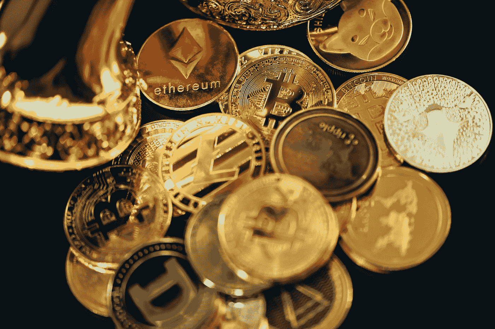
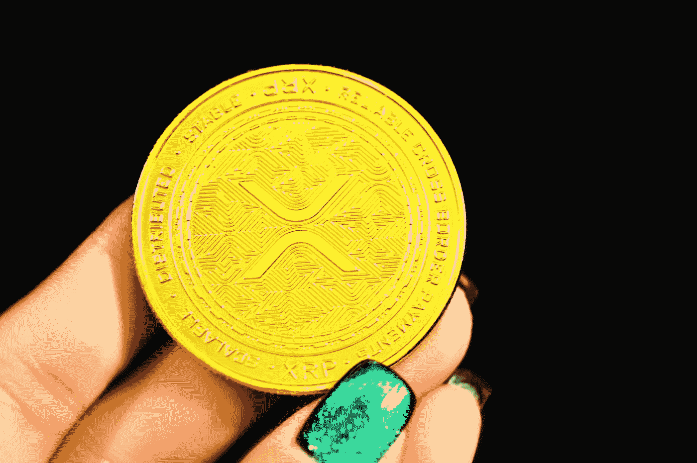
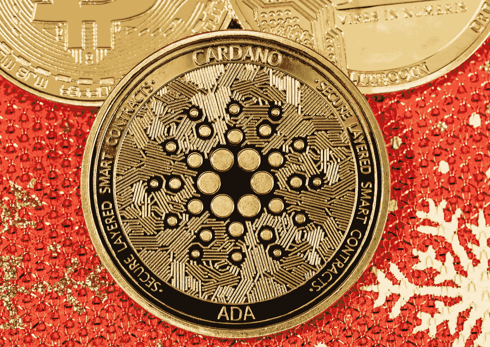
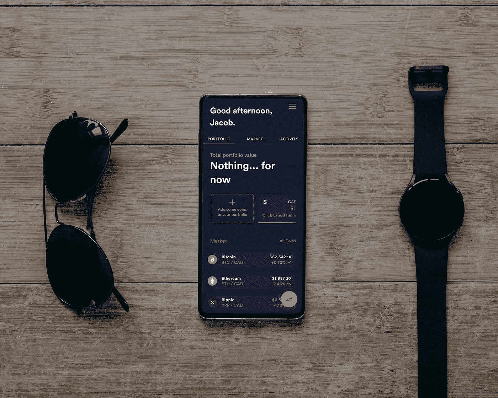

# 3 当前和长期购买的最佳加密货币

> 原文：<https://medium.com/coinmonks/3-best-cryptocurrency-to-buy-today-and-hodl-for-the-long-run-aa0a880f099?source=collection_archive---------0----------------------->

Photo by [Quantitatives](https://unsplash.com/@quantitatives?utm_source=medium&utm_medium=referral) on [Unsplash](https://unsplash.com?utm_source=medium&utm_medium=referral)

尽管 6 月份是一个充满挑战的月份，加密货币的总市值首次跌破 1 万亿美元，但反向投资者终于在最后一周加入了这场战斗。

截至 6 月 26 日，加密货币市场的总市值为 9780 亿美元。

本周的涨幅表明，加密货币可能即将回归，尽管随后降至 9010 亿美元。

没有人会认为首要的问题是这样的抗议是否被允许。

加密货币取得了一定的稳定性，这一事实令人鼓舞。

> 交易新手？试试[加密交易机器人](/coinmonks/crypto-trading-bot-c2ffce8acb2a)或者[复制交易](/coinmonks/top-10-crypto-copy-trading-platforms-for-beginners-d0c37c7d698c)

自 6 月 13 日的交易时段以来，已有 9500 亿美元投资于虚拟货币。

为了让相关利益方放心，该行业必须启动重大的向上举措，这并不十分令人鼓舞。

即使他们声称会坚持到底，也有可能不会坚持到底。

人们经常在网上撒谎，即使他们不相信。

> 另外，请看:【2022 年 6 月及以后要密切关注的 3 个密码

# 最佳加密货币今天和 Hodl №1: XRP XRP

16447855367 美元

**在 CMC 上的位置:** #7

**现价:** $0.34

Photo by [Kanchanara](https://unsplash.com/@kanchanara?utm_source=medium&utm_medium=referral) on [Unsplash](https://unsplash.com?utm_source=medium&utm_medium=referral)

开发了加密货币[***XRP·XRP***](https://coinmarketcap.com/currencies/xrp/)的 Ripple Labs 公司的首席执行官布拉德·加林豪斯最近成为头条新闻，他说如果美国证券交易委员会赢得对 Ripple 的诉讼，他可能会将其业务转移到美国境外。

SEC 已经提起诉讼，声称 Ripple 违反了联邦证券法。

据美国证券交易委员会称，该公司被指控以 XRP 的形式非法发行未注册证券。

加林豪斯很少表示悲观，因为他过去经常做出乐观的声明。

这是一个奇怪的评论，但我不想在这个时候卷入法律纠纷。

如果在法庭上的压力伤害了他和他的团队，XRP 的未来可能处于危险之中。

很快，XRP 将面临比预期的法律行动更大的技术障碍。

在整个 2021 年下半年，XRP 的出价(买入订单)数量超过了询价(卖出收费)数量。

不幸的是，订单的乐观前景并没有转化为价格趋势的转变。

多头和空头之间正在进行的订单竞争表明，下一个重要的触发因素可能会决定 XRP 的整体方向。

> 另外，请参见:[现在就花不到 2 美元购买 3 个最好的元宇宙密码游戏](https://www.sammaiyaki.com/3-best-metaverse-cryptos-under-2-to-buy-now-7b92b9fb9ed4?source=user_profile---------9----------------------------)。

# 今天和 Hodl №2 购买的最佳加密货币:Cardano ADA

**市值:15，910，622，055 美元**

**在 CMC 上的位置:** #8

**当前价格:** $0.4

Photo by [Quantitatives](https://unsplash.com/@quantitatives?utm_source=medium&utm_medium=referral) on [Unsplash](https://unsplash.com?utm_source=medium&utm_medium=referral)

[***Cardano ADA***](https://coinmarketcap.com/currencies/cardano/)作为最受欢迎的低成本加密货币之一，从未失败过吸引新投资者。

由于它是利益证明(PoS)系统的早期用户，区块链一体化的支持者最看重它。

重要的是，这方面没有任何变化。迄今为止，美国饮食协会 ADA 度过了充满挑战的一年。

尽管最近货币价格波动，反向投资者是乐观的。

6 月 26 日晚，该股收于 52 美分，仅在三天内就上涨了 10%左右。

这些都不会显著改变人类历史的方向。

鉴于最近的下跌，加密货币的价值增加 10%是非常重要的。

尽管 ADA 有可能在这种情况下毫发无伤地逃脱，但您仍然应该非常小心。

总体来说，卡尔达诺的秩序册不是很耐人寻味。

自去年 9 月 7 日以来，当出价超过请求时，空头主导了市场。

大多数商人可能已经耗尽弹药，因此无法回答。

> 另请参见:[最有回报的 LP 计划:hi 的 2 亿 HI 流动性计划](/@sammaiyaki/most-rewarding-lp-program-his-200-million-hi-liquidity-program-3aa443cd35e?source=user_profile---------0----------------------------)

# 今天和 Hodl №3 购买的最佳加密货币:Solana SOL

12，836，085，403 美元

**在 CMC 上的位置:** #9

当前价格: $37.18

Photo by [PiggyBank](https://unsplash.com/@piggybank?utm_source=medium&utm_medium=referral) on [Unsplash](https://unsplash.com?utm_source=medium&utm_medium=referral)

当以太坊网络因交易成本过高而崩溃的时候， [***索拉纳索尔***](https://coinmarketcap.com/currencies/solana/) 吸引了大量的关注。

这与加密货币被誉为潜在的以太坊杀手(称为 gas)同时发生。

相比之下，Solana 的解决方案为区块链开发商提供了一个可靠且价格合理的选择。

不出所料，他们中有相当一部分人改成了 SOL。

问题是，今年年初，索拉纳的价格约为 173 美元。

目前，在撰写本文时，SOL 的股价徘徊在 34 美元左右。

虽然 SOL 的价格降低了，但根本问题依然存在:SOL 会继续上涨，还是会开始下跌？

截至 6 月 16 日，投标总额为 7730 万美元，但只征集到 2290 万美元。

> 另外，请参见:[2022 年购买的 3 个加密投资整合代币](https://www.sammaiyaki.com/3-crypto-investment-consolidation-tokens-to-buy-in-2022-17b253e7140?source=user_profile---------6----------------------------)

# 总结一下

加密货币在 6 月经历了一个艰难的月份，当时它们的总市值首次跌破 1 万亿美元。截至 6 月 26 日，市场上所有加密货币的总价值为 9780 亿美元。

尽管其价值已降至 9010 亿美元，但本周的涨幅表明，它可能即将卷土重来。

> 此外，请参见:【2022 年 7 月及以后值得关注的 3 大趋势密码

# 财务免责声明

需要强调的是，这篇文章中的任何内容都不应该被解释为提供投资或金融建议。

本文分享的观点仅代表作者个人观点，因此不应作为金融交易或投资的建议。

此信息按“原样”*提供，不保证准确性、可靠性或全面性。*

*由于其非常不稳定的特性，比特币的价格最近一直处于不稳定的波动之中。*

*每个考虑投资加密货币的人都应该在决定是否投资加密货币之前，研究并了解他们所在地区的相关法规。*

****参考:*** [***3 个 2022 年有爆发潜力的加密令牌。***](/the-digital-journals/3-crypto-tokens-with-the-potential-to-explode-in-2022-20c04f0a36d5)*