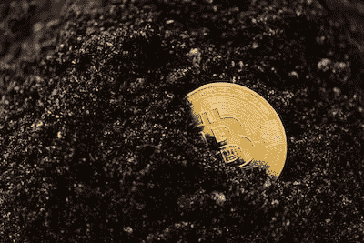
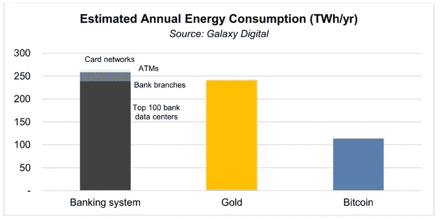

# 比特币的三大神话

> 原文：<https://medium.com/coinmonks/3-biggest-myths-of-bitcoin-c82cb6068d21?source=collection_archive---------45----------------------->

Source: [https://www.pexels.com/photo/close-up-shot-of-a-bitcoin-buried-in-the-ground-5980917/](https://www.pexels.com/photo/close-up-shot-of-a-bitcoin-buried-in-the-ground-5980917/)

比特币已经存在了 14 年多，根据 [CoinMarketCap](https://coinmarketcap.com/) 的数据，它已经成为最有价值的加密货币。许多大投资者开始考虑投资比特币，这似乎是消除对比特币的一些疑虑和误解的好时机。如果你认为比特币是你看不到的钱，因此不可信，比特币是庞氏骗局(骗局)，赌博，这个指南是给你的。

## 比特币没有现实价值，是一个骗局

比特币最大的价值就是稀缺性，硬编码不会超过 2100 万个比特币。比特币的供应量不仅有上限，而且还会经历一种机制，即每 4 年减少 50%的供应量，称为“减半”。与黄金非常相似，比特币旨在成为一种财富保护工具。然而，黄金很重，很难运输和储存，并且有少量但无限的供应，比特币旨在成为黄金的高级版本，这导致了“数字黄金”的名称。

多年来，当比特币在黑暗网络上被广泛使用时，它已经获得了负面的认识。然而，这并不意味着比特币是一个骗局。

与任何其他形式的货币一样，比特币可以用于任何非法活动。在最大的暗网关闭后，使用比特币的非法交易数量大幅下降。根据 [Forbes](https://www.forbes.com/sites/haileylennon/2021/01/19/the-false-narrative-of-bitcoins-role-in-illicit-activity/?sh=66269dc93432) (2020)，2020 年比特币网络中的犯罪份额在 0.34%左右，这甚至比法定货币交易中的犯罪份额还要少！

此外，比特币是一个基于点对点网络的开源、去中心化的网络，这意味着没有一个中央实体能够控制比特币。没有人可以窃取你的资金，因为没有人单独控制比特币网络。

## 比特币能效低，因此对环境有害

根据剑桥商学院(2022 年)的数据，比特币每年消耗 [127 太瓦时(T](https://ccaf.io/cbeci/index) Wh)。这比整个挪威消耗的还要多。但这只是硬币的一面。比特币旨在彻底改变当前的银行和金融体系。[根据 Galaxy digital mining 的调查，银行需要为其分支机构、数据中心、ATM、卡数据中心等提供电力。](https://twitter.com/glxyresearch/status/1393166955864117248?s=20)与目前的银行业相比，比特币消耗的能源至少比银行少 2 倍。

[世界银行](https://data.worldbank.org/indicator/EG.ELC.LOSS.ZS) (2022 年)和[国际能源署](https://www.iea.org/data-and-statistics?country=WORLD&fuel=Energy%20supply&indicator=ElecGenByFuel) (2022 年)估计，每年在传输和分配中损失的能量约为 2,205 TWh，比比特币网络消耗的能量多 19.4 倍。那么，为什么我们如此担心能源已经被浪费了呢？

在我看来，能源利用不一定是坏事。在做出判断之前，我们需要看看我们在比较什么。当你单独看比特币的能源消耗时，它可能看起来很可怕，但当我们缩小并将其与当前的银行和黄金行业进行比较时，比特币占据了上风。

## 比特币是赌博，不是投资

比特币确实波动很大，大部分投资者确实在比特币上亏了钱。但每个市场周期都有繁荣和萧条(起伏)，许多投资者也在比特币中获得了显著收益。

许多长期投资者确实投资比特币来赚快钱，他们投资比特币是因为他们看到并相信比特币的基本面和未来价值。他们认为这是一项投资，而不是一场赌博。比特币主要旨在解决一些问题，如让人们从银行获得财务自由、透明度、降低国际交易成本、通胀对冲以及许多其他问题。许多大型机构，如 MicroStrategy 和特斯拉，已经开始向比特币投资数十亿美元。

据[彭博](https://www.bloomberg.com/news/articles/2021-02-15/bitcoin-s-latest-record-run-is-less-volatile-than-the-2017-boom?sref=aInCMkkj)称，比特币的波动性正在显著下降。一个新的资产类别或市场波动很大是正常的，但随着这个市场的成熟，波动性会降低。但即使是网飞、谷歌或标准普尔 500 等成熟市场，这些市场周期仍会有起伏。投资者在投资前应仔细计算自己的风险状况和风险承受能力。

Source: [https://www.pexels.com/photo/graphs-display-on-an-ipad-187041/](https://www.pexels.com/photo/graphs-display-on-an-ipad-187041/)

> 交易新手？尝试[加密交易机器人](/coinmonks/crypto-trading-bot-c2ffce8acb2a)或[复制交易](/coinmonks/top-10-crypto-copy-trading-platforms-for-beginners-d0c37c7d698c)