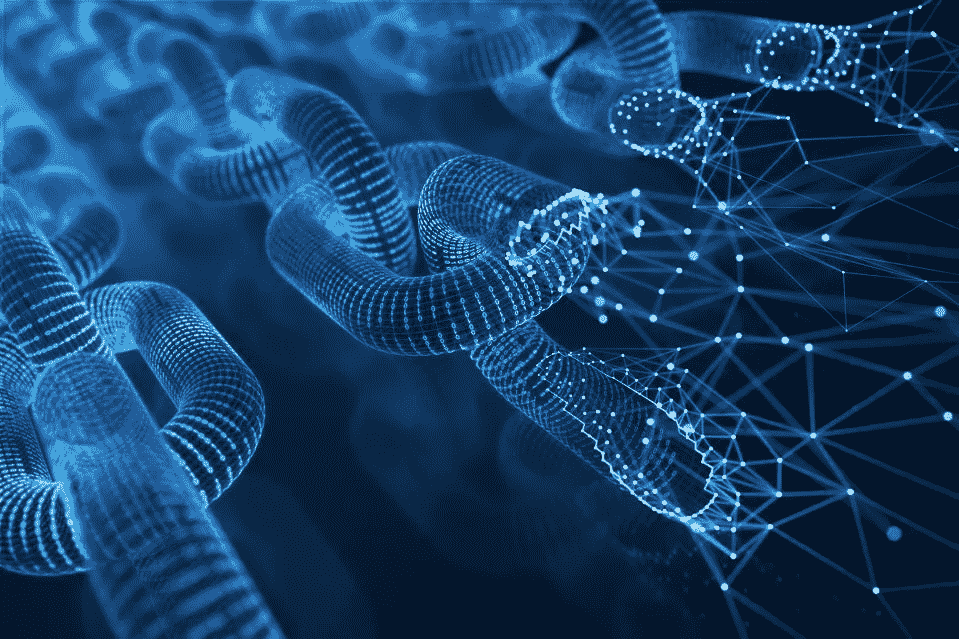

# 3.区块链:工作和层基础设施

> 原文：<https://medium.com/coinmonks/3-blockchain-working-and-layer-infrastructure-e348d677a5b6?source=collection_archive---------22----------------------->

source -- Internet

你可能已经在我最近的文章*中读到了关于区块链的内容。* 现在，我们就明白区块链是如何工作的了！

T 一个块有一些约束，比如它可以存储一定量的数据(有限的事务数)，当它被填满时，下一个块(一个新的块)由网络创建。

让我们以一个区块链为例，它由 3 个块组成，其中存储了一些事务数据。为了链接这些块，唯一的**散列 ID** 被分配给使用存储在块中的数据生成的每个块**。因此，每当有人试图改变块的数据时，它的散列 id 也会改变。这占用了大量的计算能力，使得区块链数据不可改变。**

什么是哈希 ID？它是为区块链上的任何数据事务随机生成的唯一字符串，用于验证或定位该事务。

比方说*拉德派了一个 BTC 给希亚姆。*以真实交易为例，其散列 ID 如下所示:

> 975 b 68 a 9 EDF 7 eff da 27705 EFD 64 f 785980 c 77 b 79 e 5637d 92 CB 6 a 7d 516 a 27

BTC 是什么意思？BTC 是比特币加密货币的符号，比特币区块链的原生货币。每个区块链都有自己的货币，用户使用它进行交易，区块链和货币相互支持以保持可持续性。比如以太，以太坊区块链网络支持的货币。

现在，让我们来一点技术，区块链层怎么样？

**第 0 层**由互联网、硬件和支持系统等组件组成，使整个网络保持在线。

**第一层**被称为“实现层”，是指区块链网络的核心架构。它为区块链网络提供了基础。第一层协议定义了一组操作规则，如事务吞吐量、阻塞时间、一致性算法等。，管理整个网络。像以太坊在过渡到利益证明(PoS)网络之前，暂时使用工作证明(PoW)一致算法。

**第 2 层，**目前第 1 层面临着一些性能问题，如低交易吞吐量、速度等。随着用户数量的增加。第 1 层采用 PoW 共识算法，该算法更安全，但需要高计算能力，并会影响性能。

为了解决这个问题，第 2 层就像一个与第 1 层协同工作的第三方集成。因此，工作在第 1 层和第 2 层之间分配。第 2 层也遵循与第 1 层相同的协议。总的来说，我们可以说，**第 2 层是一个框架，它为第 1 层提供了一个成熟的解决方案，以提高其整体性能。**以太网的一个例子是多边形 Matic 网络。

**第 3 层**位于第 1 层和第 2 层之上，支持在基础网络上开发应用和智能合约，这被称为分散式应用(DApps)。它托管这些应用程序，并允许用户直接与区块链交互。一些可编程区块链的例子是以太坊和索拉纳。

## 最后的话:

*   区块链是一项新兴技术，将取代我们所知的传统数据存储资源。这将彻底改变用户的应用和在线行为。
*   我带来了这一系列关于区块链的博客，尽可能用最简单的解释来解释这项技术。如果你还有一些疑惑或者想法，我们可以联系讨论👇

> 【https://www.linkedin.com/in/prakashag/ 

*   下一篇博客将会有更多的技术术语，因为我们将会讨论 DApps 和智能合约，所以请做好准备！！！
*   你可以在下面的评论区写下你的观点/想法，以便我们讨论。如果你觉得这个博客有帮助，请点击拍手👏按钮下面几下，以示支持…

> 交易新手？尝试[加密交易机器人](/coinmonks/crypto-trading-bot-c2ffce8acb2a)或[复制交易](/coinmonks/top-10-crypto-copy-trading-platforms-for-beginners-d0c37c7d698c)