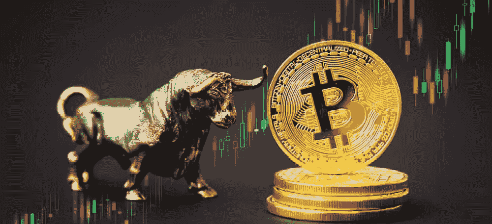

# 下一轮加密牛市的 3 个催化剂

> 原文：<https://medium.com/coinmonks/3-catalysts-for-the-next-crypto-bull-run-434836a6eb8c?source=collection_archive---------18----------------------->

所有行业，包括房地产、股票、商品和密码都受周期影响。很明显，但大多数投资者并没有真正为此做好准备。如果我说比特币重回 14000 美元的几率比我们想象的更切实，你会对此感到害怕，还是会为此感到兴奋？在回答我的问题之前，先看看你的投资组合，想象一下 BTC 股市下跌 30%的影响，以及更具破坏性的替代硬币。现在怎么办？

事实是，大多数投资者声称他们已经为熊市周期做好了准备，他们认为这是一个很好的机会窗口，但大多数人是静态的，感觉不够舒适，无法投资。你知道你应该做，你知道如果你不做你会后悔，但你还是什么都不做。

我今天的目标是为你提供一些见解，让你在投资组合决策中足够自信。

**为什么市场没有上涨**

让我们来看看宏观前景:

*   比特币曾被认为是传统资产的替罪羊，这也是其牛市周期的原因之一。例如，今天很明显，BTC 与股票市场高度相关。
*   随着全球经济衰退和美联储连续加息，投资者(主要是机构投资者)不会将资金部署在风险资产上，特别是加密货币这样波动性很大的资产。
*   分析加密部门本身，它的大部分消耗来自 6 月份的 Celsius/Luna 崩溃。事实证明，一些稳定的公司和价值数十亿美元的公司并不像它们应该的那样可靠。

**可能推动下一轮牛市的三大催化剂**

Galaxy Digital 首席执行官 Mike Novogratz 在 Token2049 crypto 活动上表示，下一轮比特币反弹将不得不更多地关注实用性，而不是故事。

2017 年的牛市最重要的是故事，这意味着项目可能会变成什么，而不是它们实际上在建造什么。人们想要更多的自由和权力下放，几个代币提出的故事符合投资者的需求。在 2020-2021 年，这是疫情的一个影响，资产的数字化已被证明是有用的。

找到推动下一轮牛市的下一个趋势并不容易，但熊市是首席执行官回归基本原则、建筑商继续建造、投资者研究以做出更明智决定的时候。因此，这里有几个你应该留意的催化剂:

*   **快速、可扩展、用户友好的应用** : [诺沃格拉茨的](https://cointelegraph.com/news/next-bitcoin-bull-run-to-be-half-story-half-utility-mike-novogratz-at-token2049)下一场拉力赛的赌注。对于在该领域建立业务的公司，尤其是传统的金融业务，这些应用程序必须坚持非加密用户。
*   **美国金融创新法案:** Cardano 的创始人 [Charles Hoskinson](https://dailyhodl.com/2022/09/24/cardano-creator-charles-hoskinson-names-catalyst-that-he-believes-could-end-crypto-downturn-and-trigger-mega-bull-market/) 认为，美国走向监管的一步可能会导致蓝筹股资本泛滥。精明的资金是一个强有力的指标，表明市场是否强劲到足以上涨。与此同时，一个强硬的政府可能会延长熊市，并进一步推低熊市。
*   **对央行缺乏信任:** [德鲁肯米勒](https://finbold.com/billionaire-investor-s-druckenmiller-says-mistrust-in-central-banks-could-lead-to-crypto-renaissance/)表示，这种缺乏信任可能导致加密资产在经济重建开始时发挥“重要作用”，特别是在美联储最近加息和英国央行推出紧急债券购买计划的情况下。

在我看来，下一个周期将由通过易用性提供广泛采用的项目组成，而不一定是通过 TradFi 公司。获奖项目可能会应用于普通用户的日常生活:游戏、社交媒体、内容创作、银行和支付转账。

根据我最近参加的会议和最近对项目负责人的采访，很明显这个领域正在变得越来越强大。项目仍在建设中，关键是将资本投入到有利于下一轮牛市的项目中。

[*乔罗伯特*](https://joerobert.com/) *现任罗伯特风险投资公司首席执行官，拥有超过 20 年的资产管理经验。自创办以来，乔已经为投资者和合伙人创造了可预见的两位数回报。Joe 已经投资了股权和代币的种子轮，以及比特币、以太坊和其他顶级加密货币的投资组合。*

*如果您是合格投资者，并想了解更多关于我们产品的信息，请联系我们。*

> 交易新手？试试[加密交易机器人](/coinmonks/crypto-trading-bot-c2ffce8acb2a)或者[复制交易](/coinmonks/top-10-crypto-copy-trading-platforms-for-beginners-d0c37c7d698c)