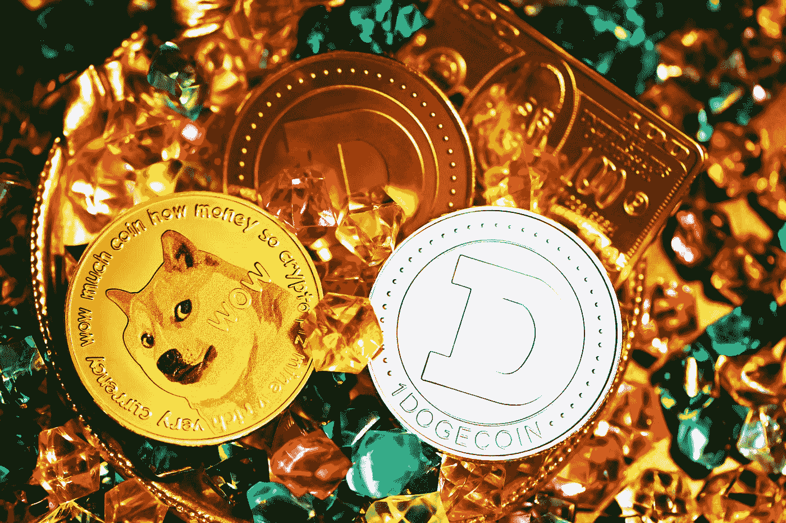

# 2022 年 10 月，以 10 美元以下的价格购买 3 台廉价密码机

> 原文：<https://medium.com/coinmonks/3-cheap-cryptos-to-buy-under-10-in-october-2022-5773115bdfa1?source=collection_archive---------11----------------------->

Photo by [Kanchanara](https://unsplash.com/@kanchanara?utm_source=medium&utm_medium=referral) on [Unsplash](https://unsplash.com?utm_source=medium&utm_medium=referral)

现在市场上可以买到任何加密货币，其中许多在行业内都有很好的前景。

然而，在整个 2022 年，我们将在相当短的时间内继续看到各种硬币的涨跌，因此很难确定哪些加密货币有真正光明的未来。

有鉴于此，让我们来谈谈三种廉价的加密货币，它们可能会在 2022 年 9 月以不到 10 美元的价格上市，以及原因。

> **另外，参见:** [长期投资加密债券的 3 个技巧](https://www.sammaiyaki.com/3-tips-to-investing-in-cryptos-for-the-long-term-266e57de0e89?source=user_profile---------4----------------------------)

# 10 美元以下可以买到的便宜密码 1:沙盒沙

市值:1，312，765，732 美元

**当前价格:** $0.8755

**循环供给:** 1.50B 砂

**当前 CMC 排名:** #42

作为一款游戏元宇宙， [***沙盒 SAND***](https://coinmarketcap.com/currencies/the-sandbox/) 允许用户通过参加在线比赛赚取虚拟现金。

换句话说，它为可以用真钱玩的加密游戏铺平了道路。

沙币是以太坊的原生货币。可以在以太坊网上购买和出售。

在沙盒中，用户可以创建和交易 NFT 对象，并开发自己的元宇宙游戏。

生态系统的主要货币沙子可以通过赌博和出售财产来获得。

> **同样，参见:**[2022 年 9 月以不到 1 美元的价格购买 3 款最佳密码手机](https://www.sammaiyaki.com/3-best-cryptos-for-less-than-1-to-buy-in-september-2022-ef199e042e72?source=user_profile---------3----------------------------)

# 10 美元以下可以买到的便宜密码 1:SHIB 的柴犬

市值:6181416561 美元

当前价格:0.00001126 美元

**流通供应量:**549063.28 亿 SHIB

**当前 CMC 排名:** #14

柴犬 SHIB 的创作动机是希望找到一种合适的狗的替代品。

柴犬是一种受网络病毒“Doge”热潮启发的密码，可与 Dogecoin 相媲美。

柴犬不是像 Dogecoin 那样的加密货币，而是基于以太坊的代币。

不可否认，这种货币已经成为市场上的重要参与者，24 小时交易量超过 3 亿美元，市场估值为 67 亿美元。

柴犬的成功在很大程度上可以追溯到围绕硬币主要目标的营销活动:取代 Dogecoin。

它用这种策略获得了许多忠实的追随者和绰号***“Dogecoin 杀手”***

一枚柴犬币价值不高。

然而，交易者和投资者有时会大量买入这些资金，以获得可观的利润。

比特币的价格一直有可能下跌，但最近，它一直呈上升趋势。

> **同样，参见:**[2022 年 9 月及以后购买的 3 款开创性密码](https://www.sammaiyaki.com/3-groundbreaking-cryptos-to-buy-in-september-2022-and-beyond-2d69f5108943?source=user_profile---------2----------------------------)

# 10 美元以下可以买到的廉价密码 1: Avalanche AVAX

市值:5173316267 美元

**当前价格:** $17.50

**循环供应量:** 295，884，039.04 AVAX

**当前 CMC 排名:** #16

加密货币 [***雪崩 AVAX***](https://coinmarketcap.com/currencies/avalanche/) 因其超过 14 亿美元的高市值和超过 1.21 亿美元的 24 小时交易量而成为密码行业的知名人物。

相反，Avalanche 的区块链网络及其提供的服务是该项目的核心原则。

为了增加网络吞吐量和减少事务时间，雪崩网络实现了子网的使用。

为了避免主区块链超限，有些项目可以使用 ***【子网】*** ，基本上就是 ***【子区块链】***

因此，Avalanche 每秒可以处理 4，500 个交易，同时保持非常低的交易和汽油费用。

这使得它成为一种普遍可用的加密货币。

> **还有，看:** [3 个潜力巨大现在买的密码](https://www.sammaiyaki.com/3-cryptos-with-massive-potential-to-buy-now-f423564b649b?source=user_profile---------1----------------------------)

# 总结一下

比特币行业的特点是高度的不确定性，这也是它最与众不同的一个方面。

然而，这也不总是一件坏事。

加密货币市场的剧烈波动增加了许多戏剧性，但一夜之间成为百万富翁的机会才是它的卖点。

知道哪些硬币最有潜力并提供独特的东西仍然是有用的，即使很难预测任何货币的下一步走向。

> **另请参见:** [3 个 Cryptos 在 CoinMarketCap 上的前 30 名为 Long Hodl](https://www.sammaiyaki.com/3-cryptos-in-the-top-30-on-coinmarketcap-for-the-long-hodl-e5fe9754f17d?source=user_profile---------5----------------------------)

# 财务免责声明

sammaiyaki.com 的*信息的提供不附带任何明示或暗示的保证，包括对准确性、完整性或适合特定用途的保证，纯粹用于教育、指导和娱乐目的。*

*本网站无意提供也不代表任何建议，无论是交易、投资还是金融建议。*

*本网站的内容，以及通过本网站可访问的任何信息，都是一般性的，不针对像您或其他任何人这样的用户。*

*如果您在没有进行独立研究和与合格的经纪人或财务顾问交谈的情况下，避免根据本网站上的信息做出任何财务、投资、交易或其他决定，这将是有益的。*

*您同意，访问本网站上或通过本网站提供的任何信息的风险由您自行承担。*

***风险陈述:**比特币和其他加密货币的交易包含可能出现的优点和缺点。不是每个人都适合交易。任何对投资感兴趣的人都需要咨询专家。*

> *交易新手？尝试[加密交易机器人](/coinmonks/crypto-trading-bot-c2ffce8acb2a)或[复制交易](/coinmonks/top-10-crypto-copy-trading-platforms-for-beginners-d0c37c7d698c)*