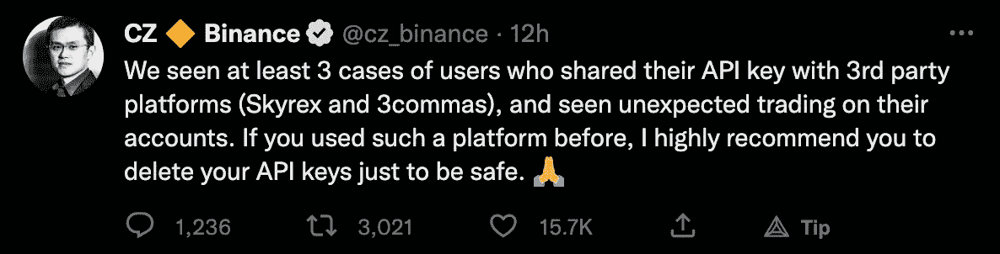
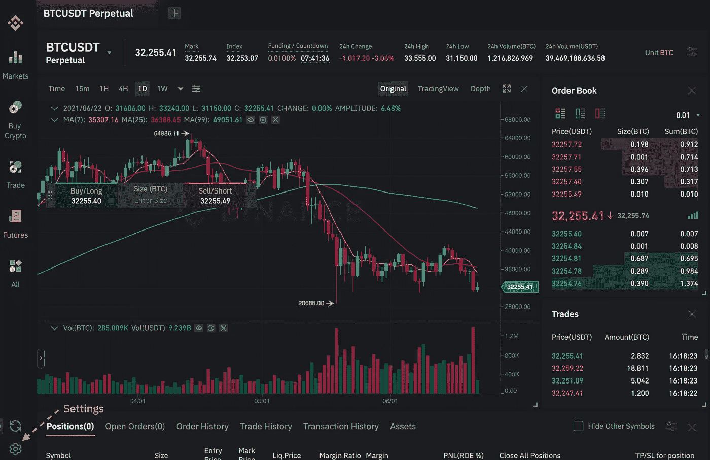
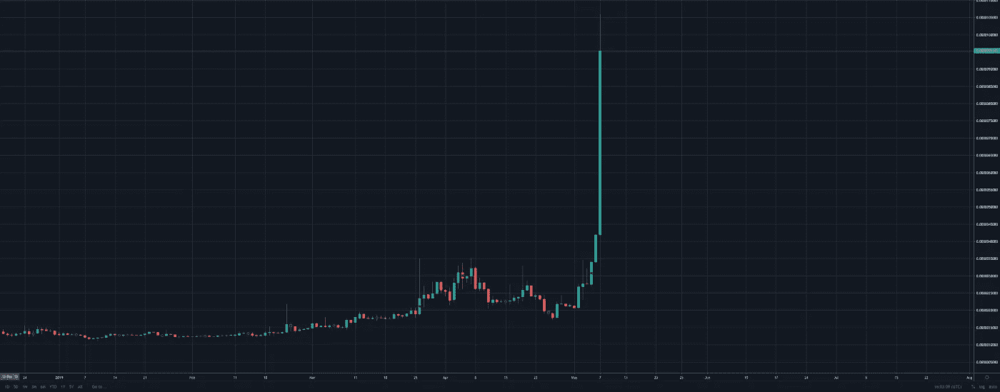
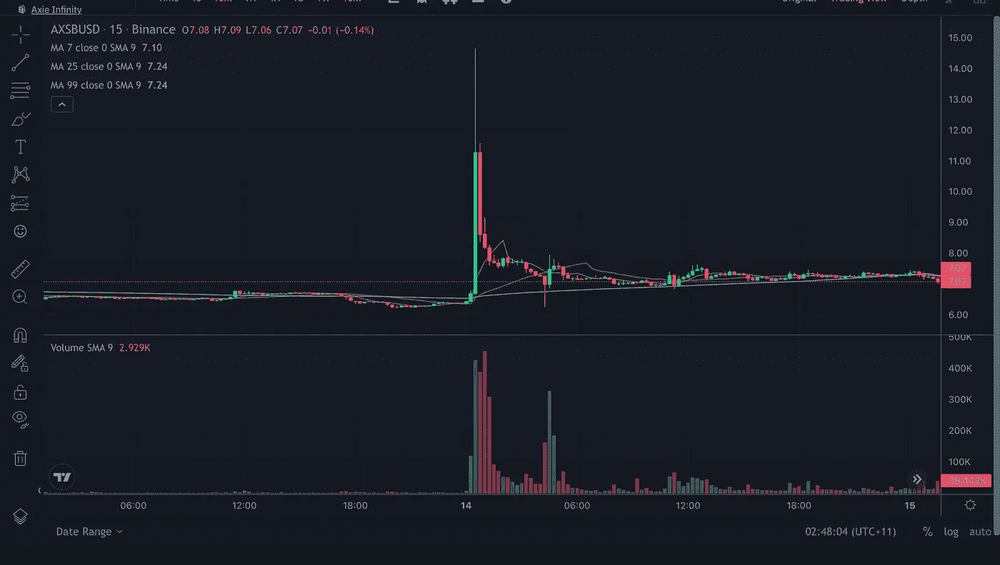
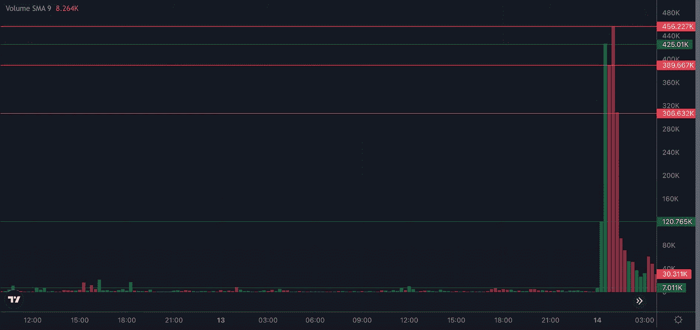

# 3 个逗号 API hacks

> 原文：<https://medium.com/coinmonks/3-commas-api-hacks-e3341e2e324e?source=collection_archive---------6----------------------->

**以及为什么您应该避免让第三方将您的私有 API 密钥存储在云上，并使用** [**Gunbot**](https://drgunbot.com/buy-gunbot/) **在本地运行。**

Sam Bearman-Fried Photo credits — Dr. Gunbot/Midjourney

# 山姆，谢谢你对熊市的贡献。

似乎 SBF 碰过的所有东西，在过去的一周里都变成了狗屎。
我个人损失了相当大的一笔钱，这笔钱现在被锁了起来(或者说得直白一点……可能从我把钱存入 FTX 的那一刻起就不存在了)

但 FTX 并不是山姆·班克曼·弗里德涉足的唯一一块馅饼。
广受欢迎的交易机器人“3 逗号”也到处都是他肮脏的指纹……就像 FTX 一样，3 逗号本周因危及用户的隐私、安全，更重要的是他们的余额而让用户付出了沉重的代价。

Tweet from C[hangpeng](https://www.google.com/search?sxsrf=ALiCzsaIu8BncGZJId105fJYRI77nuHEKg:1668437023512&q=changpeng+zhao&spell=1&sa=X&ved=2ahUKEwj_9Pag9K37AhUDhFwKHWYSC_4QkeECKAB6BAgHEAE) Zhao — CEO of Binance

如果你关注我的中级账户，或者说 CoinMonks，你可能还记得我今年早些时候发表的一篇文章，在这篇文章中，我解释了为什么与机器人交易是你能做的最好的事情之一，以及为什么 Gunbot 是市场上最好的全能机器人。
但更重要的是……我解释了为什么与第三方应用程序共享你的 API 密钥，比如“3 个逗号”,这是一个可怕的想法，可能会给你留下“0 个逗号”

此刻，你会看到很多我称之为“后见之明英雄”的人，在接下来的几个月里，这种情况更有可能发生。那些告诉你他们知道所有这些事情会发生并且应该避免的人…

但只是在事件发生之后。
**这些人逊毙了。**

# **这里是我今年早些时候的帖子的一些摘录，关于我为什么选择使用 Gunbot 而不是基于云的 bot:**

> “交易机器人需要你的`public` *和* `private` API 密匙。这些密钥就像你用来连接比特币基地或币安的用户名和密码，允许交易机器人代表你进行交易。你会乐意把你的用户名和密码交给这些未知的服务器来控制你的密码吗？我也不会。”

## 并且:

> “如果黑客利用这些云系统，他们可以获取所有这些敏感信息，并用它们来对付你。
> 此外，如果他们的服务器出现宕机(服务器离线)，当你无法访问你的机器人时，机器人进行的任何交易都可能被卡住，无法卖出。当然，你通常可以访问你的交易所来结束你的交易，但是当服务器重新上线并把仍然存储在它的内存中的交易放进去的时候呢？在某些情况下，这可能是灾难性的。”

# 这就是纯云机器人糟糕的原因。

由于 3 逗号是一个基于云的交易机器人，你的私人和公共密钥需要传递给第三方，这意味着你必须全心全意地信任你提供它们的公司。
你不仅要相信公司本身不会破产(比如，FTX 非法将用户资金从 FTX 转移到阿拉米达研究公司来中饱私囊),你还要相信公司的安全性绝对无懈可击。一直都是。
后者这次显然被“3 个逗号”忽略了。
你应该对《加密》和《DYOR》中的任何人保持警惕，以防出现最坏的结果。把你的私人密钥上传到一个你一无所知的服务器上，不知道他们有什么安全措施，不知道当你的密钥到达那个服务器时什么加密技术在保护你的密钥，甚至不知道那个该死的服务器在哪里，这些都是导致灾难的原因。
不幸的是，对于许多云机器人用户来说，这个配方导致了本周的灾难。

# 问:如何避免这种情况？

# a)简单。使用 Gunbot，控制这些密钥的存储位置，并使用 IP 白名单。

有了 [Gunbot](https://drgunbot.com/buy-gunbot/) ，你可以完全控制如何存放你的钥匙。

> Gunbot 的服务器不会存储你的`private` API 密匙。这些只能由你运行[gun bot](https://drgunbot.com/coincodecap)的计算机存储和加密，并且只能由你访问。

当你使用 [Gunbot](https://drgunbot.com/buy-gunbot/) 时，没有第三方存储你的私钥。
能接触到这些密钥的人只有**你**和你的交易所。

有了 IP 白名单，你可以选择你自己的 IP 地址作为世界上唯一允许执行交易的 IP 地址。
云机器人的问题是，一旦它们被黑客攻击，所有这些用户密钥都与被入侵和黑客攻击的机器共享同一个 IP 地址。这使得黑客可以非常容易地用一个简单的脚本来大规模攻击所有 pwned API 密钥(甚至是那些有 IP 白名单的密钥，因为它们将被列入被入侵服务器的 IP 地址的白名单中)。
[**gun bot**](https://drgunbot.com/buy-gunbot/)**只存储你的公共 API 密匙。**
没有与之配套的私钥，你根本不可能作为中间人只用公钥在我的账户上交易。我的私人密钥在我的家用机器或我选择用来运行我的机器人的 VPS 上保持锁闭和加密状态…具有我选择的安全性。

对于大规模攻击 [**Gunbot**](https://drgunbot.com/buy-gunbot/) **用户的黑客来说，他们需要单独攻击每个用户的个人机器，以获取 API 密钥并绕过 IP 白名单……祝你好运。**

你可以看到为什么云机器人对这些邪恶的演员来说是唾手可得的果实。

# 问:如果我使用机器人，我还应该相信集中交易吗？

# a)如果你不想，很快你就不必这么做了。原因如下。

[https://youtu.be/8ZZsUzpgVe0](https://youtu.be/8ZZsUzpgVe0)

宣布 DeFi 的 Gunbot 即将完成并将于 2022 年 12 月上市的绝佳时机。你的钥匙，你的钱。过去的一年严重扭曲了人们对集中交易的信任。
在 DeFi 交易所交易，把你的硬币放在胸前，而不是在亿万富翁手中。

# 让我们看看这些邪恶的行为者可能如何欺骗毫无戒心的云机器人用户。

Binance GUI

攻击者通常不能用他们的 API 密钥将受害者的资金提取到他们自己的钱包中。
事实上，交易所已经采取了一些措施来防止这种情况发生。
例如，为了通过 API 从币安的 exchange wallet 向用户的私人 DeFi wallet(如 Metamask)提取资金，用户必须首先通过 exchanges GUI(上图所示的浏览器中常见的 exchange 前端)向该 wallet 进行交易，然后才允许使用 API 密钥进行任何提取。

# 那么他们是怎么做到的呢？

A big green dildo.

# 用打气筒。

**让我们以硬币 Axie Infinity 为例，因为这次攻击发生在今天早些时候(2022 年 11 月 14 日)**

**AXS pump & dump 15 minute chart**

**AXS pump & dump 15 minute volume**

1)攻击者将完成他们的准备，并确保一切顺利进行攻击。

2)攻击者将购买大量低交易量的 shitcoin，更有可能是在高杠杆的期货账户上。如果让我冒险猜测，我会说攻击者是用自己的资金购买了成交量图底部 7000 美元 AXS 的大部分的人。

3)在攻击者锁定他们的资金后，他们针对被破坏的 API 密钥运行攻击，迫使受害者的帐户转储他们持有的所有 stablecoin，并大量购买低量 shitcoin，以抽取攻击者的包(更有可能是 12 万美元和 42.5 万美元的两个大绿量峰值)

4)攻击者倾倒他们的一袋现在价值不菲的 shitcoin，而其他不知情的用户都争先恐后地购买 shitcoin，因为大型泵-导致攻击者有更多的退出流动性来倾倒他们的袋子，让受害者拿着一袋(对不起 Axie Infinity 爱好者……)无用的 shitcoin。

5)……**利润**

攻击者现在可以在使用类似于龙卷风现金(RIP)的不倒翁或服务之前，将他们疯狂的收益(通过查看销售额来大致了解攻击者赚了多少)提取到交易所外的钱包中

因此，如果你拥有一个仅基于云的机器人，正在犹豫是否购买一个，或者正在探索自动化交易的选项，但重视你的安全性…
请。帮你自己一个忙，去看看[枪机](https://drgunbot.com/buy-gunbot/)。
在过去几年的许多 bot 评论中，这是一个可靠的选择，也是迄今为止市场上最具隐私意识的 bot——从一开始就通过设计避免了任何类似的潜在攻击。以下是我最喜欢的一些功能

> 在您自己的机器或服务器上本地运行
> 
> 不会在 Gunthy LTD 服务器上存储您的私有 API 密钥
> 
> 不收集 Gunthy LTD 服务器上的用户交易数据
> 
> 你可以获得由 Gunbot 开发者或其令人敬畏的社区制定的惊人的免费策略。
> 
> 你的交易不需要支付佣金
> 
> 像大多数机器人一样，没有月费，你支付一次就永远拥有它。
> 你可以获得免费的更新和升级。
> 
> 终身免费升级
> 
> 免费的 GUNTHY 代币
> 
> 令人惊叹的定制
> 
> 许多不同的机器人
> 
> 付费昆虫奖金
> 
> 更加

[使用 crypto 购买，在购买终身许可证时可享受 50%的折扣。](https://drgunbot.com/buy-gunbot/)

在外面注意安全，

机器人博士。

> 交易新手？尝试[加密交易机器人](/coinmonks/crypto-trading-bot-c2ffce8acb2a)或[复制交易](/coinmonks/top-10-crypto-copy-trading-platforms-for-beginners-d0c37c7d698c)