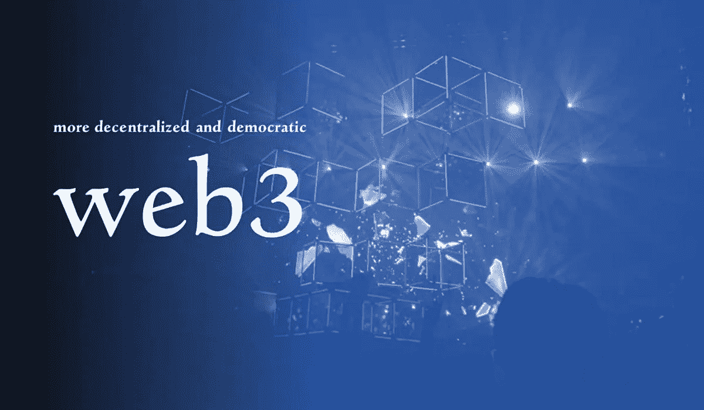
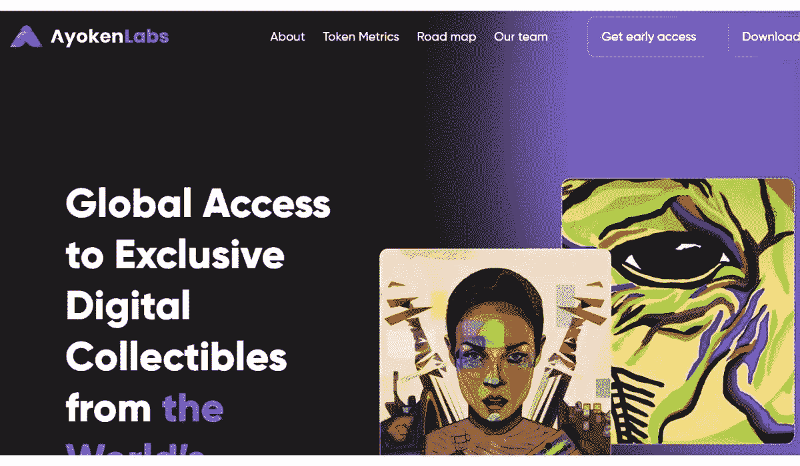
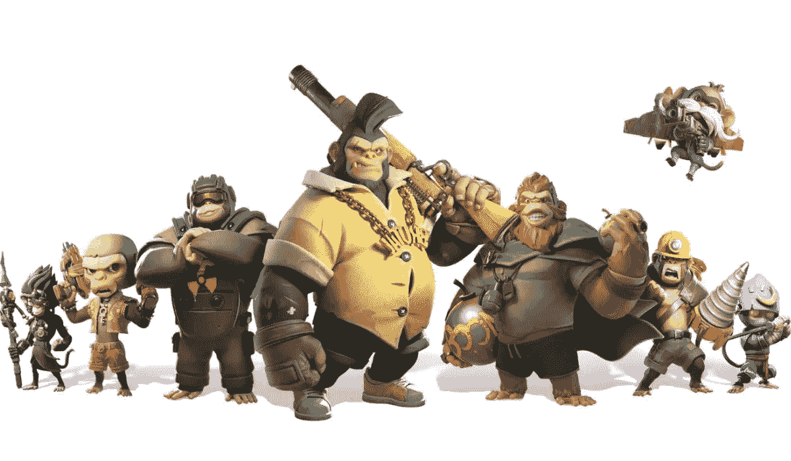

# 3 家公司从 Web2 到 Web3 的演变

> 原文：<https://medium.com/coinmonks/3-companies-evolation-from-web2-to-web3-fde9726bcd21?source=collection_archive---------29----------------------->

进化的时候到了。

类似于 Web1 如何被 Web2 的技术进步迅速超越，Web2 早已达到顶峰，目前正经历一段停滞期。换句话说，为了生存，Web2 正在经历它的自然进化过程。

Web2 的问题与 Web1 的问题具有相同的过程:企业已经出现，使用专有平台和一度开源的技术来控制市场，将消费者聚集到集中的中心，并为较小的参与者建立了几乎无法渗透的部门。此外，收入和客户开发优先于创新。用户数据现在被 Web2 平台在所谓的“免费”服务中例行收集、交换和货币化——这可能是最糟糕的部分——所有这些都隐藏在所需条款和条件的小字中。

幸运的是，不能再忽视区块链的潜力了。由于区块链技术及其潜力几乎被普遍接受，新公司正在争夺机会，以影响消费者和企业在新的 Web3 范式中的互动方式。从残酷的电子商务交易、对新的创意渠道的需求以及在线游戏的利润潜力，三家 Web3 公司准备开创我们对互联网的看法。

让我们在三种潜在业务的背景下考察 Web2 到 Web3 的发展，每一种业务都旨在帮助克服 Web 当前的限制，并为更好、更公正的未来铺平道路。

# 1.ShopX

电子商务是一个重要的行业，2021 年创造了 8700 亿美元的收入(比 2020 年增长了 14%)。事实上，全球每个顾客都经常从亚马逊、易贝和乐天(日本)等网络电子商务公司购买日常商品和服务。

不幸的是，Web2 模式下的电子商务一直存在问题。在消费者和品牌如何在线互动方面，以下潜力和进步被这些痛点超越了:

*   增加每笔交易成本的昂贵中间商
*   高客户获取成本
*   糟糕的联盟营销动态
*   客户参与的方式有限
*   用户数据的跟踪
*   来自数据黑客的安全问题

考虑到这些问题，来自一个后起之秀的 Web3 正准备改变区块链和分散化的可能性: [**SHOPX**](https://shopx.co/?ref=hackernoon.com)

这个 Web3 电子商务基础设施将是第一个将这些工具和实用程序结合在一起的基础设施，这种方式适合于目前的行业状况，并且足够灵活，可以随着市场的变化而变化。它旨在通过以下方式改变电子商务的方向:

*   为企业提供与消费者互动和奖励忠诚度的新方法
*   通过参与 Web3 赢得新客户
*   提供货币和加密货币之间的无摩擦交换
*   增加直接联盟营销连接的数量
*   建立全球开放的库存管理系统
*   将客户数据的所有权交给公司，同时保护隐私

这些无疑是美妙的 Web3 创新承诺。但是在你认为这是一项真正革命性的技术之前，要意识到创造者并没有，可以说，把婴儿和洗澡水一起倒掉。事实上，SHOPX 非常注重平台集成，在 Shopify、WooCommerce、Magento 和其他任何知名平台等 Web2 就绪程序的基础上进行开发，以便顺利采用。

最棒的是，它创造了一个环境，允许不了解区块链技术的普通用户在没有任何 Web3 知识的情况下访问 Web3 技术。用户与该平台的交互方式与他们已经使用的任何其他平台相同。在第一波浪潮中签约的品牌将受益于先发优势，并处于独特的地位，引领新兴行业走向高效的电子商务资源和交易。

# 2.阿约肯

现代艺术界长期以来一直受到停滞不前的困扰，因为它难以采用技术进步。Web2 的局限性使得参与者必须重塑艺术家、公司、粉丝和消费者之间的联系方式。这是由于假冒伪劣盛行，对艺术家版税管理不当，以及限制创意受众的多重把关。

由于 NFTs 提供了优越的出处，独立艺术家正在寻找新的场地来展示他们的作品，艺术界也有很多喧嚣，区块链准备改变艺术的生产、传播、鉴定等方式。

阿约肯 计划为那里的音乐人引入一个新的 NFT 平台。这里的数码艺术品市场将各地的艺术家和观众联系在一起。该项目为艺术家和粉丝提供了一个强大的市场，具有大量功能，使创意人员能够推出从数字/专辑艺术、数字收藏品和实用驱动的社交令牌在内的一切东西。

其中包括:

*   社区聊天和小费
*   个性化 Web3 域
*   实时分析
*   即时版税跟踪
*   独家访问未发布的镜头，现场活动，商品，并提前获得专辑
*   艺术家互动的社交标志
*   定时投放
*   礼宾服务
*   可兑换的$AYO 加密货币

这一举措之所以引人注目，是因为它的全球目标是为了更美好的未来而进入新兴市场。Ayoken 打算实现多元化，并抓住机会打开以前未开发的市场以实现增长，例如非洲的 13 亿人口(预计到 2050 年将翻一番)。这一前瞻性的战略展示了 Ayoken 如何利用区块链和艺术的力量造福全人类。

# 3.元猿

Web3 游戏将超越简单的“娱乐和游戏”事实上，许多最初应用于游戏平台的 Web2 突破后来被应用于几乎每个行业。例如，考虑一下 VR 头戴式游戏是如何发展成为重工业的常见用途的。换句话说，每个人都在关注游戏在 Web3 时代的发展。

正如电子商务和艺术领域一样，网络游戏也受到了 Web2 范式的阻碍。这些 Web 2 游戏的发行和开发采用了集中的方法。这意味着很大一部分奖励流向了出版商和营销商，而不是创作者和游戏玩家。令游戏玩家沮丧的是，还有太多的广告和对实际游戏的足够关注。多亏了 Web3 游戏，一切都在改变。

[**元猿**](https://metaapesgame.com/) 是一个耐人寻味的 Web3 玩家。他们的团队正在吸引当前猿类时代的玩家群，这是一款非常成功的移动 MMO 游戏，移动 MMO 游戏，以转移到新的 Meta Apes 平台。

那么目的是什么呢？Meta Apes 将是第一款通过软件开发工具包(SDK)转换为 Web3 的 Web2 游戏，这一功能将为在线游戏创作的未来铺平道路，以便利用 Web3 环境中提供的所有最伟大的功能，成为真正的“游戏改变者”。Ankr 的游戏 SDK 将帮助推出基于 BAS 的 Meta Apes，这是币安智能链(BSC)生态系统中的一个侧链，不仅仅是“数字窃取”观众。这种测试不仅将改进开发者发布新的 Web3 游戏和更新现有 Web2 游戏的方式，而且还将为用户和其他利益相关者开辟新的机会。

例如，Meta Apes 是几款为玩家的时间和注意力付费的 Web3 游戏中的第一款，它将提供像$BANANA 这样的游戏内加密货币。有了各种各样的补偿结构，如玩赚、分享赚等，Web3 对改善在线游戏的贡献肯定会引起其他部门的注意。

对于任何可能彻底改变一个行业的新想法来说，时机是至关重要的。现在是时候让 Web2 进入 Web3 的下一个发展阶段了。有理由认为，鉴于游戏、艺术和电子商务领域的所有这些进步，随着更多的人参与创建一个全新的、自我维持的生态系统，目前的 Web3 范式只会扩大。

[**NO Surrender Heroes**](https://app.adjust.com/nw8swri?redirect=https%3A%2F%2Ftwitter.com%2FNoSurrenderHero)

与我们共度更多时光； [**碎碎念**](https://app.adjust.com/nw8swri?redirect=https%3A%2F%2Ftwitter.com%2FNoSurrenderHero) **|** [**中等**](/@nosurrenderheroes)