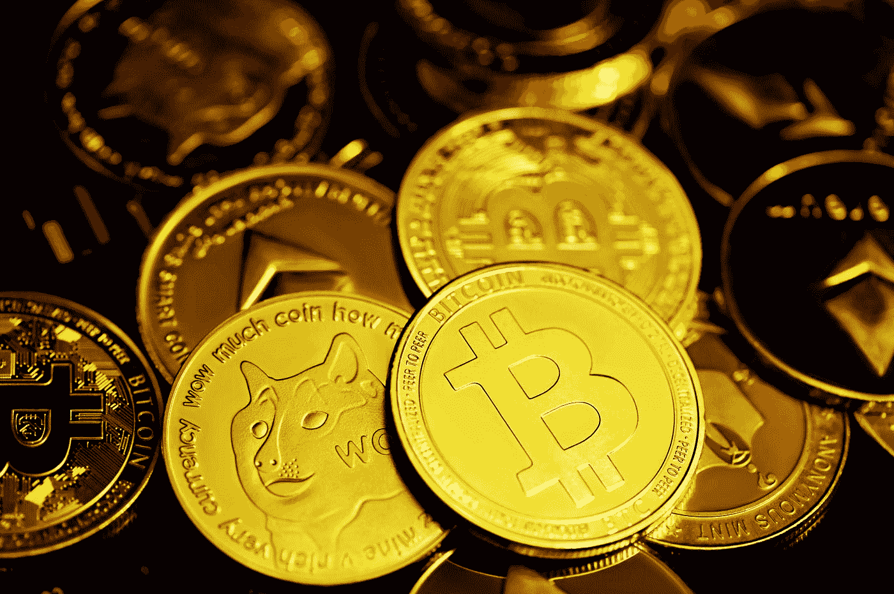

# 您的投资组合中有 3 个加密硬币

> 原文：<https://medium.com/coinmonks/3-crypto-coins-to-hodl-in-your-portfolio-8bbde2f18dcd?source=collection_archive---------15----------------------->

Photo by [Kanchanara](https://unsplash.com/@kanchanara?utm_source=medium&utm_medium=referral) on [Unsplash](https://unsplash.com?utm_source=medium&utm_medium=referral)

即使对机构投资者来说，加密货币近年来也已经成为一个重要的资产类别。

然而，选择正确的加密资产进行投资可能很困难，特别是考虑到高质量的替代品非常丰富。

然而，并不是每个看起来有吸引力的加密资产都是可行的投资选择，因为其中一些不具备长期运营所需的条件。

因此，你需要在选择资产时小心谨慎，以防止未来的损失和遗憾。

因此，以下是三种最具增长潜力的加密货币，这表明它们在加密货币市场中具有长期潜力。

> **又见:** [3 个拥有强大投票权的密码](/the-digital-journals/3-cryptos-with-a-strong-voting-power-5b39ec72981d?source=user_profile---------3----------------------------)

# Hodl №1 的加密硬币:以太坊 ETH

市值:165857973365 美元

**市值持仓** : 2

**现价**:1352.09 美元

**总供应量:** 122，667，475.50 瑞士法郎

所有的 DApps 和智能合约都是基于 [***以太坊 ETH***](https://coinmarketcap.com/currencies/ethereum/) 已经让它在加密货币界家喻户晓。

随着 2022 年晚些时候过渡到股权共识证明机制，以太坊(按市值计算仅次于比特币的第二大加密货币)有很大的潜力(尽管在这一点上它已经被安排了多年)。

由于合并，预计将出现重大的积极发展，如更快的以太坊交易、以太坊赌注的引入以及以太坊出了名的高油价的下降。

一旦期待已久的以太坊 PoS 转换完成，加密货币社区可能会提高其网络利用率。

> **另请参见:** [管理加密风险的 5 种方法](/@sammaiyaki/5-methods-for-managing-crypto-risks-9262e083bc20?source=user_profile---------2----------------------------)

# 加密硬币到 Hodl №2:币安硬币 BNB

市值:47300074371 美元

**市值持仓** : 4

当前价格:293.20 美元

总供应量: 161，337，261.09 BNB

[***币安币 BNB***](https://coinmarketcap.com/currencies/bnb/) 是世界上最成功的加密货币交易所——币安的母币。

这使得它成为加密货币市场的有力竞争者，但还有更多。

币安一直在向其生态系统中添加新的服务，NFTs 市场就是最近的一个例子。

随着时间的推移，BNB 将成为生态系统内的主要支付手段。

这类事情使得加密资产在市场上更有价值。

币安硬币(BNB)也作为币安智能链(BSC)平台令牌。

BSC 由于其更快的交易速度和更低的价格，正在迅速成为以太坊的一个可行的竞争对手。

BSC 的建立就是为此而感谢的。他们每个人都对代币的当前价值做出了贡献，这可能会在未来提升代币的价值方面发挥关键作用。

> **同样，参见:** [创建自己的加密货币](/predict/create-your-own-cryptocurrency-e09aa438c3d9?source=user_profile---------1----------------------------)

# Hodl №3 的加密硬币:Cardano ADA

**市值:**:14757854518 美元

**市值持仓** : 8

**现价**:0.4308 美元

**总供应量:**3426 万阿达

很多加密货币投资者和交易者对 [***卡达诺阿达***](https://coinmarketcap.com/currencies/cardano/) 并不熟悉。

ADA 是由以太坊的联合创始人之一查尔斯·霍金森开发的。

它是一种具有许多未实现潜力的加密货币，因为它是为分散化的未来设计的，具有智能合同和不可替代的令牌等功能。

该项目已经扩展到包括币安的非功能性森林交易市场。

Cardano Launchpad 是 Cardano 平台的另一个重要组成部分，新的加密货币项目将在这里推出。

虽然 ADA 令牌的价值现在很低，但如果增加新的用例，它的价值可能会上升，因为它是 Cardano 独有的，并支持所有这些服务。

# 总结一下

凭借您的知识，您可以根据加密货币的未来发展潜力和您的偏好做出明智的投资决策。

> **另请参见:** [加密硬币与代币](/cryptocurrency-hub/crypto-coins-vs-tokens-93a633abab4?source=user_profile---------0----------------------------)

# 财务免责声明

本网站的材料不声称提供也不构成任何交易、投资或金融建议。它纯粹是为了提供信息、启发和娱乐。

在没有首先进行研究和联系合格的经纪人或金融顾问之前，建议不要根据本网站的材料做出任何金融、投资、交易或其他选择。

您承认您必须评估本网站上的任何信息或通过本网站提供的任何信息。

# 风险陈述

比特币和其他加密货币的交易既有优势也有劣势。交易并不适合所有人。任何对投资感兴趣的人都必须咨询专家。

> 交易新手？试试[加密交易机器人](/coinmonks/crypto-trading-bot-c2ffce8acb2a)或者[复制交易](/coinmonks/top-10-crypto-copy-trading-platforms-for-beginners-d0c37c7d698c)