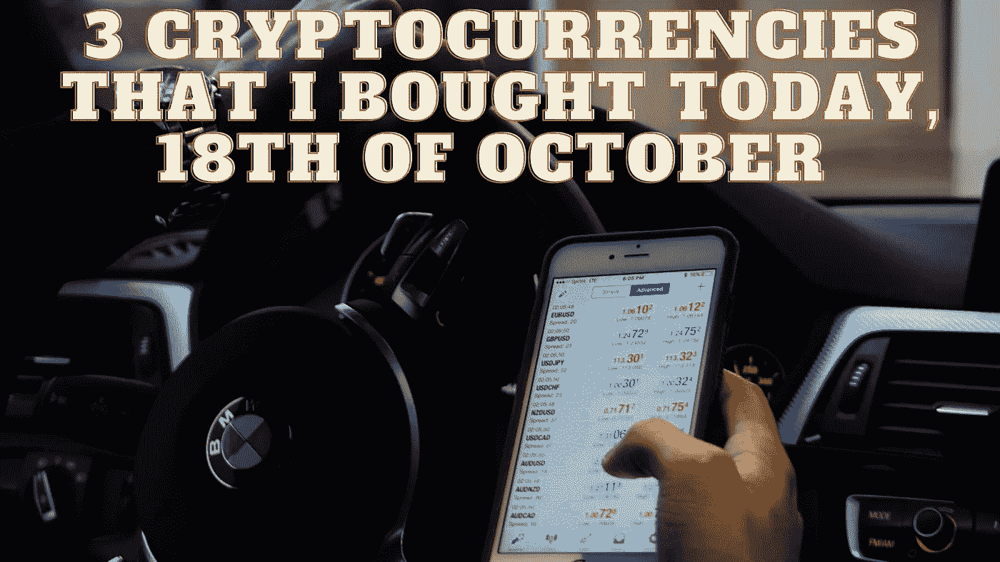

# 我今天买的 3 种加密货币，10 月 18 日

> 原文：<https://medium.com/coinmonks/3-cryptocurrencies-that-i-bought-today-18th-of-october-501919fb9ba?source=collection_archive---------27----------------------->

Source photo Unsplash.com

# 币安硬币(BNB)

领先的加密货币交易所之一币安接受币安硬币作为交易和费用的支付。自 2017 年推出以来，币安硬币(BNB)已经发展成为一种多功能的加密货币，在币安交易所以外也有应用。近年来，它已经扩展到包括预订旅行、处理付款和…