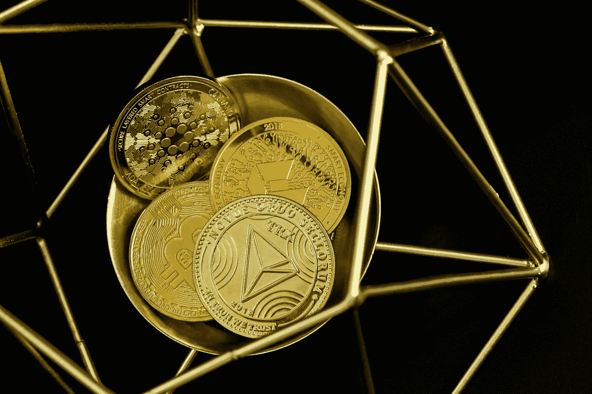

# 2022 年 12 月我认为被低估的 3 种加密货币

> 原文：<https://medium.com/coinmonks/3-cryptocurrencies-that-i-think-are-undervalued-in-december-2022-75afb944a7eb?source=collection_archive---------15----------------------->

Source photo [HD photo by Traxer (unsplash.com)](https://unsplash.com/photos/8TD991gibiQ)

# 比特币(BTC)

与其他数字货币相比，比特币的价格非常高。如果你在考虑购买比特币，很容易产生比特币被高估的感觉。然而，考虑到比特币过去的表现和未来的潜力，它被大大低估了。