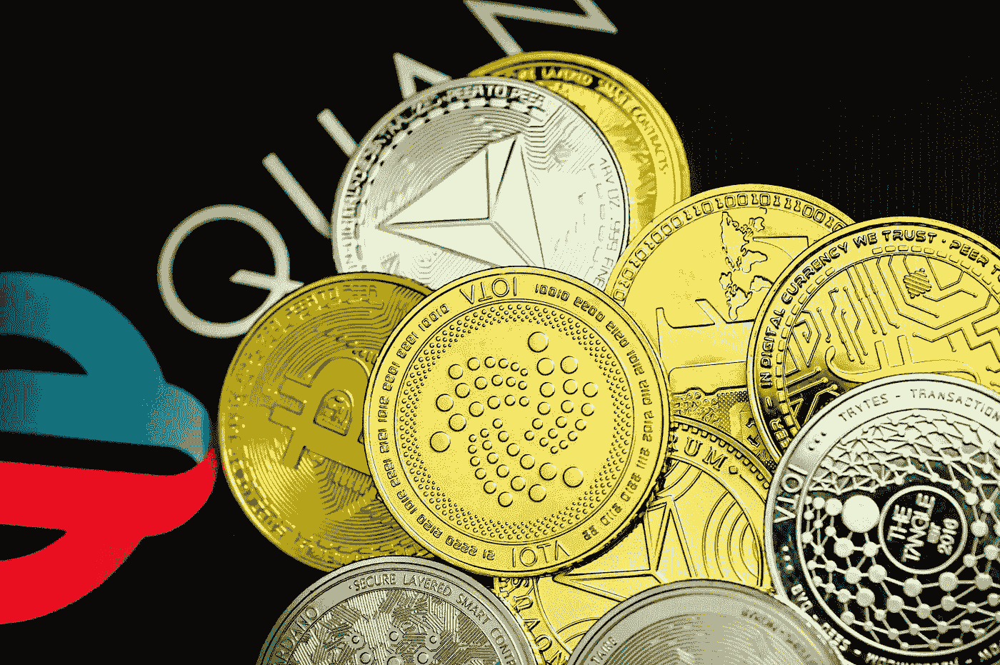

# 3 个 Cryptos 长期在 CoinMarketCap 排名前 30

> 原文：<https://medium.com/coinmonks/3-cryptos-in-the-top-30-on-coinmarketcap-for-the-long-hodl-e5fe9754f17d?source=collection_archive---------3----------------------->

Photo by [Traxer](https://unsplash.com/@traxer?utm_source=medium&utm_medium=referral) on [Unsplash](https://unsplash.com?utm_source=medium&utm_medium=referral)

M 当今市场上的任何投资者都有兴趣参与短期交易策略，以利用加密货币价格的大幅波动。

尽管如此，应对这个庞大市场的最佳方式是将资金投入到最好的长期加密货币中。

这样做将有助于你抵御市场波动，并采取更实用的方法长期投资加密货币。

讨论最有利可图的货币是困难的，因为这样做需要我们分析他们的潜力和到目前为止的进展。

不要忘记，它的价值可能会从一天到另一天发生剧烈变化；不断地把它包含在你的计算中。

先验地，一种货币可能有巨大的潜力，但这并不意味着它是无风险的，或者你会立即看到利用它的任何好处。

然而，我们目前掌握的数据显示，比特币尤其有利可图。

由于它是同类中的第一种，其特征被用作后续加密货币的模板。

正因为如此，长期投资被视为潜在的相当有利可图。

> 另请参见:[2023 年之前你应该考虑的 3 种加密技术](https://www.sammaiyaki.com/3-crypto-you-should-consider-ahead-of-2023-6fd8d679cb8d?source=user_profile---------4----------------------------)

# CoinMarketCap 排名前 30 位的密码:Uniswap UNI

**市值:4，554，319，790 美元**

**CMC 上的位置:** #21

当前价格价格: $5.98

[***有时被称为 DEX(去中心化交易平台)，Uniswap UNI***](https://coinmarketcap.com/currencies/uniswap/) 是一个前沿的去中心化交易平台。

它是用以太坊分布式账本技术建造的。

Uniswap 不是该市场中唯一提供服务的 DEX，但就客户群和日交易量而言，它是最繁忙的 DEX 之一。

使用 Uniswap 这样的 DEX，投资者可以直接将资金投入加密货币市场。

通过消除中间人的必要性，我们节省了时间和金钱。

这是可能的，因为自动做市商(AMM)方法，它依赖于高度安全的数字合同。

加密货币最成功的长期投资方法之一 Uniswap 着眼于分散交易的未来增长。

> 此外，请参见:[2022 年 7 月购买的 3 种最佳加密技术，以获得长期投资回报](https://www.sammaiyaki.com/3-best-crypto-to-buy-in-july-2022-for-long-term-roi-2939e21c21ec?source=user_profile---------23----------------------------)

# CoinMarketCap 排名前 30 的 Cryptos 第 2 名:Solana SOL

11，792，698，305 美元

**在 CMC 上的位置:** #9

**当前价格:** $33.31

考虑对[***Solana SOL***](https://coinmarketcap.com/currencies/solana/)的投资，这是我们 2022 年最佳长期加密货币投资名单上的下一个项目。

Solana 是一个开源的区块链平台，它促进了智能合同协议的使用。

它在一些人中赢得了 ***【以太坊黑仔】*** 的绰号。

然而，在大多数指标上，Solana 优于其主要竞争对手以太坊。

相比之下，以太坊每秒可以处理大约 16 笔交易，而 Solana 每秒可以处理大约 65000 笔交易。

即使索拉纳网络的交易费用几乎为零，以太坊的费用仍然昂贵。

如果你认为以太坊在智能合约业务中的主导地位不会永远持续下去，索拉纳可能是长期投资的最佳加密货币。

> 另请参见:[2022 年增长最快的 3 种加密货币](https://www.sammaiyaki.com/3-fastest-growing-cryptocurrency-in-2022-798db0f4b15b?source=user_profile---------32----------------------------)

# CoinMarketCap 排名前 30 的 Cryptos 第 3 名:币安硬币 BNB

4508 万美元

**在 CMC 上的位置:** #5

**当前价格:** $279.41

[***币安币，或称 BNB，***](https://coinmarketcap.com/currencies/bnb/) 是支持币安交易所的加密货币。

币安硬币是这种货币的最后一个名字。

由于这一发展，每天处理数十亿美元交易量的币安交易所的客户现在可以享受交易费用减少 25%的好处。

最重要的是，币安硬币(BNB)可能被用来支付币安智能链的交易成本。

像 Lucky Block 这样有很多承诺的首次加密货币初创公司已经开始选择上述网络。

因此，从长远来看，很有可能 BNB 需求将继续扩大，考虑到现在已有数百枚硬币在币安智能链上上市。

> 另外，请看:[2022 年 6 月及以后要密切关注的 3 个密码](https://www.sammaiyaki.com/3-cryptos-to-watch-closely-in-june-2022-and-beyond-1d83ebc29376?source=user_profile---------33----------------------------)

# 总结一下

我来总结一下对 [***基本注意力令牌的最后意见，缩写为 BAT***](https://coinmarketcap.com/currencies/basic-attention-token/) 。

从长远来看，这种加密货币是数字广告投资的最佳选择。

价值数十亿美元的数字广告业是预计将受到加密货币和区块链技术影响的另一个领域。

引领潮流的是基本的注意力标志及其固有的数字资产 BAT。英美烟草消除了对中介平台的需求，在企业和消费者之间建立了直接沟通。

如果你使用 BRAVE 浏览器，它使用基本的注意力令牌，你只会看到与你的需求相关的商品和服务的广告。

此外，用户获得 BAT 代币作为参与的报酬；这项服务由广告收入支撑。

因此，广告商可以检查他们的信息是否到达了正确的人手中。

> 另外，请参见:[现在长期投资的 3 种加密技术](https://www.sammaiyaki.com/3-crypto-to-invest-in-for-the-long-haul-now-91fafebe58c4?source=user_profile---------35----------------------------)

# 财务免责声明

请注意，本文中的信息应被视为投资或财务建议。

此内容代表作者个人观点，不应作为做出财务或投资选择的建议。

不保证所提供信息的准确性、完整性或可靠性；它“按原样”提供

比特币价格的异常波动导致了过去几个月的剧烈波动。

您投资加密货币的决定应根据并遵守任何适用的当地限制。

> 交易新手？尝试[加密交易机器人](/coinmonks/crypto-trading-bot-c2ffce8acb2a)或[复制交易](/coinmonks/top-10-crypto-copy-trading-platforms-for-beginners-d0c37c7d698c)