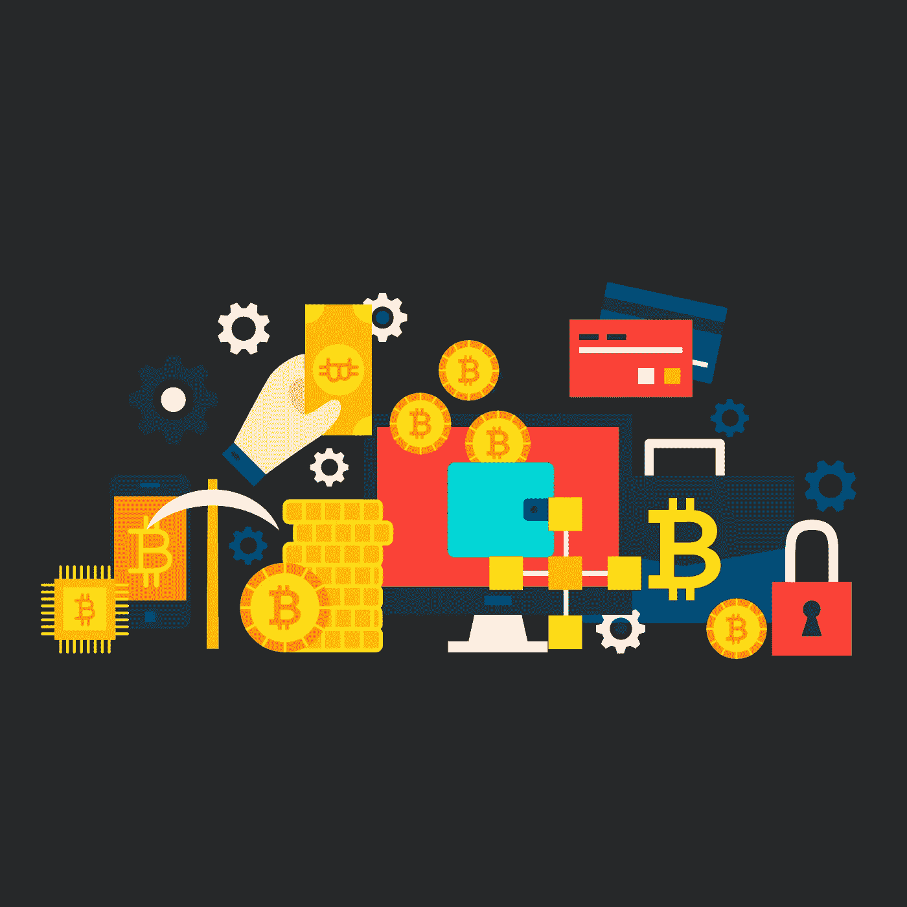

# 今天，11 月 9 日，我买了 3 个密码

> 原文：<https://medium.com/coinmonks/3-cryptos-that-i-bought-today-9th-of-november-f17f4f8ea203?source=collection_archive---------45----------------------->

Source photo [Bitcoin Money Cryptocurrency — Free vector graphic on Pixabay](https://pixabay.com/vectors/bitcoin-money-cryptocurrency-4851387/)

# 比特币(BTC)

比特币是有史以来第一种加密货币。它的价格和市场规模明显高于任何其他加密货币投资选择，因此不难看出它为什么是领先者。比特币是一种很好的投资加密货币，因为它被商家广泛接受。例如，Visa 接受比特币作为支付方式。