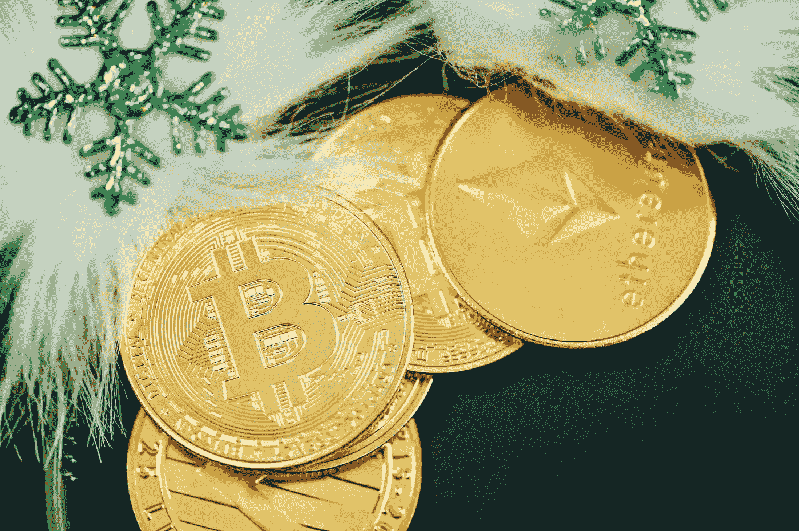

# 随着 12 月的临近，3 种隐密植物需要密切关注

> 原文：<https://medium.com/coinmonks/3-cryptos-to-keep-close-as-december-approaches-e9a77aef6cb7?source=collection_archive---------3----------------------->

Photo by [Traxer](https://unsplash.com/@traxer?utm_source=medium&utm_medium=referral) on [Unsplash](https://unsplash.com?utm_source=medium&utm_medium=referral)

无论如何想象，加密货币的估值都不是一件简单的事情。

在大多数情况下，如果没有现金流或高度投机的触发因素，为加密货币分配 ***【公允价值】*** 可能会很困难。

由此带来的直接后果是，大多数投资者并不积极寻求折价加密货币。

加密货币占据的领域已经出现了几种有趣的价值替代品。

投资者应该考虑这些加密货币。

投资者不会盲目投资，不管有问题的加密货币是被归类为钱包增长、活跃地址还是网络上的分散应用。

这是因为存在可用于精确评估这种加密货币价值的方法。

> **另外，请参见:** [您的投资组合中需要的 3 个加密硬币](https://www.sammaiyaki.com/3-crypto-coins-to-hodl-in-your-portfolio-8bbde2f18dcd?source=user_profile---------2----------------------------)

# 需要密切关注的密码№1: Qredo QRDO

市值:42131588 美元

**市值持仓** : #393

**现价**:0.2268 美元

**总供应量:** 186，172，044.31 人民币

这个项目的惊人增长确实证明了它在增加机构投资者对加密货币的敞口方面取得了成功。

要判断[***Qredo QRDO***](https://coinmarketcap.com/currencies/qredo/)是否会增加，投资者必须仔细观察关键的机构采纳指标随时间的变化。

作为该项目的结果，各机构将有机会获得分散监管和跨链结算服务。

如果你对安全数据加密或在区块链保存加密货币感兴趣，你可以这样做。

Qredo 对更有经验的玩家的吸引力源于它的多方计算基础。

也就是说，使用 Qredo，您可以评估交易，而不必提供有关参与方的任何识别细节。

任何考虑采用区块链技术的人都应该认真考虑 Qredo 项目，因为它在安全性和隐私方面都有好处。

在它的整个生命周期中，我计划监视处理的事务数量和存储在区块链中的总价值，以衡量它的成功。

> **另见:** [加密市场波动背后的 3 个原因](https://www.sammaiyaki.com/3-reasons-behind-crypto-markets-volatility-9c06876a63ca?source=user_profile---------3----------------------------)

# 保持密切联系的隐花植物№2:茄科植物 SOL

**市值:**:10650485832 美元

**市值排名** : #9

**当前价格**:29.80 美元

**总供应量:** 357，886，008.13 索尔

我仍然看好几项备受瞩目的努力，包括发展最快的加密货币之一[***Solana SOL***](https://coinmarketcap.com/currencies/solana/)。

我的信心很大程度上是基于 Solana 网络作为 DeFi 应用和 NFTs (NFTs)的主要基础设施的普遍使用。

交易量应该被认为是这个项目的一个重要标准。

尽管熊市环境非常惨淡，索拉纳的交易量在整个 5 月份大幅攀升，达到月度新高。

原因很简单:索拉纳的网络吸引了许多消费者，尤其是 NFT 行业的消费者。

索拉纳的价值遭受了重大打击，从历史高点下跌了 85%以上。

虽然 NFT 的某些指标在下降，但 Solana 与 NFT 相关的交易总数却在增加。

对于那些看好这个行业未来的人来说，索拉纳区块链仍然是最好的选择。

其他活动本身也可以被视为投资。

另一方面，那些想用比特币做更多事情的人可以探索索拉纳。

长期投资者可以放心地接受这个坚实而直接的概念。

> **另见:** [3 个有看涨倾向的 Cryptos 买入和 2022 年 10 月 Hodl](https://www.sammaiyaki.com/3-cryptos-with-bullish-tendencies-to-buy-and-hodl-in-october-2022-9ba470b6f032?source=user_profile---------1----------------------------)

# 需要密切关注的密码№3:猿猿

市值:1371431006 美元

**市值头寸** : #38

当前价格:4.48 美元

总供应量:306，875，000.00 澳元

[***APE coin APE***](https://coinmarketcap.com/currencies/apecoin-ape/)是今年又一个被很多人密切关注的 meme 币。

这个迷因令牌从三月份才出现；因此，它对市场来说是相当新的。

APE 最初以 1 美元一个令牌的价格发行，随后迅速升值，在短时间内达到 40 美元左右。

这在很大程度上与以下事实有关:这枚硬币与 Bored Ape 游艇俱乐部有关，该俱乐部是著名的 NFT 的设计者，继续获得异常高的价格(尽管不如其巅峰时期)(尽管不如其巅峰时期)。

对于 token 的早期投资者来说，价格保持在 5 美元以上是一个巨大的成功。

尽管如此，这种货币的早期投资者迄今为止已经获得了 400%的回报。

因此，许多人认为它是目前最可靠的迷因标志之一。

也许吧。尽管如此，从交易量和交易规模来看，对非金融交易的需求似乎没有以前那么强劲了。

我认为投资者在 NFT 投资时应保持谨慎，因为流入投机性更强的资产的资金减少了。

ApeCoin 背后可能有一些有用的东西，所以能够忍受一些短期波动的投资者可以考虑长期持有他们的硬币。

这是其他人都应该出售的加密货币之一。

> **另请参见:** [你的投资组合中应该有的 3 种下注密码](https://www.sammaiyaki.com/3-staking-cryptos-you-should-have-in-your-portfolio-3cf96b95d9e3?source=user_profile---------0----------------------------)

# 总结一下

从 SOL 与 NFT 市场直接相关的快速增长的交易量中可以得出一个简单而合理的投资论点。

ApeCoin 是今年许多人密切关注的另一个 meme coin 从长远来看，这种饱受打击的加密货币可能会因机构采用 QRDO 而受益。

> **另见:** [加密硬币对代币](https://www.sammaiyaki.com/crypto-coins-vs-tokens-93a633abab4?source=user_profile---------4----------------------------)

# 财务免责声明

本文涵盖的信息并不意味着提供也不代表交易、投资或金融建议。

它的唯一目的是获得信息、启发和娱乐。

强烈建议在没有首先研究和咨询认证经纪人或财务顾问的情况下，不要根据本网站的内容做出任何财务、投资、交易或其他决定。

您理解您必须评估本网站上或通过本网站提供的任何信息。

## 风险陈述

比特币和其他加密货币的交易有利有弊。交易并不适合每个人。任何考虑投资的人都应该听取专业人士的建议。

> 交易新手？尝试[加密交易机器人](/coinmonks/crypto-trading-bot-c2ffce8acb2a)或[复制交易](/coinmonks/top-10-crypto-copy-trading-platforms-for-beginners-d0c37c7d698c)