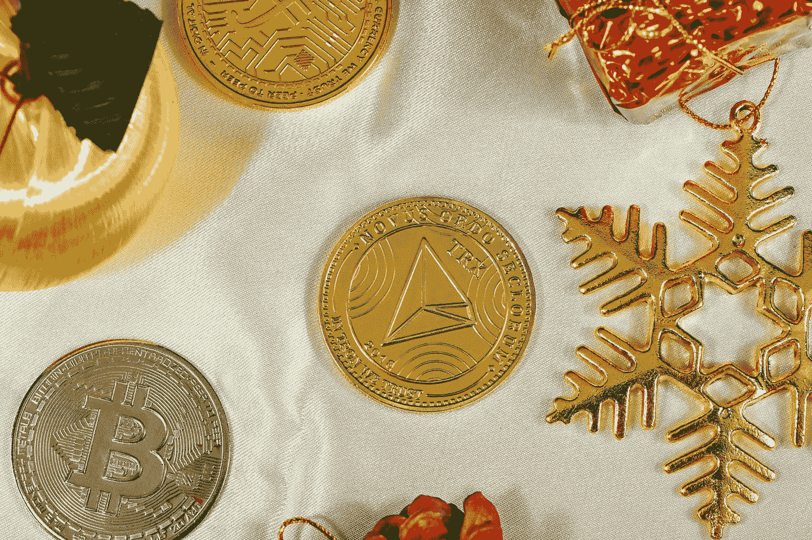

# 本周值得关注的 3 个密码

> 原文：<https://medium.com/coinmonks/3-cryptos-to-watch-this-week-c739edd85af8?source=collection_archive---------5----------------------->

Photo by [Traxer](https://unsplash.com/es/@traxer?utm_source=medium&utm_medium=referral) on [Unsplash](https://unsplash.com?utm_source=medium&utm_medium=referral)

加密货币现在大卖，这给了买家获利的最佳机会。

由于美联储通过提高利率来对抗通货膨胀的努力，股票市场大幅下跌。

这直接导致所有主要指数大幅下跌。

与股市损失相比，加密货币市场的损失要严重得多。

自 2022 年以来，超过 58%的加密货币市值已经丧失。

加密货币市场可以从这种更大程度的折扣中恢复过来，超过股票市场。

然而，现在购买的最佳加密货币必须相当安全，以保护投资者免受太大风险。

这里有 3 个本周值得关注的密码，它们有相当大的市值供你细读。

> **还有，看:** [有几块钱就买 3 个密码](https://www.sammaiyaki.com/3-cryptos-to-buy-if-you-have-a-few-dollars-e0300551c0e9?source=user_profile---------0----------------------------)

# 本周值得关注的密码№1:索拉纳·索尔

市值:11744839849 美元

**市值排名** : #10

**现价**:32.74 美元

**总供应量:** 358，775，444.85 索尔

在对比其他数字货币时，[***Solana SOL***](https://coinmarketcap.com/currencies/solana/)对于投资者来说是以太坊 ETH 很好的替代品。

索拉纳的交易费用远远少于以太坊。

以太坊的交易费是 9 美分，远远超过索拉纳不到万分之一便士的交易费。

完成一笔交易需要多长时间也是有争议的。Solana 每秒可以处理 3400 笔交易，而以太坊只能处理 15 笔。

因此，任何进行大量采购的人都应该利用索拉纳。

然而，以太坊是一个很好的选择，符合拥有两种加密货币。

直到今天，他们仍然是强有力的对手，谁也没有将对方淘汰出局。

> **亦见:** [三月来临之际要保持亲密的隐密关系](https://www.sammaiyaki.com/3-cryptos-to-keep-close-as-december-approaches-e9a77aef6cb7?source=user_profile---------1----------------------------)

# 本周值得关注的密码第二名:BNB·BNB

市值:52390966221 美元

**市值排名** : #4

当前价格:327.22 美元

总供应量: 159，978，368.51 BNB

就交易量而言，币安是最大的加密交易所。

这是一个相互关联的区块链的集合，渴望成为区块链工业事实上的支柱。

[***BNB BNB***](https://coinmarketcap.com/currencies/bnb/) 对投资者来说最耐人寻味的一点是，公司从 BNB 的交易中抽取一部分，定期烧掉。

通常情况下，BNB 交易都被浪费了。这应该会提高 BNB 的价格，因为流通中的数量会减少。

但币安的主要优势在于，它是世界上最大的加密货币交易所。随着越来越多的人使用密码，网络可以支持更多的贸易。反过来，这导致公司支付越来越多的账单。

简而言之，随着币安继续发展和增加其收费基础，BNB 的价值将攀升。

> **此外，请参见:** [你的投资组合中应该有的 3 种赌注密码](https://www.sammaiyaki.com/3-staking-cryptos-you-should-have-in-your-portfolio-3cf96b95d9e3?source=user_profile---------2----------------------------)

# 本周要看的密码№3:以太坊 ETH

市值:1.9127 亿美元

**市值排名** : #2

**现价**:1564.93 美元

**总供应量:** 122，373，863.50 ETH

*以太坊已经损失了大约三分之二的价值，这比 2022 年市场经历的损失要严重得多。*

*由于以太坊的大幅亏损，比特币现金可能是一个更优越的投资选择。*

*这是因为比特币现金会更容易快速回收。*

*最后，达成整合让以太坊能够突破目前的性能范围这一观点更加可信。*

*具体的变化包括用利害关系证明共识投票机制取代工作证明共识投票流程。*

*这意味着以太坊将不再需要一个庞大的计算机网络来“挖掘”以太，利用它们的综合处理能力来解决数学问题。*

*众所周知，采矿是高用电量和日益增长的生态担忧的主要原因。*

*相反，这笔钱将被分配给随机选择的投标人，作为 ETH 生成过程的一部分。*

*仍处于起步阶段的赌注法很有前途，但早期迹象表明，它不会在减少加密货币对环境的影响的同时减少集中化。*

*合并的直接结果可能是对 ETH 的需求增加，当人们利用他们的购买力来表达他们对社会和环境问题的想法时，这是值得注意的。*

> ***另见:**[2022 年 10 月 3 个有看涨倾向的 Cryptos 买入和 Hodl](https://www.sammaiyaki.com/3-cryptos-with-bullish-tendencies-to-buy-and-hodl-in-october-2022-9ba470b6f032?source=user_profile---------3----------------------------)*

# *总结一下*

*索拉纳在他的加密投资组合中占有相当大的份额，但两者都是很好的投资。*

*将你的部分资金投入到交易所最大的加密货币生态系统是明智的。*

*以太坊绿色升级的采用应该会增加对加密货币的长期需求。*

> ***另外，请看:** [3 个加密硬币到你的文件夹里](https://www.sammaiyaki.com/3-crypto-coins-to-hodl-in-your-portfolio-8bbde2f18dcd?source=user_profile---------4----------------------------)*

# *财务免责声明*

*本文无意提供或构成交易、投资或金融建议。它的唯一目的是教育、娱乐和告知读者。*

*强烈建议您在没有首先进行独立研究并与持牌经纪人或财务顾问交谈之前，不要根据本网站的材料做出任何财务、投资、交易或其他决定。*

*您同意您有责任评估在本网站上找到或通过本网站访问的材料。*

# *风险陈述*

*比特币和其他加密货币的交易有利有弊。交易只适合某些人。任何考虑投资的人都应该听取专业人士的建议。*

# *延伸阅读:*

*随着 12 月的临近，3 种隐密植物需要密切关注。[https://medium . com/coin monks/3-cryptos-to-keep-close-as-December-approach-e 9a 77 AEF 6 CB 7](/coinmonks/3-cryptos-to-keep-close-as-december-approaches-e9a77aef6cb7)*

> *交易新手？尝试[加密交易机器人](/coinmonks/crypto-trading-bot-c2ffce8acb2a)或[复制交易](/coinmonks/top-10-crypto-copy-trading-platforms-for-beginners-d0c37c7d698c)*