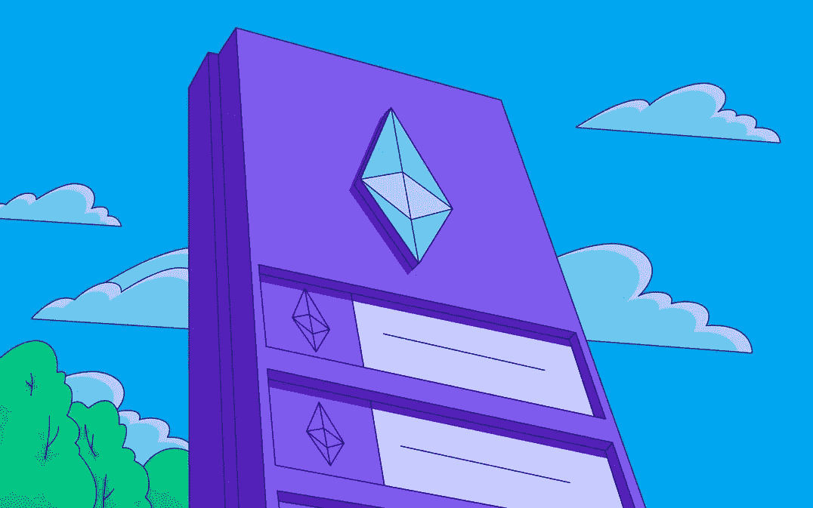

# #3 解码以太坊:为什么是气？

> 原文：<https://medium.com/coinmonks/3-decoding-ethereum-why-gas-8307b1081dd2?source=collection_archive---------45----------------------->

Image Credit: [Paxful Team](https://paxful.com/university/)

以太坊能够在称为以太坊虚拟机或 EVM 的状态机中执行智能合同，同时向内存读写数据，这使其成为一个图灵完全系统。简而言之，以太坊可以计算任何图灵机可以计算的任何算法，前提是有限内存的限制。

图灵完全性也是非常危险的，尤其是在公共区块链中，这是因为停机问题:一些问题可能要花很长时间才能完成&可能会使整个系统“停止”。现代打印机是图灵完成，可以给文件打印，使他们进入冻结状态。考虑到安全和资源管理的问题，我们不希望类似的事情发生在以太网上。一个“冻结”的打印机可以关闭并再次打开，而不是一个公共的区块链！

我们无法预先预测一个程序是否会终止。换句话说，我们不能在不运行程序的情况下预测它的路径；并且可能会在没有警告的情况下出现意外的无限循环。

**挑战来了:**每个参与节点(客户端)都必须验证每个事务，运行它调用的任何智能契约。但是以太坊无法预测智能合约是否会终止，或者会运行多长时间，除非实际运行它(它可能会永远运行下去)。

为了应对这一挑战，以太坊引入了一种叫做*气体*的计量机制。当 EVM 加载并执行契约时，它会仔细考虑每条指令(计算、数据访问等)。).每条指令都有一个以气体为单位的预定义成本。举个例子，

*   两个数相加= 3 气体
*   计算 keccack-256 哈希= 30 + 6(对于每 256 个 vit 的被哈希的数据)
*   发送一笔交易= 21，000 汽油

当事务调用智能合约的功能时，它必须包括燃气限制，即执行智能合约时可以消耗的最大燃气量。如果目前消耗的气体超过气体限制，EVM 将终止执行。

把 gas 想象成资源的“货币”，以太坊允许图灵完全计算，同时限制任何程序可以消耗的资源。

在下一篇博客中，我将解释以太坊账户。敬请关注。

> 交易新手？试试[密码交易机器人](/coinmonks/crypto-trading-bot-c2ffce8acb2a)或[复制交易](/coinmonks/top-10-crypto-copy-trading-platforms-for-beginners-d0c37c7d698c)