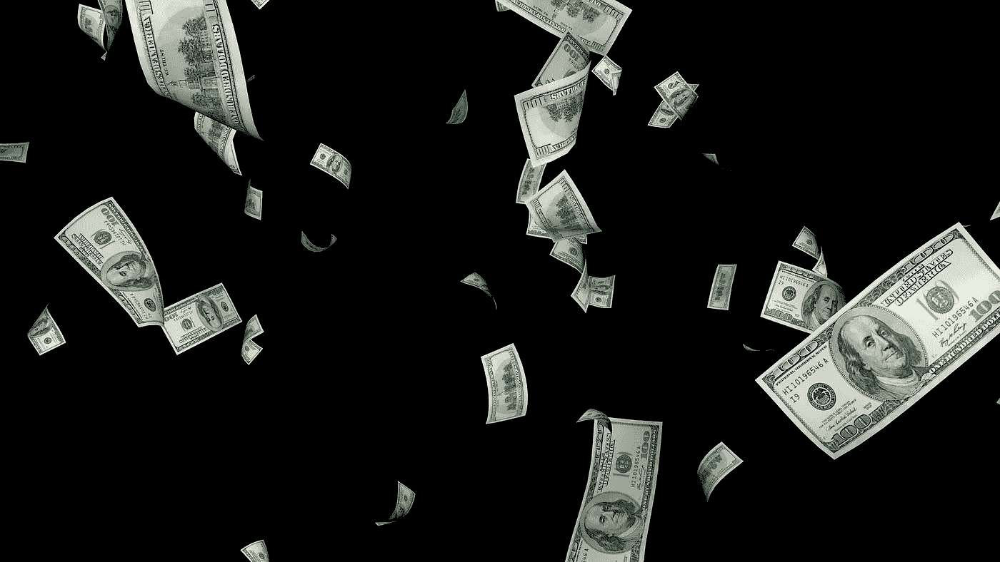

# 今天，11 月 23 日，我买了 3 支分红股票

> 原文：<https://medium.com/coinmonks/3-dividend-stocks-that-i-bought-today-23th-of-november-356b093b8a9b?source=collection_archive---------19----------------------->

Source photo [Bancnote Bancnotă Valută — Imagine gratuită pe Pixabay](https://pixabay.com/ro/illustrations/bancnote-bancnot%c4%83-valut%c4%83-dolari-6688554/)

# 雪佛龙(CVX)

自从中期选举以来，主要的石油和天然气公司雪佛龙(纽约证券交易所代码:CVX)的股价已经下跌。投资者目前没有理由担心，因为即使是适度的监管变化也不太可能对大型能源公司的利润产生实质性影响。