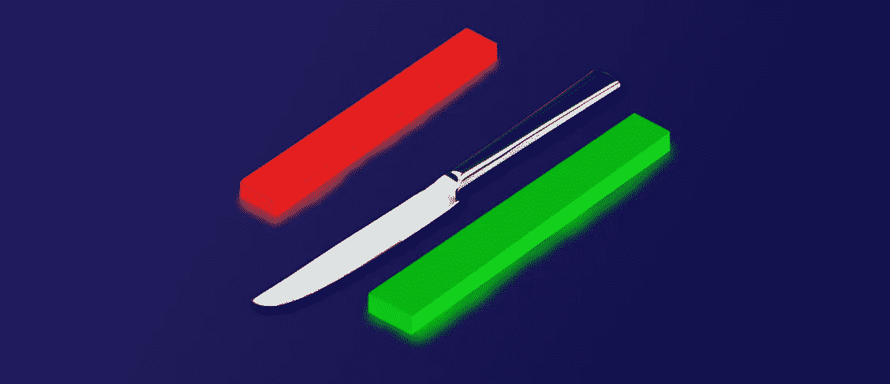

# 3 种有效的方法在密码中接住落下的刀

> 原文：<https://medium.com/coinmonks/3-effective-ways-to-catch-a-falling-knife-in-crypto-1789f061f915?source=collection_archive---------36----------------------->

3 Effective Ways to Catch a Falling Knife in Crypto

用专业术语来说，接住掉下来的刀指的是买入正在快速抛售的加密货币。价格的急剧下跌使这种交易策略风险很大，但同时，如果操作正确，它可以产生巨大的回报。

# 什么是 Crypto 中的落刀？

在金融行业，下跌的刀是股票/密码或任何其他资产，一直处于强劲的下跌趋势，交易处于新低。

这个类比来自于这样一个事实，即很难抓住一把掉下来的刀而不受伤。同样的概念也适用于加密货币。

如果你想在底部购买加密货币，下面是 3 条需要遵守的规则。

# 规则 1:暂时的逆风或结构性问题

第一条规则是看整体市场趋势，分析抛售是因为暂时的逆风，还是有结构性问题。例如，由于 2021 年 5 月中国的加密开采禁令而导致的比特币抛售是一种暂时的逆风。

比特币的快速抛售是短暂的，加密货币在那一天正好触底。因此，在这种情况下购买一把下落的刀是明智之举。

# 规则 2:人群往往反应过度

短期内，当市场出现过度反应时，我们往往会反弹。诺贝尔经济学奖得主理查德·塞勒指出，从长远来看，如果我们承担更高的风险，就会获得更高的回报。

# 规则 3:缩短时间框架

最后，确保你把时间框架降低到日内图表，以便更好地了解价格何时会反转。

确定反转时间的一个简单方法是等待最后一波下跌，通常是一根大蜡烛和一根大蜡烛，然后是反转最近抛售压力的确认蜡烛。

# 掉刀能有多大风险？

抓住下跌的刀是非常冒险的，因为如果你在错误的时间买入，你会陷入恶性循环。

随着价格不断下降，你不断购买更多，因为你认为价格不能再低了。但最终，你只剩下一大包密码，而且价格越来越低。

如果你不能处理掉刀的精神压力，那么你最好不要接住它。

# 落刀和长钉的区别

峰值是一个急剧上升的趋势，通常是由一个强有力的催化剂引起的。峰值也可能是由于意外事件导致的下跌。

上涨和下跌之间的区别在于，上涨是由于市场事件引起的突然变动，而下跌是由于基本面不佳引起的长期下跌。例如，[比特币从 20k 美元到 3k 美元的走势](https://cointelegraph.com/news/crypto-traders-explain-what-caused-the-bitcoin-price-plunge-to-3-000)就是一把落下的刀。

# 摘要

底线是，当你看到大幅下跌时，通常是折价购买加密货币的机会。但一定要遵循上述规则，避免过早买掉刀。最重要的是，如果你不能承受精神压力，就不要买坠落的刀。

*最初发表于*[T5【https://www.cryptohopper.com】](https://www.cryptohopper.com/blog/6334-3-effective-ways-to-catch-a-falling-knife-in-crypto)*。*

> 交易新手？尝试[加密交易机器人](/coinmonks/crypto-trading-bot-c2ffce8acb2a)或[复制交易](/coinmonks/top-10-crypto-copy-trading-platforms-for-beginners-d0c37c7d698c)