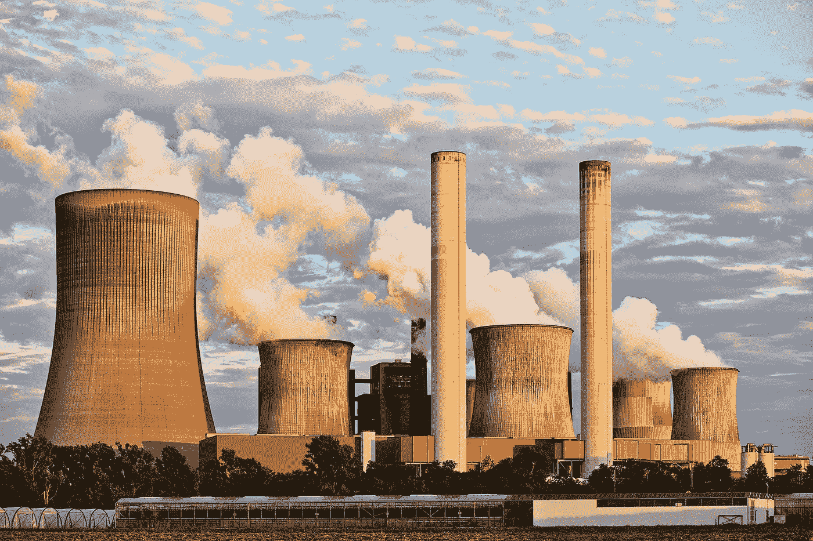

# 今天，2022 年 12 月 30 日，我们分析了 3 只能源股

> 原文：<https://medium.com/coinmonks/3-energy-stocks-that-we-analyse-today-30th-of-december-2022-bf33fd3c396c?source=collection_archive---------37----------------------->

Source photo [Landscape Photography of Factory · Free Stock Photo (pexels.com)](https://www.pexels.com/photo/air-air-pollution-chimney-clouds-459728/)

# 康菲石油公司

2023 年一只有希望的能源股是康菲石油公司。这家石油公司的净利润在 2022 年第三季度几乎翻了一番，为该公司的辉煌一年画上了句号。杰出的管理选择、谨慎的预算和高涨的化石燃料市场都促成了显著的财务成果。