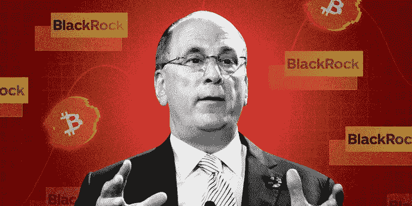

# 贝莱德首席执行官和我都认同的 3 个市场预测

> 原文：<https://medium.com/coinmonks/3-market-predictions-on-which-blackrocks-ceo-and-i-agree-1612b7e0a23?source=collection_archive---------19----------------------->

贝莱德首席执行官拉里·芬克在《纽约时报》DealBook 活动上表示，证券的令牌化将是下一代市场。

在区块链上创建项目的数字表示并验证其所有权和交易历史的过程称为令牌化。

这种策略提供了一种不同的方式来交易股票、债券、房地产等资产，甚至是艺术品等非传统资产，使交易变得透明可信。

我和他有相似的想法，似乎其他球员也有长期的想法。根据我与一些项目负责人的交谈，几乎任何东西的令牌化都可能导致下一波加密的采用。

**即时结算和降低费用**

拉里的观点是:令牌化将提供即时结算并降低费用。但是，尽管有这些优势，他补充说，开发这种类型的技术不会破坏贝莱德的商业模式。*“想想债券和股票的即时清算，没有中介机构，我们将大幅降低利率。”*

乔的观点:我坚信在未来，大多数市场不需要一个中央实体来统治。通过区块链技术的发展，分散平台将激增并获得更多采用，当前的传统玩家将不得不降低费用并提供更好的用户体验以保持竞争力。

**令牌化证券是下一代市场**

拉里的观点:他提到下一代市场将是证券的令牌化。

乔的观点:在未来十年，我们将会看到新市场的出现，其中一些是我们多年前没有想到的:

*   公司将一定比例的股份象征性地用于筹集资本；
*   可收集项目的权利被标记以在低流动性市场中产生流动性；
*   音乐版权象征性地加速了音乐家的职业生涯，与他的粉丝建立了联系；
*   电影版权被令牌化，允许投资者分享制作利润；
*   影响者将他们的资产(渠道、页面)令牌化，筹集资本，并投资于他们的增长，同时与社区分享这种增长。

世界各地的任何投资者都可以选择过多的另类投资。那些被令牌化的资产也将有更快增长的空间。随着不同投资渠道的民主化，对它们的需求自然会激增。

当前的加密项目很可能在未来消失

Larry 的观点:他还提出，虽然未来在于符号化，但大多数现有的项目在“未来”都不会存在。FTX 的致命缺陷是创造自己的令牌。

乔的观点:人们在每次牛市后都被炒作，事实是大多数项目的象征经济学一点也不强大。交换令牌几乎没有任何用处，实际上，大多数项目都有相同简化模型的无用令牌。

**结束语**

不仅拉里和我对市场有这些想法。摩根大通在新加坡的一项试验中，使用 Polygon 通过该行开发的私人区块链 Onyx Digital Assets 交易令牌化的现金存款。像 [Jupiter Exchange](https://bgqde.clicks.mlsend.com/te/cl/eyJ2Ijoie1wiYVwiOjQ1NTI1LFwibFwiOjc0Mzk5MDA4OTI5MzUwNzU5LFwiclwiOjc0Mzk5MDEwNTg2MTAxNDMxfSIsInMiOiI0Y2M1Mjk5N2M3OWQ1MmE3In0) 这样的公司也走上了标记替代资产和创造新市场的道路。我们对市场的看法能否实现只是时间问题。

[*乔罗伯特*](https://joerobert.com/) *现任罗伯特风险投资公司首席执行官，拥有超过 20 年的资产管理经验。自创办以来，乔已经为投资者创造了可预见的两位数回报。Joe 已经投资了股权和代币的种子轮，以及比特币、以太坊和其他顶级加密货币的投资组合。*

# 如果您是合格投资者，并想了解更多关于我们产品的信息，请联系我们。

> *交易新手？试试* [*密码交易机器人*](/coinmonks/crypto-trading-bot-c2ffce8acb2a) *或* [*复制交易*](/coinmonks/top-10-crypto-copy-trading-platforms-for-beginners-d0c37c7d698c)
> 
> *分散加密持股，了解一下* [*币安的替代品*](https://coincodecap.com/binance-alternatives)
> 
> *加入 Coinmonks* [*电报频道*](https://t.me/coincodecap) *和* [*Youtube 频道*](https://www.youtube.com/c/coinmonks/videos) *获取每日* [*加密新闻*](http://coincodecap.com/)

# 另外，阅读

*   [复制交易](/coinmonks/top-10-crypto-copy-trading-platforms-for-beginners-d0c37c7d698c) | [加密税务软件](/coinmonks/crypto-tax-software-ed4b4810e338)
*   [电网交易](https://coincodecap.com/grid-trading) | [加密硬件钱包](/coinmonks/the-best-cryptocurrency-hardware-wallets-of-2020-e28b1c124069)
*   [密码电报信号](/coinmonks/top-3-telegram-channels-for-crypto-traders-in-2021-8385f4411ff4) | [密码交易机器人](/coinmonks/crypto-trading-bot-c2ffce8acb2a)
*   [最佳加密交易所](/coinmonks/crypto-exchange-dd2f9d6f3769) | [印度最佳加密交易所](/coinmonks/bitcoin-exchange-in-india-7f1fe79715c9)
*   [面向开发人员的最佳加密 API](/coinmonks/best-crypto-apis-for-developers-5efe3a597a9f)
*   最佳[密码借贷平台](/coinmonks/top-5-crypto-lending-platforms-in-2020-that-you-need-to-know-a1b675cec3fa)
*   [免费加密信号](/coinmonks/free-crypto-signals-48b25e61a8da) | [加密交易机器人](/coinmonks/crypto-trading-bot-c2ffce8acb2a)
*   杠杆代币的终极指南