# 三分钟。每周市场情绪总结—8 月 20 日

> 原文：<https://medium.com/coinmonks/3-min-weekly-market-sentiment-wrap-up-august-20th-6fdbdff6efb5?source=collection_archive---------21----------------------->

有时，朋友、客户、社交媒体上的关系会向我咨询如何交易。大多数人没有意识到，与真正了解世界经济的非常聪明的人相反，我的观点不是基于信念。真的，我的分析只是从与那些聪明人的谈话中收集来的，然后我只是鹦鹉学舌。

我认为——希望——还是有价值的。这是一种本能的聚合，我会发现反复出现的主题、普遍情绪、利用某种动态进行的交易。

缺乏强烈的偏见也许是最好的事情。没有依恋，没有自我，只是对我尊敬的人告诉我的事情持开放态度。

不过，澄清并重申，我甚至没有交易市场，我只是观察并停留在回调时积累的顽固的买入并持有投资者。

当前的市场充满了不确定性。不是从 2022 年上半年开始的对未来的不确定性，那时人们回归现金并出售风险资产。不。现在人们不确定他们持有的风险资产，也不确定他们持有的现金。FUD 和 FOMO 混在一起了。

有哪些给双方火上浇油的叙事？

看涨:投资者不再害怕通货膨胀。它一直在上升，但似乎没有上升太多。它本质上很高，但大多数人认为它已经见顶或正在见顶的过程中。虽然由于经济衰退，这可能不是不确定的，但通胀下降可以缓解美联储不断加息给股市带来的压力。因此，如果我们认为美联储将从鹰派转向鸽派，我们可以再次购买风险资产。当然，仍有俄罗斯-乌克兰问题，仍有供应链问题，仍有中国的零补贴政策，仍有商品/食品问题，这些问题将在一段时间内影响我们的生活，但所有这些都已经反映在价格中了。最好先投资，然后再错过。

看跌:今年早些时候，经济中的一些基本问题已经反映在价格中，即需要很长时间才能应对的不出意料的通胀上升，以及更意想不到的俄罗斯-乌克兰战争，这场战争将以我们无法想象的方式堵塞全球供应链。从货币贬值，到商业协议、贸易路线、化肥和食品以及石油和天然气从一个大国转移到另一个大国，当我们准备迎接冬季的几个月时，世界陷入了彻底的混乱。投资者误解了美联储的重点，美联储的重点是抗击通胀，而不是帮助华尔街，而是要花多长时间才能控制住通胀。美中紧张关系于事无补。最后，在经济衰退时购买风险，因为这可能对通胀产生“积极”影响的想法是愚蠢的。

…你认为会有这样或那样的偏见吗？你在这里找不到。

我从每天与我交谈的老练玩家那里收集到的一件事(尽管我真正关注的是加密)是，希望牛市直线反弹至历史高点的散户投资者正在让自己失望。

大多数人似乎可以说的一件事是:我们可能已经触底了。

这并不是说我们不能回落，重新测试，甚至进一步下跌。或者我们不会降到那么低。但我们会触及接近长期低点的东西的想法在概率上是可以理解的。

大多数基金和大型投资者也以长期眼光看待我们的市场。许多零售业的人都在问‘是这样吗？’、‘我是否应该再次买入’，等着看下周会如何发展……啊，这不是建立长期财富或稳定投资组合的方式。这种感觉实际上是我们对波动性的研究还没有结束，或者说我们还没有找到解决方案。我们至少要等到 2023 年初才能找到明确的出路……如果我们真的要在那时走出困境的话。

我的看法——基于零数据——是我们将经历一个不寻常的时期。我在以前的博客文章中谈到过这一点:过去 14 年宽松的货币环境造就了一代习惯于 V 型底部(快速下跌，但同样快速复苏)的投资者；但环境已经发生了相当大的变化，仍然有大量的资金，但供应正在减少，而不是增加。本质上，现金变得不容易，投资者会更加谨慎地投资。

因此，我预计会出现一种痛苦而持久的横盘行情。这将考验投资者的耐心。

在 3 月至 5 月，面对顽固的多头，我用看跌的偏见进行了沟通。在 6 月至 7 月，我传达了我谨慎的看涨倾向，或者至少是在面对周围压倒性悲观情绪的情况下，对积累持开放态度。今天，我试图分享一个谨慎的观点，即事情并不总是像上涨或下跌那样二元的——市场也可能横向移动，这可能比典型的投资者或交易者预期的更痛苦，更具破坏性。

但是“密码呢？”我听到你在叫嚣。一样。我真的认为我们不应该用去相关来欺骗自己。虽然从长期来看，我仍然强烈相信 BTC 和加密的不相关属性，但在短期和当前环境下，它是货币供应和宏观市场情绪的代表。这很可惜，因为它的价值要大得多。但这是一个纯粹的投机性价格行为，因此与投资者的策略和情绪有关，尤其是在越来越多的人和越来越复杂的团体进行加密交易的情况下。

你是否认为看跌是等待更长时间的理由，而不是在 17.8K 买入 BTC？如果你这样想，我几乎可以保证你会错过底部。对于长期投资者来说，这是一个很好的买入价格，而且可能再次成为一个很好的买入价格。你还记得看着 60 年代中期的 BTC，想着“当比特币回到 50 年代时，你肯定会买”……你现在在哪里，你的信念和热情在哪里？如果它已经消失了，你是被动的，而不是主动的，所以阿尔法的大部分不会属于你。你将被谴责为跟随者，因为某些原因总是迟到。

股票市场是一个把钱从没有耐心的人身上转移到有耐心的人身上的工具沃伦·巴菲特…当然他也在谈论加密，对吗？对吗？

也许我敢说的一件事——一个朋友最近分享的概念——是事情发生或展开的速度比以前快得多。因此，当我谈论更痛苦的市场或横向市场时，我不是在谈论失去的十年的情况，可能只是在六个月到两年之间。有趣的是，它可能与之前 BTC 市场周期的时间线一致，从顶部到周期性底部，然后横向进入新的(减半后)反弹；如果我们要重复以前的周期，那确实还需要一段时间。

我绝对喜欢图表。他们是如此，嗯，可视化！它们可以将整个情况概括在一个清晰的层次或指标中。下面是一个图表转储:

— — — — ->>>>

下面是我最近最喜欢的图表，显示了比特币区块链上，硬币从年轻/弱手到年长/稳定手的转变。你是哪一个？你想站在哪一边？

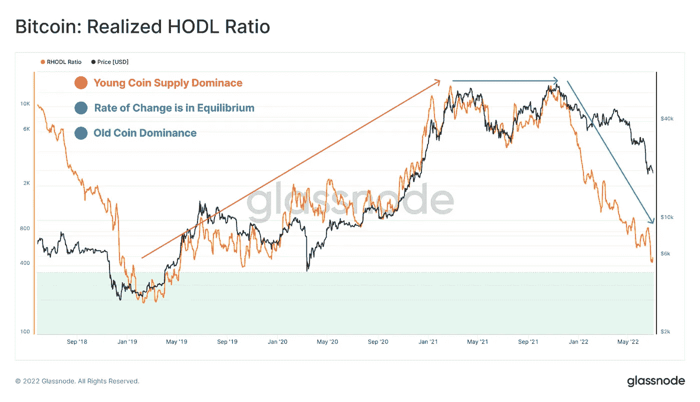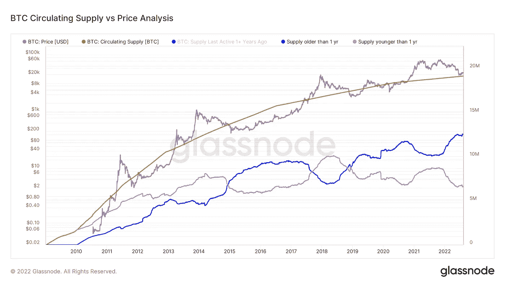

这是一个关于瑞士联邦理工学院合并的美丽迷因，也是许多投资者对这一事件的误解。网络是安全的——但是你也可以理解为“受控的”——通过验证器。这些验证者在一定程度上是一些相当大的中央集权实体，它们非常有影响力，或者可能有与监管者一致的激励，而不是投资者认为他们正在购买的自由主义和自由放任主义意识形态。我自己持有大量 ETH 股票，所以我不看跌，只是说一些人可能会戴着玫瑰色眼镜买入。

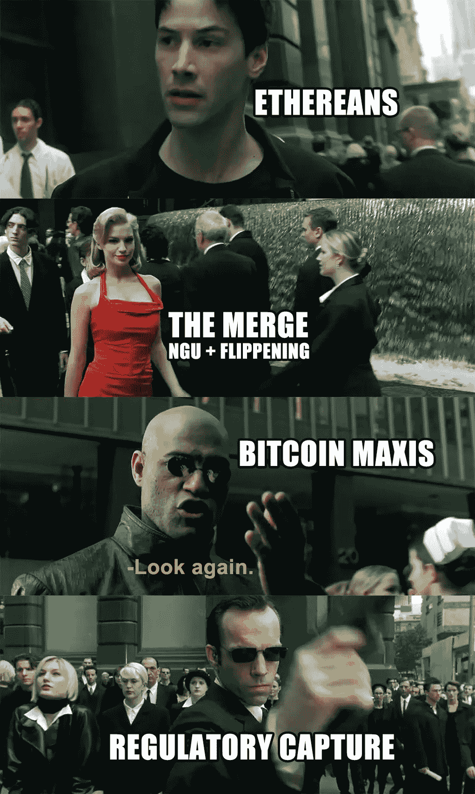

下图显示了债券市场的预期，债券市场通常被认为是更复杂和可靠的市场，美联储不仅会放缓加息，而且会开始降息。

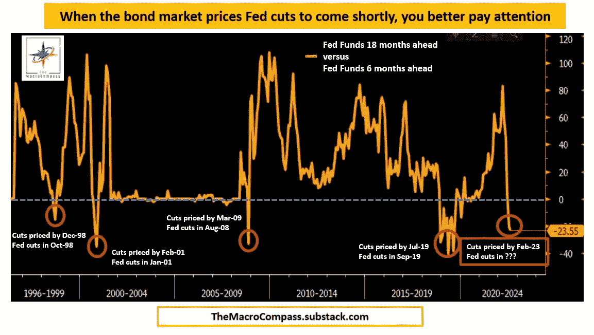

这张图表——等等，实际上是三张图表——也在某种程度上告诉你，在当前价格买入，为什么可能不是绝对低点，可能是……不是……最糟糕的主意？我至少一直在买。

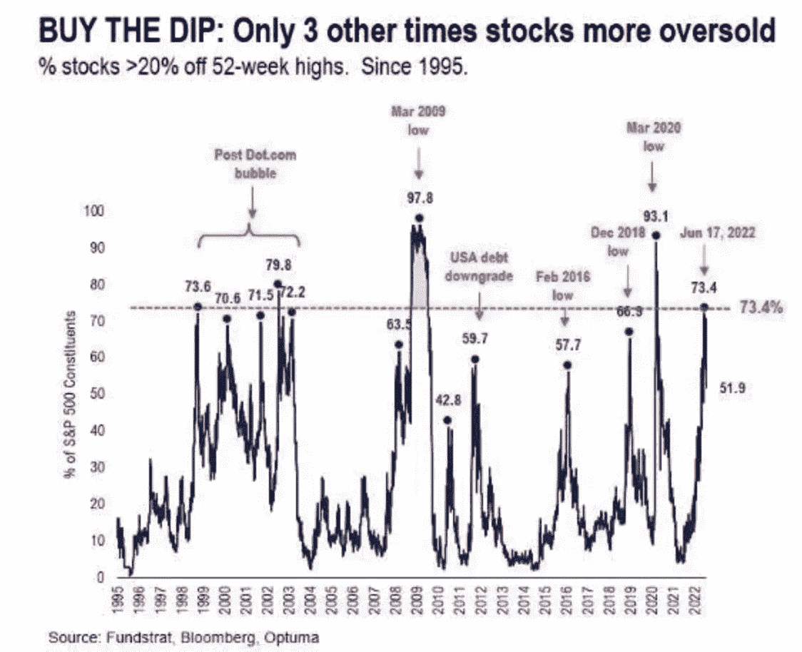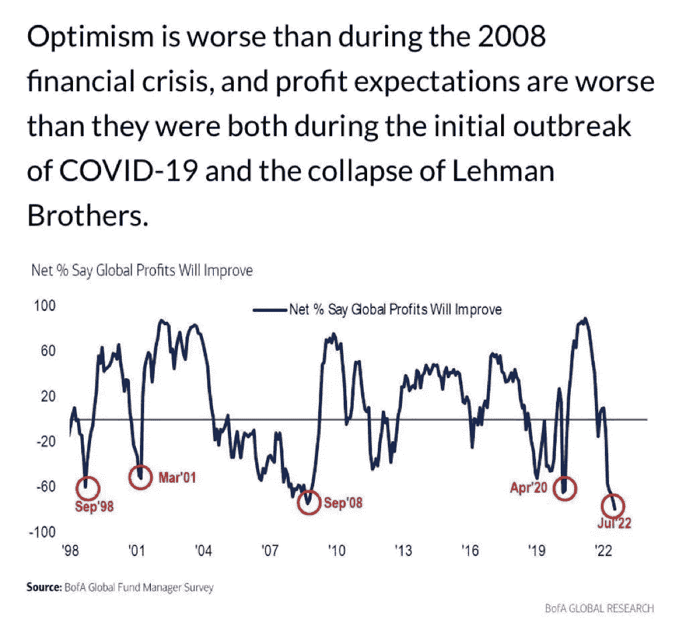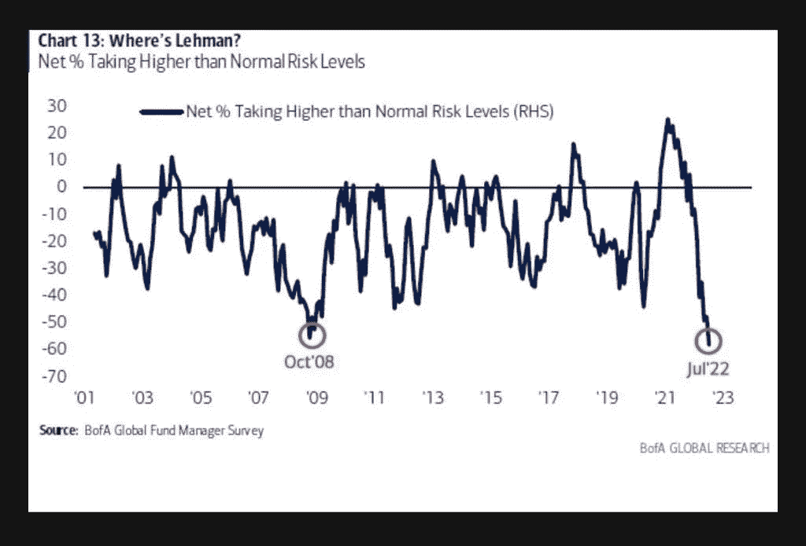

下面是法国疯狂的、绝对暴涨的电价。

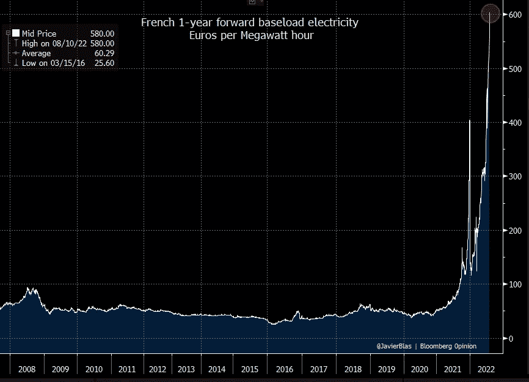

这是德国准备在这个冬天变得更加贫穷和寒冷。只是一个前所未见的同比通胀水平。精神错乱。欧洲现在看起来并不乐观。

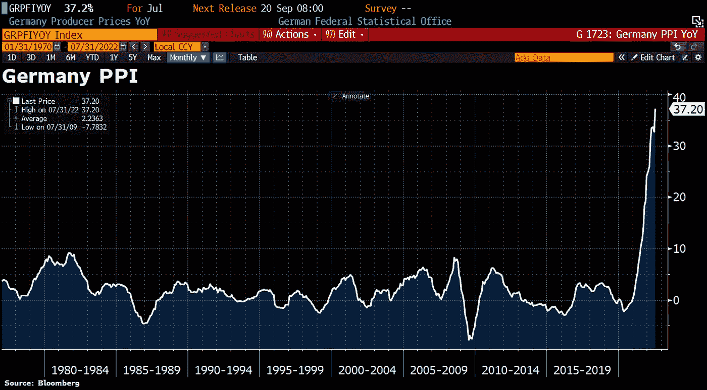

为了应对通货膨胀的阴霾和厄运，美国公司的定价似乎表明价格将很快下降。通货膨胀似乎总是遵循这个标准。因此，除非美国公司在他们的计划上撒谎，否则我们可能很快就会看到通胀率下降。

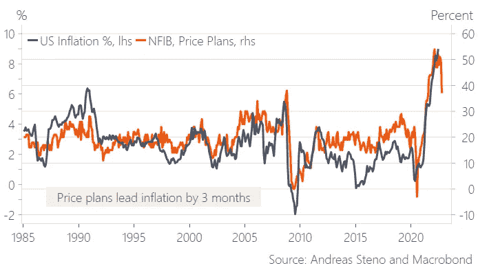

这里有一些东西应该让你至少投入一些现金到加密市场。为什么？因为你可能会领先一些财大气粗的大型投资者，他们正准备将所有资金投入区块链、web3、DeFi……不管你怎么称呼它。

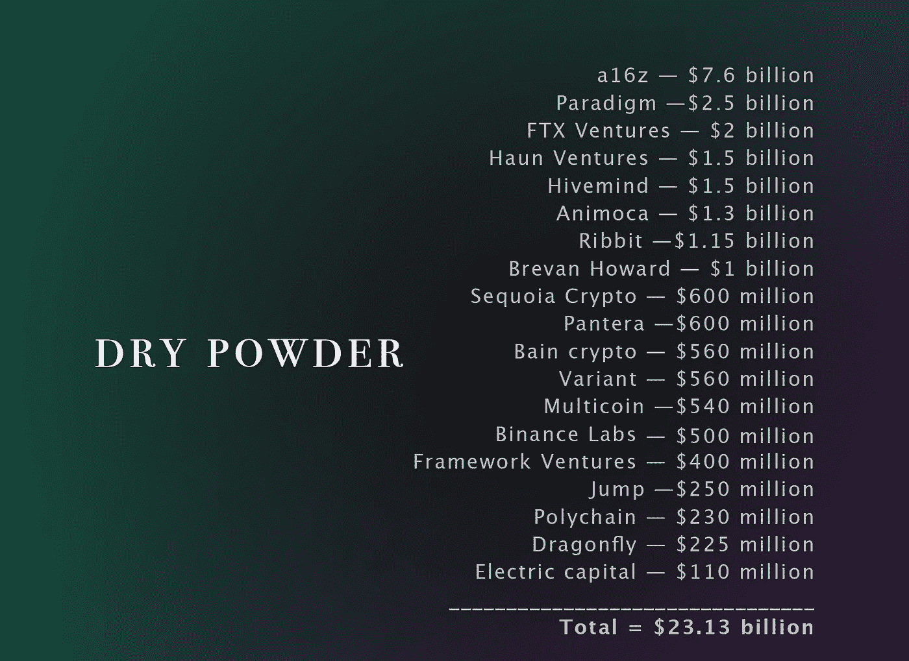

下面显示了 ETH 和净未实现利润/损失，表明 1000 点基本上是绝对投降水平-但我们可以在上涨前投降几次吗？

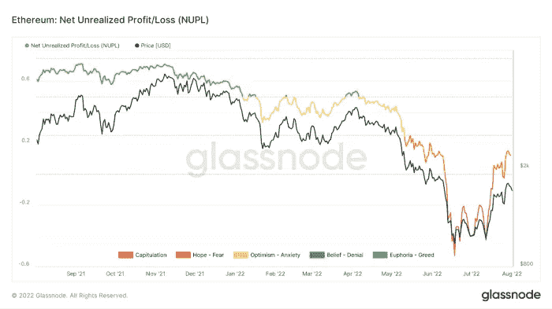

还有这个，我真的很喜欢 Pi 周期指标，它看起来很有趣，还有 RSI 指标(我通常只在出现背离时使用，但在周线上，它可能是一个很好的底部指标)。

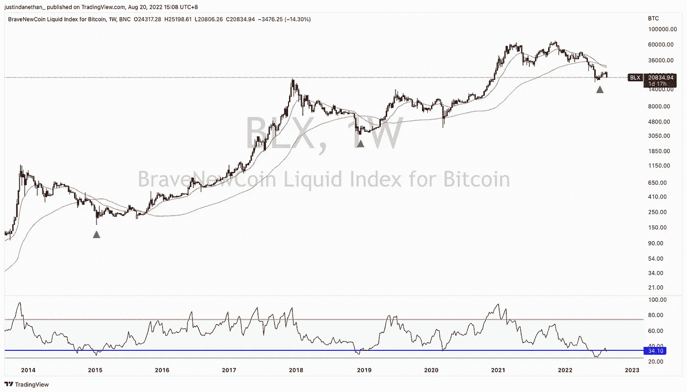

这是一个采用曲线图，你可以在右下角看到 BTC。取决于你是否认为这只是一种时尚或是通向未来的道路。

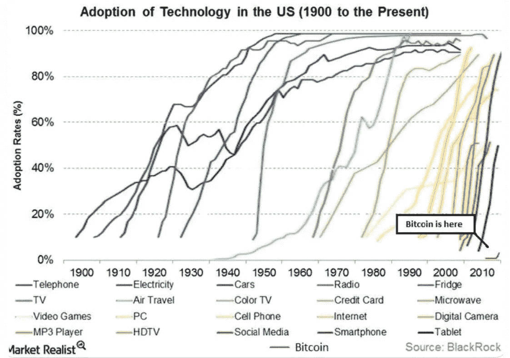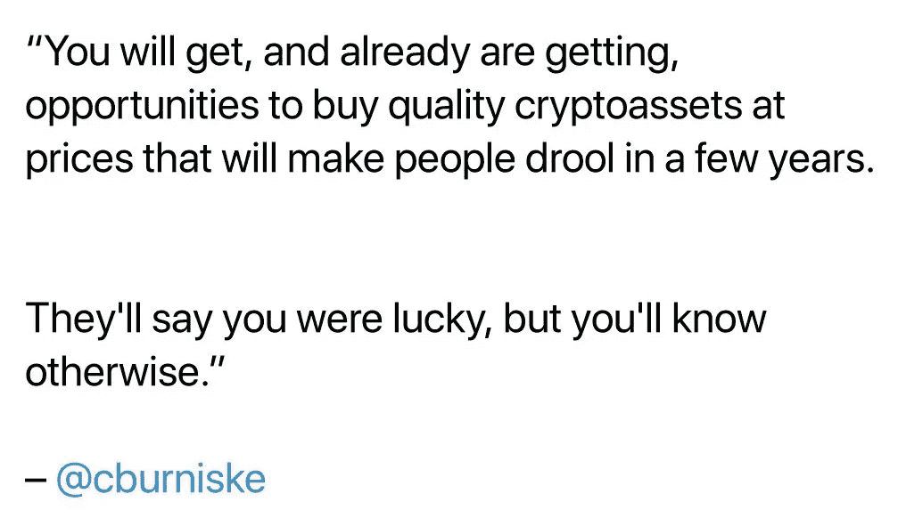

> 交易新手？试试[加密交易机器人](/coinmonks/crypto-trading-bot-c2ffce8acb2a)或者[复制交易](/coinmonks/top-10-crypto-copy-trading-platforms-for-beginners-d0c37c7d698c)