# 三分钟。每周市场情绪总结—7 月 9 日

> 原文：<https://medium.com/coinmonks/3-min-weekly-market-sentiment-wrap-up-july-9th-2c7abfa21f8e?source=collection_archive---------13----------------------->

有一种乐观情绪正在出现，几乎具有传染性。人们已经持续看跌很长时间了(尤其是在经历了十年的只涨不跌和短暂的回撤之后)。

我还没有被说服，但也很高兴，对可能陷入谷底的可能性持开放态度。

不过，这种动态很奇怪。对于长期关注市场的人来说，你会认识到坏消息可能带来的乐观情绪……因为坏消息可能允许或迫使(取决于时间)央行暂停加息，甚至逆转加息。可能导致这种情况发生的是经济衰退…所以自然你会在经济衰退时购买，对吗？

简单来说:

*   Covid 和对全球经济的担忧促使各国央行降低利率，向金融体系注入现金，有时是直接将现金存入消费者的银行账户。
*   购买力随时增加，推动人们消费。
*   与此同时，全球供应链和生产问题推高了价格。
*   随着人们拥有现金和价格进一步上涨，需求不会停止。
*   中央银行开始关注通货膨胀，并开始提高利率以降低需求，从而降低快速上涨的价格。但是等式的供应端并没有解决。
*   随着利率上升，所有企业的估值都需要重新评估，因为这对企业、需求、债务以及持有债券的无风险利率(其实际利率仍然不是正的，但负的更少)都意味着什么。
*   但问题在于:当我们到达衰退逼近的临界点时，它会影响消费者情绪和央行支持经济的决定。
*   这变得更容易，因为随着经济衰退的前景，大宗商品价格下降，因此生产成本也在一定程度上下降……因此，无论央行收益率如何(这也应该解决消费者的购买风格)，现在价格都在自行下降。比如，如果出现经济衰退，你可以预期汽油价格会下降，或者木材会更便宜，等等。因此，通货膨胀被负面的经济预期所化解。

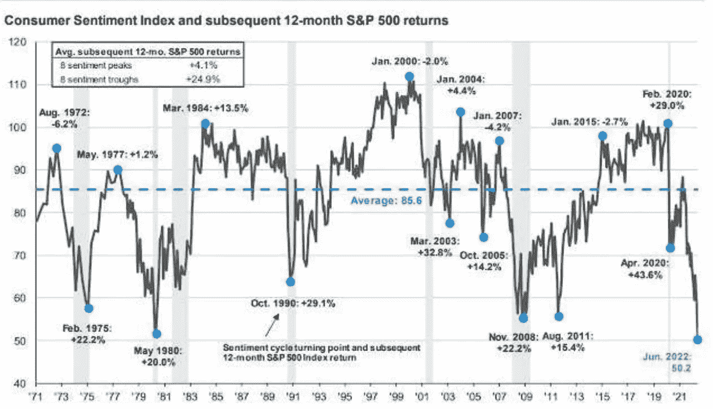

*   …这可能会导致加息减少、暂停甚至逆转，因此被推低至极端水平(相对而言)的股票估值现在可以回升…因此衰退和美联储的潜在反应实际上可能有利于估值，从而有利于股票市场、房地产市场等的价格走势。下图显示了极端的避险情绪，或者说这已经成为一个拥挤的交易，可以持续一段时间，但也有一定的逆转可能性

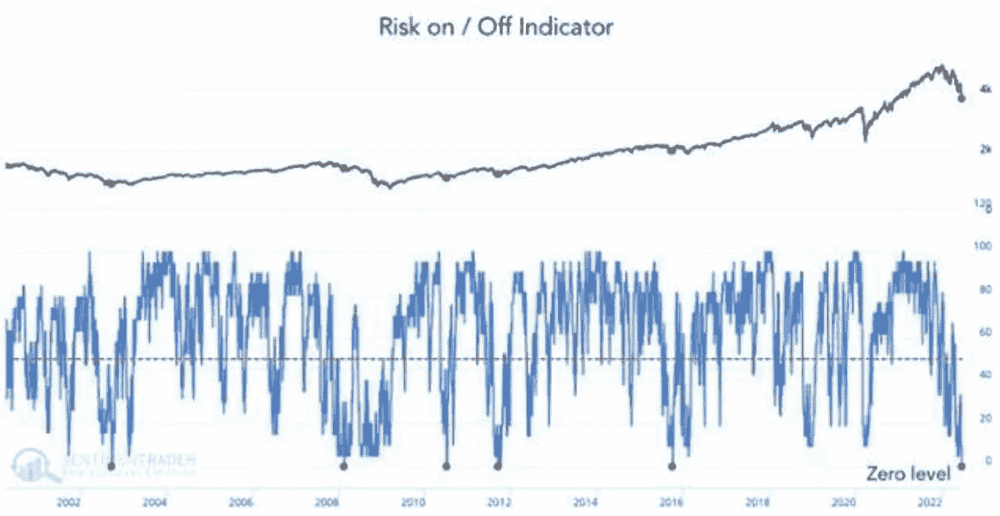

关于商品成本的一个很好的例子是下面的图表，它可能更多地与 covid 在中国的解决有关，而不是其他任何东西，但也可能与经济预期有关。对于生产和供应链来说，东西越来越便宜。

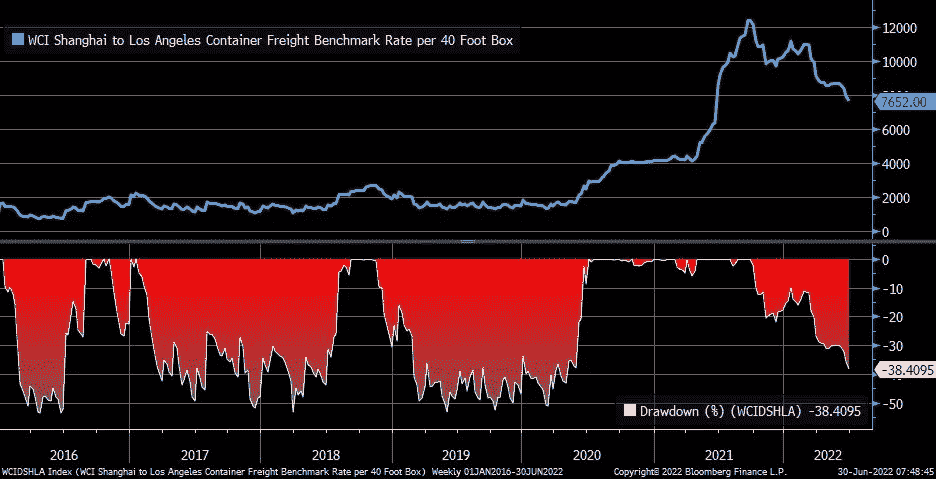

目前，加密交易与高增长/科技股类似，因此我们可以假设，如果/当股票上涨时，加密也会上涨。基本上，所有被认为有风险的东西，以及在过去六到九个月中被扼杀的东西，都应该上涨，或者至少在持续下跌的趋势中暂停。

> 交易新手？试试[加密交易机器人](/coinmonks/crypto-trading-bot-c2ffce8acb2a)或者[复制交易](/coinmonks/top-10-crypto-copy-trading-platforms-for-beginners-d0c37c7d698c)

你可以在总加密市值图(日线图)中看到最近的情绪变化，技术指标似乎在看涨。不过要小心，对于交易者来说，这些东西可能会误导人，而且变化很快。

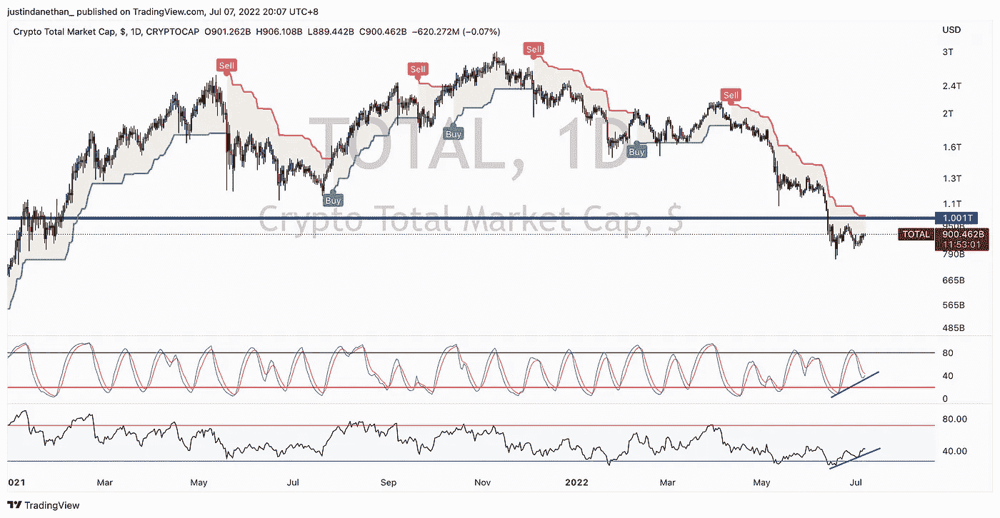

一个涉及加密市场和传统市场的快速提示是美元正在达到的极端水平。这本身并无好坏之分，但它凸显了从风险资产到现金的转移……但这一转移最终会逆转。这是美元的(周)图。如果继续下跌，预计加密和股票将会反方向上涨。

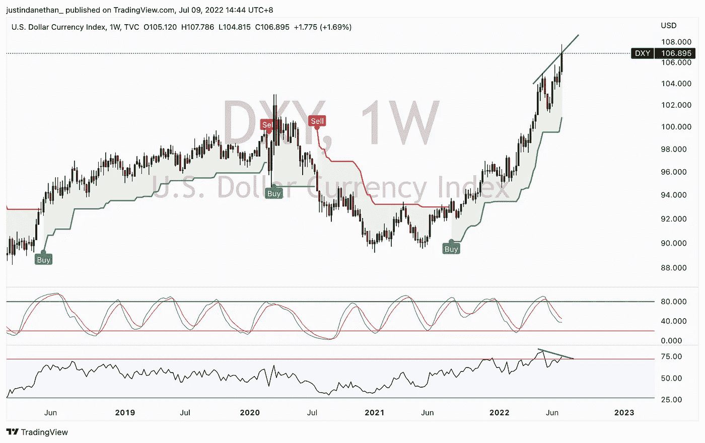

稍后，我将以一些积极的基本面数据和我的投资行为总结来结束这篇文章，但在此之前，让我先给所有的反转看涨言论浇浇冷水

事情发展很快，有时你需要快速反应。不过，我不认为我们处在这种动态中。地缘政治问题将长期影响我们，大宗商品可能会略有逆转，但到目前为止，处于不受干扰的牛市中，通胀可能很快见顶，但仍非常高，投资者被当前的动态吓坏了，衰退不是一件“好事情”，无论你想如何看待它(尽管它可能是市场非常“健康”的事情)，现金比以前更加稀缺， 从更广更长的时间来看，自由世界和其他政权之间的竞争正在加深，食品短缺正在逼近……所有这些都表明熊市还没有结束，或者说，如果已经结束，底部需要很长时间才能形成。

我这么说只是为了展示论点的另一面。以及管理期望。我想，我们没有 V 型底。在我们能够形成一个强有力的支撑之前，它最多只能保持区间震荡。或者，我们将缓慢地进一步下跌，直到几个月——也许几年——形成一个圆形底部，然后我们可以以可持续的方式再次上涨。

下面是 VEA (Vanguard 的发达国家 ETF)…看起来我们将在均线下方停留一段时间，也许它甚至会成为阻力，我们需要应对不安、厌倦和投降，然后才能看到真正的上涨。

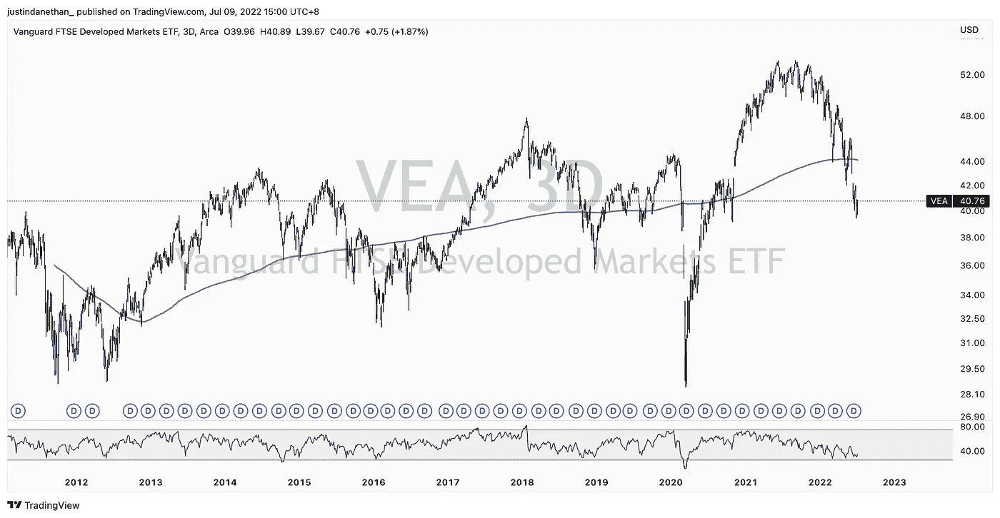

另一个可能让任何秘密投资者不寒而栗的图表是下图，它显示了在下一轮上涨之前结束每个主要熊市的“死亡盒子”。

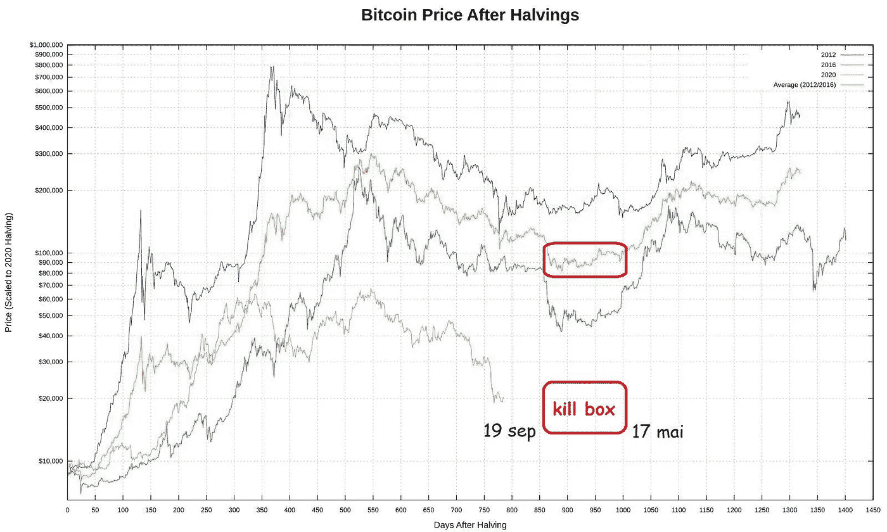

说到承诺的看涨和支持加密的基本面，实际上有一些长期的东西让我一如既往地看好这一资产类别。

当我听到诋毁者在价格下跌时抬起他们丑陋的头时，我感到很难过，好像“BTC 将归零”，因为它正在经历其自然的兴衰过程。它已经十四岁了，还没有找到最终的立足点，这没什么。

下面，你可以看到比特币地址的数量在无情地增长。不管当前价格如何，资产都在增长。

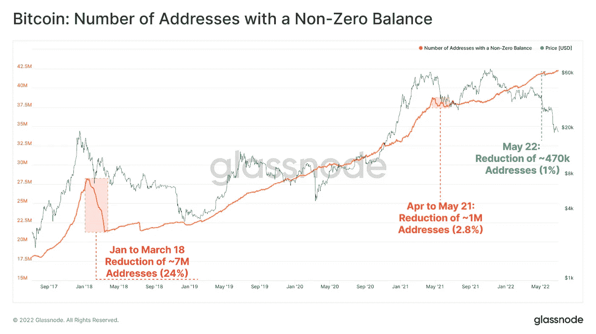

下图也来自 Glassnode，显示了“活跃”实体的数量，这些实体在不确定的期限内减少了，但在更广泛的时间范围内继续增加。

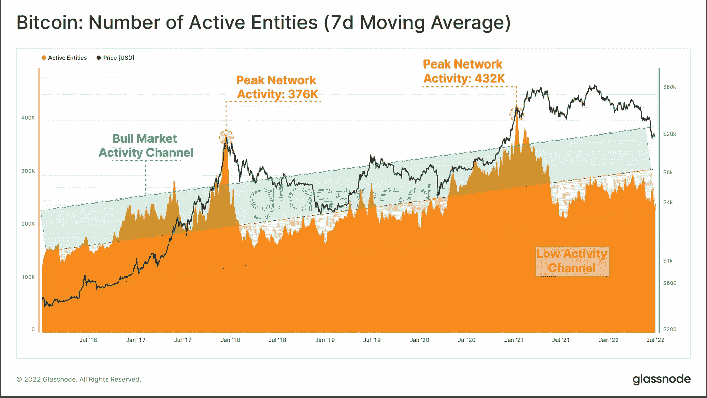

我认为更深层的事情将由 Arthur Hayes (Bitmex 的创始人)在下文中解释。六月，整个问题都与 Celsius，Genesis，Babel，BlockFi，Voyager 和所有与三箭资本(3AC)和之前的 UST/卢娜崩溃有关。但令人惊奇的是:集中化的实体正在遭受痛苦，而去中心化的协议却保持强势，按预期运行。它们的象征性价格可能会下跌，因此对投机者和投资者来说感觉不好，但基础技术是有效的。我们要去迪菲。TradFi 无法竞争，也不会像今天这样，比如说，五年或十年后。

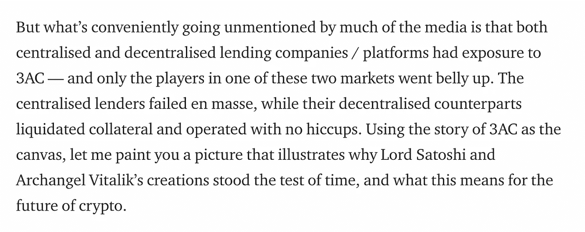

在更广的范围内，为了给你提供你想要的彩色图表，这里有一张图表，显示了手机和互联网的采用相对于比特币的采用的增长。除非突然停车，否则我们要向北走。现在也不是认为自己比市场聪明、会通过积极交易来优化回报的时候。买入核心投资组合和 hodl。

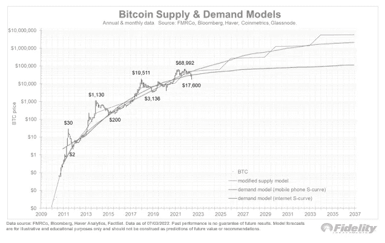

我该如何应对这一切？我讨厌听起来像一个破纪录，但我仍然只是平均到资产。我的游戏计划假设未来 3-6 个月的痛苦或不令人兴奋的价格波动。这是积累时间。没必要贪心。我已经买了高得多的(30k 以下)，但也不是很远，在 20k 左右。我仍然是一个十几岁的买家。而且有更多的流动性可以继续购买，一次购买一小部分。

我在传统资产领域做着同样的事情，在 VTI 和 SCHB、VEA、VWO 和 SCHE、FM、VNQ 和 VNQI、GLD 等市场购买了大量小股股票。

*免责声明:此处包含的任何信息都不构成购买或出售任何货币、产品或金融工具、进行任何投资或参与任何特定交易策略的要约(或要约邀请)。*

> 加入 Coinmonks [电报频道](https://t.me/coincodecap)和 [Youtube 频道](https://www.youtube.com/c/coinmonks/videos)了解加密交易和投资

# 另外，阅读

*   [币安期货交易](https://coincodecap.com/binance-futures-trading)|[3 commas vs Mudrex vs eToro](https://coincodecap.com/mudrex-3commas-etoro)
*   [如何购买 Monero](https://coincodecap.com/buy-monero) | [IDEX 评论](https://coincodecap.com/idex-review) | [BitKan 交易机器人](https://coincodecap.com/bitkan-trading-bot)
*   [CoinDCX 评论](/coinmonks/coindcx-review-8444db3621a2) | [加密保证金交易交易所](https://coincodecap.com/crypto-margin-trading-exchanges)
*   [红狗赌场评论](https://coincodecap.com/red-dog-casino-review) | [Swyftx 评论](https://coincodecap.com/swyftx-review) | [CoinGate 评论](https://coincodecap.com/coingate-review)
*   [Bookmap 点评](https://coincodecap.com/bookmap-review-2021-best-trading-software) | [美国 5 大最佳加密交易所](https://coincodecap.com/crypto-exchange-usa)