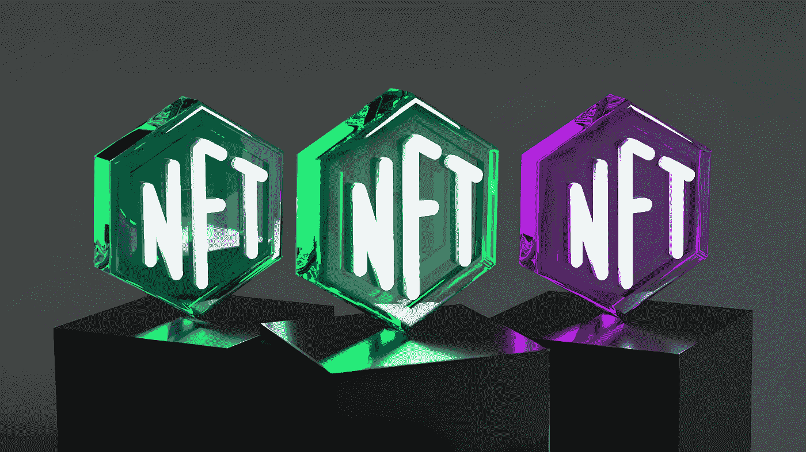

# 2022 年秋天可能爆炸的 3 个 NFT！

> 原文：<https://medium.com/coinmonks/3-nfts-that-could-explode-in-the-fall-of-2022-d68607338f1?source=collection_archive---------5----------------------->

Photo by [Choong Deng Xiang](https://unsplash.com/es/@dengxiangs?utm_source=medium&utm_medium=referral) on [Unsplash](https://unsplash.com?utm_source=medium&utm_medium=referral)

所谓的 NFTs 越来越受欢迎，尤其是在 2022 年。许多 NFT 的价值激增。创造者们也将日益增长的接受度视为一个机会，来构建更多不可替代的代币。但是 NFT 市场是多方面的。除了现有的风险，投资不可替代的代币也有很大的机会。毕竟，密码朋克，无聊的猿，和公司的价值…