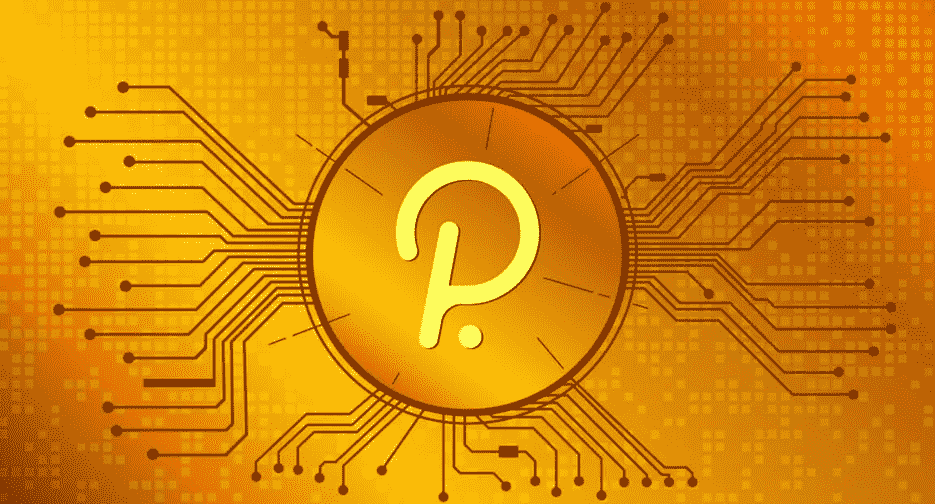
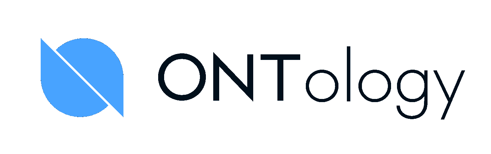
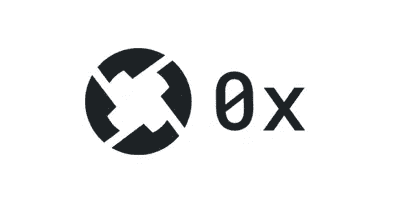

# Polkadot 上的 3 个项目应该在你的观察列表上！

> 原文：<https://medium.com/coinmonks/3-projects-on-polkadot-you-should-have-on-your-watchlist-63084320354a?source=collection_archive---------14----------------------->

图片来源:[https://www . economy magazine . it/la-区块链-迪-波尔卡多特-波特雷贝-普雷斯托-斯卡扎雷-以太坊/](https://www.economymagazine.it/la-blockchain-di-polkadot-potrebbe-presto-scalzare-ethereum/)

***3 个既定项目，3 个不同的用例，这就是我今天要跟大家谈的。***

这就是为什么你不能低估这个分析中的竞争者。

我想说清楚；这不是排名。我想给你带来 3 个最著名的基于波尔卡多特的密码，它们有着有趣的发展。

让我来剧透一下我们今天要看的内容:

1) **Polkadot** :是一种革命性的区块链基础设施，旨在支持下一代网络，用户可以在其中控制自己的数据和身份。

2) **本体**:是一个公共区块链，旨在为公司提供一个在生产过程中实施区块链技术的具体选项

3) **0x** :是建立在以太坊区块链上的开源协议，支持基于以太坊的令牌的对等交换。

在这个小剧透之后，我希望你已经准备好深入这些密码。拿起你的咖啡，让我们开始吧！

## 首先，我们谈谈波尔卡多特。

**Polkadot 通过提供一种在单一网络中将不同且独立的区块链连接在一起的方式来创建这种基础设施，允许它们利用 Polkadot 中继链提供的共享安全性优势进行互操作、交换数据和处理交易。它还允许与非区块链系统和成熟的区块链互动，如比特币和以太坊。**

Polkadot 团队提出了一个 ***解决方案:*** 创建能够相互通信的并行链，以避免阻塞单个区块链。这些链被称为 Parachain，具有彼此不同的特征:事务的计算分布在各个 para chain 中，使得大量的事务能够被非常快速地处理。

Polkadot 网络和加密货币看起来是加密货币行业的一颗新星。

你的加密文件夹里有点令牌吗？

***查看这里我的完整波尔卡多特评论****:*[*https://medium . com/@ mikezillo/token-review-Polkadot-DD 180352868 e*](/@mikezillo/token-review-polkadot-dd180352868e)

## 第二个是**本体**！

***本体是一个区块链平台，用两个令牌工作:ONT 和 ONG*** 。

ONT 是该系统的主要货币，而 ONG 是与区块链服务有关的辅币；ONG 是在本体维护网启动后创建的，用于奖励为平台运行做出贡献的用户。通过将他们的资源交由平台支配并创建新的区块链，用户可以通过非政府组织的形式赚取交易佣金，鼓励用户在网络中保持活跃。

Ontology 的区块链不收取任何费用，支持每秒 1000 笔交易。它被认为是一种特别安全的加密货币，因为它让用户接受特殊的身份验证。由于建立在近地天体平台上，本体还具有无法破译的特性，即使强大的计算机试图解密也是如此。那么，本体与公共的和私人的区块链都是兼容的。这使得有可能克服与密码世界相关的最大限制之一，即不同区块链之间的协作。

*你知道 ONT 吗？你认为那是一个有价值的项目吗？*

## 今天最后一个密码是 **0x (ZRX)** ！

**0x 是基于以太坊区块链的开源协议，支持基于以太坊的令牌的对等交换**。它也称为分散式交换。0x 在共享基础架构上使用通用智能合同。它的技术结合了两种策略——国家频道和自动市场标记(AMM ),这两种策略已经被建议用来克服这些问题。

状态通道使交易离线，从而降低了在以太网上交易时产生的成本。如果加密资产的价格达到一定门槛，AMM 将引入第三方来促成交易。因此，AMM 在两方之间(而不是两方之间)进行交易，并作为交易对手。0x 创始人将他们的系统描述为“链上结算的链外订单中继”。

他们的使命是:“*创造一个所有价值都能自由流动的符号化世界。*”

这是一个使命宣言，体现了为世界建立一个开放的金融体系的雄心，并始终激励和指导着团队。

他们想要包含的核心概念:

*   建设公共基础设施，
*   使资产更容易获得和流动，
*   赋能全球创业团队，构建新金融体系。

他们认为，公众的区块链有潜力成为世界上一股强大的平衡力量。随着越来越多的资产被令牌化并转移到区块链轨道，公共区块链有更大的机会实现金融服务的民主化，就像互联网实现信息的民主化一样。

*你交易过 ZRX 吗？*

# **结论**

在这 3 个不同的用例中，这 3 个硬币并不竞争，但每一个都可以成为各自目的的赢家。

让我知道，如果你已经把这些项目纳入你的投资组合。

你的观察列表中还有其他来自波尔卡多特生态系统的令牌吗？

请在评论中与我分享，我会很乐意给你我对它们的看法。

> 交易新手？试试[密码交易机器人](/coinmonks/crypto-trading-bot-c2ffce8acb2a)或者[复制交易](/coinmonks/top-10-crypto-copy-trading-platforms-for-beginners-d0c37c7d698c)