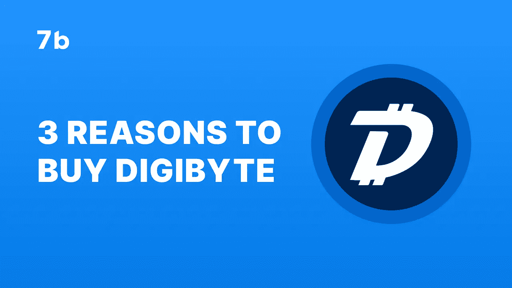
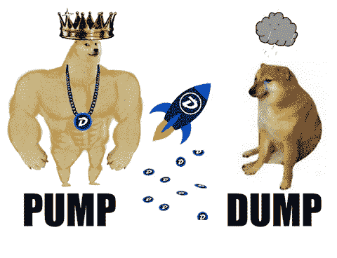
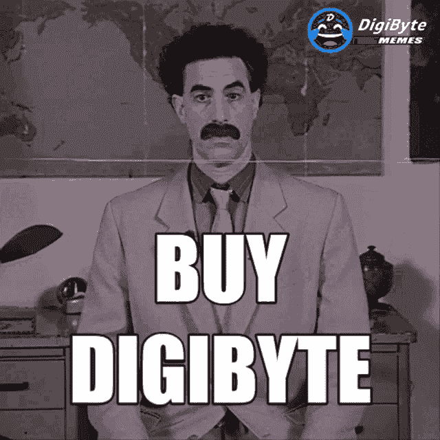

# 购买 DigiByte 的 3 个理由

> 原文：<https://medium.com/coinmonks/3-reasons-to-buy-digibyte-ba96f1bef827?source=collection_archive---------33----------------------->

许多加密货币都在努力接近比特币的成功，并超越它。在今天的文章中，我们将告诉你 2022 年值得关注的比特币替代品之一，以及投资它的理由。这里有 3 个购买 Digibyte 的理由，因为许多人认为它是最有前途的加密货币之一。

# 什么是 DigiByte？

首先，我们来深究一下 DigiByte 到底是怎么回事。它被描述为一个点对点的加密货币和区块链平台。DigiByte 自称是一种更快的数字货币和创新的区块链，可用于数字资产、智能合同、分散应用和安全认证。

Digibyte 由 Jared Tate 于 2013 年开发，并于 2014 年向公众展示，是一款多用途、多层次的区块链，专为安全、快速的支付系统而打造。

在其存在的 8 年中，DigiByte 已遍布 100 多个国家，并已成为最安全和最快的分散区块链之一。

Digibyte 拥有 210 亿枚硬币的固定供应量，到 2035 年将全部开采完毕。它的块速度比比特币快 40 倍，比莱特币快 10 倍。

[什么是 DigiByte？](https://www.youtube.com/watch?v=bsHA7TBbbWE)

# DigiByte 是如何工作的？

DigiByte 是一种分散的加密货币，提供快速、安全和可靠的交易。DigiByte 使用工作证明操作机制，该机制使用一种称为挖掘的过程来生成新的 DGB 令牌。

凭借一分钟的阻塞时间，它无需外部确认协议即可确认交易。多算法挖掘保护数字字节区块链，它由许多相互连接的块组成。

DigiByte 最初是作为比特币的一个分支推出的，但后来已经发展成为一个全球性的项目，拥有自己独特的代码库、社区和目标。

DigiByte 区块链的设计具有适应性，支持多种采矿方法。DigiByte 支持的五种不同的挖掘算法是 Sha256、Scrypt、Skein、Qubit 和 Odocrypt。

数字字节区块链包括三层:

*   集成到 DigiByte 平台的分散式应用程序和智能合约的顶层
*   由 DigiByte 区块链公司创建和维护的电子公共分类账
*   DigiByte 节点的全球网络，传递和验证 DGB 交易并铸造新 DGB 货币

投资者试图找到一种好的、便宜的、快速的加密货币，但他们只能从两种货币中选择。有了 DigiByte，您就能以实惠的价格获得出色的加密功能，而不必担心速度和安全性。它还具有令人印象深刻的支持数字资产的能力，如分散应用程序(dApps)和智能合同。

DGB 仍然可以访问，在撰写本文时交易价格为 0.013 美元。随着一些分析师预测今年春天早些时候的高点，乐观的是，到 2030 年，这枚硬币的估值可能达到 0.50 美元。

# 购买 Digibyte 的 3 个理由

我们可以列举几个让 Digibyte 成为如此吸引投资的加密货币的原因，但让我们重点关注 3 个主要原因:

**1。这是一种 100%去中心化的加密货币**

滴滴运营着一个真正去中心化的区块链，没有首席执行官或其他公司负责。它从未通过向零售或机构买家出售预开采的硬币，或通过首次发行硬币(ICO)获得任何资产。一切都是志愿者的努力，社区可以控制所做的决定。

这意味着 DigiByte 拥有一个真正分散的系统。DigiByte 的社区驱动的根也有助于透明度。对于投资者来说，这是一个令人鼓舞的消息，因为在加密领域，隐藏开发者的真实意图是很常见的。正如投资者所看到的，加密世界可能是危险的，正如最近鱿鱼游戏代币的动荡所证明的那样。

**2。闪电般快的交易速度**

就交易速度而言，Digibyte 比比特币更高效，比特币每秒钟只能进行 7 次交易。Digibyte 以每秒 560 次交易大大超过了这个数字。甚至以太坊每秒也只能处理 13 笔交易。

DigiByte crypto 既经济又快速。对于寻找具有毋庸置疑潜力的加密货币的投资者来说，这是一个明智的选择。

**3。Digibyte 安然无恙**

与比特币和以太坊一样，Digibyte 的区块链是通过工作证明(PoW)来验证的。为了保护其网络，DigiByte 使用了五种不同的算法。因此，区块链变得非常安全和分散。DigiByte 几乎不可能接管其 hashrate 的 51%以上并产生双重花费攻击。这是以太坊经典在 2020 年 8 月发生的三次，削弱了它的价值。DigiByte 没有这个漏洞。

# 最后的想法

DigiByte 是一种公认的硬币，有一个经过验证的社区，是最强的密码之一。它会一直留在这里。多重优势证明 DigiByte 是加密货币领域安全、创新和长期的投资选择。最简单方便的方法就是在 [7b 经纪人 app](https://play.google.com/store/apps/details?id=io.sevenb.terminal) 中购买 Digibyte。不要失去以最低价格买卖 DGB 而不收取任何额外交易或服务费用的机会。在这篇博文中找到更多关于这枚硬币的信息。

*原载于 2022 年 8 月 17 日*[*https://seven b . io*](https://sevenb.io/blog/3-reasons-to-buy-digibyte/)*。*

> 交易新手？尝试[加密交易机器人](/coinmonks/crypto-trading-bot-c2ffce8acb2a)或[复制交易](/coinmonks/top-10-crypto-copy-trading-platforms-for-beginners-d0c37c7d698c)