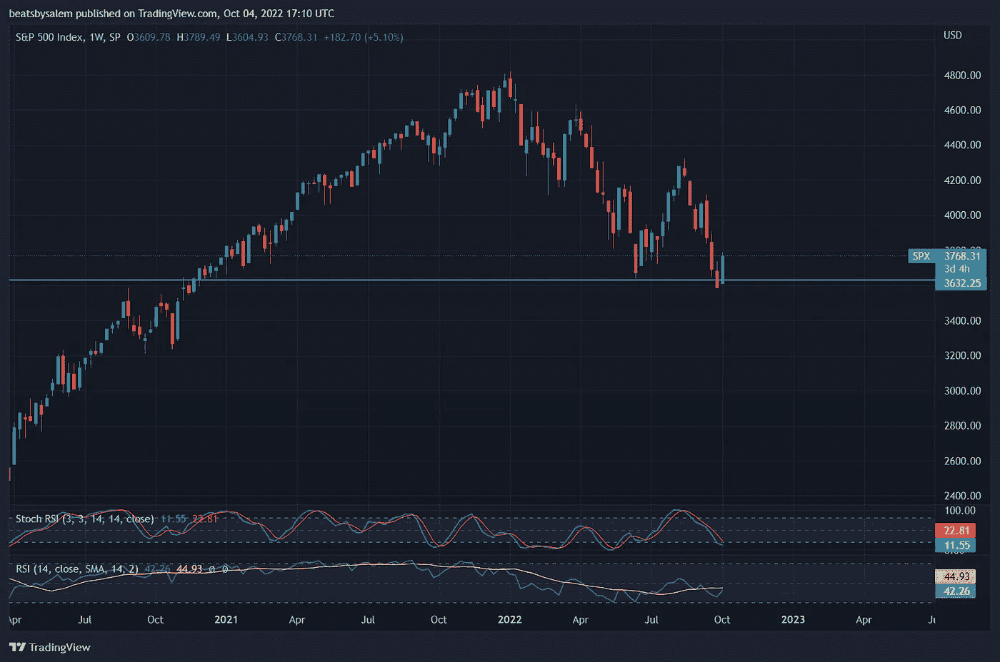
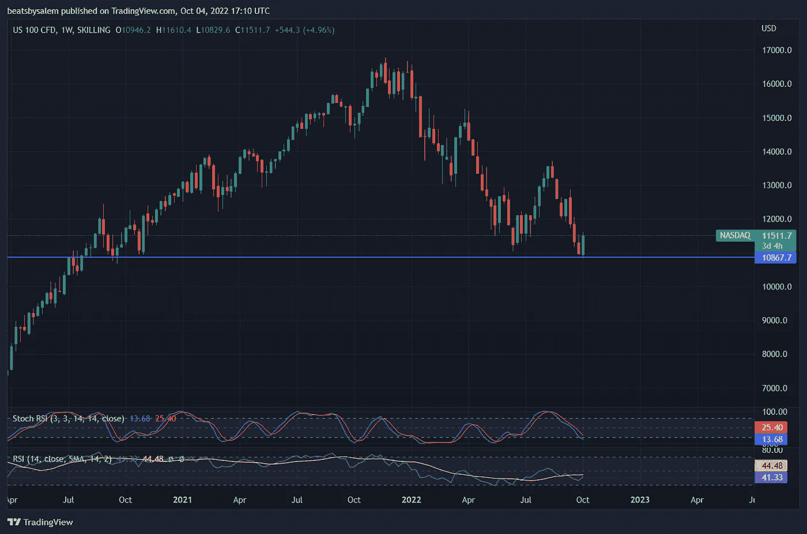
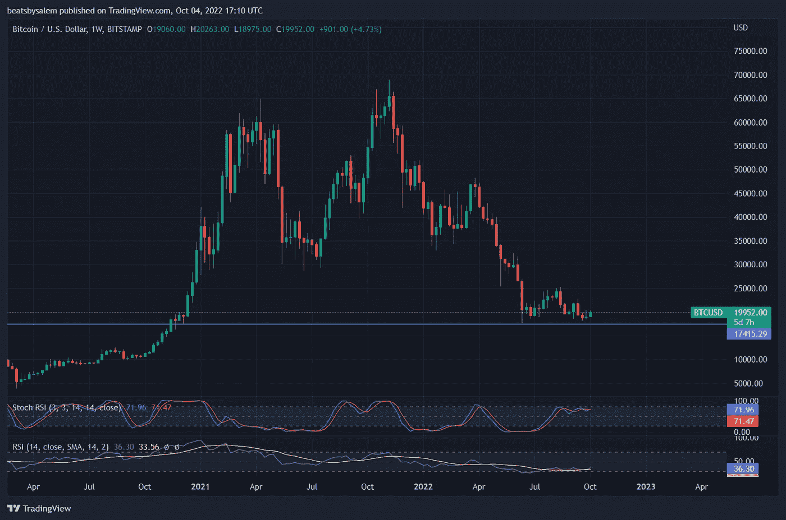
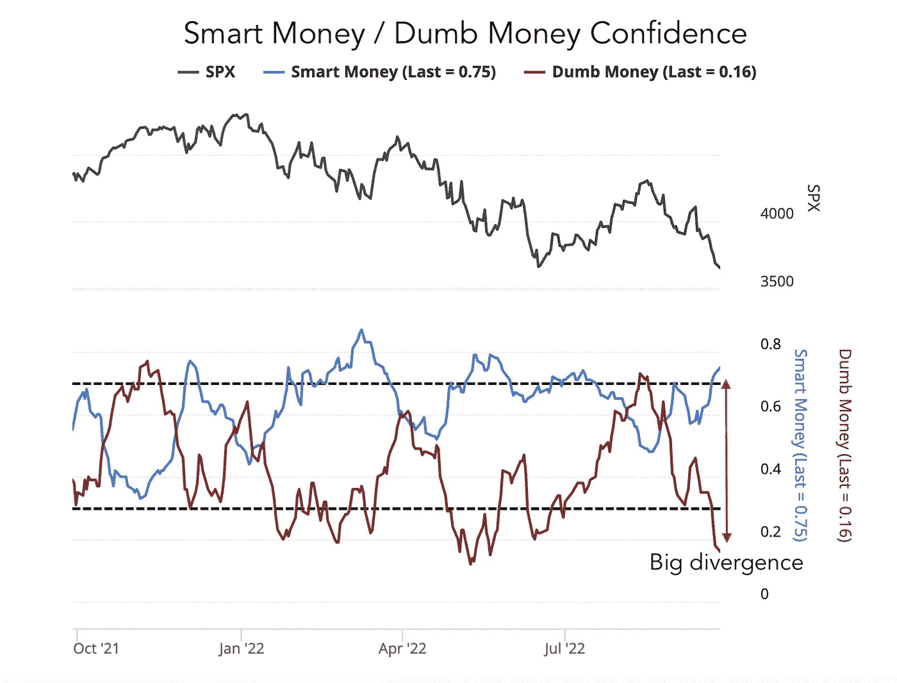
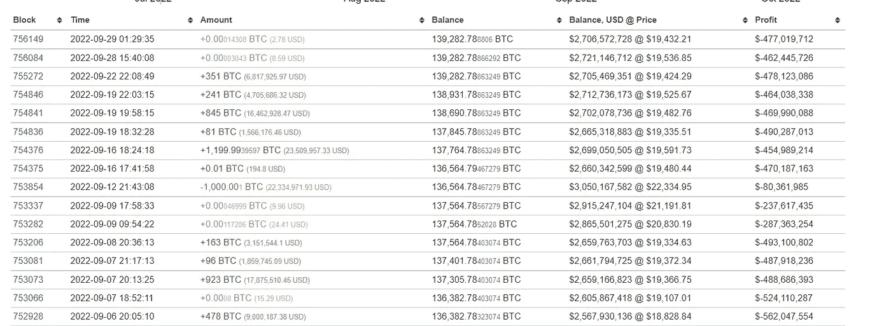
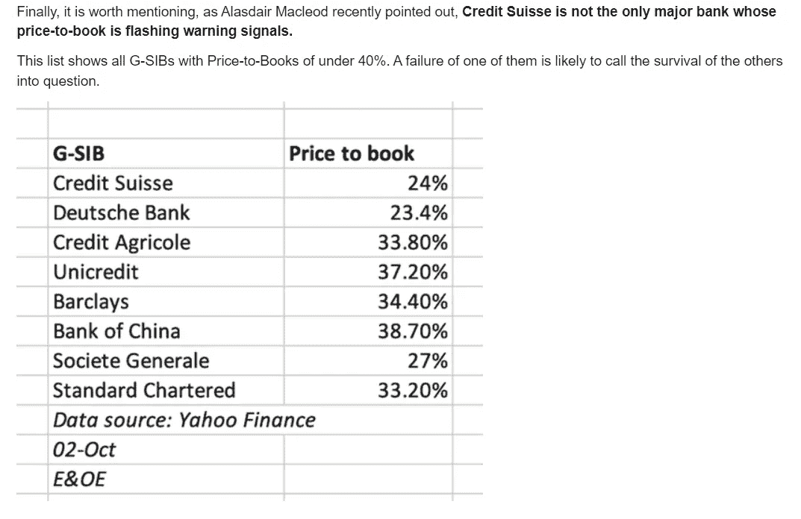
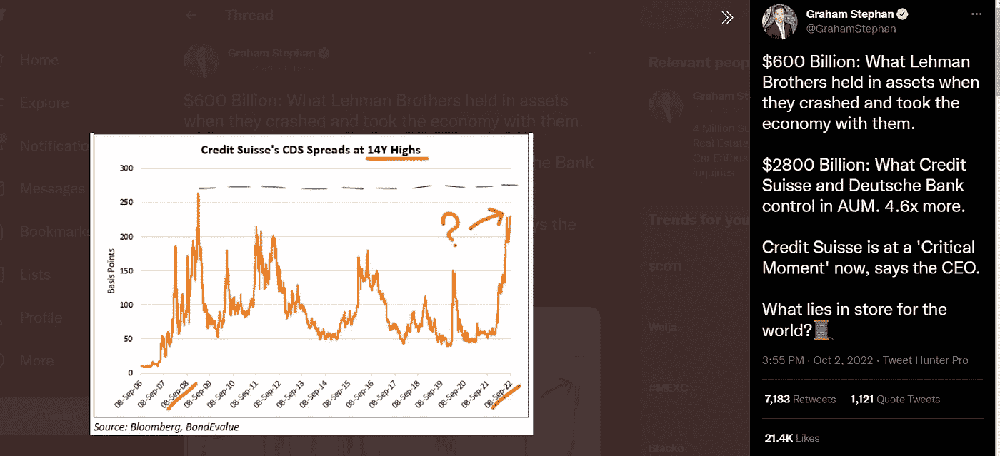

# 这次衰退让比特币比以往任何时候都更强劲的 3 个原因(看涨)

> 原文：<https://medium.com/coinmonks/3-reasons-why-bitcoin-is-extremely-bullish-right-now-e270846de6d6?source=collection_archive---------15----------------------->

Source: [https://www.pexels.com/photo/space-shuttle-launch-during-nighttime-796206/](https://www.pexels.com/photo/space-shuttle-launch-during-nighttime-796206/)

经过近一年的看跌。事实上，每个人都还在恐慌，银行濒临破产，世界经济正处于崩溃的边缘。为什么我还是觉得比特币很牛？听我说完…

**比特币 VS 传统市场(S & P 500，纳斯达克)**

美联储不断提高利率。价格越高，市场恐慌和崩溃就越严重。传统市场不断突破一个又一个的支撑位，从之前的低点开始越来越低。

S&P 500, Weekly Chart

我不是技术分析专家，但看到标准普尔 500 图显示疲软也不是火箭科学！虽然突破支撑线并反弹到支撑线上方标志着假出，但我们不能忽视最近的低点是一个更低的低点，这标志着下跌趋势的继续。

Nasdaq, Weekly Chart

至于纳斯达克指数，它看起来比 S&P 图表要好，因为它还没有突破支撑位，但它仍然创造了一个更低的低点，这表明下降趋势还在继续。随着利率和 DXY(美元指数)不断上升，这些市场很可能会继续下跌。

另一方面，比特币被认为与传统市场密切相关。标准普尔 500，纳斯达克)，表现出不同的东西。

Bitcoin, Weekly Chart

从上面的 BTC 图表中，我们可以得出 2 个结论，它占据了主要支撑位，也创造了更高的低点。这意味着到目前为止，在上面的图表中，BTC 是唯一一个试图打破下降趋势的，不像更成熟的市场。这显示了投资者的巨大信心。

## **聪明钱 vs 笨钱**

根据 [Investopedia](https://www.investopedia.com/terms/s/smart-money.asp) 的说法，聪明的钱可以定义为

> 机构投资者、市场专家、央行、基金和其他金融专业人士控制的资本。

换句话说，他们是成功的经验丰富的投资者。另一方面，愚蠢的钱可能仅仅意味着经验不足的散户投资者。

Source: [https://twitter.com/GameofTrades_/status/1575930983492165633](https://twitter.com/GameofTrades_/status/1575930983492165633)

聪明的钱是蓝线，愚蠢的钱是棕色线，上面由 gameoftrades 发布的图表显示了其他人在做什么。明智的投资开始增加，而愚蠢的投资则相反。存在着巨大的分歧。我们从中可以得出的结论是，经验丰富的投资者开始对市场有信心，而经验不足的投资者开始恐慌。上周末，随着[比特币恐惧和贪婪指数跌至 20，人们陷入恐慌。](https://twitter.com/BitcoinFear/status/1576338689550065667)在这两组人中，你认为跟随谁会更明智？

这只比特币鲸鱼不停地往钱包里添加比特币。我们可以看到越来越多的大投资者进入加密领域。我们需要问自己，大投资者是否知道一些我们不知道的事情？也许，而且仅仅是也许…底部在？

正如沃伦·巴菲特所说，股市是一个把钱从没有耐心的人身上转移到有耐心的人身上的工具。“即使比特币和其他资产价格暴跌，也要了解你投资的资产，给团队时间解决他们所有的问题。如果你赌对了，你就会赢！

**新叙事**

疫情之后，世界经济基本上是一片混乱。各国开始疯狂印钞票来对抗经济崩溃。这导致资产价格和通胀数字飙升。总有一天会结束的。2021 年底，美联储开始加息，以减少经济中的货币供应，希望以此打击极高的通胀率。结果，美元指数开始上涨，资产价格开始暴跌。这是导致市场恐惧的原因…直到现在…

我相信我们中的许多人都是 Luna、Celsius 和另一家金融机构倒闭的受害者。在密码市场崩溃后不久，许多密码公司紧随其后。谈论它会引发创伤后应激障碍！然而，这只是冰山一角。最近，有传言说一些最大的银行濒临倒闭。据瑞士彭博银行报道，瑞士瑞信银行集团正处于关键时刻。不过先别慌，银行财务上还是‘还行’。然而，如果这个谣言开始升级，人们开始恐慌，并开始从银行提取他们所有的钱，这可能导致银行挤兑，这可能导致银行崩溃。

Source: [Credit Suisse Shares Hit Record Low, CDS Spike To Record High After CEO Letter Backfires | ZeroHedge](https://www.zerohedge.com/markets/credit-suisse-ceo-touts-strong-liquidity-positionagain-market-says-nein)

这是严重的，瑞士瑞信银行集团不是唯一的银行。据 [ZeroHedge](https://www.zerohedge.com/markets/credit-suisse-ceo-touts-strong-liquidity-positionagain-market-says-nein) 报道，8g-sib 的市净率正在闪烁警告信号。根据[维基百科](https://en.wikipedia.org/wiki/List_of_systemically_important_banks)的说法，G-SIB 指的是可以被称为系统重要性金融机构的银行。

Source: [https://twitter.com/GrahamStephan/status/1576601663477059585](https://twitter.com/GrahamStephan/status/1576601663477059585)

据 [Graham Stephan](https://twitter.com/GrahamStephan/status/1576601663477059585) 称，在 2008 年金融危机期间，雷曼兄弟控制了 6000 亿美元。雷曼兄弟的倒闭拖垮了整个世界。目前，瑞士瑞信银行集团和德意志银行控制着价值超过 28000 亿美元的资产。我想不出比这更糟糕的情况了。世界的命运掌握在银行手中。但是为什么我还是觉得比特币很牛？

在这种经济下，人们正在失去他们在政府中的命运。通货膨胀率持续上升。被宣扬为人们避风港的银行和现金也在崩溃。人们会想把他们的钱投资到流动性强、足够安全的东西上。另一方面，比特币具有流动性、安全性，并且不受金融机构控制，这是一个很好的选择。这可以成为比特币获得更多关注的一个很好的叙事。

**结论**

我并不是说比特币可以在银行倒闭后立即飙升，但我认为随着人们开始对当前的金融体系失去信任，比特币将有很大机会超越中央集权实体。比特币旨在对冲通胀，也旨在彻底改革当前的金融体系。在所有金融不稳定的情况下，随着人们开始转向这种替代方案，他们将开始意识到所有这些好处，并随后开始了解整个加密市场。

# **注意:我不是财务顾问，我无法预见未来。我只是在网上分享我的想法。投资前请做好调查。谢谢你。**

> 交易新手？尝试[加密交易机器人](/coinmonks/crypto-trading-bot-c2ffce8acb2a)或[复制交易](/coinmonks/top-10-crypto-copy-trading-platforms-for-beginners-d0c37c7d698c)