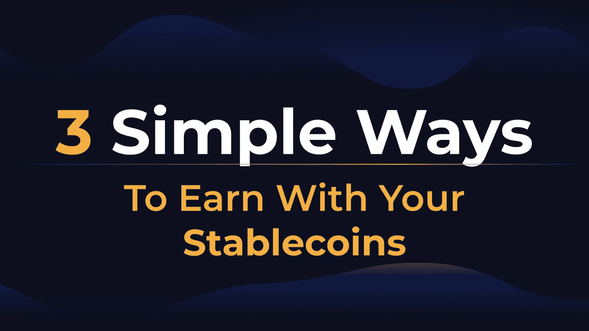

# 用你的稳定收入赚钱的 3 个简单方法

> 原文：<https://medium.com/coinmonks/3-simple-ways-to-make-money-with-your-stablecoins-6ac7e2f6f307?source=collection_archive---------35----------------------->

我们以前说过。最近，加密市场一直在以绝对无情的方式行事。下面是一个简要概述(2022 年年中年初至今):

很清楚了。无论你投资了什么，你的投资组合都会损失超过一半的价值(T3)，如果不是 80%以上的话。悲哀。

怎么办？似乎无处可藏而不被抓……**除非你坚持你的原则！**

是的，稳定的发型不性感。

是的，稳定硬币不是有趣的硬币。

是的，stablecoins 不会提供 10 倍的回报…事实上甚至不会有 2 倍的回报。

他们不会让你一夜暴富。

但是，要想随着时间的推移产生可持续的回报，仅仅依靠风险策略(或缺乏风险策略)是不会有回报的。

> *“代币和股票为您赢得游戏。*
> 
> Stablecoins 为你赢得冠军。”

对于一些开始接触加密的投资者来说，稳定的硬币就相当于他们购买更多代币的现金储备。

但这只是稳定货币力量的一小部分。

# 三分之一——HODL！

假设你来自一个货币对美元疲软的国家，用你稳定的(美元)货币稳定赚钱的最懒的方法就是简单地… **持有它！**

这听起来确实非常违背直觉。许多人甚至认为“[现金是垃圾](https://finance.yahoo.com/news/billionaire-investor-ray-dalio-says-163406073.html#:~:text=Billionaire%20investor%20Ray%20Dalio%20continued,warned%20stocks%20look%20even%20worse.&text=The%20founder%20and%20co%2Dchief,years%20that%20cash%20is%20trash.)”，会让你容易受到通货膨胀的影响。

> 交易新手？尝试[加密交易机器人](/coinmonks/crypto-trading-bot-c2ffce8acb2a)或[复制交易](/coinmonks/top-10-crypto-copy-trading-platforms-for-beginners-d0c37c7d698c)

但还是。它的性能会比本文开头提到的任何令牌都要好。

事实上，如果你的国家在欧盟，你会比持有现金表现得更好:

EUR/USD Exchange Rates Over Time

是不是说所有的“stablecoins”都是好拿的？

绝对不行。正如过去几个月发生的各种丑闻向我们展示的那样，并非所有的丑闻都是一样的。

所以要明智选择。因为即使是像戴、、这样最受欢迎的明星也有一些(可以忽略不计的)风险。

# 2/3 —提供流动性

当然，在如此动荡的市场中，持有稳定的股票是安全的。

但是，让你的资产多收益一点也无妨！

在 DeFi 中，被动赚钱的一个简单方法是**成为流动性提供者！**

它由什么组成？

这仅仅意味着你在帮助一个平台池为它的用户变得更有流动性，通过增加你的现金！

作为回报，你不会赚取利息或收益，但从其他用户的交易费！所以越多人使用你的流动资金，越频繁，你赚的钱就越多！

不用说，这是在 DeFi 中*未经许可*完成的。只有你和平台的智能合约！

一个例子就是[衍生品交易平台 iGain IRS！](https://igain.finance/irs/apy-trade-pools?utm_source=medium&utm_medium=article&utm_campaign=provide_liquidity)

Pick the underlying token of your choice

在那里，您可以通过购买 LP(流动性提供者)代币来提供您选择的基础代币(USDC、戴、，甚至是 ETH)的流动性！

Add or remove your liquidity on [iGain IRS](https://igain.finance/irs/apy-trade-pools?utm_source=medium&utm_medium=article&utm_campaign=provide_liquidity)

为了增加您的收益，您可以在[客家农业页面](https://hakka.finance/farms/)上存入您的 LP 代币，并获得 3 位数的年收益！

# 3/3——贷款

最后，另一个充实你的稳定资本的方法是借给他们！

在这种情况下，你将持续获得 APY。

在 DeFi 上，两个最老牌的借贷平台是 Aave 和向往。

与过去破产的 CeFi 或 CeDeFi 平台不同，这两个协议在最近的市场波动和戏剧中幸存下来，并完全完好无损，这要归功于它们的分散属性和对 DeFi 投资者的万无一失的安全标准。

然而，有一个问题:对于贷款人来说，DeFi 利率是:

*   1-要么是固定的，但太低，在熊市中不能带来足够有趣的回报(因为更少的人愿意借钱来杠杆化)
*   2-更高但更不稳定，易受需求和供应波动的影响！

有可能拥有一切吗？

尽管听起来可能令人惊讶，但事实确实如此，通过做空利率，在高利率下降的情况下，你的收入将保持不变。

iGain IRS 允许对 [Aave(在多边形上)](https://igain.finance/irs/fixed-apy?utm_source=medium&utm_medium=article&utm_campaign=provide_liquidity)和[渴望(在扇形上)](https://igain.finance/irs/fixed-apy?utm_source=medium&utm_medium=article&utm_campaign=provide_liquidity)！

你可以在这两个平台上贷款，也可以在 iGain IRS 上单独购买短期代币。

或者通过其[一键式解决方案](https://igain.finance/irs/fixed-apy?utm_source=medium&utm_medium=article&utm_campaign=provide_liquidity)直接在 iGain IRS 上借贷和购买空头代币！

Make a deposit on Aave AND buy the corresponding amount of Short tokens in one-click on iGain IRS!

就是这样！现在你已经准备好在任何市场条件下从你的稳定收入中获得稳定的回报了！永远不要忘记安全交易；)

[iGain 网站](https://bit.ly/3MBpnE3) | [推特](https://twitter.com/iGainFinance) | [不和](https://discord.com/invite/cU4D2a8) | [电报](https://t.me/hakkafinance) | [维基](https://hakkafinance.gitbook.io/igain/igain-universe/interest-rate-synth/introduction) | [乔布斯](https://pelith.notion.site/pelith/Hakka-Finance-Pelith-is-hiring-27bfdd1991bc46019f69f5c7926b69fb)

> *加入 Coinmonks* [*电报频道*](https://t.me/coincodecap) *和* [*Youtube 频道*](https://www.youtube.com/c/coinmonks/videos) *了解加密交易和投资*

# 另外，阅读

*   [3 商业评论](/coinmonks/3commas-review-an-excellent-crypto-trading-bot-2020-1313a58bec92) | [Pionex 评论](https://coincodecap.com/pionex-review-exchange-with-crypto-trading-bot) | [Coinrule 评论](/coinmonks/coinrule-review-2021-a-beginner-friendly-crypto-trading-bot-daf0504848ba)
*   [莱杰 vs n rave](/coinmonks/ledger-vs-ngrave-zero-7e40f0c1d694)|[莱杰 nano s vs x](/coinmonks/ledger-nano-s-vs-x-battery-hardware-price-storage-59a6663fe3b0) | [币安评论](/coinmonks/binance-review-ee10d3bf3b6e)
*   [加密交易机器人](/coinmonks/crypto-trading-bot-c2ffce8acb2a) | [Bingbon 评论](https://coincodecap.com/bingbon-review)
*   [Bybit Exchange 评论](/coinmonks/bybit-exchange-review-dbd570019b71) | [Bityard 评论](https://coincodecap.com/bityard-reivew) | [Jet-Bot 评论](https://coincodecap.com/jet-bot-review)
*   [3 commas vs crypto hopper](/coinmonks/3commas-vs-pionex-vs-cryptohopper-best-crypto-bot-6a98d2baa203)|[赚取加密利息](/coinmonks/earn-crypto-interest-b10b810fdda3)