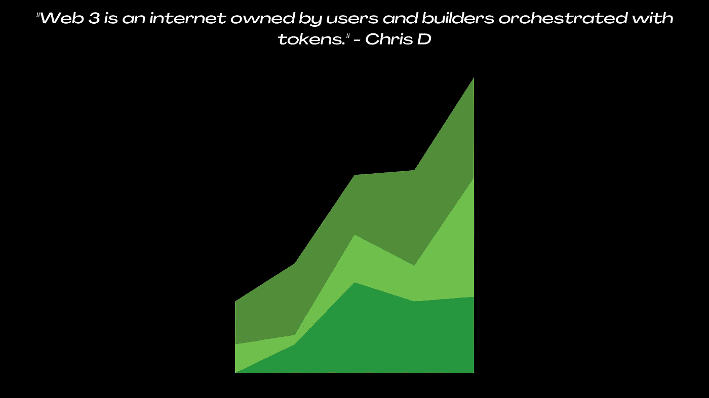
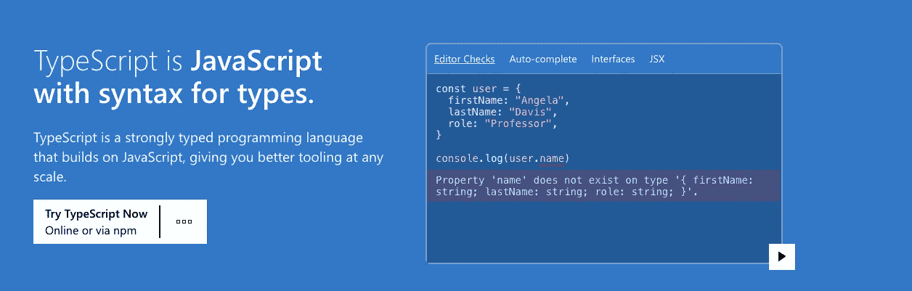
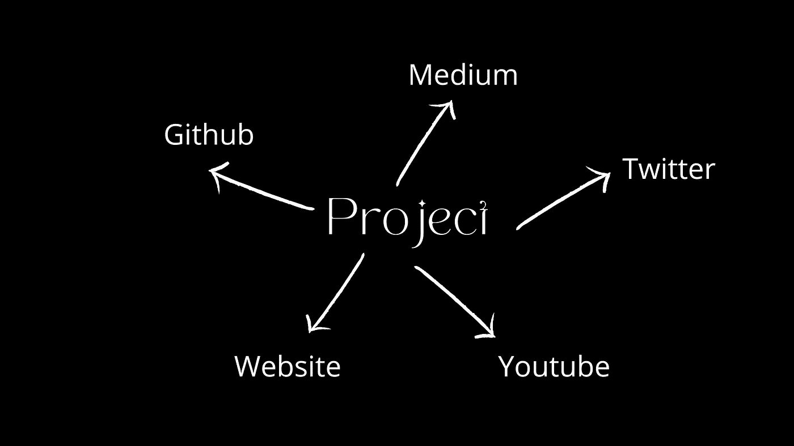

# 人们不知道的闯入网络所需的 3 项技能:

> 原文：<https://medium.com/coinmonks/3-skills-needed-to-break-into-web3-people-dont-know-about-262570c3f308?source=collection_archive---------17----------------------->

## 行业需求的细分:



# 能够阅读白皮书

政治是短语“白皮书”(或“白皮书”，任何拼写都合适)首次出现的地方。1922 年的丘吉尔白皮书在成为法律之前提出了一个政策概念，这是有史以来第一份白皮书。白皮书最初被政客们用作试探气球，但在 20 世纪 90 年代，它在市场营销和销售方面越来越受欢迎。这些被用作宣传产品和激起潜在顾客兴趣的方法。

*对于上下文，它看起来是这样的:*


> 加密白皮书也是这样工作的。

但是根据目标受众的不同，加密白皮书可以有不同的目标。例如，[的比特币白皮书](https://bitcoin.org/bitcoin.pdf)是写给**的，告知人们**一项技术突破:从一方向另一方发送现金，无需中间人。大多数现代白皮书都是为了解释象征经济学、推销项目或为项目筹集资金而撰写的。

## *有三种类型的白皮书:*

*   **学术类**:例子有比特币、以太坊、索拉纳。
*   **营销论文**:如今大多数 DApps 都有大量的营销论文。
*   垃圾:几乎所有的垃圾和仓促的项目都放在这里。

# **从哪里开始:**

即使那些不熟悉区块链技术的人也可以阅读现代白皮书。

加密公司意识到投资者可能并不总是有兴趣了解区块链是如何运作的。白皮书非常强调预期利润以及一个项目是否有吸引人的用例。

因此，你只需要对加密货币的运作有一个基本的了解。

比特币入门和以太坊入门是很好的起点。

> 交易新手？试试[加密交易机器人](/coinmonks/crypto-trading-bot-c2ffce8acb2a)或者[复制交易](/coinmonks/top-10-crypto-copy-trading-platforms-for-beginners-d0c37c7d698c)

然而，如果你是一名开发者或者渴望成为 web3 生态系统中的一员

*   比特币白皮书和以太坊白皮书是必读的，把它们当成你的圣经。因为生态系统的大部分要么来自它，要么建立在它之上。

# 能够熟练使用 TypeScript 和 JS 编写代码



基于区块链的应用和加密货币的未来是，你的浏览器充当你的钱包，你的设备充当你的冷藏钱包。

Javascript 在这个过程中扮演了最重要的角色。web3 生态系统中的大部分开发都是后端开发，目前向用户显示，或者由 javascript 汇集在一起。

所有技术性的 WEB3 职位空缺都有一个工作要求，要求说明 JAVASCRIPT、TYPESCRIPT (JS 但有语法)、WEB3 JS ( ETH JAVASCRIPT API)方面的技能

如果你是这个领域的新手，我已经加入了一个免费数据库的链接，里面有这里描述的所有东西和 web3 开发所需的东西。

# 个人项目组合:

建立投资组合通常是为了找到一份工作。当我们缺乏必要的培训或专业知识时，这有时是必要的。

*在如今的市场环境下，你如何让公司相信你是这个职位的最佳候选人，因为他们对雇佣应届毕业生持谨慎态度？*

通过展示你在之前的任务中所做的工作，你可以展示你的技能。如果你的在线作品集越多，你找到理想工作的机会就越大。

第二个原因是通过发展个人项目来实现你学习新事物的愿望。

当我们发现一个新的人才时，我们希望进行实验，并最终创造出一个可以在现实世界中应用的有用的东西。

## 您可以开始展示项目的地方:

1.  Github:在这里分享你的代码，让人们加入并与你合作项目。
2.  定制网站:这一点怎么强调都不为过，**拥有一个个人网站，因为这将成为你的电子简历。**
3.  中等:写关于项目，这将使你更好地理解向潜在的招聘者或投资者解释它。
4.  Youtube:当你开始时，分享你每天或每周的旅程，让人们学习，让你负责并完成它们。
5.  Twitter:人们看到它的最快方式。
6.  LinkedIn:不言而喻，LinkedIn 将是让你的项目获得关注并与志同道合的开发者联系的最快方式。在这里发布你的项目的最终链接，让人们使用它并给出反馈。



这个数据库包含了你可以在没有任何先验知识的情况下开始的项目的想法。

当我几个月前开始做这个的时候，我不知道有这么多东西要学。幸运的是，我能够从大量的互联网资源中学习所有的基础知识，并有动力创建自己的 Dapp 和资源列表，并教人们如何变得可靠。

底线是，虽然区块链和 web3 技术仍处于起步阶段，但市场急需有才华和热情的开发人员。如果你准备成为区块链和 web3 的权威，看看下面列出的资源。

[白皮书基本介绍](https://btcturk.medium.com/cryptocurrency-whitepapers-4efd03fce407)

[免费概念数据库，包含](https://thebb.gumroad.com/l/web3notion)(书籍、稀有文章、项目想法和 Web3 工具)

```
Read More By Author :[A job in Web3 paying up to $250k. Here are a few effortless steps to get one if you’re currently a data scientist](/@databb/a-job-in-web3-pays-up-to-x-51ea19dbb7f8)[Top AI Fellowships](/towards-data-science/top-ai-fellowship-programs-to-look-out-for-344af565824c)
```

感谢阅读。

> 加入 Coinmonks [电报频道](https://t.me/coincodecap)和 [Youtube 频道](https://www.youtube.com/c/coinmonks/videos)了解加密交易和投资

# 另外，阅读

*   [麻雀交换评论](https://coincodecap.com/sparrow-exchange-review) | [纳什交换评论](https://coincodecap.com/nash-exchange-review)
*   [美国最佳加密交易机器人](https://coincodecap.com/crypto-trading-bots-in-the-us) | [经常性回顾](https://coincodecap.com/changelly-review)
*   [在印度利用加密套利赚取被动收入](https://coincodecap.com/crypto-arbitrage-in-india)
*   [Godex.io 审核](/coinmonks/godex-io-review-7366086519fb) | [邀请审核](/coinmonks/invity-review-70f3030c0502) | [BitForex 审核](https://coincodecap.com/bitforex-review)
*   [5 款最佳免费加密货币制图工具](https://coincodecap.com/crypto-charting-tools)