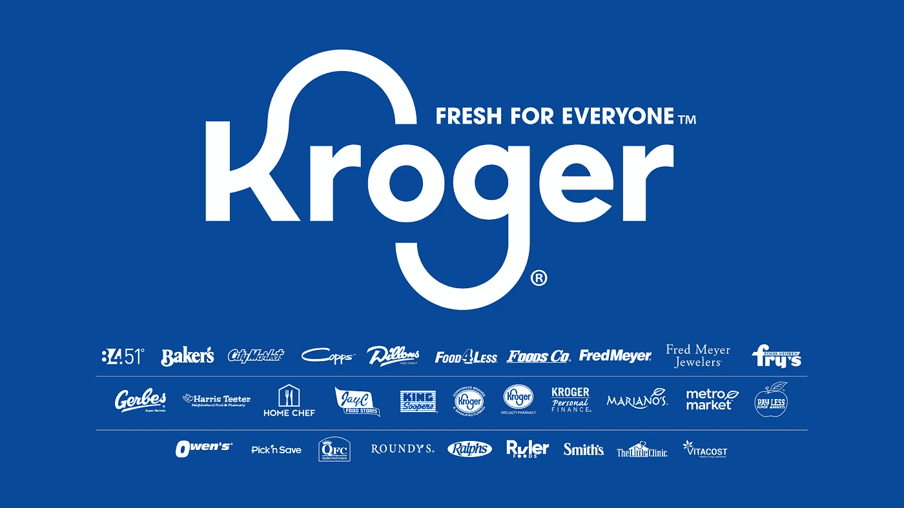

# 3 投资股票，为潜在的经济衰退做准备

> 原文：<https://medium.com/coinmonks/3-stocks-to-invest-to-prepare-for-the-potential-economic-downturn-416628a5fa20?source=collection_archive---------44----------------------->

*Three Stocks for Your Portfolio and the Reasons Why*

世界正面临通货膨胀和经济崩溃。美联储已经将利率提高了五倍，达到标准利率的 3%-3.25%。尽管美联储今年竭尽全力收紧政策，但 9 月份消费者价格指数(CPI)仍达到 8.2%，超出了市场预期。

人们预计美联储政策制定者将再次大幅加息。然而，美联储官员的承诺导致借贷成本在 2023 年 3 月达到 5%。因此，我们有一切理由引发衰退。

此外，央行有可能在 12 月批准加息 50 个基点。25 个基点的加息发生在 2 月和 3 月的两次会议上。

彭博经济学家展示了最新的衰退概率模型，该模型预测经济衰退将在第二天发生。到 2023 年 10 月，美国几乎 100%会发生衰退。

从专业分析师、交易员和投资者的角度来看，他们可能想知道哪些股票可以在经济低迷的预测中度过市场动荡并产生稳定的回报。这篇博客将带你浏览三只有弹性的股票，包括 Visa Inc .、Centene Corporation 和 Kroger Co .

 [## “炒股是赌博吗？”&为什么总有人问？

### 我们很抱歉有这样一个点击诱饵标题来吸引您的点击，因为它是…毫无意义的比较股票交易和…

medium.com](/@libraryoftrader/is-trading-stocks-gambling-why-are-people-always-asking-5f4314c30d74) 

# 维萨公司

*Visa Inc. leads the field of digital payments — Image Source: Visa*

Visa Inc .是支付技术领域的领导者，为消费者、商家、金融机构、战略合作伙伴、企业和政府机构提供数字支付服务。此外，公司还提供 Visa、Visa electronic、Interlink、VPAY 等卡产品、平台和其他增值服务。

2022 年 10 月 19 日，v 与 Thunes 握手，为小公司和消费者推出国际发送到钱包功能。他们甚至可以通过 78 家数字钱包提供商跨境转移资金。它在近 45 个国家和地区拥有 15 亿个数字钱包。因此，V 预计将 Visa Direct 的覆盖范围扩大到近 70 亿个终端。

 [## 股票市场情绪低落。你该怎么办？

### 股市的连续下跌是否拖累了焦虑和恐惧？你有没有陷入过销售的极度恐慌？

medium.com](/@libraryoftrader/stock-market-is-in-a-down-mood-what-should-you-do-dbd4cf355f66) 

此外，Visa 加拿大公司和道明证券公司在一个创新项目上相互合作。因此，道明成为第一家参与 Visa B2B Connect 的加拿大金融机构，与 100 多个国家和地区建立了联系。这项交易也被认为是扩大该公司的市场覆盖面，提高 V 的盈利能力。

v 的净收入同比增长 19%，至 77.9 亿美元。v 的出色表现也通过其营业收入的增长表现出来，今年第四季度为 50.9 亿美元。与此同时，该公司的非 GAAP 净收入和每股收益分别达到 40.9 亿美元和 1.93 美元。

V 的股票在过去的一个月里已经实现了 19.1%的增长，收盘时为 209.34 美元。总体而言，通过 POWR 评级和稳定性，它显示了一个充满希望的前景和持续发展。

# 森腾公司(CNC)

Centene Corporation (CNC)通过为投保不足和未投保的个人提供政府资助的商业医疗保健计划来树立自己的声誉。此外，它还提供教育和外联方案，以获取适当的保健服务所需的信息和援助。

它的内布拉斯加州全面护理获得了内布拉斯加州卫生与人类服务部(DHHS)全州医疗补助管理护理合同的奖励。此外，它还签订了一份为期六年的新合同，为寄养儿童和青少年提供优质医疗保险。

截至 2022 年 9 月 30 日的 2022 财年第三季度，该公司的总收入同比增长 11%，达到 358.7 亿美元。两个主要的动力是医疗补助和医疗保险的增长。它的调整后净收入增加到 7.55 亿美元，增长率为 1.3%。

 [## 股市:有一个你不应该进入的情感陷阱

### 在股市的疯狂涨跌中，情绪波动变得疯狂并不奇怪。阅读金融…

medium.com](/@libraryoftrader/the-stock-market-there-is-an-emotional-trap-you-shouldnt-go-in-c5dac3838dfa) 

分析师对其收入和每股收益的增长做出了积极的预测，同比分别增长 14.8%和 11.2%。CNC 的股票也实现了增长，过去一个月增长了 10.3%，过去一年增长了 19.8%，最后一个交易日收于 85.80 美元。

它的整体表现被评为 A 级，但其价值和质量却被评为 B 级。在 POWR 收视率中。CNC 在 A 级医疗健康保险行业的股票中排名第五。

# 克罗格公司

*The Kroger Co. is the top retailers in the U.S. — Image Source: Kroger Stories*

克罗格公司主要经营药店和综合食品、多种百货商店、价格影响仓库等。KR 管理的 35 个州有 27000 多家超市。

在混乱和潜在的经济崩溃中，2022 年 10 月 14 日，KR 达成了扩大客户范围的最终协议。此外，这笔交易还提高了向约 8500 万个家庭提供新鲜和实惠食品的接近度，让他们拥有一流的全渠道体验。

由于该合并协议，KR 希望收购大量 ACI 普通股和优先股，估计总对价为每股 34.10 美元。它每年将带来超过 2000 亿美元的收入。

 [## 为什么股市会崩盘？

### 崩溃的股票市场是一个吸引热烈讨论的话题，因为它深刻地影响了许多…

medium.com](/@libraryoftrader/why-does-crashing-stock-markets-happen-6f25eb648f9a) 

KR 的表现通过销售额的增长展示了光明的未来——2022 年第二季度同比增长 9.3%。营业利润同比增长 13.7%，而该公司调整后的 EBITDA 达到 76.3 亿美元。

专家对 KR 未来的增长寄予厚望，希望在截至 2023 年 1 月的财年实现 1483.2 亿美元的收入。此外，其每股收益可能同比增长 10.9%，至 4.08 美元。

这样一个数据库支持 POWR 的总体 A 级和 B 级的增长、价值和质量评估。

# 你怎么想呢?

v、Centene 和 KR 表现出稳定的进步，尽管整个市场面临紧张局势和经济衰退的可能性。因此，许多分析师注意到这些股票，坚信它们可以在市场动荡中航行。

然而，这里的信息不应该被视为最终的建议或圣经，指导你为你的交易组合或观察名单选择股票。我们尽最大努力为您提供最有用的参考，以便您在全球经济衰退的紧张局势下用赚钱的股票充实您的账户！

更深入的金融市场和交易知识**👇**

 [## 股票交易:初学者指南

### 股票交易一直是受欢迎的工具，因为它的高利润。作为一个交易新手，你可能会…

medium.com](/@libraryoftrader/stock-trading-a-beginners-guide-b6ea4a72ad46)  [## 印度股票市场:你知道什么？—第一部分

### 那些不了解印度股票市场的人可能已经错过了许多从这样的股票市场获利的机会

medium.com](/@libraryoftrader/the-indian-stock-market-what-do-you-know-part-i-966c439b917b)  [## 印度股票市场:你知道什么？第二部分

### 在之前关于印度股票市场概况的文章中，我们分享了两家印度股票交易所(BSE…

medium.com](/@libraryoftrader/the-indian-stock-market-what-do-you-know-part-ii-6c1a66cf0fa3)  [## 印度股票投资者必须知道的五大网上资源

### 如果你是印度股市的新手，你可能会发现自己对更新哪些网上资源感到困惑…

medium.com](/coinmonks/top-5-online-sources-that-indian-stock-market-investors-must-know-34560186a109) 

**你也能找到我们👇**

*   交易者博客库:[https://libraryoftrader.net/blogs](https://libraryoftrader.net/blogs)
*   https://www.facebook.com/libraryoftrader 脸书
*   推特:[https://twitter.com/libraryoftrader](https://twitter.com/libraryoftrader)
*   领英:[https://www.linkedin.com/company/library-of-trader/](https://www.linkedin.com/company/library-of-trader/)
*   https://www.reddit.com/user/Library_Of_Trader
*   quora:[https://www.quora.com/profile/Library-of-Trader](https://www.quora.com/profile/Library-of-Trader)

> 交易新手？试试[密码交易机器人](/coinmonks/crypto-trading-bot-c2ffce8acb2a)或者[复制交易](/coinmonks/top-10-crypto-copy-trading-platforms-for-beginners-d0c37c7d698c)