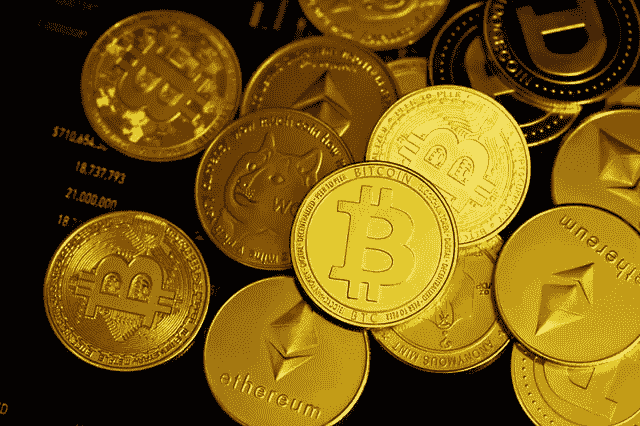

# 作为投资加密货币的初学者，我学到了 3 件事

> 原文：<https://medium.com/coinmonks/3-things-i-learned-as-a-beginner-investing-in-cryptocurrency-f31018357b82?source=collection_archive---------38----------------------->

*免责声明:本文仅旨在总结我的经验以及我在投资 crypto 的第一年所学到的东西，而不是提供任何财务建议。强烈建议在进行任何投资之前进行风险评估。*

Photo by [Kanchanara](https://unsplash.com/@kanchanara?utm_source=unsplash&utm_medium=referral&utm_content=creditCopyText) on [Unsplash](https://unsplash.com/s/photos/crypto?utm_source=unsplash&utm_medium=referral&utm_content=creditCopyText)

就在几年前，世界上大多数人都不知道的术语现在正被广泛谈论:加密货币(Crypto)…