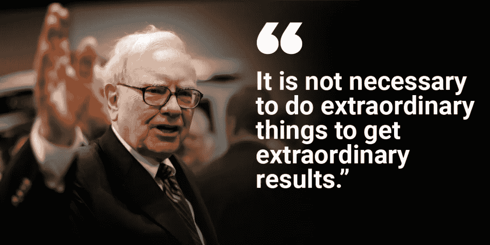

# 现在就买 3 只沃伦巴菲特的股票

> 原文：<https://medium.com/coinmonks/3-warren-buffet-stocks-to-buy-right-now-261a9292a110?source=collection_archive---------24----------------------->

Source photo [warren buffett quotes — Bing images](https://www.bing.com/images/search?view=detailV2&ccid=Ei5alvPZ&id=81A6A18F5470EF2E02322F676334C931F316C480&thid=OIP.Ei5alvPZpxzv-poOFLt18QHaDt&mediaurl=https%3a%2f%2fwww.whizsky.com%2fwp-content%2fuploads%2f2018%2f01%2fWarren-Buffett.png&cdnurl=https%3a%2f%2fth.bing.com%2fth%2fid%2fR.122e5a96f3d9a71ceffa9a0e14bb75f1%3frik%3dgMQW8zHJNGNnLw%26pid%3dImgRaw%26r%3d0&exph=595&expw=1190&q=warren+buffett+quotes&simid=608003224577509902&FORM=IRPRST&ck=6CFBE4C1CA6C397E525225793211C0DA&selectedIndex=6&ajaxhist=0&ajaxserp=0)

# 可口可乐公司

沃伦·巴菲特投资了几家知名公司，包括可口可乐(纽约证券交易所代码:KO)。这位奥马哈先知显然每天都要吃掉许多罐樱桃可乐。

考虑到伯克希尔在这家软饮料制造商中拥有相当大的股份，他一定觉得有义务保持忠诚。凭借其 4 亿股可口可乐股票，伯克希尔控制着 920 万股可口可乐股票