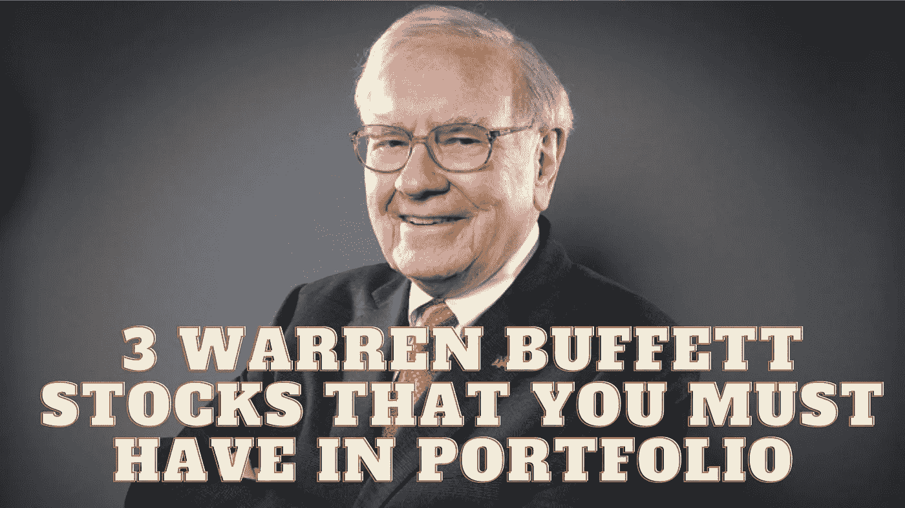

# 投资组合中必不可少的 3 只沃伦·巴菲特股票

> 原文：<https://medium.com/coinmonks/3-warren-buffett-stocks-that-you-must-have-in-portfolio-6be67618f58b?source=collection_archive---------41----------------------->

Source photo [warren buffet — Căutare Google](https://www.google.ro/search?q=warren+buffet&sxsrf=ALiCzsb6pVYHzoEkIbIm4veCN8Oc7i6qag:1666197710476&source=lnms&tbm=isch&sa=X&ved=2ahUKEwji5KGV3uz6AhU_X_EDHeRcAj4Q_AUoAXoECAEQAw&biw=1319&bih=649&dpr=1#imgrc=Nf2yME84d2a-kM)

# 苹果公司(AAPL)

过去十年中表现最好的股票之一是苹果(纳斯达克股票代码:AAPL)。在此期间，苹果公司(纳斯达克股票代码:AAPL)的股票平均每年上涨 21.17%。这些回报率比科技股云集的纳斯达克高出 81%。苹果股票的价值增加了大约 7 倍于初始投资…