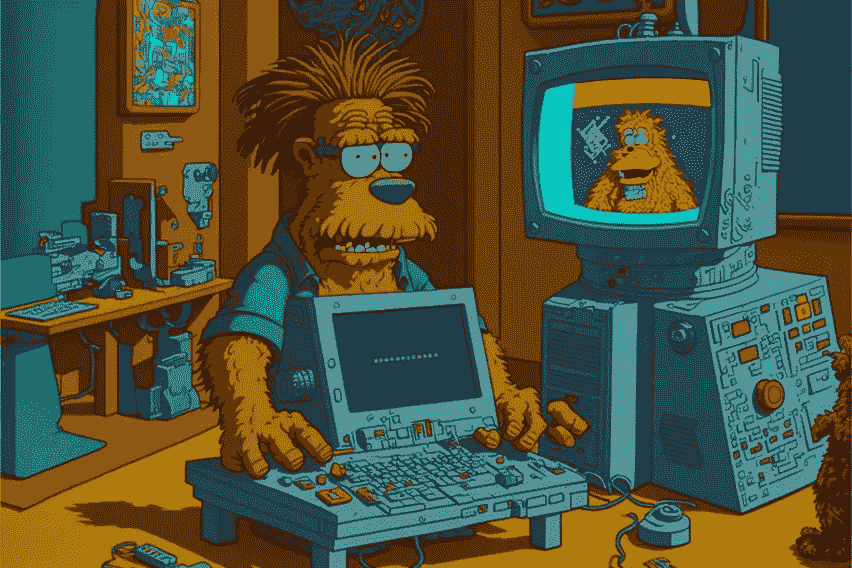

# 人工智能帮助你赚钱的 3 种方式🤖 💸

> 原文：<https://medium.com/coinmonks/3-ways-ai-can-help-you-make-money-67ebc5ac001?source=collection_archive---------2----------------------->

> 如果你在 2023 年 1 月 15 日之前订阅时事通讯，你就有机会赢得来自 WOKEYS NFT 项目的 1/10 免费 NFT，并且你将获得一个免费的 AI 初学者 Guide🦧 ⬇️
> 
> [订阅简讯！](https://multilayeredmarketing.mykajabi.com/)📰

__________________________________________________________________________________________________________________________________

## 1.出售股票图片

使用****(或其他图像生成应用程序)创建图像，然后出售。****

****如果你为 midjourney 付费(约 36 美元/月)，你就有权出售你使用 midjourney 应用程序创建的图片。****

> ****交易新手？在[最佳加密交易](/coinmonks/crypto-exchange-dd2f9d6f3769)上尝试[加密交易机器人](/coinmonks/crypto-trading-bot-c2ffce8acb2a)或[复制交易](/coinmonks/top-10-crypto-copy-trading-platforms-for-beginners-d0c37c7d698c)****

****这意味着你可以随心所欲地创造出令人敬畏的图像，并出售这些图像！你可以把它们单独放在[**Etsy**](https://www.etsy.com/shop/TYinTECH?ref=seller-platform-mcnav)**上或者按照我的做法把它们捆在[**gum road**](https://wokeyverse.gumroad.com/l/AI-Metaverse-Set-1)**上。********

******随着时间的推移，你可能会因为把你的图片放在这些网站上出售而额外获得 10，100，甚至 1000 美元。******

******如果你想变得更高级，那么你可以去 [**RedBubble**](https://www.redbubble.com/people/MultiLayered/shop?asc=u&ref=account-nav-dropdown) (我的店面于 1 月 20 日开业)，然后调整你的图像大小，你可以让它们为你在衬衫、杯子、海报、鼠标轻拍上投放产品。你说吧！******

****任何地方，只要有人想用他们的艺术作品赚钱，你都可以！见鬼，你甚至可以开一个画廊，向公众展示你的照片！****

********

## ****2.创建无尽的博客****

****有了 ChatGPT 和 Playground 这样的应用，无论是从 [**OpenAI**](https://openai.com/) **，**你都有了一个近乎完美的作家、营销人员、编码人员、秘书、编辑等等……触手可及，免费！！！****

****这些工具对于任何需要帮助的企业家来说都是无价的。****

****人工智能的能力是无穷无尽的，而且每天都在成倍地提高！****

****你可以让**[**ChatGPT**](https://chat.openai.com/)**创建一个科技、网络 3、区块链、金融领域的 10 大(或 100 大)热门话题列表……然后你可以让它为所有这些话题的博客文章起一个朗朗上口的标题。如果你愿意，你可以让它为你写一篇 500-1000 字的博文。********

******如果你真的想的话，你可以每天发好几篇博文。******

******有了这些，你就可以向它索要一份适合你的公司名单，然后你可以开始询问这些公司是否愿意支付一定的费用来刊登你的博客文章……随着你的受众的增加，你可以开始索要更多的钱，并最终从中获得丰厚的收入。******

************

## ******3.开始播客******

******我们谈到了 ChatGPT、Midjourney 和 Playground，但没有触及其他 AI 工具，如[**【Murf】**](https:://www.murf.ai)或[**Soundful**](https://www.soundful.com)**。********

****Murf 可以接收你给它的文本，并以多种不同的声音吐出近乎完美的文本音频，从澳大利亚小孩到西班牙阿姨。我相信如果需要的话，它还可以给你一个声音的头像。****

****然后，您可以使用该声音，并将其以音频格式放入播客中。****

****a.使用 ChatGPT 创建播客主题，并编写脚本
b .使用 Murf 将脚本转换为播客
c .使用 Soundful 创建背景音乐等…****

****如果你真的很高级，你可以让 Murf 为一个共同主持的播客创建两个不同角色的声音，他们之间进行充分的对话。****

****在你发展了一批追随者之后，你就可以在你的播客上出售赞助。****

********

****__________________
**群众演员:******

*   ******人工智能:**
    -为您(或为客户)创建营销活动
    -撰写电子书、儿童读物、大型书籍、小说等……
    -为网站、登陆页、传单等撰写文案……
    -为漫画、网站、书籍等创建图像……
    -为您、为 YouTube、Spotify、抖音等创建音乐……****

****_______________________****

> ****获得被动收入的可能性似乎是无穷无尽的，现在是在 AI 还“年轻”和大众还没赶上之前进一步探索这些想法的最佳时机！****

********

> ****1 月 17 日[号工作钥匙](https://twitter.com/TheWokeys)就要来了！！！****
> 
> ****是时候打开你内心的“觉醒的视觉”了，🧙🏼‍♂️****

****_ _ _ _ _ _ _ _ _ _ _ _ _ _ _ _ _ _ _ _ _ _ _ _ _ _ _ _ _ _
_ _ _ _ _ _ _ _ _ _ _ _ _ _ _ _ _ _ _ _ _ _ _ _ _ _ _ _ _ _ _****

******永远小心！！！⚠️******

> ****我怎么强调都不为过！保持高度警惕，留意你点击的每一个链接、你做的每一笔交易和你接触的每一个人，因为这个领域骗子很多，即使是最好看的项目也会被撤下。****
> 
> *****在点击所有链接之前，要再三检查，确保它们是你要找的官方链接。此外，在给自己或他人发送任何有价值的东西之前，要再三检查所有的钱包地址。*****

****[LinkTree](https://linktr.ee/multilayeredmarketing)
[LinkTree](https://linktr.ee/multilayeredmarketing)
[LinkTree](https://linktr.ee/multilayeredmarketing)****

> ****在 [**Gumroad**](https://wokeyverse.gumroad.com/l/AI-Metaverse-Set-1) 收银台使用代码“**the keys 1**”购买第一(50)个系列包装，享受 100%折扣！****

> ****请通过发送 Polygon Matic 到这个 Eth 地址或 Eth Tokens 来支持我和我的家庭🙏🏼****
> 
> *******0xb 53 b 3978333 e 11 c 382 ab 619 f 02 f 469 A8 c 70750 af*******
> 
> *****_ _ _ _ _ _ _ _ _ _ _ _ _ _ _ _ _ _ _ _ _ _ _ _ _ _ _ _ _ _ _ _ _ _ _ _ _ _ _ _ _ _ _ _ _ _ _ _ _ _ _ _ _ _*****

> ****如果你在 2023 年 1 月 15 日之前订阅时事通讯，你就有机会赢得来自 WOKEYS NFT 项目的 1/10 免费 NFT，并且你将获得一个免费的 AI 初学者 Guide🦧 ⬇️****
> 
> ****订阅时事通讯！📰****

********

# ****干杯，
泰因泰****

*****邮箱:ty @ multilayeredmarketing . XYZ* [LinkTree](https://linktr.ee/multilayeredmarketing)****

******我的一些其他博文:** [web 3 十大作家](/coinmonks/top-10-web3-writers-ca995689c17f) [web 3 五大败笔](/coinmonks/5-downfalls-of-web3-cd5dc8ade4fd)
[5 + 5 不欢而散的战术](/coinmonks/5-tips-for-a-better-discord-nft-crypto-edition-ff9b039d0359)
[Crypto 101:初学者指南](/coinmonks/crypto-101-a-beginners-guide-345d440bd163)
[NFT 五大最佳实践(营销&社区成长)](/coinmonks/top-5-nft-best-practices-marketing-and-community-growth-7025e26eb50c)
[Web3 基础知识](/coinmonks/web3-basics-252121357f33)
[可供 NFT 选择的实用案例【t2t &我们所知的自由的终结](/coinmonks/alternative-nft-crypto-real-life-use-cases-b7c0b08d99ef)
[2023 年 5 大 AI 趋势](/coinmonks/top-5-a-i-trends-for-2023-fccd7a755a31)
[2023 年 10 本另类读物](/coinmonks/10-alternative-books-to-read-for-2023-f01f0a4d9aa9)****

> ****加入 Coinmonks [电报频道](https://t.me/coincodecap)和 [Youtube 频道](https://www.youtube.com/c/coinmonks/videos)了解加密交易和投资****

# ****另外，阅读****

*   ****[如何使用 Solidity 在以太坊上创建 DApp？](https://coincodecap.com/create-a-dapp-on-ethereum-using-solidity)****
*   ****[加密交易机器人](/coinmonks/crypto-trading-bot-c2ffce8acb2a) | [OKEx vs 币安](https://coincodecap.com/okex-vs-binance)****
*   ****[币安 vs FTX](https://coincodecap.com/binance-vs-ftx) | [最佳(SOL)索拉纳钱包](https://coincodecap.com/solana-wallets)****
*   ****[如何在 Uniswap 上交换加密？](https://coincodecap.com/swap-crypto-on-uniswap) | [A-Ads 评论](https://coincodecap.com/a-ads-review)****