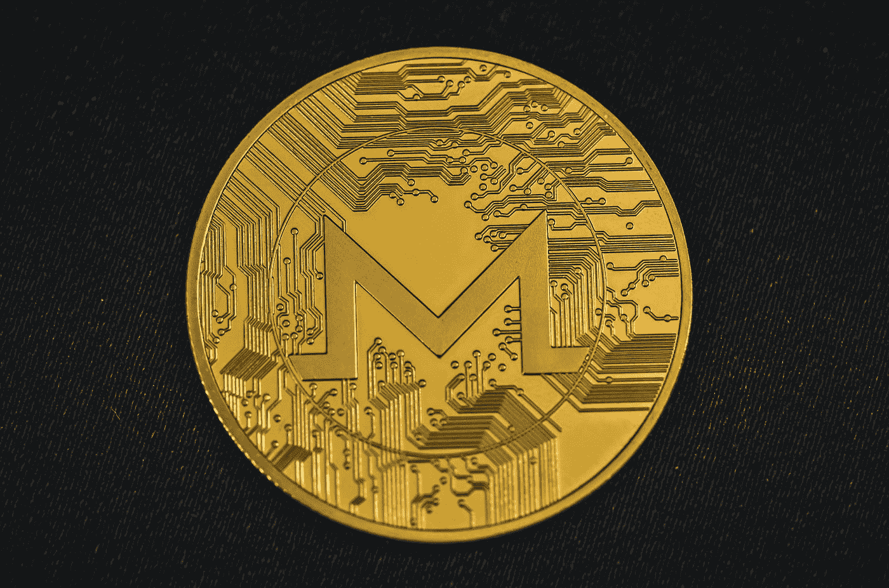
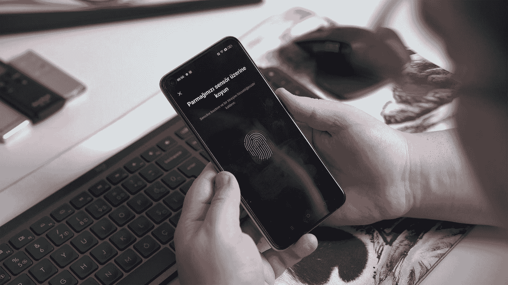

# 无 KYC 购买加密货币的 3 种方式(无身份验证或年龄要求)

> 原文：<https://medium.com/coinmonks/3-ways-to-buy-cryptocurrency-without-kyc-no-id-verification-or-age-requirement-8c3da61cf716?source=collection_archive---------31----------------------->

# **简介**

Photo by [Shubham Dhage](https://unsplash.com/@theshubhamdhage?utm_source=medium&utm_medium=referral) on [Unsplash](https://unsplash.com?utm_source=medium&utm_medium=referral)

B 购买加密货币而不进行“了解你的客户”( KYC)验证是可能的，但这可能需要一些努力，并且可能不适用于所有类型的加密货币。KYC 验证是金融机构验证其客户身份时通常需要的过程。这样做是为了防止洗钱和其他非法活动，通常需要从交易所和其他平台购买加密货币。

在本文中，我们将探索几种无需 KYC 验证就可以购买加密货币的方法。我们将讨论每种方法的优缺点，并提供一些提示和建议，告诉您如何根据自己的需求选择正确的选项。

**选项 1:使用分散式交易所**

Photo by [Shubham Dhage](https://unsplash.com/@theshubhamdhage?utm_source=medium&utm_medium=referral) on [Unsplash](https://unsplash.com?utm_source=medium&utm_medium=referral)

购买加密货币而不经过 KYC 验证的一种方式是使用分散式交易所(DEX)。dex 是允许用户直接相互购买和出售加密货币的平台，不需要中介。因为 dex 不要求用户创建账户或通过 KYC 验证，所以它们提供了一种更私人和匿名的方式来买卖加密货币。

> 从顶级交易者那里复制交易机器人。免费试用。

优点:

*   dex 提供了一种更加私密和匿名的方式来买卖加密货币。
*   dex 不要求用户创建帐户或通过 KYC 验证。
*   dex 允许用户之间直接买卖加密货币，无需中介。

缺点:

*   并非所有 dex 都支持所有类型的加密货币。
*   dex 可能不像传统交易所那样方便用户。
*   dex 可能需要更高水平的技术知识才能使用。

提示和建议:

*   做你的研究，找到一个支持你想买的特定类型的加密货币的指数。
*   准备花一些时间学习如何使用 DEX，因为它们可能不像传统交易所那样用户友好。
*   使用 dex 时要谨慎，因为与传统交易所相比，欺诈和其他诈骗的风险更高。

**选择 2:使用点对点(P2P)平台**

Photo by [André François McKenzie](https://unsplash.com/@silverhousehd?utm_source=medium&utm_medium=referral) on [Unsplash](https://unsplash.com?utm_source=medium&utm_medium=referral)

购买加密货币而不经过 KYC 验证的另一种方式是使用点对点(P2P)平台。P2P 平台允许用户之间直接连接，无需中介即可买卖加密货币。这意味着用户无需创建账户或通过 KYC 验证即可使用该平台。

优点:

*   P2P 平台提供了一种更加私密和匿名的方式来买卖加密货币。
*   P2P 平台不要求用户创建账户或通过 KYC 验证。
*   P2P 平台允许用户之间直接联系，不需要中介。

缺点:

*   P2P 平台可能没有传统交易所那么人性化。
*   P2P 平台可能需要更高水平的技术知识才能使用。
*   与传统交易所相比，P2P 平台的欺诈和其他诈骗风险更高。

提示和建议:

*   做好自己的调研，选择一个信誉好，值得信赖的 P2P 平台。
*   准备花一些时间学习如何使用 P2P 平台，因为它们可能不像传统交易所那样用户友好。
*   在使用 P2P 平台时要谨慎，一定要使用信誉良好、值得信赖的卖家，以避免欺诈和其他骗局。

**选项 3:使用注重隐私的加密货币**

Photo by [Traxer](https://unsplash.com/@traxer?utm_source=medium&utm_medium=referral) on [Unsplash](https://unsplash.com?utm_source=medium&utm_medium=referral)

另一种选择是使用注重隐私的加密货币，如 Monero 或 Zcash，它们提供内置的隐私功能，使跟踪交易更加困难。这些加密货币可以在交易所或通过 P2P 平台购买，不需要 KYC 验证。然而，需要注意的是，一些交易所和平台可能仍然需要对这些类型的加密货币进行 KYC 验证，所以做好您的研究并找到一个不需要它的平台非常重要。

优点:

*   注重隐私的加密货币提供内置的隐私功能，使其难以追踪交易。
*   这些加密货币可以在交易所或通过 P2P 平台购买，无需 KYC 验证。
*   与其他加密货币相比，注重隐私的加密货币提供了高水平的隐私和匿名性。

缺点:

*   并非所有的交易所和平台都支持注重隐私的加密货币。
*   一些交易所和平台可能仍然需要对这些类型的加密货币进行 KYC 验证。
*   注重隐私的加密货币可能不像其他加密货币那样被广泛接受或支持。

提示和建议:

*   做你的研究，找到一个声誉良好的交易所或平台，支持以隐私为重点的加密货币，不需要 KYC 验证。
*   准备好花些时间了解以隐私为中心的加密货币，以及如何安全地使用它们。
*   请注意，注重隐私的加密货币可能不会像其他加密货币那样被广泛接受或支持，也可能不适合所有用途。

**结论**

Photo by [Onur Binay](https://unsplash.com/es/@onurbinay?utm_source=medium&utm_medium=referral) on [Unsplash](https://unsplash.com?utm_source=medium&utm_medium=referral)

总之，有几种方法可以在不经过 KYC 验证的情况下购买加密货币。dex 和 P2P 平台提供了一种更加私密和匿名的方式来买卖加密货币，但在使用这些平台之前，务必要谨慎行事并做好调查。此外，注重隐私的加密货币可能提供一种无需 KYC 验证即可买卖加密货币的方式，但务必要与您使用的平台或交易所核实，以确保这是可能的。无论您选择哪种方法，重要的是要仔细考虑利弊，并根据您的具体需求和目标做出明智的决定。

> 多样化的密码持有，了解[币安替代品](https://coincodecap.com/binance-alternatives)

*   [什么是保证金交易](https://coincodecap.com/margin-trading) | [美元成本平均法](https://coincodecap.com/dca)
*   [支持卡审核](https://coincodecap.com/uphold-card-review) | [信任钱包 vs 元掩码](https://coincodecap.com/trust-wallet-vs-metamask)
*   [Exness 回顾](https://coincodecap.com/exness-review)|[moon xbt Vs bit get Vs Bingbon](https://coincodecap.com/bingbon-vs-bitget-vs-moonxbt)
*   [如何开始通过加密贷款赚取被动收入](https://coincodecap.com/passive-income-crypto-lending)
*   [BigONE 交易所评论](/coinmonks/bigone-exchange-review-64705d85a1d4) | [电网交易机器人](https://coincodecap.com/grid-trading)