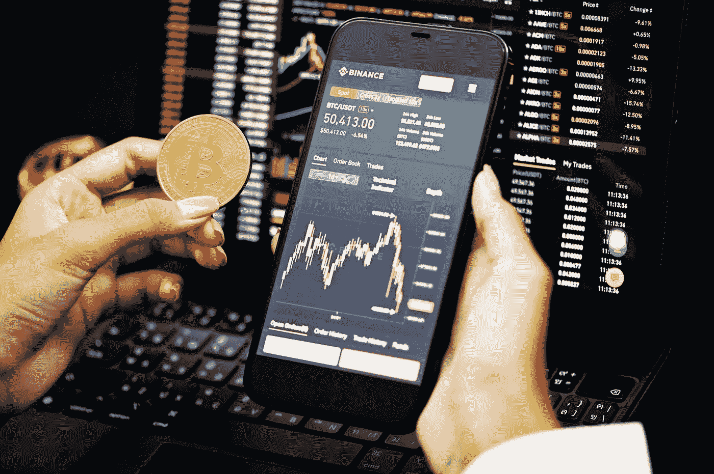

# 在你的文件夹里放 3 个冬盾密码

> 原文：<https://medium.com/coinmonks/3-winter-shield-cryptos-to-keep-in-your-portfolio-ed5bab41c6ee?source=collection_archive---------15----------------------->

Photo by [Kanchanara](https://unsplash.com/@kanchanara?utm_source=medium&utm_medium=referral) on [Unsplash](https://unsplash.com?utm_source=medium&utm_medium=referral)

即使几种加密货币的价值已经从 6 月份的低点回升，宣称加密的冬天已经结束仍然为时过早。

然而，那些对市场有长期看法的人不应该急于清算他们的比特币持有量。

相反，他们应该专注于提高投资组合的质量，以在加密的冬天尽可能地保持价值。

由于加密资产价格的普遍下降，许多最高质量的令牌目前正在打折交易。

那些一直在寻求额外保护解决方案的人将会发现这是一个绝佳的机会(如果这个行业曾经存在过的话)。

# 2022 年 8 月购买的令人敬畏的加密和 Hodl №1: BNB BNB

**市值:48076340040 美元**

**在 CMC 上的位置:** #5

**当前价格:** $297.99

被广泛认为是最大的加密货币交易平台的币安交易所有其本土硬币， [***币安硬币***](https://coinmarketcap.com/currencies/bnb/) 。

这种加密货币是币安智能链的原生货币，这是增长速度最快的智能合约平台之一。

今天早上，币安宣布他们将与足球巨星克里斯蒂亚诺罗纳尔多长期合作。

与抖音明星科比·拉梅的合作只是该公司众多成功合作伙伴之一。

通过提高币安的知名度，这些努力从长远来看有利于代币持有者。

币安计划与上述明星一起推出 NFT 系列，以扩大其客户群，提高其整体知名度。

随着越来越多的人开始使用加密货币交易所，我认为 BNB 是一个标志，可能会迅速获得很大一部分市场。

对这个市场有长远眼光的投资者可能会发现，购买 BNB 是有益的，因为币安交易所是全球舞台上的领导者。

> 另外，请参见:[2022 年 8 月购买的 3 款出色的加密软件和 Hodl](https://www.sammaiyaki.com/3-awesome-crypto-to-buy-in-august-2022-and-hodl-e957ffd94ed1?source=user_profile---------0----------------------------)

# 将于 2022 年 8 月购买的令人敬畏的加密和 Hodl №2:以太坊以太网

198，124，776，476 美元

**在 CMC 上的位置:** #2

当前价格:1623.25 美元

最近加密冬天解冻的主要受益者之一是 [***以太坊 ETH***](https://coinmarketcap.com/currencies/ethereum/) ，这是目前全球市值第二大的加密货币。

这种转变主要归因于这两个网络在下个月的某个时候的预期合并。

看好即将推出的以太坊版本的投资者一直在购买代币，并押注于加密货币，期待这一时刻的到来。

由于这种结合，以太坊区块链将成为一个更节能的利益相关网络。

此外，许多人认为网络的令牌组学、吞吐量指标和成本指标将在不久的将来得到改善。

每一个曾经在以太坊网络上进行或收到交易的人都将从这次升级中受益匪浅。

如果你是一名具有长期前景的投资者，想要从加密货币领域历史上最重要的升级中获利，以太坊可能是你可以考虑的一个好选择。

完成合并的日期定在 8 月 30 日。

> 另请参见: [3 个加密代币，用一些 100 美元的纸币进行投资](https://www.sammaiyaki.com/3-crypto-tokens-to-invest-in-with-a-few-100-notes-5dbb6b3a19d7?source=user_profile---------1----------------------------)

# 2022 年 8 月购买的令人敬畏的密码和 Hodl №3: Solana SOL

**市值:12696779497 美元**

**在 CMC 上的位置:** #9

**当前价格:** $36.37

[***Solana SOL***](https://coinmarketcap.com/currencies/solana/)平台正在快速发展，并渴望与以太坊竞争，成为最受欢迎的智能合约平台之一。

你可以在 Solana 上完成你在以太坊上能做的任何事情。

随着越来越多的用户和开发者关注这个网络，Solana 生态系统的发展非常引人注目。

索拉纳用户可以使用 NFTs、Defi 应用程序、meme 货币和元宇宙即玩即赚游戏。

正如硬币的长期走势图所示，索拉纳随着时间的推移迅速扩张，可能是因为这个领域的网络效应盛行。

> 另外，请看: [3 台 Cryptos 将于 2022 年起飞](https://www.sammaiyaki.com/3-cryptos-set-to-soar-in-2022-96f65b6a379a?source=user_profile---------3----------------------------)

# 总结一下

即使几种加密货币的价值已经从 6 月份的低点回升，宣布加密的冬天结束仍然为时过早。

另一方面，那些对市场有长期看法的人不应该现在就清算他们的比特币持有量。

相反，他们应该专注于提高投资组合的整体质量，以保持尽可能多的价值。

> 另请参见:[今天购买的 3 种最佳加密货币和长期使用的 Hodl】](https://www.sammaiyaki.com/3-best-cryptocurrency-to-buy-today-and-hodl-for-the-long-run-aa0a880f099?source=user_profile---------4----------------------------)

# 财务免责声明

需要强调的是，这篇文章中的任何内容都不应该被解释为提供投资或金融建议。

本文分享的观点仅代表作者个人观点，因此不应作为金融交易或投资的建议。

此信息按“原样”*提供，不保证准确性、可靠性或全面性。*

*由于其非常不稳定的特性，比特币的价格最近一直处于不稳定的波动之中。*

*每个考虑投资加密货币的人都应该在决定是否投资加密货币之前，研究并了解他们所在地区的相关法规。*

# ****参考:****

*3 Cryptos 将于 2022 年上市。尽管多次鼓励。[https://blog . cryptos stars . is/3-cryptos-set-to-soar-in-2022-96f 65 B6 a 379 a](https://blog.cryptostars.is/3-cryptos-set-to-soar-in-2022-96f65b6a379a)*

> *交易新手？尝试[加密交易机器人](/coinmonks/crypto-trading-bot-c2ffce8acb2a)或[复制交易](/coinmonks/top-10-crypto-copy-trading-platforms-for-beginners-d0c37c7d698c)*