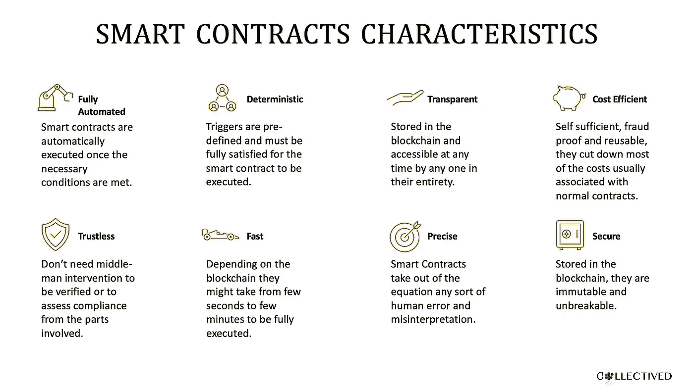
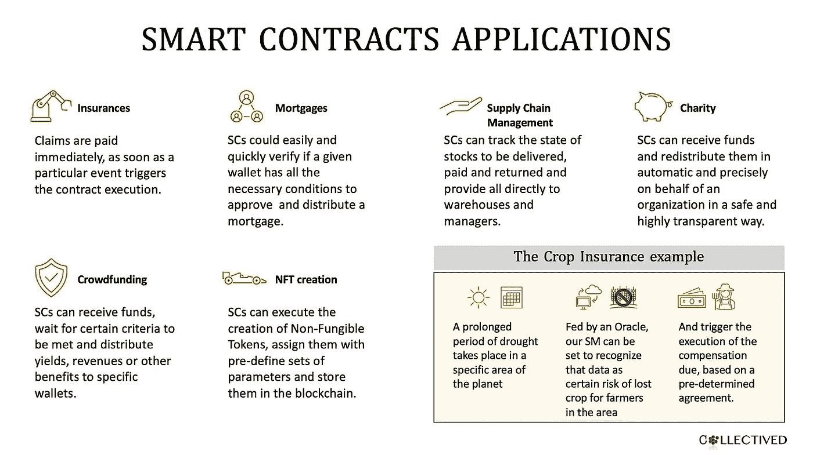
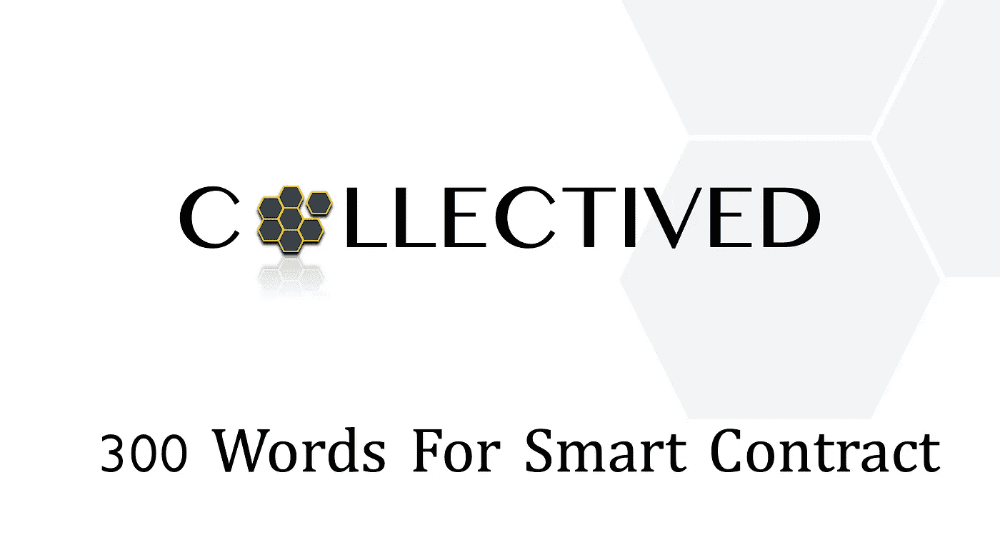

# 智能合同 300 字

> 原文：<https://medium.com/coinmonks/300-words-for-smart-contract-4bdfaab2de7f?source=collection_archive---------36----------------------->

# 在大多数区块链应用程序的后端工作的产品简介。

智能合约(Smart Contract)一词由 Nick Szabo 于 1994 年提出，它定义了一个存储在区块链中的程序，当其代码中阐明的条款和条件得到满足时，该程序将自动执行。

在加密领域已经被广泛采用，通常用来描述智能合约基本原则的隐喻是自动售货机:

> *如果*您选择了一种产品
> 
> *然后*机器会显示它的价格
> 
> *如果*你插入钱
> 
> 然后，机器会计算它们值多少钱
> 
> *如果*达到所选产品要求的金额
> 
> *然后*机器将为您分发产品
> 
> *如果*你投入的钱比要求的多
> 
> 然后机器会把差额退还给你

简而言之，在查看 SM 时，我们通常可以识别:

1.  **一行代码**，可能会触发无限多种动作。
2.  **一个余额**，可以存储、接收或发送加密货币。
3.  区块链，这份合同安全地存放在那里。

由于在区块链中进行了加密，智能合约还获得了两个额外的优势:

1.  它们是不可改变的，因此一旦签署，没有人能改变它们。
2.  它们是高度透明的，因为在任何时间点都是可访问和可证实的。

得益于上述所有优势，加上相互交互的能力，以及与甲骨文的交互能力，智能合约是一种非常通用的工具，可以在各行各业和各种应用中使用。

撰写本文时，智能合同正在研究和进一步开发中，我们确信它们将在区块链的发展中发挥重要作用。

在这种情况下，我们推荐一些额外的内容来深入探讨这个主题:

Nick Szabo 的智能合同

[智能合约:数字市场的基石，作者 Nick Szabo](https://www.fon.hum.uva.nl/rob/Courses/InformationInSpeech/CDROM/Literature/LOTwinterschool2006/szabo.best.vwh.net/smart_contracts_2.html)——论文

[智能合约—Ethereum.org](https://ethereum.org/en/smart-contracts/)—文章

[Finematics 解释的智能合约](https://www.youtube.com/watch?v=pWGLtjG-F5c&t=71s) —视频

[什么是 Crypto 中的智能合约？由白板加密](https://www.youtube.com/watch?v=pyaIppMhuic) —视频

[智能合约在保险行业的应用](https://www.youtube.com/watch?v=oiYRQkKkpwg) —视频

感谢您阅读 Collectived 的时事通讯！免费订阅接收新帖，支持我的工作。

> 交易新手？尝试[加密交易机器人](/coinmonks/crypto-trading-bot-c2ffce8acb2a)或[复制交易](/coinmonks/top-10-crypto-copy-trading-platforms-for-beginners-d0c37c7d698c)