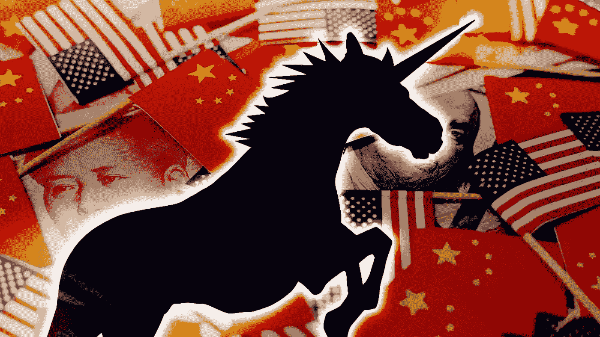
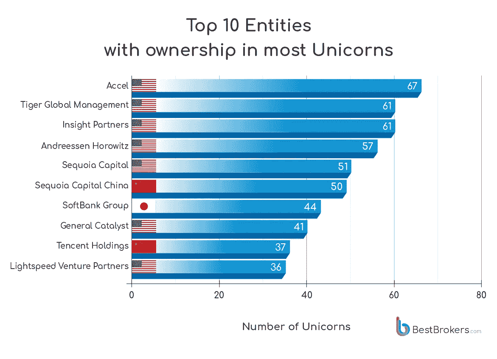
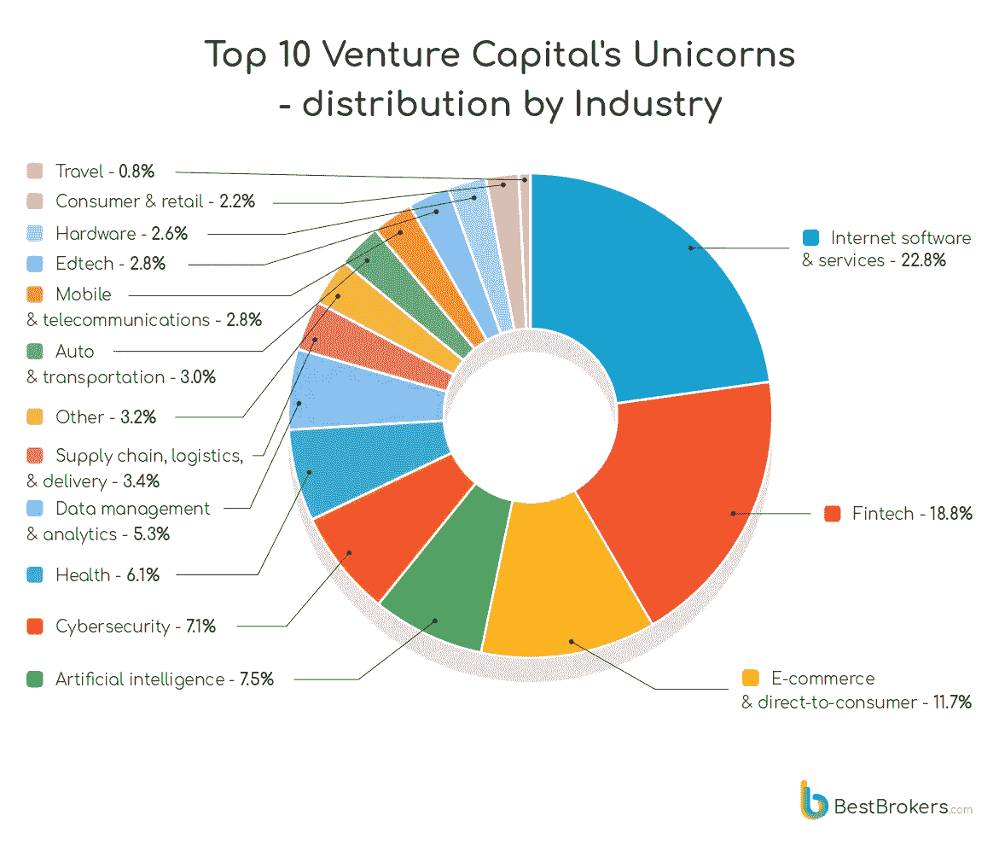
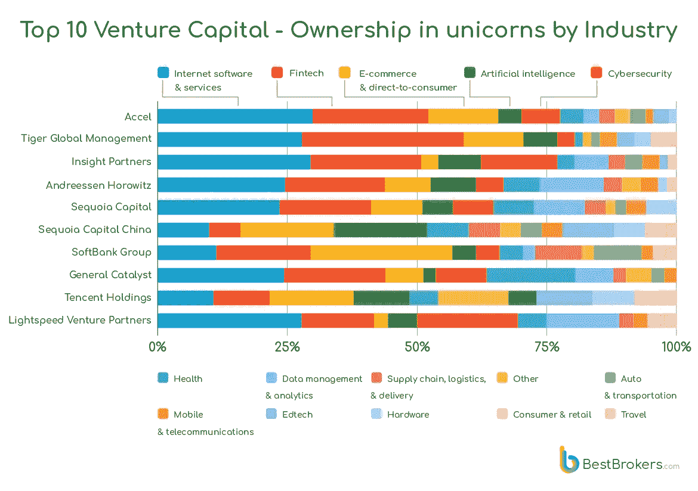

# 全球 38%的独角兽由前 10 大风投所有。

> 原文：<https://medium.com/coinmonks/38-of-all-unicorns-in-the-world-are-owned-by-the-top-10-vcs-96f1d07985de?source=collection_archive---------26----------------------->

Just ten firms own 38% of all 1143 unicorns currently on the market.

就像生活中的所有事情一样，任何领域或行业的佼佼者都远远领先于其他人。

“BestBroker 的报告确定了投资最多独角兽的前 10 大实体。数据显示，目前市场上 1143 只独角兽中，只有 10 家公司拥有 38%的份额。Accel 在 67 家价值超过 10 亿美元的公司中独占鳌头，而 Tiger Global Management 和 Insight Partners 都投资了 61 家独角兽公司。

有趣的是，在全球排名前 10 的风险投资公司中，有 7 家属于美国。

中国有 2 个席位，当然，软银也在那里。

令人感兴趣的是，如果我们将这一数据与前 10 大风投公司的 IPO 或退出数量进行交叉比较。

我想知道谁会胜出？

USA still dominates Unicorn ownership.

显然 A16Z、Accel、Sequoia 和 Tiger Global 在这个指标上都排名很高。

那么钱都流向了哪里？

似乎是软件和金融科技。

“按照行业对这些独角兽进行分组显示了一个不可否认的趋势——大多数风险投资资金似乎都流向了软件和金融科技公司。”

"自 2021 年初以来，金融科技独角兽增长了惊人的 330%，其次是互联网软件和服务增长了 274%，网络安全增长了 267%。接下来是健康、数据分析、物流和人工智能。“我们可以清楚地看到，趋势行业是如何受到疫情及其带来的变化的强烈影响，”BestBrokers 的分析师艾伦·戈德堡说

Fintech and Software has always dominated the appetite of VCs, and probably will for the next decade.

这是有道理的，自风投开始以来，金融科技和软件一直主导着风投的资金。

但是不要在网络安全和 AI 上睡大觉。

随着更多的技术、更多的软件、更多的数据吞噬世界，网络安全至关重要。

公司不能再忽视它了，他们会为了用户和他们自己花大价钱来保护他们的数据。

这些年来，人工智能一直在发展、成熟和成长。

随着我们看到更多有趣的应用和实现进入现实世界，如人工智能驾驶、解决复杂问题、医学研究，风投将继续投入资金资助增长。

有趣的是，电子商务在风投中也很受欢迎。

尤其是在亚洲，随着手机和互联网普及率的上升，电子商务的蓬勃发展也就顺理成章了。

Software and Fintech seems to be the bread and butter of all VCs.

“疫情带来的变化在我们看到的电子商务的增长中最为明显。在所有上榜的亚洲企业的投资组合中，电子商务和直接面向消费者的公司都占有很大的比重，该行业在所有三家亚洲企业中排名第一。

正如许多人预测的那样，亚洲正在增长。

亚洲的人才正在成熟，我们正在为下一个大浪潮做准备，在未来给我们带来非凡优势的领域进行深思熟虑的播种。

创业生态系统也在逐渐成熟，虽然缓慢但却稳定。

我对投资亚洲很感兴趣。

为下一个十年的增长、机遇和繁荣干杯。

-

未来 fintech 和软件还会继续占据主导地位吗？

-

#创业#商业#创业#成长#成功#社交媒体#文化#创业#战略#电子商务#风险投资#成长#投资#独角兽

> 交易新手？试试[加密交易机器人](/coinmonks/crypto-trading-bot-c2ffce8acb2a)或者[复制交易](/coinmonks/top-10-crypto-copy-trading-platforms-for-beginners-d0c37c7d698c)