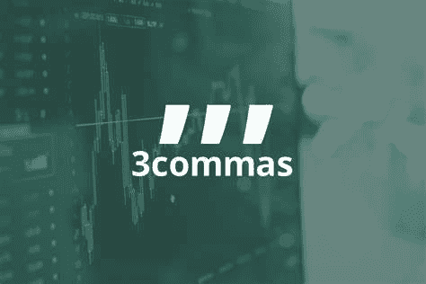
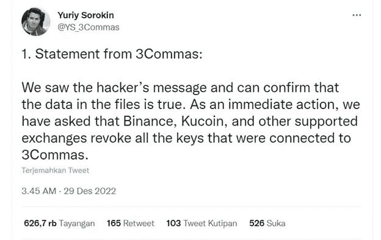
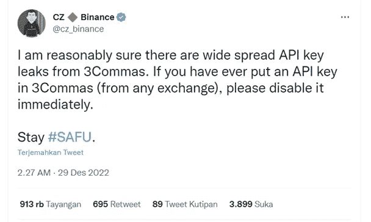
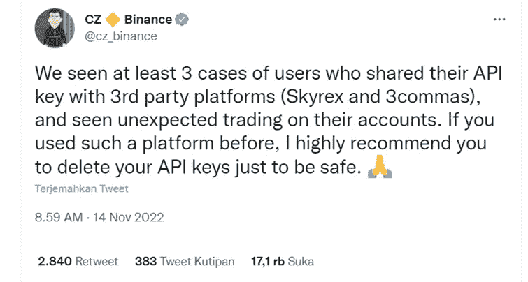
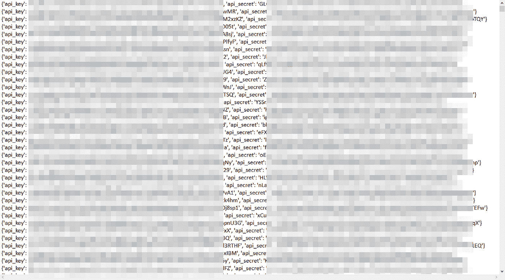

# 3Commas Crypto Trading Bot 平台泄漏

> 原文：<https://medium.com/coinmonks/3commas-crypto-trading-bot-platform-leak-cfdaaf368279?source=collection_archive---------39----------------------->

交易机器人是使用交易机器人开发的软件，其功能是自动进行交易。交易机器人被创造出来是为了阅读交易信号和执行交易。通过用户设置的初始设置，机器人将根据我们的意愿运行。

> 交易新手？在[最佳加密交易](/coinmonks/crypto-exchange-dd2f9d6f3769)上尝试[加密交易机器人](/coinmonks/crypto-trading-bot-c2ffce8acb2a)或[复制交易](/coinmonks/top-10-crypto-copy-trading-platforms-for-beginners-d0c37c7d698c)

**3Commas 是一个智能加密交易平台，使用自动化机器人生成交易**成立于 2017 年。该平台已被交易者广泛用于加密货币交易中获利。3Commas 将其平台连接到交易所，如币安的加密交易所机器人。用户可以设置自己的交易规模，即获利/亏损的规模。

[https://twitter.com/YS_3Commas/status/1608202390121111552](https://twitter.com/YS_3Commas/status/1608202390121111552)

## 3Commas 首席执行官声明

1.  3Commas 团队查看了黑客的信息，并确认文件中的数据是正确的。3Commas 要求币安、Kucoin 和其他受支持的交易所撤销所有与 3Commas 相关的密钥。
2.  3Commas 团队怀疑黑客是由内部人员实施的，但据他们称，这一点尚未得到证实
3.  事件发生后，3Commas 实施了新的安全措施，并启动了全面调查，执法部门将参与其中。

> 3Commas 的疏忽会退款吗？

## 其他声明

**币安 CEO(赵昌鹏)本人表示，API 密匙普遍泄露**

[https://twitter.com/cz_binance/status/1608182790540902407](https://twitter.com/cz_binance/status/1608182790540902407)

API 密钥本身是一个独特的代码，其功能是提供登录访问，并将代码从一个开发人员连接到另一个开发人员。

这个 API 密匙泄露案例之前在去年 11 月发生在 Skyrex 和 3Commas 平台上。

[https://twitter.com/cz_binance/status/1591974155783909377](https://twitter.com/cz_binance/status/1591974155783909377)

实际上，如果出现以下情况，就会发生 API 密钥泄漏:

1.  团队 3commas 有一个安全问题，密钥被泄露
2.  内部团队 3commas 参与其中

这些案例中的许多不太可能是由于网络钓鱼而发生的。3Commas API 密钥泄漏已经暴露在公众面前

[https://twitter.com/tier10k/status/1608186096411725826/photo/1](https://twitter.com/tier10k/status/1608186096411725826/photo/1)

你是 3Commas 用户吗？您的 3Commas 帐户是否经历过类似事件？

> 加入 Coinmonks [电报频道](https://t.me/coincodecap)和 [Youtube 频道](https://www.youtube.com/c/coinmonks/videos)了解加密交易和投资

# 另外，阅读

*   [加密货币储蓄账户](/coinmonks/cryptocurrency-savings-accounts-be3bc0feffbf) | [加密交易机器人](/coinmonks/crypto-trading-bot-c2ffce8acb2a)
*   [BigONE 交易所评论](/coinmonks/bigone-exchange-review-64705d85a1d4) | [CEX。IO 审查](https://coincodecap.com/cex-io-review) | [Swapzone 审查](/coinmonks/swapzone-review-crypto-exchange-data-aggregator-e0ad78e55ed7)
*   [最佳比特币保证金交易](/coinmonks/bitcoin-margin-trading-exchange-bcbfcbf7b8e3) | [比特币保证金交易](https://coincodecap.com/bityard-margin-trading)
*   [加密保证金交易交易所](/coinmonks/crypto-margin-trading-exchanges-428b1f7ad108) | [赚取比特币](/coinmonks/earn-bitcoin-6e8bd3c592d9)
*   [WazirX vs CoinDCX vs bit bns](/coinmonks/wazirx-vs-coindcx-vs-bitbns-149f4f19a2f1)|[block fi vs coin loan vs Nexo](/coinmonks/blockfi-vs-coinloan-vs-nexo-cb624635230d)