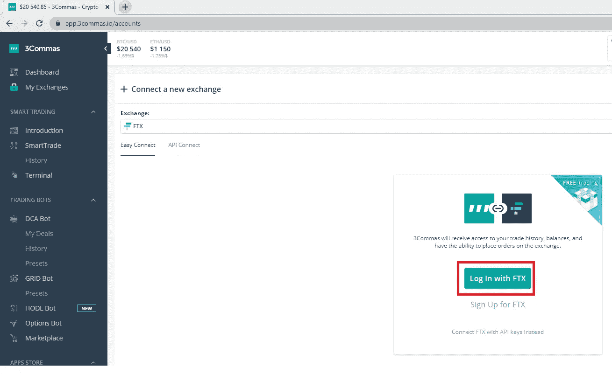
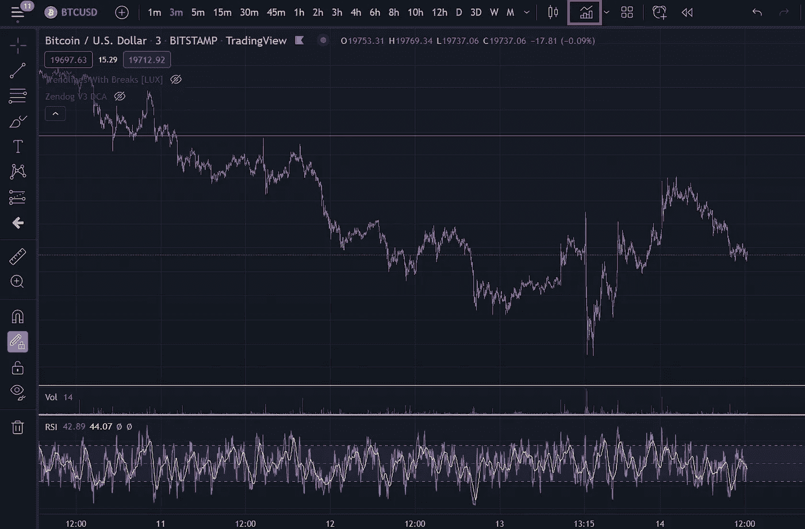
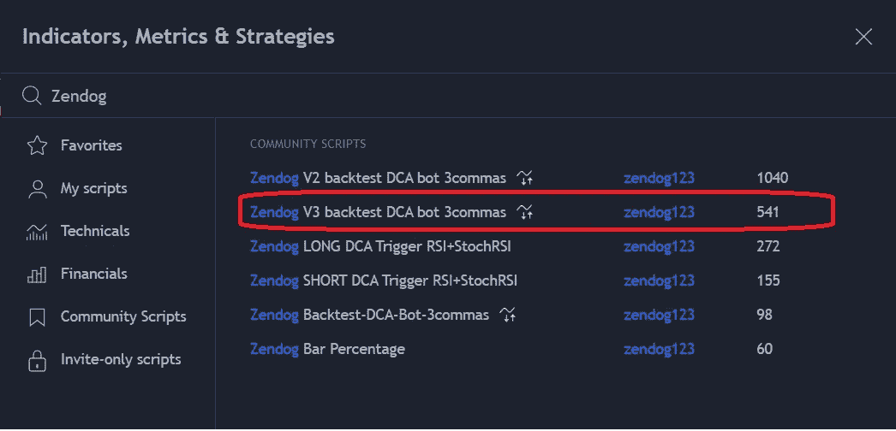
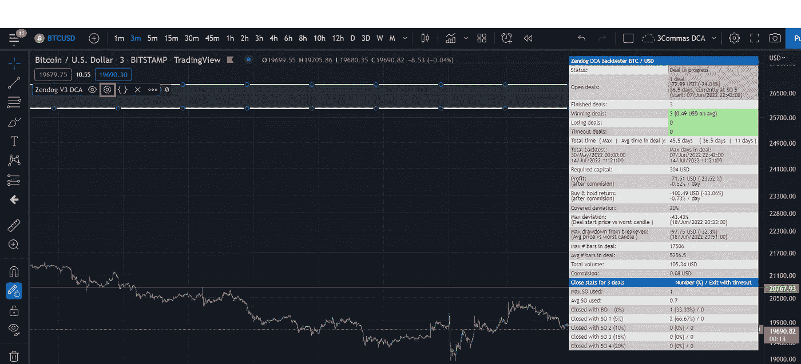
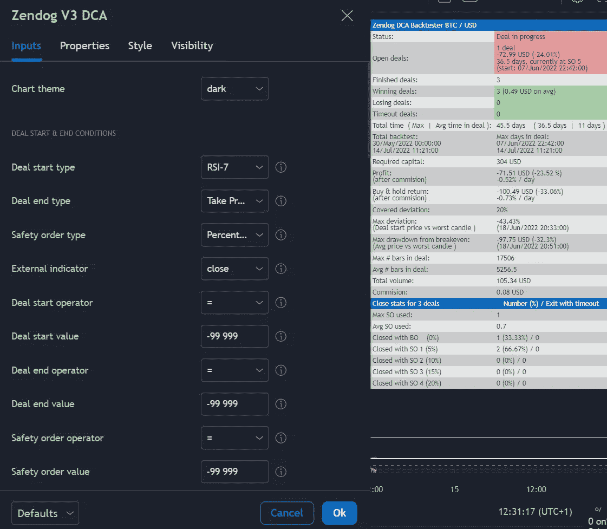
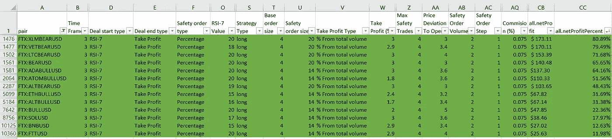

# 3 FTX 上免费的 Commas，我已经包括了 14 对将产生被动收入的确切机器人配置。

> 原文：<https://medium.com/coinmonks/3commas-for-free-on-ftx-and-ive-included-exact-bot-configurations-for-14-pairs-that-will-generate-4ebe699579a9?source=collection_archive---------1----------------------->

如果你在 Medium 上关注我，你就会知道我喜欢构建 DCA 机器人，而且是大量的！我已经变得相对痴迷于建立一个机器人，调整设置，让它运行，以赚取我的被动收入。

我不是在做庞氏节点或一夜之间获得 1000%收益的生意。这是*不现实的*也是不可持续的。相反，我会寻找更小的收益，随着时间的推移，这些收益会增加资本。管理少量的机器人也建立了我对机器人的信心，所以我最终可以放下它，继续下一个。

在这篇文章中，我将分享我使用的工具，你如何在 [FTX](https://bit.ly/3nhAojq) 上免费使用这些工具，我还将分享在 [FTX](https://bit.ly/3nhAojq) 上一些有利可图的机器人配置，这将帮助你开始。

我还创建了一个 YouTube 视频，其中涵盖了我寻找和构建盈利机器人的策略、方法和技术。这可以在这里找到:[https://youtu.be/O-OTX6ZuWgQ](https://youtu.be/O-OTX6ZuWgQ)

**文章内容**

第 1 部分:设置和连接[3 commas](https://bit.ly/3QIgQ5f)&[FTX](https://bit.ly/3nhAojq)
第 2 部分:在 [3Commas](https://bit.ly/3QIgQ5f)
上创建一个 bot 第 3 部分:注册一个免费的 [TradingView](https://bit.ly/3HP7cJY) 帐户来构建和测试您自己的配置
第 4 部分:示例 Bot 设置和回溯测试数据，包括一个 excel 文档，其中包含 14 对 [FTX](https://bit.ly/3nhAojq) 的 18，000 多个变量。

**第 1 节:设置并连接 3 条命令&**[**FTX**](https://bit.ly/3nhAojq)

1.  在此免费注册 3 条消息[并获得任何付费订阅的 10%折扣(如果您决定使用](https://bit.ly/3QIgQ5f)[币安](http://bit.ly/3OfkcKY)、 [Kucoin](http://bit.ly/39nzbDQ) 等)。
2.  在此免费注册 [FTX](https://bit.ly/3nhAojq) 并享受 5%的交易费优惠。
3.  在[3 命令](https://bit.ly/3QIgQ5f)中，连接一个新的交换机，选择用 [FTX](https://bit.ly/3nhAojq) 登录——截图如下。

4.用你的 [FTX](https://bit.ly/3nhAojq) 账户登录 [FTX](https://bit.ly/3nhAojq) 并授权连接。

5.向您的 [FTX](https://bit.ly/3nhAojq) 帐户存款，您现在可以免费使用所有的 [3Commas](https://bit.ly/3QIgQ5f) 功能！

**第二节:在**[**3 条命令**](https://bit.ly/3QIgQ5f) **上创建一个 bot。**

现在是机器人建筑！

1.  转到 3Commas 中左侧导航栏上的 DCA 机器人
2.  在右上角找到创建 DCA Bot 按钮。
3.  选择高级选项。
4.  选择 [FTX](https://bit.ly/3nhAojq) 交易所
5.  选择你的配对和设置，点击“创建机器人”，你就完成了！

**第三节:免费注册**[**trading view**](https://bit.ly/3HP7cJY)**账号&将 ZenDog V3 DCA 添加到您的图表(免费)**

1.  转到[交易视图](https://bit.ly/3HP7cJY)并创建一个账户(如果您还没有)
2.  打开您的图表并添加一个指标(见下面的截图)

3.搜索 ZenDog V3 DCA，然后单击下面突出显示的那个

4.添加到图表后，单击下面突出显示的设置目录

5.您可以在弹出窗口中配置所有特定设置，并在右侧窗口(覆盖在图表上)中查看测试结果。

6.现在，您需要找到适合自己的配置。

**第 4 节:示例 Bot 设置和回溯测试数据**

如果你对构建机器人感兴趣，你可以在这篇[文章](/coinmonks/dca-bots-do-they-actually-work-and-are-they-actually-passive-income-im-undecided-90846b04db2a)中找到我的方法和一些技巧。

正如我上面提到的，我将在下面包括几个我计划自己构建的例子，但是首先，我已经在这里链接了回溯测试数据[的副本。这包括在](https://bit.ly/3NTppra) [FTX](https://bit.ly/3nhAojq) 的 14 对不同的设置中的 18660 种变化。这是我在 TradingView 上使用 ZenDog V3 DCA 策略测试不同 RSI 值、获取利润百分比和百分比偏差以获得一些最有利可图的结果的地方。请注意，ZenDog 策略计算利润的方式与测试的 TradingView 策略略有不同，但这些结果是一个很好的起点。

> 交易新手？试试[密码交易机器人](/coinmonks/crypto-trading-bot-c2ffce8acb2a)或[复制交易](/coinmonks/top-10-crypto-copy-trading-platforms-for-beginners-d0c37c7d698c)

此外，请注意最有利可图的并不总是最好的，因为它们通常风险更大。然而，这些设置是一个起点，你可以调整以找到适合你的设置。

Here are the most profitable ones!

我已经在回溯测试数据上用绿色突出显示了最有利可图的结果(上面的截图)，但下面是我计划下一步构建的结果。

**Bot 1—adabullsd—日均 1.55%—高风险**

为什么是这个机器人？如果你读过我的其他文章，你就知道我长期看好加密。这是一个牛市令牌，所以它的长度是 3 倍，在熊市中它的收益率是 1.55%？是的，请！

此外，这呈现了两种结果。我要么通过机器人赚钱，要么只剩下一袋 3 倍长的代币，我会把它们放在某个地方，直到它们盈利！请注意牛熊令牌重新平衡，因为每天这些重新平衡每个交易所都是不同的，但请务必了解您使用的交易所的详细信息。

这是有风险的，在 10%的交易中，它将使用所有分配的资金，所以你不要在这个交易中投入太多。

**Bot 2 — ATOMBULLUSD —平均每天 0.8%—高风险**

同样出于与 ADABULLUSD 完全相同的原因。高风险，所以我将使用少量！

不过，在这个例子中，我选择了回测数据中利润较低的版本(回测数据中的单元格用蓝色突出显示)。原因是，最有利可图的设置导致交易锁定时间延长。

**总结**

随着时间的推移，所有这些工具都是开始积累一些被动收入的好工具。请花些时间看看我的一些被动收入文章，我在这些文章中详细列出了我的 3 个普通机器人每月给我带来的收入。

我将继续在 Google Drive 的回溯测试电子表格中添加数据，所以如果你对这些数据感兴趣，请继续回来查看。

我还会为新的鞋对和配置写一些后续文章，所以请务必关注我，了解最新动态。

如果您有任何配对建议要进行回溯测试，请联系我们！

**附属链接**

更多优惠还可以在这里找到:【https://linktr.ee/RealisticCrypto】T2

还有，如果你想请我喝杯咖啡或者啤酒:) :

BTC—BC 1 qaxaq 2 q 9 js 89 gyzhr 0202 sxt 6 hgchprqjga 5 px

基于 ETH、BNB、AVAX、SOL 和 FTM 的令牌—0 x3b 7b 843d 8125 Fe 7 EBA 541 e 1d 751 a4 a 73 f 0 cfad 4c

**免责声明**

这不是财务建议，我不是财务顾问或会计或税务专家。这是我对帮助过我的软件工具的体验，以及我使用它们的经历。

我在本指南中使用了推荐链接。使用这些工具有助于以后的文章，所以如果你觉得这篇文章有用，并且想看看我提到的工具，请使用它们。我还会叫出你在哪里打折——双赢对吧？

> 加入 Coinmonks [电报频道](https://t.me/coincodecap)和 [Youtube 频道](https://www.youtube.com/c/coinmonks/videos)了解加密交易和投资

# 另外，阅读

*   [印度最佳 P2P 加密交易所](https://coincodecap.com/p2p-crypto-exchanges-in-india) | [柴犬钱包](https://coincodecap.com/baby-shiba-inu-wallets)
*   [8 大加密附属计划](https://coincodecap.com/crypto-affiliate-programs) | [eToro vs 比特币基地](https://coincodecap.com/etoro-vs-coinbase)
*   [最佳以太坊钱包](https://coincodecap.com/best-ethereum-wallets) | [电报上的加密货币机器人](https://coincodecap.com/telegram-crypto-bots)
*   [交易杠杆代币的最佳交易所](https://coincodecap.com/leveraged-token-exchanges) | [购买 Floki](https://coincodecap.com/buy-floki-inu-token)
*   [3Commas 对 Pionex 对 Cryptohopper](https://coincodecap.com/3commas-vs-pionex-vs-cryptohopper) | [Bingbon 评论](https://coincodecap.com/bingbon-review)