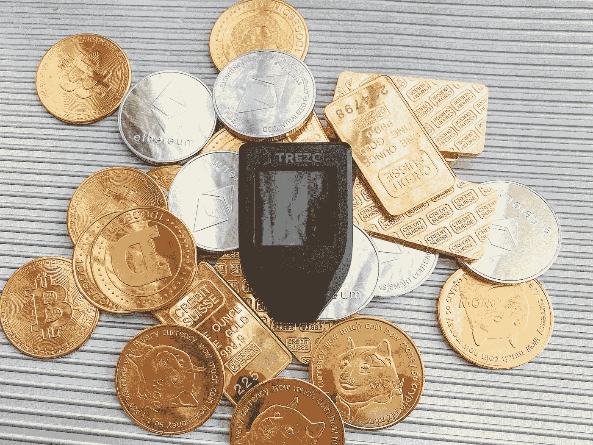
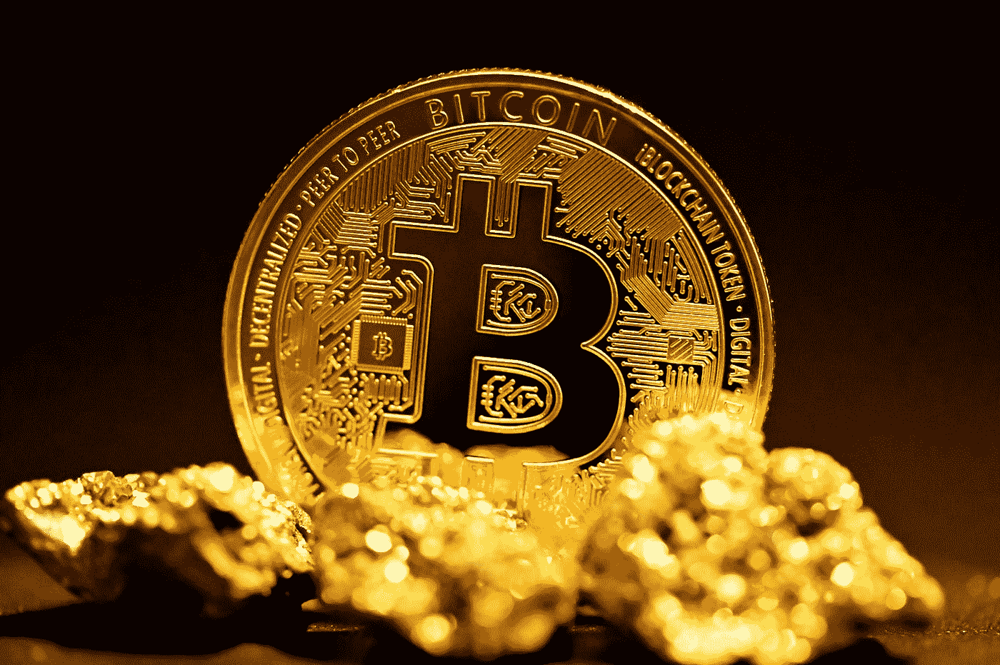
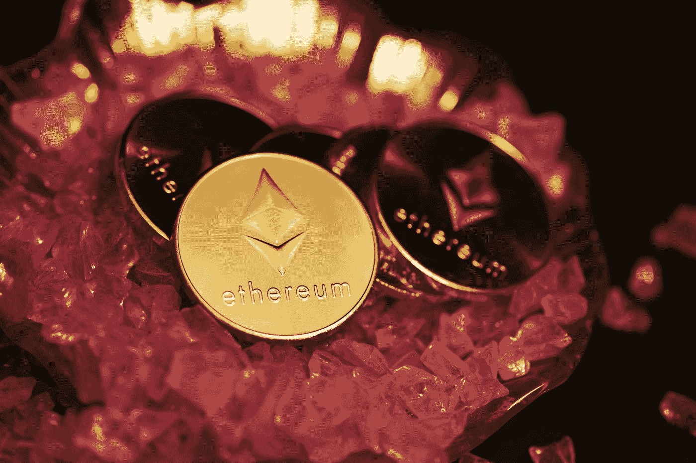
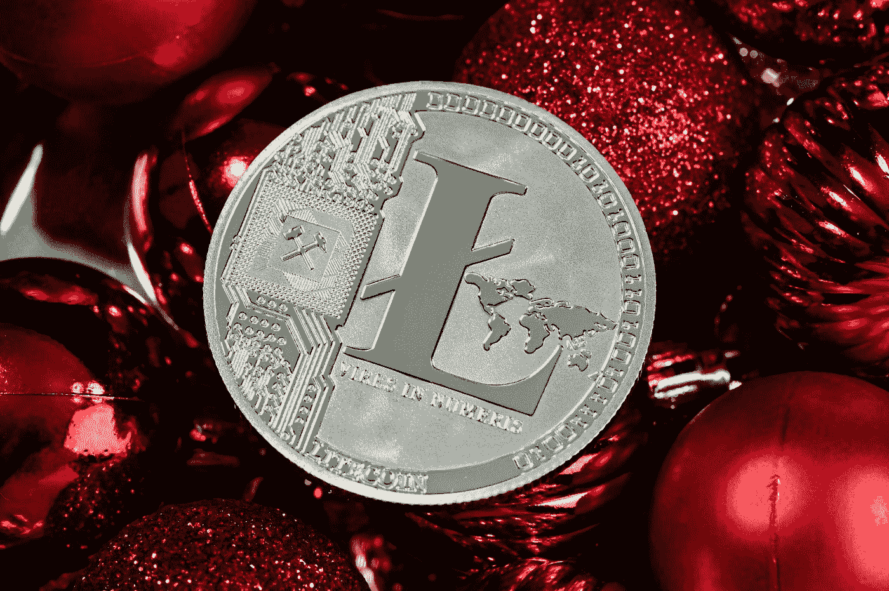

# 眼下投资的 4 种最佳加密货币(2022 年)(安全选项)

> 原文：<https://medium.com/coinmonks/4-best-cryptocurrencies-to-invest-in-right-now-2022-safe-options-1cfaf600b8e3?source=collection_archive---------32----------------------->

加密货币是数字或虚拟货币，使用加密技术来确保安全，并且是分散的，这意味着它们不受任何中央机构的控制。近年来，加密货币作为传统法定货币的替代品越来越受欢迎，许多人都对投资加密货币感兴趣。

Photo by [regularguy.eth](https://unsplash.com/@moneyphotos?utm_source=medium&utm_medium=referral) on [Unsplash](https://unsplash.com?utm_source=medium&utm_medium=referral)

1.  **比特币(BTC)**

Photo by [Kanchanara](https://unsplash.com/@kanchanara?utm_source=medium&utm_medium=referral) on [Unsplash](https://unsplash.com?utm_source=medium&utm_medium=referral)

比特币是最原始、最广为人知的加密货币。2009 年，一个名叫中本聪的匿名个人或团体首次提出了这一概念。

比特币的关键优势之一是其去中心化的性质，这使得交易快速而廉价，不需要银行等中介机构。这也是一个有限的供应，总共有 2100 万比特币将被创造出来。这种稀缺性，加上不断增长的需求，导致比特币的价值随着时间的推移而上升。

投资比特币时需要考虑的另一个关键因素是它的波动性。比特币的价格可能在短时间内大幅波动，这可能使其成为一种风险投资。然而，它的长期潜力以及商家和消费者的广泛采用使其成为那些寻求投资加密货币的人的有力竞争者。

**2。以太坊**

Photo by [Traxer](https://unsplash.com/@traxer?utm_source=medium&utm_medium=referral) on [Unsplash](https://unsplash.com?utm_source=medium&utm_medium=referral)

以太坊是另一种流行的加密货币，于 2015 年推出。它不同于比特币，因为它是一个分散的平台，允许创建智能合约和分散的应用程序(dApps)。

以太坊的主要优势之一是它的灵活性和支持广泛应用的能力。这导致了一个不断增长的开发者和企业家生态系统，他们正在以太坊平台上构建，这有助于其不断增长的价值。

投资以太坊要考虑的另一个因素是它的增长潜力。随着对去中心化应用和智能合约需求的增长，以太坊的价值也可能增加。这使得它成为寻找具有长期潜力的加密货币的投资者的一个有吸引力的选择。

**3。莱特币**

Photo by [Traxer](https://unsplash.com/@traxer?utm_source=medium&utm_medium=referral) on [Unsplash](https://unsplash.com?utm_source=medium&utm_medium=referral)

莱特币是一种加密货币，于 2011 年推出，是比特币的一个更轻、更快的版本。它使用不同的算法进行挖掘，从而加快交易速度，降低费用。

Litecoin 的主要优势之一是其更快的交易时间，这使其成为日常使用和支付的良好选择。它也是最广泛接受的加密货币之一，越来越多的商家和企业接受它作为一种支付形式。

投资莱特币时要考虑的另一个因素是它的增长潜力。随着对快速和廉价交易需求的增长，莱特币的价值也可能增加。这使得它成为寻找具有长期潜力的加密货币的投资者的一个好选择。

**4。涟漪(XRP)**

Photo by [Kanchanara](https://unsplash.com/@kanchanara?utm_source=medium&utm_medium=referral) on [Unsplash](https://unsplash.com?utm_source=medium&utm_medium=referral)

Ripple 是一种加密货币，于 2012 年推出，专注于为银行和金融机构提供全球支付解决方案。它使用节点网络和一致算法来验证交易，这允许快速和廉价的转移。

Ripple 的主要优势之一是其专注于银行和金融行业。这导致了与主要银行和金融机构的伙伴关系，从而提高了它的可信度和接受度。

投资 Ripple 时要考虑的另一个因素是它的增长潜力。随着全球支付解决方案需求的增长，Ripple 的价值可能也会增加。这使得它成为寻找具有长期潜力的加密货币的投资者的一个好选择。

**结论:**

总之，有许多不同的加密货币可供投资，正确的选择将取决于您的个人目标和风险承受能力。比特币、以太坊、莱特币和 Ripple 是最受欢迎和被广泛接受的加密货币，它们都具有独特的优势和增长潜力。在做出任何决定之前，仔细研究和评估投资加密货币的风险和潜在回报非常重要。分散投资也很重要，不要投资超过你愿意损失的部分。

加密货币是一种高波动性和高风险的投资，其价值可以在短时间内大幅波动。因此，谨慎对待加密货币投资，并在做出任何决定之前咨询金融专业人士非常重要。

总体而言，加密货币领域的增长和创新潜力使其成为一个令人兴奋且潜在有利可图的投资机会。通过正确的方法和尽职调查，加密货币可以成为您投资组合的宝贵补充。

> 交易新手？试试[密码交易机器人](/coinmonks/crypto-trading-bot-c2ffce8acb2a)或[复制交易](/coinmonks/top-10-crypto-copy-trading-platforms-for-beginners-d0c37c7d698c)
> 
> 多样化的密码持有，了解[币安替代品](https://coincodecap.com/binance-alternatives)
> 
> 加入 Coinmonks [电报频道](https://t.me/coincodecap)和 [Youtube 频道](https://www.youtube.com/c/coinmonks/videos)获取每日[加密新闻](http://coincodecap.com/)

## 另外，阅读

*   [拷贝交易](/coinmonks/top-10-crypto-copy-trading-platforms-for-beginners-d0c37c7d698c) | [密码税务软件](/coinmonks/crypto-tax-software-ed4b4810e338)
*   [网格交易](https://coincodecap.com/grid-trading) | [加密硬件钱包](/coinmonks/the-best-cryptocurrency-hardware-wallets-of-2020-e28b1c124069)
*   [密码电报信号](/coinmonks/top-3-telegram-channels-for-crypto-traders-in-2021-8385f4411ff4) | [密码交易机器人](/coinmonks/crypto-trading-bot-c2ffce8acb2a)
*   [最佳密码交易所](/coinmonks/crypto-exchange-dd2f9d6f3769) | [印度最佳密码交易所](/coinmonks/bitcoin-exchange-in-india-7f1fe79715c9)
*   [开发人员的最佳加密 API](/coinmonks/best-crypto-apis-for-developers-5efe3a597a9f)
*   最佳[密码借出平台](/coinmonks/top-5-crypto-lending-platforms-in-2020-that-you-need-to-know-a1b675cec3fa)
*   [免费加密信号](/coinmonks/free-crypto-signals-48b25e61a8da) | [加密交易机器人](/coinmonks/crypto-trading-bot-c2ffce8acb2a)
*   [杠杆代币](/coinmonks/leveraged-token-3f5257808b22)终极指南